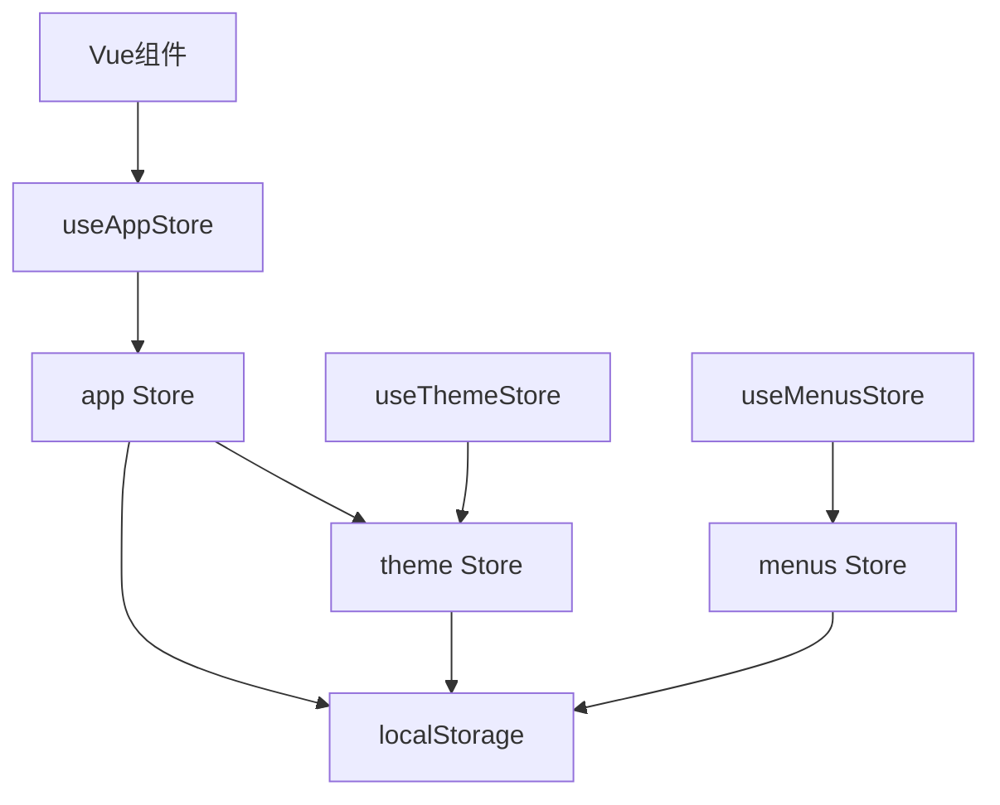
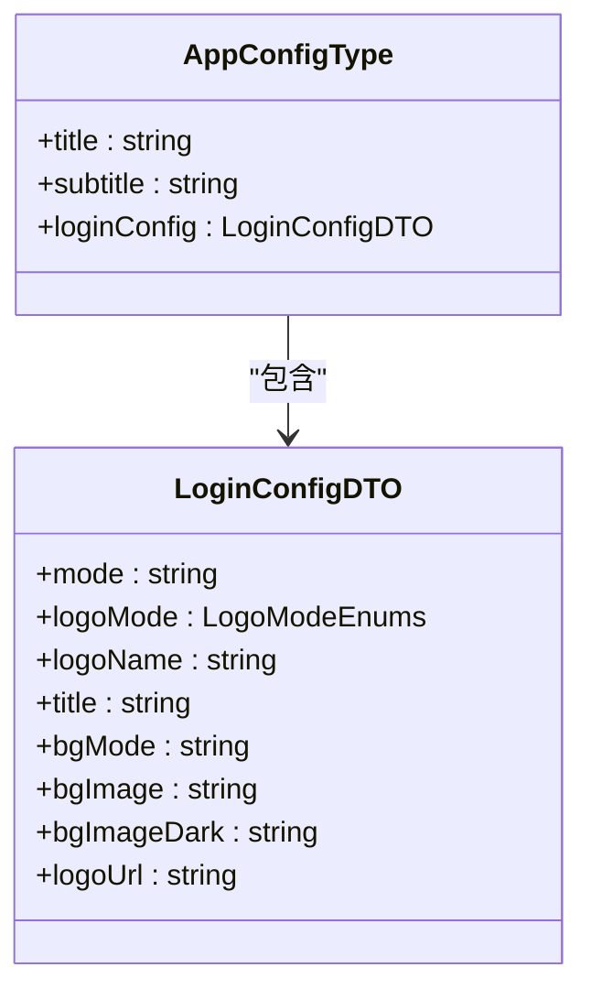
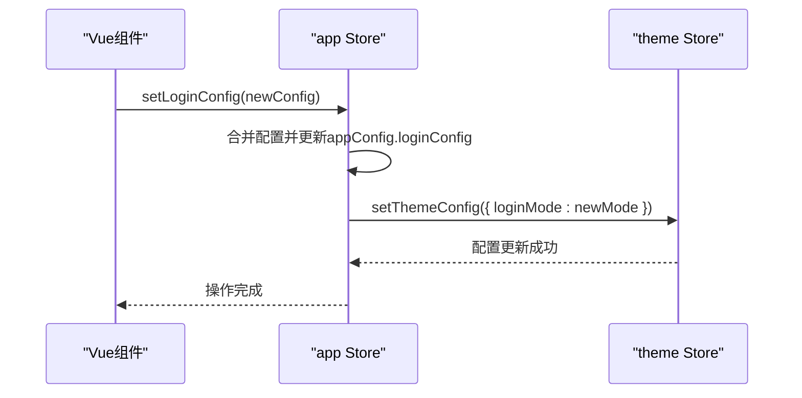
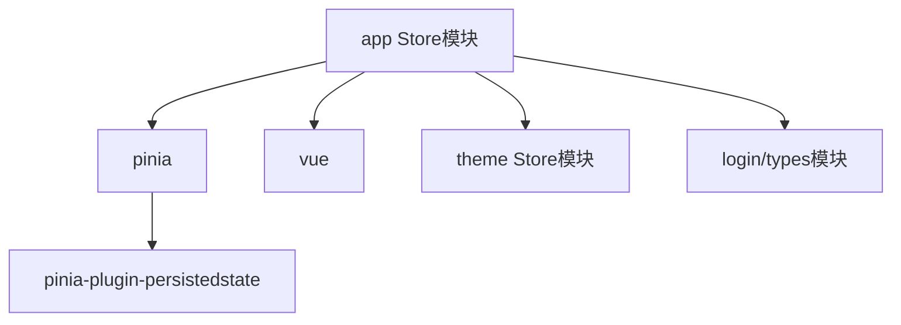

# 应用状态管理

<cite>
**本文档中引用的文件**   
- [types.ts](file://src/store/uedModule/app/types.ts)
- [defaultConfig.ts](file://src/store/uedModule/app/defaultConfig.ts)
- [index.ts](file://src/store/uedModule/app/index.ts)
- [layout/index.vue](file://src/components/uedModule/layout/index.vue)
- [store/index.ts](file://src/store/index.ts)
</cite>

## 目录
1. [简介](#简介)
2. [项目结构](#项目结构)
3. [核心组件](#核心组件)
4. [架构概述](#架构概述)
5. [详细组件分析](#详细组件分析)
6. [依赖分析](#依赖分析)
7. [性能考虑](#性能考虑)
8. [故障排除指南](#故障排除指南)
9. [结论](#结论)

## 简介
本文档详细阐述了应用全局状态管理模块的设计与实现，聚焦于`app`模块的`state`。文档涵盖了状态中包含的应用配置项（如系统标题、布局模式、侧边栏状态等）及其默认值定义方式，解释了`types.ts`中定义的状态类型结构和`defaultConfig.ts`中的默认配置策略。同时，文档描述了`actions`中用于更新应用状态的方法，如`toggleSidebar`、`updateLayout`等，并结合代码示例展示了其调用方式。此外，还说明了`getters`如何提供派生状态（如侧边栏折叠状态、当前布局类型），阐述了该模块与其他`store`模块（如`theme`、`menus`）的交互关系，以及在组件中通过`useAppStore`进行状态读取和更新的最佳实践。最后，文档提供了状态持久化机制的实现细节，以及常见问题如状态未响应更新的排查方案。

## 项目结构
应用状态管理模块位于`src/store/uedModule/app/`目录下，采用模块化设计，主要由三个核心文件构成：`types.ts`定义了状态的数据结构，`defaultConfig.ts`提供了状态的默认配置，`index.ts`则是模块的入口和逻辑核心。该模块通过Pinia进行状态管理，并与`theme`、`menus`等其他store模块协同工作，共同维护应用的全局状态。

```mermaid
graph TB
subgraph "状态管理模块"
types["types.ts<br/>定义状态类型"]
defaultConfig["defaultConfig.ts<br/>提供默认配置"]
index["index.ts<br/>核心逻辑与Actions"]
end
subgraph "其他模块"
theme["theme模块"]
menus["menus模块"]
end
index --> theme : "交互"
index --> menus : "交互"
types --> index : "类型引用"
defaultConfig --> index : "配置引用"
```

**图示来源**
- [types.ts](file://src/store/uedModule/app/types.ts)
- [defaultConfig.ts](file://src/store/uedModule/app/defaultConfig.ts)
- [index.ts](file://src/store/uedModule/app/index.ts)

**本节来源**
- [types.ts](file://src/store/uedModule/app/types.ts)
- [defaultConfig.ts](file://src/store/uedModule/app/defaultConfig.ts)
- [index.ts](file://src/store/uedModule/app/index.ts)

## 核心组件
应用状态管理的核心组件是`app` store模块，它负责管理应用的全局配置和UI状态。该模块定义了`AppConfigType`接口来描述应用配置，使用`defaultConfig`对象提供初始值，并通过`index.ts`中的`defineStore`函数创建一个Pinia store实例，暴露`setAppConfig`、`setLoginConfig`等actions来更新状态。

**本节来源**
- [types.ts](file://src/store/uedModule/app/types.ts#L1-L27)
- [defaultConfig.ts](file://src/store/uedModule/app/defaultConfig.ts#L1-L20)
- [index.ts](file://src/store/uedModule/app/index.ts#L1-L80)

## 架构概述
应用状态管理采用Pinia作为状态管理库，遵循模块化设计原则。`app` store模块是核心，它管理着应用的基本配置和UI状态。该模块通过`storeToRefs`与Vue组件进行响应式绑定，并通过`pinia-plugin-persistedstate`插件实现状态的持久化存储。`app` store与`theme` store存在交互，当登录配置中的主题模式改变时，会同步更新`theme` store中的配置。



**图示来源**
- [index.ts](file://src/store/uedModule/app/index.ts#L21-L79)
- [store/index.ts](file://src/store/index.ts#L1-L12)

## 详细组件分析

### 状态类型与默认配置分析
`types.ts`文件定义了`AppConfigType`接口，该接口描述了应用配置对象的结构，包括`title`（系统标题）、`subtitle`（副标题）和`loginConfig`（登录配置对象）。`loginConfig`的类型为`LoginConfigDTO`，这是一个来自`views/uedModule/login/types`的复杂对象，包含了登录页面的模式、Logo、背景图等详细配置。

`defaultConfig.ts`文件则提供了这些配置的默认值。例如，系统标题默认为“智启vue3孵化器系统”，副标题为“webpack”。`loginConfig`的默认值是通过`new LoginConfigDTO()`构造函数创建的，其中包含了深色和浅色背景图的路径、Logo模式等。这种设计将类型定义与默认值分离，提高了代码的可维护性。



**图示来源**
- [types.ts](file://src/store/uedModule/app/types.ts#L1-L27)
- [defaultConfig.ts](file://src/store/uedModule/app/defaultConfig.ts#L1-L20)

### 核心逻辑与Actions分析
`index.ts`文件是`app` store模块的核心，它使用`defineStore`创建了一个名为`app`的store。该store的状态（state）是一个包含多个响应式引用（`Ref`）的对象，如`appConfig`、`watermark`、`themePanelVisible`等。

该模块定义了多个`actions`来更新状态：
- `setAppConfig(config: AppConfigType)`: 用于更新整个应用配置。它会将传入的`config`与`defaultConfig`进行合并，确保未提供的配置项使用默认值，然后更新`appConfig`的值。
- `setLoginConfig(config: LoginConfigDTO)`: 专门用于更新登录配置。它会创建一个新的`LoginConfigDTO`实例，合并默认配置、当前配置和传入的新配置。一个关键的交互是，当`loginConfig.mode`改变时，此action会调用`useThemeStore().setThemeConfig()`来同步更新主题模块的配置。
- `setWatermark(watermarkStr: string)`: 设置水印内容。
- `setThemePanelVisible(show: boolean)`: 控制主题控制面板的显示与隐藏。
- `setFullScreen(isFull: boolean)`: 设置全屏状态。



**图示来源**
- [index.ts](file://src/store/uedModule/app/index.ts#L21-L79)

### 在组件中的使用分析
在Vue组件中，通过`useAppStore`函数来访问`app` store。`layout/index.vue`组件是一个典型的使用示例。它首先导入`useAppStore`，然后调用该函数获取store实例。为了在模板中使用store中的响应式数据，它使用`storeToRefs`将`appConfig`中的`watermark`和`fullScreen`解构为独立的响应式引用。

该组件还使用`watch`监听路由变化。当路由的`meta.fullScreen`元数据或通过`routeCenter.getMeta`获取的自定义元数据中`fullScreen`为`true`时，它会调用`appStore.setFullScreen(true)`来更新全局的全屏状态。这体现了状态管理在跨组件通信和UI状态同步中的作用。

```mermaid
flowchart TD
A[组件 setup] --> B[导入 useAppStore]
B --> C[调用 useAppStore()]
C --> D[获取 appStore 实例]
D --> E[使用 storeToRefs 解构状态]
E --> F[在模板中使用 watermark, fullScreen]
D --> G[监听路由变化]
G --> H{路由需要全屏?}
H --> |是| I[调用 appStore.setFullScreen(true)]
H --> |否| J[调用 appStore.setFullScreen(false)]
```

**图示来源**
- [layout/index.vue](file://src/components/uedModule/layout/index.vue#L1-L304)

**本节来源**
- [index.ts](file://src/store/uedModule/app/index.ts#L1-L80)
- [layout/index.vue](file://src/components/uedModule/layout/index.vue#L1-L304)

## 依赖分析
`app` store模块依赖于多个外部模块和库。它直接依赖于`pinia`库来创建store，依赖于`vue`库的`ref`和`defineStore`。它还依赖于`@/store`来导入`useThemeStore`，以实现与主题模块的交互。其配置依赖于`@/views/uedModule/login/types`中的`LoginConfigDTO`类型。在项目层面，它依赖于`pinia-plugin-persistedstate`插件来实现状态持久化。



**图示来源**
- [index.ts](file://src/store/uedModule/app/index.ts#L1-L80)
- [store/index.ts](file://src/store/index.ts#L1-L12)

**本节来源**
- [index.ts](file://src/store/uedModule/app/index.ts#L1-L80)
- [store/index.ts](file://src/store/index.ts#L1-L12)

## 性能考虑
该状态管理方案的性能表现良好。Pinia的轻量级和响应式特性确保了状态更新的高效性。状态持久化通过`pinia-plugin-persistedstate`在`localStorage`中进行，读写操作对应用性能影响较小。需要注意的是，`setAppConfig`方法在每次调用时都会创建一个新对象（`{...defaultConfig, ...config}`），如果配置对象非常庞大且频繁更新，可能会产生一定的内存开销。但在本项目中，配置对象相对较小，此影响可忽略不计。

## 故障排除指南
当遇到状态未响应更新的问题时，可以按照以下步骤进行排查：

1.  **检查响应式解构**：在组件中，如果直接从store中解构状态（如`const { fullScreen } = useAppStore()`），`fullScreen`将失去响应性。必须使用`storeToRefs`来保持响应性，如`const { fullScreen } = storeToRefs(useAppStore())`。
2.  **检查Action调用**：确保在组件中正确调用了相应的`action`方法来更新状态，而不是直接修改状态。例如，应调用`appStore.setFullScreen(true)`，而不是`appStore.fullScreen = true`。
3.  **检查持久化配置**：确认`store/index.ts`中已正确注册`piniaPluginPersistedstate`插件。如果插件未注册，状态将不会被持久化。
4.  **检查浏览器存储**：打开浏览器开发者工具的“Application”或“Storage”标签页，检查`localStorage`中是否存在`app-store`键，并查看其值是否正确。这有助于判断是状态未更新还是未持久化。
5.  **检查依赖注入**：确保在`main.ts`中正确安装了`pinia`实例。如果`pinia`未被正确安装，所有store都将无法工作。

**本节来源**
- [layout/index.vue](file://src/components/uedModule/layout/index.vue#L1-L304)
- [store/index.ts](file://src/store/index.ts#L1-L12)

## 结论
`app` store模块为应用提供了一个健壮、可维护的全局状态管理解决方案。它通过清晰的类型定义、合理的默认配置和模块化的action设计，有效地管理了应用的配置和UI状态。与`theme`等模块的交互设计良好，状态持久化机制也已正确配置。在组件中使用`useAppStore`和`storeToRefs`是读取和更新状态的最佳实践。遵循本文档的指导，可以有效地使用和维护该状态管理模块。