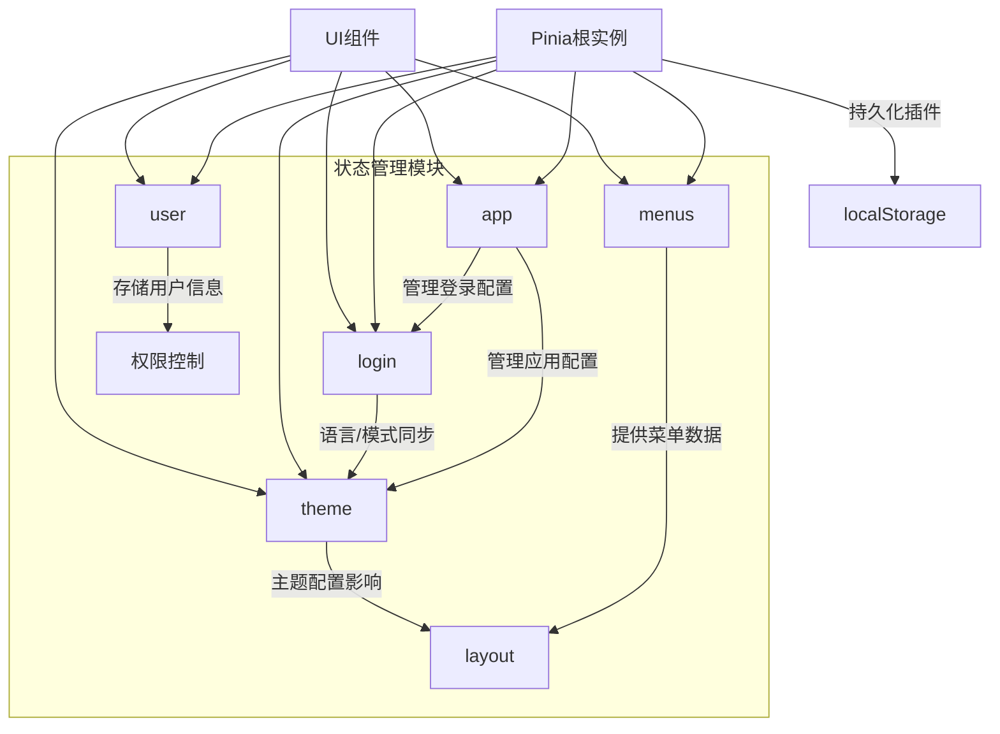
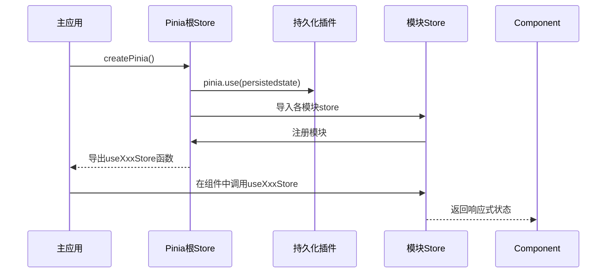
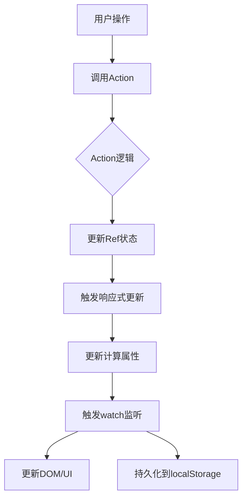

# 状态管理

<cite>
**本文档中引用的文件**  
- [index.ts](file://src/store/index.ts)
- [app/index.ts](file://src/store/uedModule/app/index.ts)
- [theme/index.ts](file://src/store/uedModule/theme/index.ts)
- [login/index.ts](file://src/store/uedModule/login/index.ts)
- [menus/index.ts](file://src/store/uedModule/menus/index.ts)
- [user/index.ts](file://src/store/uedModule/user/index.ts)
- [app/types.ts](file://src/store/uedModule/app/types.ts)
- [theme/types.ts](file://src/store/uedModule/theme/types.ts)
- [login/types.ts](file://src/store/uedModule/login/types.ts)
- [menus/types.ts](file://src/store/uedModule/menus/types.ts)
- [defaultConfig.ts](file://src/store/uedModule/app/defaultConfig.ts)
- [theme/defaultConfig.ts](file://src/store/uedModule/theme/defaultConfig.ts)
- [login/defaultConfig.ts](file://src/store/uedModule/login/defaultConfig.ts)
- [index.vue](file://src/views/uedModule/login/index.vue)
- [themeConfig/index.vue](file://src/views/uedModule/themeConfig/index.vue)
- [layout/index.vue](file://src/components/uedModule/layout/index.vue)
</cite>

## 目录
1. [项目结构概览](#项目结构概览)  
2. [Pinia状态管理架构](#pinia状态管理架构)  
3. [核心模块分析](#核心模块分析)  
   - [App模块](#app模块)  
   - [Theme模块](#theme模块)  
   - [Login模块](#login模块)  
   - [Menus模块](#menus模块)  
   - [User模块](#user模块)  
4. [模块间通信与集成](#模块间通信与集成)  
5. [持久化与响应式原理](#持久化与响应式原理)  
6. [最佳实践与常见问题](#最佳实践与常见问题)

## 项目结构概览

项目采用模块化方式组织Pinia状态管理，所有store模块位于`src/store/uedModule`目录下，按功能划分为`app`、`theme`、`login`、`menus`、`user`等独立模块。每个模块包含`index.ts`（主逻辑）、`types.ts`（类型定义）和`defaultConfig.ts`（默认配置）三个核心文件。

根store文件`src/store/index.ts`负责创建Pinia实例、注册持久化插件，并统一导出各模块的store使用函数。



**图示来源**  
- [index.ts](file://src/store/index.ts)
- 项目结构分析

## Pinia状态管理架构

系统采用Pinia作为状态管理解决方案，通过模块化设计实现关注点分离。整体架构遵循以下原则：

- **模块化设计**：每个功能域拥有独立的store模块
- **单一状态树**：通过根store统一管理所有模块
- **持久化支持**：使用`pinia-plugin-persistedstate`实现状态持久化
- **类型安全**：全面使用TypeScript定义状态结构

根store的初始化过程如下：



**图示来源**  
- [index.ts](file://src/store/index.ts#L1-L13)

## 核心模块分析

### App模块

`app`模块负责管理全局应用配置，包括系统标题、水印、全屏状态等。

#### 状态定义
```typescript
interface AppStore {
  appConfig: Ref<AppConfigType>;
  watermark: Ref<string>;
  themePanelVisible: Ref<boolean>;
  activeModuleId: Ref<string>;
  fullScreen: Ref<boolean>;
  // ... actions
}
```

#### 功能职责
- 管理应用级配置信息
- 控制主题面板的显示/隐藏
- 管理水印内容
- 跟踪当前激活的模块ID
- 控制全屏模式

#### Action实现
```typescript
const setAppConfig = (config: AppConfigType) => {
  const value = { ...defaultConfig, ...config };
  appConfig.value = value;
};

const setLoginConfig = (config: LoginConfigDTO) => {
  appConfig.value.loginConfig = new LoginConfigDTO(
    Object.assign(defaultConfig.loginConfig, appConfig.value.loginConfig, config)
  );
  themeStore.setThemeConfig({ ...themeStore.themeConfig, loginMode: appConfig.value.loginConfig.mode });
};
```

**模块来源**  
- [app/index.ts](file://src/store/uedModule/app/index.ts#L1-L80)
- [app/types.ts](file://src/store/uedModule/app/types.ts#L1-L27)

### Theme模块

`theme`模块负责管理主题配置，包括明暗模式、主题色、字号等。

#### 状态定义
```typescript
interface ThemeConfigType {
  mode: string; // 'light'/'dark'
  lang: string; // 'zh'/'en'
  primaryColor: string;
  layout: string; // 'top'/'side'/'mix'
  fontSize: string; // '12px'/'14px'
  // ... 其他配置
}
```

#### 核心功能
- **动态主题切换**：支持明暗模式切换
- **主题色生成**：基于主色生成渐变色系
- **字号控制**：动态更新CSS变量
- **本地存储**：自动同步配置到localStorage

#### 响应式实现
```typescript
const theme = computed(() => {
  const { primaryColors, darkPrimaryColors } = getPrimaryColors();
  const isDark = themeTokenType.value === 'dark';
  return {
    token: {
      colorPrimary: isDark ? primaryColors[4] : primaryColors[5],
      fontSize: parseInt(themeConfig.value.fontSize, 10),
      // ... 其他token
    },
    algorithm: themeTokenType.value === ThemeTypes.Dark ? darkAlgorithm : defaultAlgorithm,
    components: {
      // 组件级主题配置
    }
  };
});
```

#### 持久化机制
通过`watch`监听`themeConfig`变化，自动保存到localStorage：

```typescript
watch(
  themeConfig,
  (newValue) => {
    localStorage.setItem('ZQTHEMECONFIG', JSON.stringify(newValue));
    updateFontSizeCSS(newValue.fontSize);
  },
  { deep: true }
);
```

**模块来源**  
- [theme/index.ts](file://src/store/uedModule/theme/index.ts#L1-L158)
- [theme/types.ts](file://src/store/uedModule/theme/types.ts#L1-L24)

### Login模块

`login`模块管理登录配置，包括语言、登录模式等。

#### 状态定义
```typescript
type LoginConfigStore = {
  name: 'ZQ_LOGIN_CONFIG';
  loginConfig: Ref<LoginConfigDTO>;
  get: (field: keyof LoginConfigDTO) => any;
  set: (config: Partial<LoginConfigDTO>) => void;
  reset: () => void;
};
```

#### 核心功能
- **配置持久化**：自动保存到localStorage
- **国际化同步**：设置语言时同步更新i18n
- **主题同步**：设置模式时同步更新主题

#### 初始化逻辑
```typescript
onMounted(() => {
  const { mode = 'light', lang = 'zh' } = JSON.parse(localStorage.getItem(name) || '{}');
  setI18n(lang);
  setTheme(mode);
});
```

#### 配置更新
```typescript
const set = (config: Partial<LoginConfigDTO>) => {
  loginConfig.value = new LoginConfigDTO({ ...loginConfig.value, ...config });
  setLoginConfig();
  setTheme(loginConfig.value.mode);
  setI18n(loginConfig.value.language);
};
```

**模块来源**  
- [login/index.ts](file://src/store/uedModule/login/index.ts#L1-L57)
- [login/types.ts](file://src/store/uedModule/login/types.ts#L1-L12)

### Menus模块

`menus`模块负责管理菜单数据结构和导航状态。

#### 数据结构
```typescript
interface MenuType {
  title: string;
  id: string;
  path?: string;
  icon?: string;
  children?: MenuType[];
}

interface RouteItemType {
  path: string;
  title: string;
  component: boolean;
}
```

#### 核心功能
- **菜单数据管理**：存储和更新菜单树
- **菜单映射**：建立路径到菜单项的映射关系
- **激活路由跟踪**：维护当前激活的路由层级
- **面包屑生成**：结合菜单和路由生成面包屑

#### 核心算法
```typescript
function dataToMenuMap(menus: MenuType[], map: Map<string, MenuType[]>, parents: MenuType[] = []) {
  menus.forEach((item) => {
    if (item.path) {
      map.set(item.path, [item, ...parents]);
    }
    if (item.children && item.children.length > 0) {
      dataToMenuMap(item.children, map, [item, ...parents]);
    }
  });
}
```

#### 计算属性
```typescript
const activeMenus = computed(() => {
  const lastRoutePath = activeRoutes.value[activeRoutes.value.length - 1].path;
  return menusMap.get(lastRoutePath) ?? [];
});

const activeBreadcrumb = computed(() => {
  return [...[...activeMenus.value].reverse(), ...activeRoutes.value.slice(0, -1)];
});
```

**模块来源**  
- [menus/index.ts](file://src/store/uedModule/menus/index.ts#L1-L138)
- [menus/types.ts](file://src/store/uedModule/menus/types.ts#L1-L15)

### User模块

`user`模块管理用户认证状态，包括token、权限和用户信息。

#### 状态定义
```typescript
interface UserStore {
  token: Ref<string | undefined>;
  permissionIds: Ref<string[]>;
  userInfo: Record<string, any>;
  setToken: (tokenStr: string) => void;
  setPermissionIds: (ids: string[]) => void;
  setUserInfo: (info: any) => void;
  reset: () => void;
}
```

#### 核心功能
- **认证状态管理**：存储token和用户信息
- **权限管理**：维护用户权限ID列表
- **状态恢复**：从localStorage恢复状态
- **状态重置**：提供登出时的状态清理

#### 状态恢复
```typescript
const restore = () => {
  if (localStorage.getItem('user-store')) {
    const userStore = JSON.parse(localStorage.getItem('user-store') || '{}');
    Object.assign(userInfo, userStore.userInfo);
    token.value = userStore.token;
    permissionIds.value = userStore.permissionIds;
  }
};
restore();
```

#### 持久化配置
```typescript
{
  persist: {
    key: 'user-store',
    storage: localStorage
  }
}
```

**模块来源**  
- [user/index.ts](file://src/store/uedModule/user/index.ts#L1-L62)

## 模块间通信与集成

各store模块通过相互引用实现功能协同，形成完整的状态管理网络。

### 主题与登录模块协同

登录模块在配置变更时主动通知主题模块：

```typescript
const set = (config: Partial<LoginConfigDTO>) => {
  // ... 更新配置
  setTheme(loginConfig.value.mode);  // 同步主题模式
  setI18n(loginConfig.value.language);  // 同步语言
};
```

### 应用与主题模块协同

应用模块在登录配置变更时更新主题配置：

```typescript
const setLoginConfig = (config: LoginConfigDTO) => {
  // ... 更新登录配置
  themeStore.setThemeConfig({ 
    ...themeStore.themeConfig, 
    loginMode: appConfig.value.loginConfig.mode 
  });
};
```

### UI组件集成示例

#### 登录页面集成
```vue
<script setup lang="ts">
import { useLoginStore, useThemeStore, useUserStore } from '@/store';

const loginStore = useLoginStore();
const userStore = useUserStore();
const { themeConfig } = storeToRefs(useThemeStore());

// 监听登录配置变化
watch(loginStore.loginConfig, (v) => {
  loginConfig.value = Object.assign(loginConfig.value, v);
});
</script>
```

#### 主题配置页面集成
```vue
<script setup lang="ts">
import { useThemeStore, useLoginStore } from '@/store';

const themeStore = useThemeStore();
const loginStore = useLoginStore();

const useTheme = () => {
  Modal.confirm({
    onOk() {
      themeConfig.value = { ...themeConfig.value, ...config.value };
    }
  });
};

const handleLocaleChangeA = (key: any) => {
  changeLocale(key);
  loginStore.set({ language: key });  // 同步到登录模块
  window.location.reload();
};
</script>
```

#### 布局组件集成
```vue
<script setup lang="ts">
import { useAppStore, useMenusStore, useThemeStore } from '@/store';

const appStore = useAppStore();
const { watermark, fullScreen } = storeToRefs(appStore);

const menusStore = useMenusStore();
const { siderMenus } = storeToRefs(menusStore);

const themeStore = useThemeStore();
const { themeConfig } = storeToRefs(themeStore);
</script>
```

**集成来源**  
- [login/index.vue](file://src/views/uedModule/login/index.vue#L1-L413)
- [themeConfig/index.vue](file://src/views/uedModule/themeConfig/index.vue#L1-L315)
- [layout/index.vue](file://src/components/uedModule/layout/index.vue#L1-L304)

## 持久化与响应式原理

### 持久化策略

系统采用`pinia-plugin-persistedstate`插件实现状态持久化，各模块配置如下：

| 模块 | 存储键 | 存储位置 | 配置 |
|------|--------|----------|------|
| app | app-store | localStorage | 启用 |
| login | login-store | localStorage | 启用 |
| user | user-store | localStorage | 启用 |
| theme | 无 | localStorage | 手动实现 |

```typescript
// app模块持久化配置
{
  persist: {
    key: 'app-store',
    storage: localStorage
  }
}
```

### 响应式原理

基于Vue 3的响应式系统，使用`ref`和`computed`实现状态响应：

```typescript
// 响应式状态
const appConfig = ref<AppConfigType>({ ...defaultConfig });

// 响应式计算属性
const theme = computed(() => {
  return {
    token: {
      colorPrimary: themeConfig.value.primaryColor,
      fontSize: parseInt(themeConfig.value.fontSize, 10)
    }
  };
});
```

### 状态更新流程



**原理来源**  
- 各store模块实现
- Vue 3响应式系统

## 最佳实践与常见问题

### 最佳实践

1. **模块化设计**：按功能域划分store模块
2. **类型安全**：为每个模块定义明确的类型
3. **单一职责**：每个模块只管理特定领域的状态
4. **避免循环依赖**：谨慎处理模块间引用
5. **合理使用持久化**：仅对需要持久化的状态启用

### 常见问题排查

#### 状态未更新

**可能原因**：
- 忘记使用`.value`访问ref
- 直接修改对象而非替换
- 未正确使用响应式API

**解决方案**：
```typescript
// 错误：直接修改
state.obj.prop = 'new value';

// 正确：替换整个对象
state.obj = { ...state.obj, prop: 'new value' };

// 或使用reactive
const state = reactive({ obj: { prop: 'value' } });
state.obj.prop = 'new value'; // 正确
```

#### 模块未注册

**症状**：`useXxxStore()`函数未定义

**解决方案**：
1. 检查`src/store/index.ts`是否正确导入和导出
2. 确认模块路径正确
3. 检查命名冲突

#### 持久化失效

**可能原因**：
- 持久化插件未正确注册
- 存储键冲突
- 浏览器隐私模式

**解决方案**：
```typescript
// 确保在根store注册插件
const pinia = createPinia();
pinia.use(piniaPluginPersistedstate);
```

### 性能优化建议

1. **避免过度使用computed**：仅对复杂计算使用
2. **合理使用watch**：指定`deep`和`immediate`选项
3. **批量更新**：合并多个状态更新
4. **内存管理**：及时清理不再使用的监听器

**问题排查来源**  
- 各store模块实现
- Vue 3官方文档