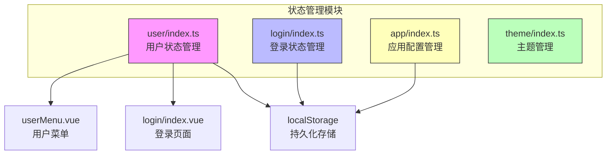
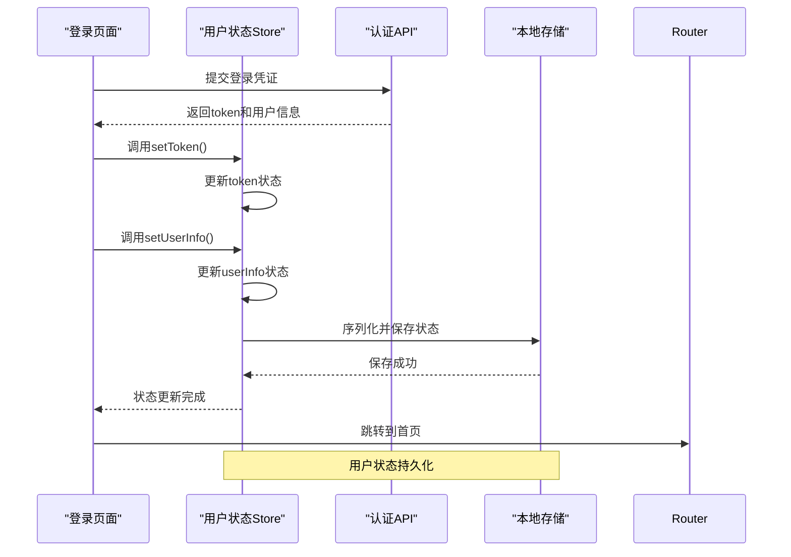
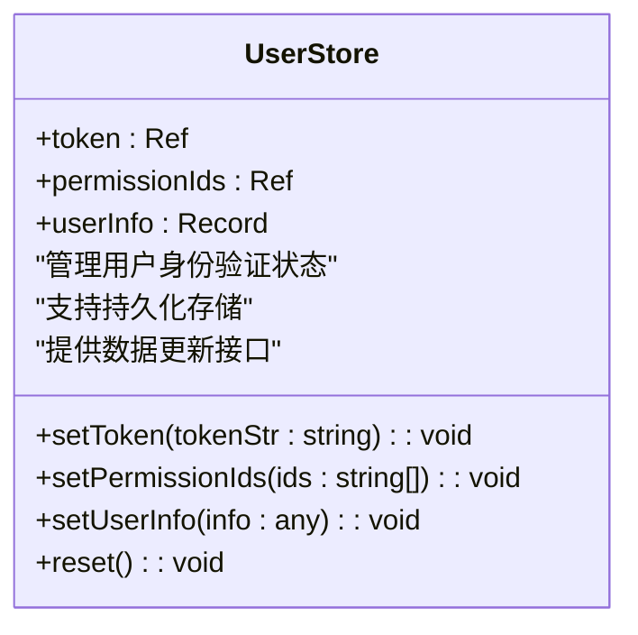
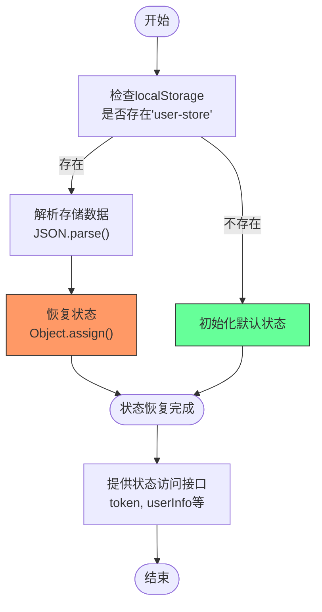
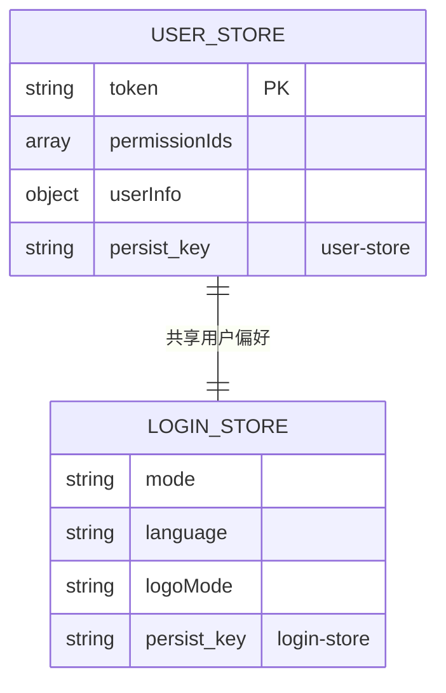
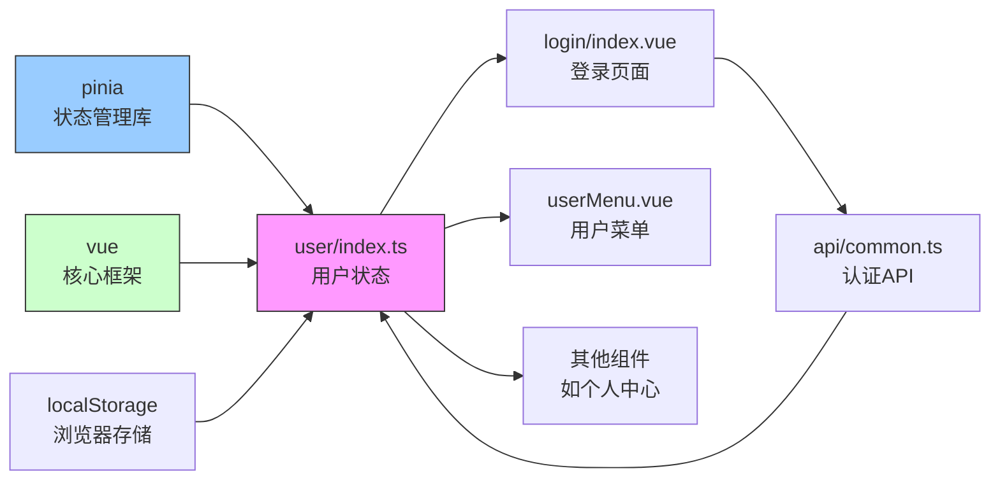

# 用户状态管理

<cite>
**本文档引用文件**   
- [index.ts](file://src/store/uedModule/user/index.ts#L0-L61)
- [types.ts](file://src/store/uedModule/user/types.ts#L0-L0)
- [login/index.vue](file://src/views/uedModule/login/index.vue#L0-L414)
- [userMenu.vue](file://src/components/uedModule/menu/userMenu.vue#L0-L90)
- [index.ts](file://src/store/index.ts#L0-L12)
- [app/defaultConfig.ts](file://src/store/uedModule/app/defaultConfig.ts#L0-L20)
- [common.ts](file://src/api/common.ts#L304-L354)
</cite>

## 目录
1. [简介](#简介)
2. [项目结构](#项目结构)
3. [核心组件](#核心组件)
4. [架构概述](#架构概述)
5. [详细组件分析](#详细组件分析)
6. [依赖分析](#依赖分析)
7. [性能考虑](#性能考虑)
8. [故障排除指南](#故障排除指南)
9. [结论](#结论)

## 简介
本文档详细阐述了用户状态管理模块的设计与实现，重点分析了user store模块在Vue 3项目中的作用。该模块负责存储和管理用户相关的业务数据，如用户个人资料、权限信息、操作状态等，并与登录状态管理模块协同工作。文档将深入解析用户状态的存储结构、操作方法、持久化机制以及在不同页面中的使用方式，为开发者提供全面的技术参考。

## 项目结构
用户状态管理模块位于`src/store/uedModule/user`目录下，是基于Pinia状态管理库实现的。该模块与其他状态管理模块（如app、login、theme）共同构成了应用的全局状态管理体系。用户状态模块主要包含两个文件：`index.ts`定义了状态的逻辑和行为，`types.ts`定义了相关的类型结构。

**图示来源**
- [index.ts](file://src/store/uedModule/user/index.ts#L0-L61)
- [login/index.vue](file://src/views/uedModule/login/index.vue#L0-L414)
- [userMenu.vue](file://src/components/uedModule/menu/userMenu.vue#L0-L90)

**本节来源**
- [index.ts](file://src/store/uedModule/user/index.ts#L0-L61)
- [index.ts](file://src/store/index.ts#L0-L12)

## 核心组件
用户状态管理模块的核心是`user/index.ts`文件中定义的Pinia store。该store负责管理用户的身份验证令牌（token）、权限ID列表（permissionIds）和用户信息（userInfo）。通过`setToken`、`setUserInfo`等方法，其他组件可以安全地更新用户状态。`reset`方法用于在用户登出时清除所有用户相关数据。

**本节来源**
- [index.ts](file://src/store/uedModule/user/index.ts#L0-L61)

## 架构概述
用户状态管理模块采用Pinia作为状态管理解决方案，实现了响应式的数据管理和模块化的架构设计。该模块与登录流程紧密集成，在用户成功登录后，由登录页面调用`setToken`和`setUserInfo`方法来初始化用户状态。用户状态在应用的各个组件中通过`useUserStore`组合式函数进行访问和使用。

**图示来源**
- [index.ts](file://src/store/uedModule/user/index.ts#L0-L61)
- [login/index.vue](file://src/views/uedModule/login/index.vue#L0-L414)

## 详细组件分析
### 用户状态Store分析
用户状态Store是应用中管理用户相关数据的核心组件。它定义了用户身份验证所需的关键数据结构和操作方法。

#### 数据结构与方法

**图示来源**
- [index.ts](file://src/store/uedModule/user/index.ts#L0-L61)

#### 用户信息管理流程

**图示来源**
- [index.ts](file://src/store/uedModule/user/index.ts#L0-L61)

**本节来源**
- [index.ts](file://src/store/uedModule/user/index.ts#L0-L61)
- [types.ts](file://src/store/uedModule/user/types.ts#L0-L0)

### 登录流程集成分析
用户状态管理模块与登录流程深度集成，确保用户身份验证信息能够正确地存储和使用。

#### 登录状态与用户状态的区别与联系
用户状态（user store）和登录状态（login store）虽然都与用户身份相关，但职责分明。用户状态主要存储用户的身份验证令牌和业务数据，而登录状态则存储登录页面的配置信息，如主题模式、语言设置等。两者通过不同的持久化键名（'user-store' vs 'login-store'）分别存储在localStorage中。

**图示来源**
- [index.ts](file://src/store/uedModule/user/index.ts#L0-L61)
- [login/index.ts](file://src/store/uedModule/login/index.ts#L0-L56)

**本节来源**
- [login/index.vue](file://src/views/uedModule/login/index.vue#L0-L414)
- [login/index.ts](file://src/store/uedModule/login/index.ts#L0-L56)

## 依赖分析
用户状态管理模块依赖于多个核心库和模块，形成了一个完整的依赖网络。

**图示来源**
- [index.ts](file://src/store/uedModule/user/index.ts#L0-L61)
- [login/index.vue](file://src/views/uedModule/login/index.vue#L0-L414)
- [index.ts](file://src/store/index.ts#L0-L12)

**本节来源**
- [index.ts](file://src/store/index.ts#L0-L12)
- [common.ts](file://src/api/common.ts#L304-L354)

## 性能考虑
用户状态管理模块在设计时考虑了性能优化，通过合理的状态管理和持久化策略确保应用的响应速度。

- **状态更新效率**：使用Vue的`ref`和`reactive`函数创建响应式数据，确保状态更新的高效性。
- **持久化开销**：状态在初始化时从localStorage恢复，避免了重复的API调用。
- **内存占用**：用户信息存储在内存中，提供快速访问，同时通过合理的数据结构设计控制内存使用。

## 故障排除指南
### 常见问题及解决方案
1. **用户状态无法持久化**
   - 检查浏览器是否禁用了localStorage
   - 验证Pinia持久化插件是否正确安装和配置
   - 确认持久化键名没有冲突

2. **用户信息更新不生效**
   - 确保调用`setUserInfo`方法时传入了正确的数据
   - 检查组件是否正确地从store中读取了更新后的状态
   - 验证响应式系统是否正常工作

3. **登录后状态未正确初始化**
   - 检查登录API返回的数据格式是否符合预期
   - 确认登录页面是否正确调用了`setToken`和`setUserInfo`方法
   - 验证状态恢复逻辑是否正确执行

**本节来源**
- [index.ts](file://src/store/uedModule/user/index.ts#L0-L61)
- [login/index.vue](file://src/views/uedModule/login/index.vue#L0-L414)

## 结论
用户状态管理模块是应用安全性和用户体验的核心组成部分。通过Pinia实现的状态管理提供了清晰的数据流和高效的响应式更新机制。模块的持久化设计确保了用户状态在页面刷新后能够正确恢复，提升了用户体验。与其他模块的良好集成使得用户个性化配置能够在整个应用中共享和使用。建议在实际开发中遵循本文档的最佳实践，确保用户状态管理的稳定性和安全性。