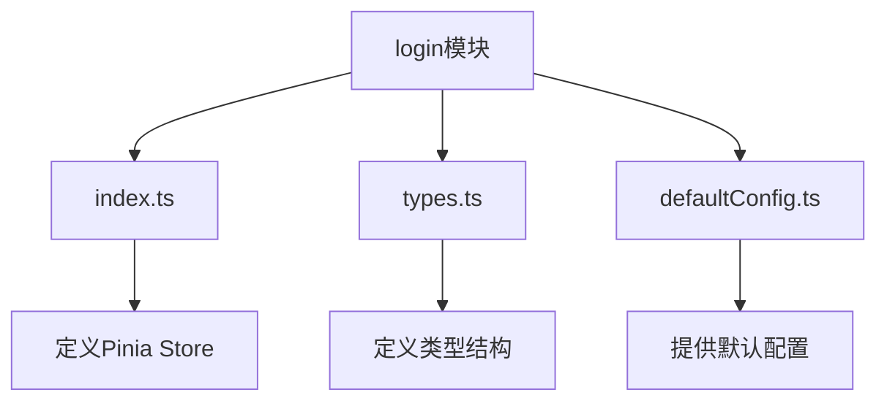
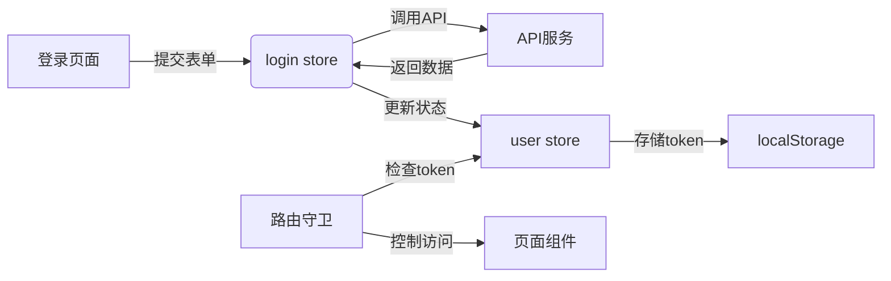
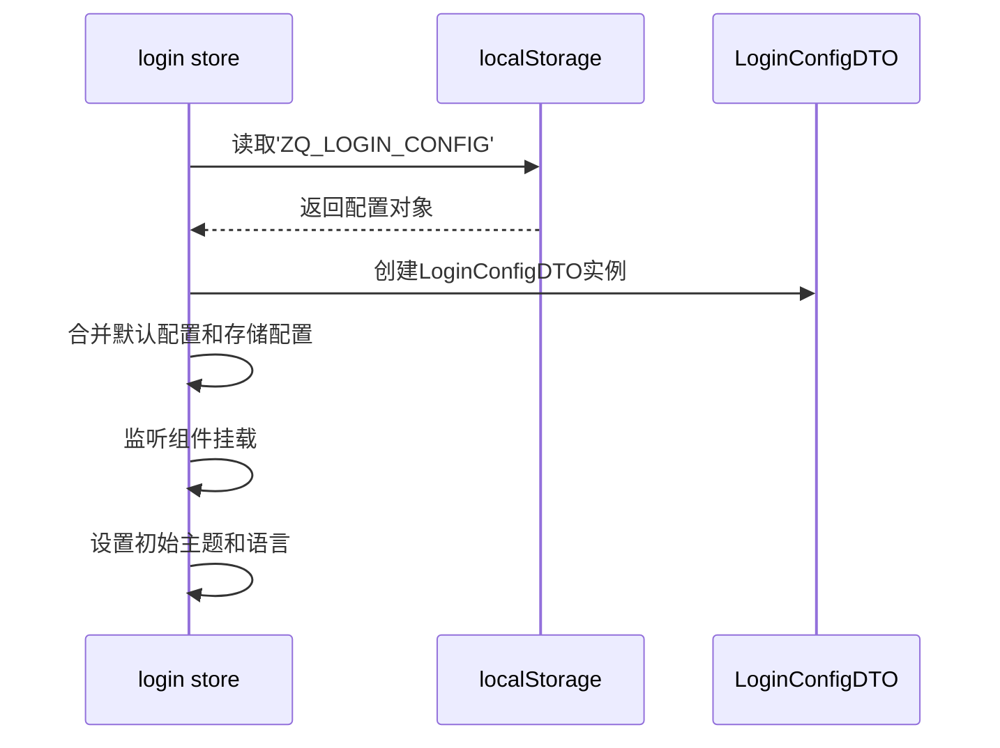
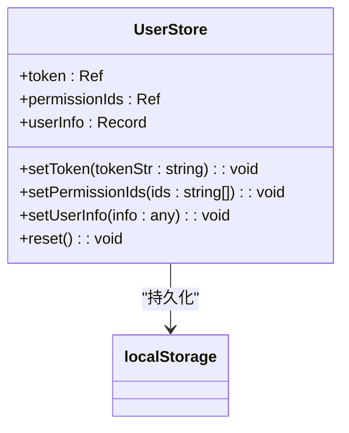
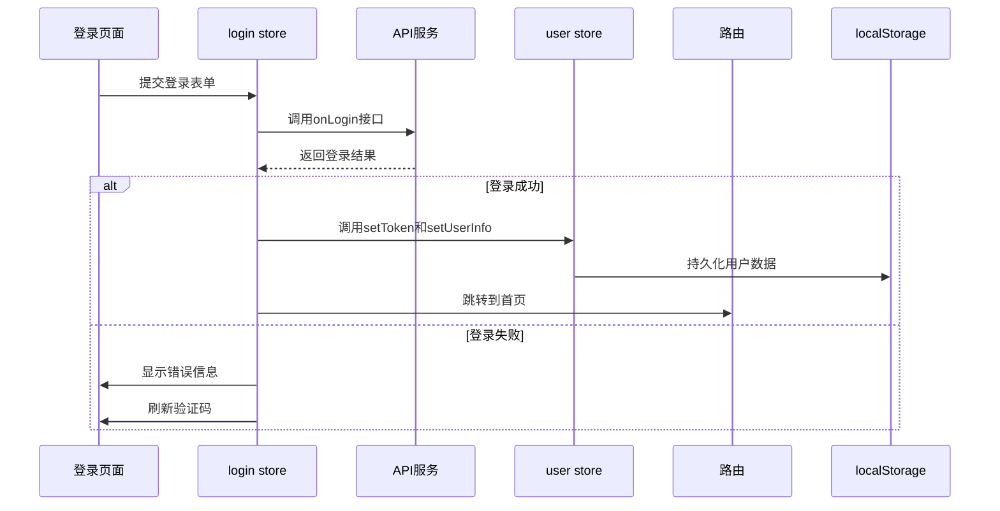
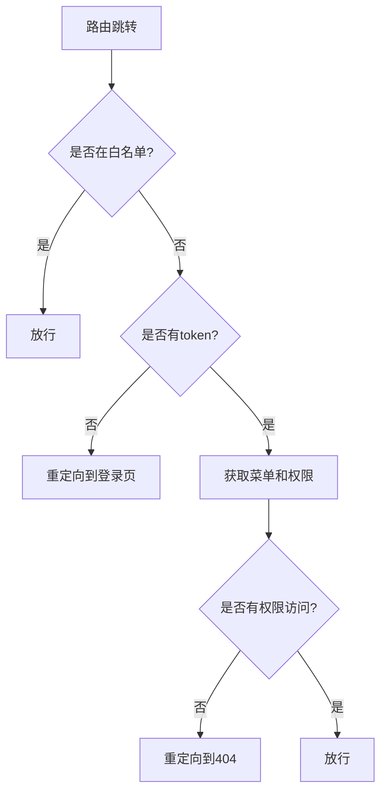
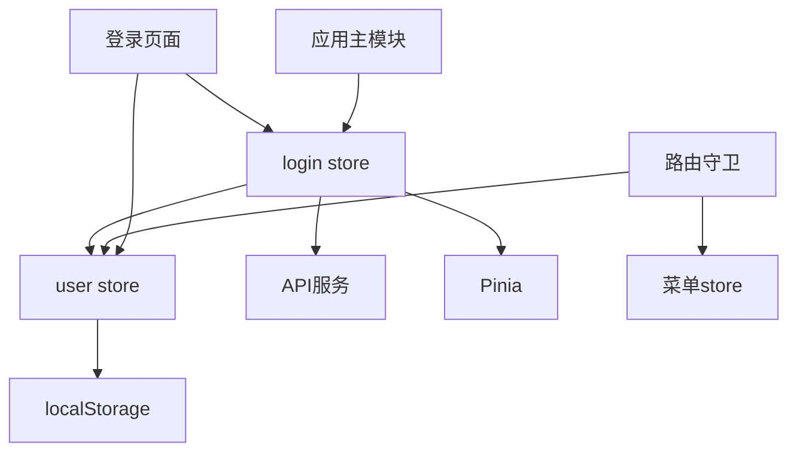

# 登录状态管理

<cite>
**本文档引用的文件**   
- [defaultConfig.ts](file://src/store/uedModule/login/defaultConfig.ts) - *更新了登录配置的默认值*
- [types.ts](file://src/store/uedModule/login/types.ts) - *定义了登录配置的类型结构*
- [index.ts](file://src/store/uedModule/login/index.ts) - *实现了login store的核心逻辑*
- [user/index.ts](file://src/store/uedModule/user/index.ts) - *管理用户认证状态*
- [guard.ts](file://src/router/guard.ts) - *路由守卫实现权限控制*
- [index.vue](file://src/views/uedModule/login/index.vue) - *登录页面组件*
- [common.ts](file://src/api/common.ts) - *提供登录相关的API服务*
</cite>

## 更新摘要
**变更内容**   
- 更新了登录模块的配置管理和实现逻辑
- 调整了store状态管理机制
- 优化了登录页面的交互体验
- 增强了主题和语言切换功能

## 目录
1. [简介](#简介)
2. [项目结构](#项目结构)
3. [核心组件](#核心组件)
4. [架构概述](#架构概述)
5. [详细组件分析](#详细组件分析)
6. [依赖分析](#依赖分析)
7. [性能考虑](#性能考虑)
8. [故障排除指南](#故障排除指南)
9. [结论](#结论)

## 简介
本文档全面介绍了登录状态管理模块的功能与实现。该模块基于Pinia状态管理库，负责维护用户认证状态、处理登录登出流程、与后端服务交互，并与路由系统协同实现权限控制。文档详细说明了state中维护的用户认证状态，如登录状态、用户信息、token、权限列表等，以及模块如何与路由守卫协同工作。

## 项目结构
登录状态管理模块主要由以下几个文件构成，位于`src/store/uedModule/login/`目录下：



**Diagram sources**
- [index.ts](file://src/store/uedModule/login/index.ts)
- [types.ts](file://src/store/uedModule/login/types.ts)
- [defaultConfig.ts](file://src/store/uedModule/login/defaultConfig.ts)

**Section sources**
- [index.ts](file://src/store/uedModule/login/index.ts)
- [types.ts](file://src/store/uedModule/login/types.ts)
- [defaultConfig.ts](file://src/store/uedModule/login/defaultConfig.ts)

## 核心组件
登录状态管理模块的核心是`login` store，它负责管理登录相关的配置和状态。该模块与`user` store紧密协作，`user` store负责管理用户认证的核心数据，如token和用户信息。两个store共同构成了完整的用户认证状态管理体系。

**Section sources**
- [index.ts](file://src/store/uedModule/login/index.ts)
- [user/index.ts](file://src/store/uedModule/user/index.ts)

## 架构概述
登录状态管理模块的架构设计遵循了分层和职责分离的原则。模块通过Pinia store管理状态，与API服务层进行异步通信，并通过路由守卫实现权限控制。



**Diagram sources**
- [index.ts](file://src/store/uedModule/login/index.ts)
- [user/index.ts](file://src/store/uedModule/user/index.ts)
- [guard.ts](file://src/router/guard.ts)
- [index.vue](file://src/views/uedModule/login/index.vue)

## 详细组件分析

### login store分析
`login` store主要负责管理登录页面的配置信息，如主题模式、语言、背景图等。这些配置信息会被持久化到localStorage中，以便用户下次访问时保持一致的体验。

#### 状态结构
```mermaid
classDiagram
class LoginConfigStore {
+name : 'ZQ_LOGIN_CONFIG'
+loginConfig : Ref<LoginConfigDTO>
+get(filed : keyof LoginConfigDTO) : LoginConfigDTO[keyof LoginConfigDTO]
+set(config : Partial<LoginConfigDTO>) : void
+reset() : void
}
class LoginConfigDTO {
+mode : string
+language : string
+logoMode : string
+title : string
+bgMode : string
+bgImage : string
+bgImageDark : string
+logoUrl : string
+logoName : string
+showLanguage : boolean
+copyright : Array<{text : string, link? : string}>
}
LoginConfigStore --> LoginConfigDTO : "包含"
```

**Diagram sources**
- [types.ts](file://src/store/uedModule/login/types.ts)
- [index.ts](file://src/store/uedModule/login/index.ts)

**Section sources**
- [types.ts](file://src/store/uedModule/login/types.ts)
- [index.ts](file://src/store/uedModule/login/index.ts)

#### 初始化流程


**Diagram sources**
- [index.ts](file://src/store/uedModule/login/index.ts)
- [defaultConfig.ts](file://src/store/uedModule/login/defaultConfig.ts)

### user store分析
`user` store是用户认证状态的核心，负责管理用户的token、权限ID和用户信息。

#### 状态结构


**Diagram sources**
- [user/index.ts](file://src/store/uedModule/user/index.ts)

**Section sources**
- [user/index.ts](file://src/store/uedModule/user/index.ts)

#### 登录流程


**Diagram sources**
- [index.vue](file://src/views/uedModule/login/index.vue)
- [common.ts](file://src/api/common.ts)
- [user/index.ts](file://src/store/uedModule/user/index.ts)

### 路由守卫机制
路由守卫是权限控制的关键组件，它在每次路由跳转前检查用户的认证状态和权限。

#### 权限控制流程


**Diagram sources**
- [guard.ts](file://src/router/guard.ts)

**Section sources**
- [guard.ts](file://src/router/guard.ts)

## 依赖分析
登录状态管理模块与其他模块存在紧密的依赖关系，形成了一个完整的认证生态系统。



**Diagram sources**
- [index.ts](file://src/store/uedModule/login/index.ts)
- [user/index.ts](file://src/store/uedModule/user/index.ts)
- [guard.ts](file://src/router/guard.ts)
- [index.vue](file://src/views/uedModule/login/index.vue)

**Section sources**
- [index.ts](file://src/store/uedModule/login/index.ts)
- [user/index.ts](file://src/store/uedModule/user/index.ts)
- [guard.ts](file://src/router/guard.ts)

## 性能考虑
登录状态管理模块在设计时考虑了性能优化：
1. 使用Pinia的持久化插件，避免重复初始化状态
2. 采用按需加载策略，只在需要时获取菜单和权限数据
3. 合理使用ref和reactive，避免不必要的响应式开销
4. 在登录成功后延迟跳转，确保状态持久化完成

## 故障排除指南
### 常见问题及解决方案
1. **登录后状态未持久化**
   - 检查localStorage中是否正确存储了'user-store'和'login-store'
   - 确认Pinia持久化插件已正确配置

2. **路由守卫不生效**
   - 检查路由守卫是否已正确安装
   - 确认路由元数据中的permissionId是否正确设置

3. **登录配置未生效**
   - 检查defaultConfig.ts中的默认配置是否正确
   - 确认localStorage中的'ZQ_LOGIN_CONFIG'是否被正确读取

4. **钉钉登录失败**
   - 检查getLoginRedirectUrl接口返回的redirectUrl是否有效
   - 确认钉钉应用的回调地址配置正确

**Section sources**
- [user/index.ts](file://src/store/uedModule/user/index.ts)
- [guard.ts](file://src/router/guard.ts)
- [defaultConfig.ts](file://src/store/uedModule/login/defaultConfig.ts)
- [common.ts](file://src/api/common.ts)

## 结论
登录状态管理模块通过Pinia store实现了用户认证状态的有效管理。模块设计合理，职责清晰，通过与API服务、路由守卫等组件的协同工作，构建了一个完整的用户认证和权限控制体系。建议在实际使用中注意状态持久化的可靠性，并定期检查安全相关配置，确保系统的安全性。