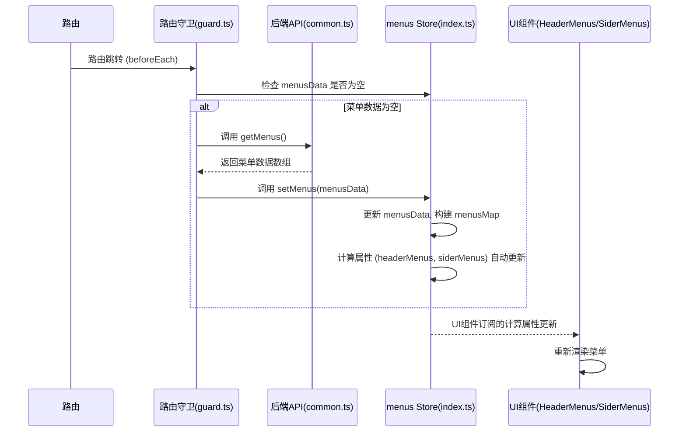
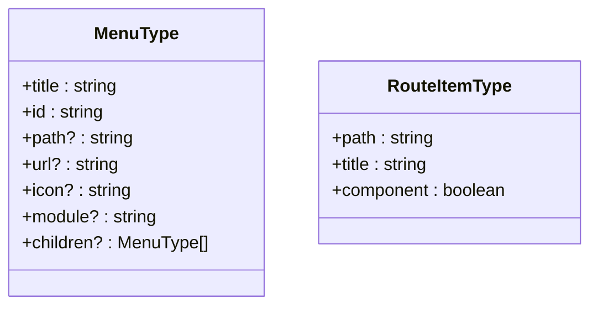
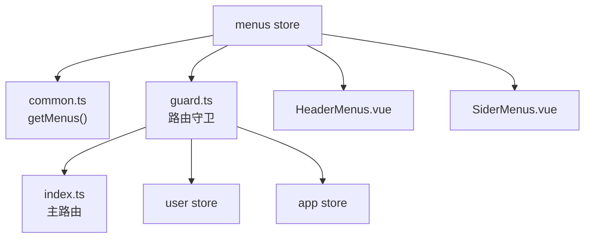

# 菜单状态管理

<cite>
**本文档中引用的文件**   
- [types.ts](file://src/store/uedModule/menus/types.ts)
- [index.ts](file://src/store/uedModule/menus/index.ts)
- [HeaderMenus.vue](file://src/components/uedModule/layout/comps/HeaderMenus.vue)
- [SiderMenus.vue](file://src/components/uedModule/layout/comps/SiderMenus.vue)
- [common.ts](file://src/api/common.ts)
- [guard.ts](file://src/router/guard.ts)
- [index.ts](file://src/router/index.ts)
</cite>

## 目录
1. [项目结构](#项目结构)
2. [核心组件](#核心组件)
3. [架构概述](#架构概述)
4. [详细组件分析](#详细组件分析)
5. [依赖分析](#依赖分析)
6. [性能考虑](#性能考虑)
7. [故障排除指南](#故障排除指南)

## 项目结构
菜单状态管理模块位于 `src/store/uedModule/menus` 目录下，是应用状态管理（Pinia store）的一部分。该模块主要负责管理应用的菜单数据、状态和行为，包括侧边栏菜单、顶部菜单的渲染数据、激活状态以及面包屑导航。其核心文件是 `index.ts`，它定义了 `menus` store 的状态（state）、计算属性（computed）和动作（actions）。`types.ts` 文件则定义了菜单相关的数据类型。该模块与布局组件（`HeaderMenus.vue`, `SiderMenus.vue`）紧密协作，通过订阅 store 状态来渲染菜单UI。菜单数据的加载由路由守卫（`guard.ts`）触发，与后端API（`common.ts`）交互获取。

```mermaid
graph TB
subgraph "菜单状态管理模块"
A["menus store<br>(index.ts)"] --> B["菜单类型定义<br>(types.ts)"]
A --> C["菜单数据<br>(menusData)"]
A --> D["菜单映射<br>(menusMap)"]
A --> E["计算属性<br>(headerMenus, siderMenus)"]
A --> F["动作<br>(setMenus, reset)"]
end
subgraph "UI 组件"
G["顶部菜单<br>(HeaderMenus.vue)"] --> A
H["侧边栏菜单<br>(SiderMenus.vue)"] --> A
end
subgraph "数据与路由"
I["API 接口<br>(common.ts)"] --> A
J["路由守卫<br>(guard.ts)"] --> A
K["主路由<br>(index.ts)"] --> J
end
A -.-> G : 订阅 headerMenus
A -.-> H : 订阅 siderMenus
J --> I : 调用 getMenus()
J --> A : 调用 setMenus()
```

**Diagram sources**
- [index.ts](file://src/store/uedModule/menus/index.ts)
- [types.ts](file://src/store/uedModule/menus/types.ts)
- [HeaderMenus.vue](file://src/components/uedModule/layout/comps/HeaderMenus.vue)
- [SiderMenus.vue](file://src/components/uedModule/layout/comps/SiderMenus.vue)
- [common.ts](file://src/api/common.ts)
- [guard.ts](file://src/router/guard.ts)

**Section sources**
- [index.ts](file://src/store/uedModule/menus/index.ts)
- [types.ts](file://src/store/uedModule/menus/types.ts)

## 核心组件
菜单状态管理的核心是 `menus` Pinia store，它封装了菜单数据的存储、转换和状态计算逻辑。该 store 通过 `setMenus` 方法接收从后端获取的原始菜单数据，并将其转换为适合UI组件渲染的格式。它利用计算属性（如 `headerMenus` 和 `siderMenus`）来动态生成不同区域的菜单项，并通过 `activeMenus` 和 `activeBreadcrumb` 等计算属性来响应路由变化，实现菜单的激活和面包屑导航。`menusMap` 这个数据结构是实现路由到菜单映射的关键，它极大地优化了查找性能。

**Section sources**
- [index.ts](file://src/store/uedModule/menus/index.ts)

## 架构概述
该模块采用典型的MVVM模式，Pinia store 作为 ViewModel，负责管理 Model（菜单数据）并为 View（布局组件）提供数据和状态。数据流是单向的：路由变化触发路由守卫 -> 守卫调用API获取菜单数据 -> 守卫调用store的`setMenus`方法更新状态 -> store的计算属性自动更新 -> UI组件响应式地重新渲染。这种设计将数据获取、状态管理和UI渲染清晰地分离，提高了代码的可维护性和可测试性。



**Diagram sources**
- [guard.ts](file://src/router/guard.ts)
- [common.ts](file://src/api/common.ts)
- [index.ts](file://src/store/uedModule/menus/index.ts)
- [HeaderMenus.vue](file://src/components/uedModule/layout/comps/HeaderMenus.vue)
- [SiderMenus.vue](file://src/components/uedModule/layout/comps/SiderMenus.vue)

## 详细组件分析
### menus store 分析
`menus` store 是整个菜单系统的核心，它定义了菜单的状态、行为和数据转换逻辑。

#### 数据结构与类型定义
`types.ts` 文件定义了菜单的核心数据结构 `MenuType` 和 `RouteItemType`。


**Diagram sources**
- [types.ts](file://src/store/uedModule/menus/types.ts)

**Section sources**
- [types.ts](file://src/store/uedModule/menus/types.ts)

#### State 与 Actions 分析
`index.ts` 文件中的 store 定义了以下关键状态和方法：

- **State (状态)**:
  - `menusData`: 使用 `ref<MenuType[]>` 存储从后端获取的原始菜单树数据。
  - `menusMap`: 使用 `Map<string, MenuType[]>` 存储一个关键的映射关系，键为路由路径（path），值为从根菜单到该路径对应菜单项的完整路径数组。这是实现快速路由到菜单查找的核心。
  - `activeRoutes`: 使用 `ref<RouteItemType[]>` 存储当前激活的路由层级信息，用于生成面包屑。

- **Actions (动作) 与 Computed (计算属性)**:
  - `setMenus(menus: MenuType[])`: 这是加载菜单数据的主要入口。它不仅将数据赋值给 `menusData`，还会调用 `dataToMenuMap` 函数遍历整个菜单树，构建 `menusMap` 映射，为后续的快速查找做准备。
  - `headerMenus`: 计算属性，调用 `dataToMenuItems` 函数，将 `menusData` 中第一层的菜单项转换为适用于顶部菜单（TopMenu）组件渲染的格式（包含 key, label, icon 等）。
  - `siderMenus`: 计算属性，根据当前激活的路由（通过 `activeMenus` 计算得出），找到对应的顶级菜单项，然后将其子菜单转换为适用于侧边栏菜单（SideMenu）组件渲染的格式。
  - `activeMenus`: 计算属性，利用 `menusMap`，根据当前 `activeRoutes` 中最后一个路由的路径，反向查找并返回从根到该菜单项的完整路径数组。这决定了哪些菜单项应该被高亮激活。
  - `activeBreadcrumb`: 计算属性，将 `activeMenus`（菜单层级）和 `activeRoutes`（路由层级，除去最后一个）合并，生成完整的面包屑导航数据。
  - `findFistSiderMenu`: 一个辅助方法，用于在用户访问根路径 `/` 时，深度优先搜索并返回第一个具有 `path` 属性的侧边栏菜单项，以便进行重定向。
  - `reset`: 用于重置整个 store 的状态，清空所有数据。

**Section sources**
- [index.ts](file://src/store/uedModule/menus/index.ts)

### 布局组件分析
布局组件通过 Pinia 的 `storeToRefs` 或直接访问 store 实例来订阅 `menus` store 的状态。

#### 顶部菜单 (HeaderMenus.vue)
`HeaderMenus.vue` 组件通过 `props` 接收 `menuData`，这个数据通常来自 `menusStore.headerMenus`。它使用 `UedMapMenu` 和 `TopMenu` 组件来渲染顶部菜单。当用户点击菜单项时，会触发 `handleMenuClick` 事件，该事件会调用微前端的导航辅助函数 `microMenuNavigation` 来处理跳转。

**Section sources**
- [HeaderMenus.vue](file://src/components/uedModule/layout/comps/HeaderMenus.vue)

#### 侧边栏菜单 (SiderMenus.vue)
`SiderMenus.vue` 组件同样通过 `props` 接收 `menuData`，这个数据通常来自 `menusStore.siderMenus`。它使用 `SideMenu` 组件来渲染侧边栏菜单。组件内部处理了菜单的折叠/展开状态。

**Section sources**
- [SiderMenus.vue](file://src/components/uedModule/layout/comps/SiderMenus.vue)

## 依赖分析
`menus` store 与多个模块存在依赖关系：
- **API 依赖**: 依赖 `src/api/common.ts` 中的 `getMenus()` 函数来获取菜单数据。
- **路由依赖**: 依赖 `src/router/guard.ts` 中的路由守卫来触发菜单的加载和状态更新。同时，`src/router/index.ts` 中的路由扁平化逻辑为 `activeRoutes` 提供了数据基础。
- **UI 组件依赖**: 被 `HeaderMenus.vue` 和 `SiderMenus.vue` 等布局组件直接依赖，以获取渲染所需的数据。
- **其他 Store 依赖**: 在路由守卫中，`menus` store 与 `user` store 和 `app` store 协同工作，共同完成权限校验和应用状态管理。



**Diagram sources**
- [index.ts](file://src/store/uedModule/menus/index.ts)
- [common.ts](file://src/api/common.ts)
- [guard.ts](file://src/router/guard.ts)
- [index.ts](file://src/router/index.ts)
- [HeaderMenus.vue](file://src/components/uedModule/layout/comps/HeaderMenus.vue)
- [SiderMenus.vue](file://src/components/uedModule/layout/comps/SiderMenus.vue)

**Section sources**
- [index.ts](file://src/store/uedModule/menus/index.ts)
- [guard.ts](file://src/router/guard.ts)

## 性能考虑
该模块在性能方面有以下设计和考虑：
1.  **数据预处理与缓存**: `menusMap` 的设计是性能优化的关键。它在 `setMenus` 时一次性构建好路由到菜单路径的映射，将后续的查找时间复杂度从 O(n) 降低到接近 O(1)，避免了在每次路由变化时都进行深度遍历。
2.  **计算属性的响应性**: 使用 Pinia 的计算属性（`computed`）来派生 `headerMenus`, `siderMenus`, `activeMenus` 等数据。这些属性是惰性求值且缓存的，只有当其依赖的 `menusData` 或 `activeRoutes` 发生变化时才会重新计算，避免了不必要的重复计算。
3.  **性能优化建议**:
    - **菜单数据缓存**: 当前实现中，每次用户刷新页面或重新登录，都会重新调用 `getMenus()` 接口。建议在 `getMenus()` 函数中加入 `localStorage` 缓存机制。首次获取后存入 `localStorage`，后续加载时优先从缓存读取，可以显著减少网络请求和页面加载时间。
    - **按需加载**: 对于菜单层级非常深或菜单项非常多的系统，可以考虑实现菜单的懒加载（Lazy Loading），即只在用户展开某个父菜单时，才去请求其子菜单的数据。

## 故障排除指南
- **问题**: 菜单无法加载或显示为空。
  - **检查点**: 确认 `getMenus()` API 接口是否返回了正确的数据。检查路由守卫 `guard.ts` 是否在正确条件下调用了 `setMenus`。确认 `menusData` 在 store 中是否被正确赋值。
- **问题**: 菜单激活状态不正确或面包屑显示错误。
  - **检查点**: 检查 `activeRoutes` 的数据是否准确反映了当前路由。确认 `menusMap` 是否已正确构建，特别是路由 `path` 是否与菜单项的 `path` 完全匹配（注意大小写和斜杠）。
- **问题**: 侧边栏菜单没有自动展开到正确的层级。
  - **检查点**: 确认 `siderMenus` 计算属性的逻辑，它依赖于 `activeMenus` 的最后一个元素。检查 `activeMenus` 的计算是否正确。

**Section sources**
- [index.ts](file://src/store/uedModule/menus/index.ts)
- [guard.ts](file://src/router/guard.ts)
- [common.ts](file://src/api/common.ts)