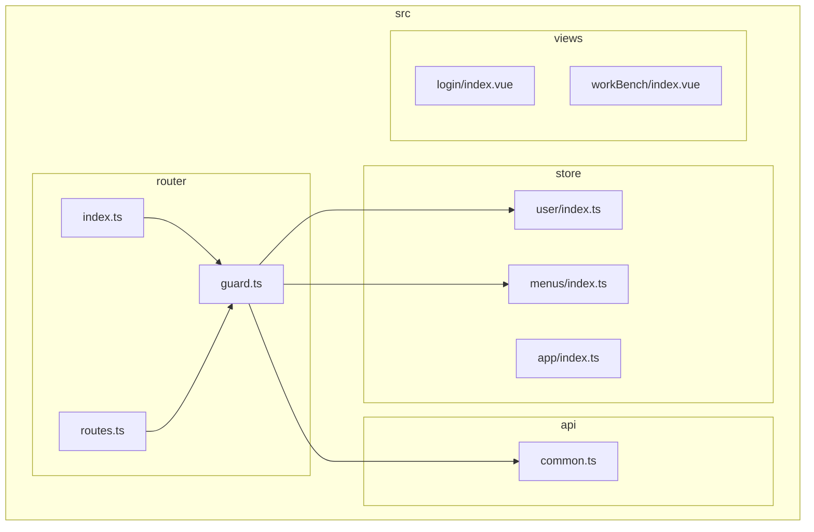
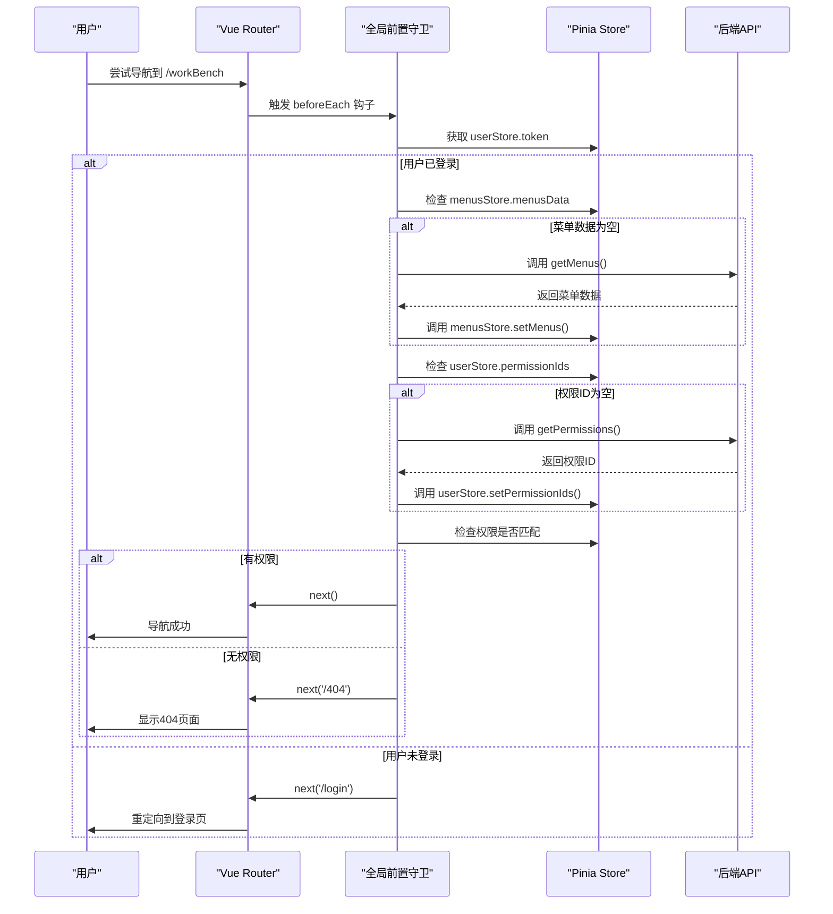
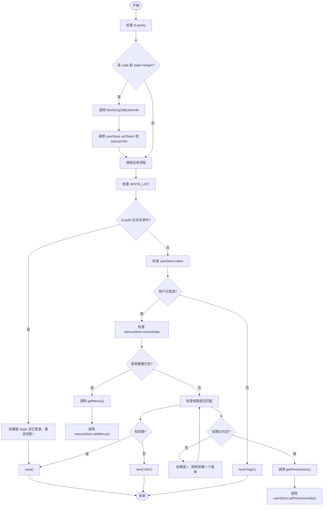
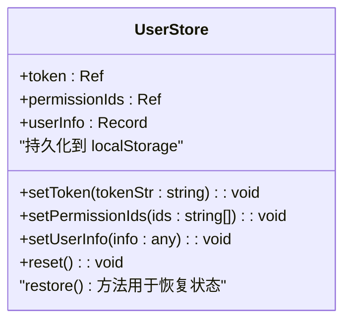
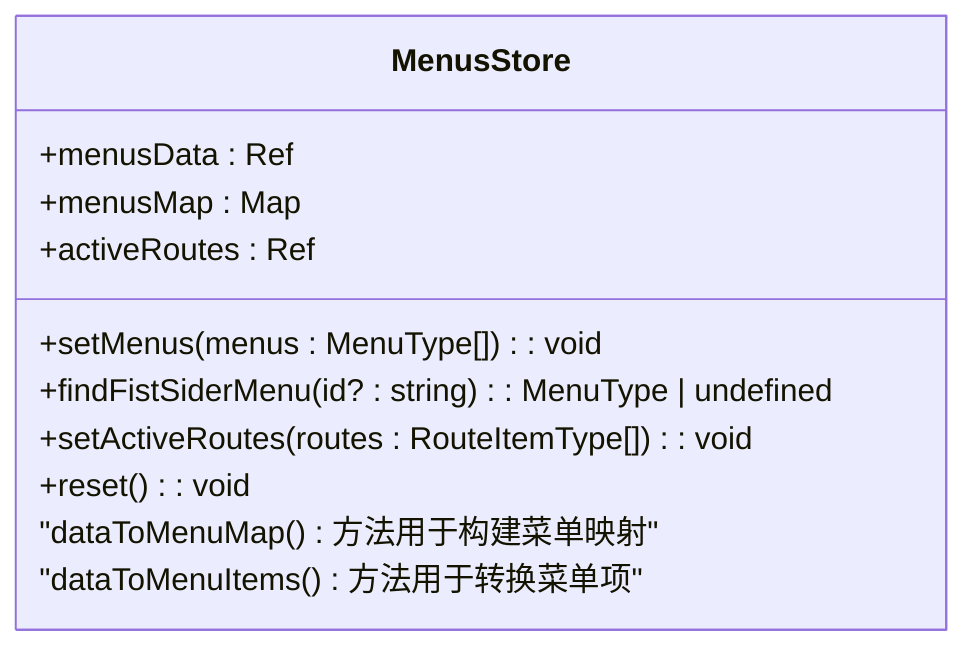
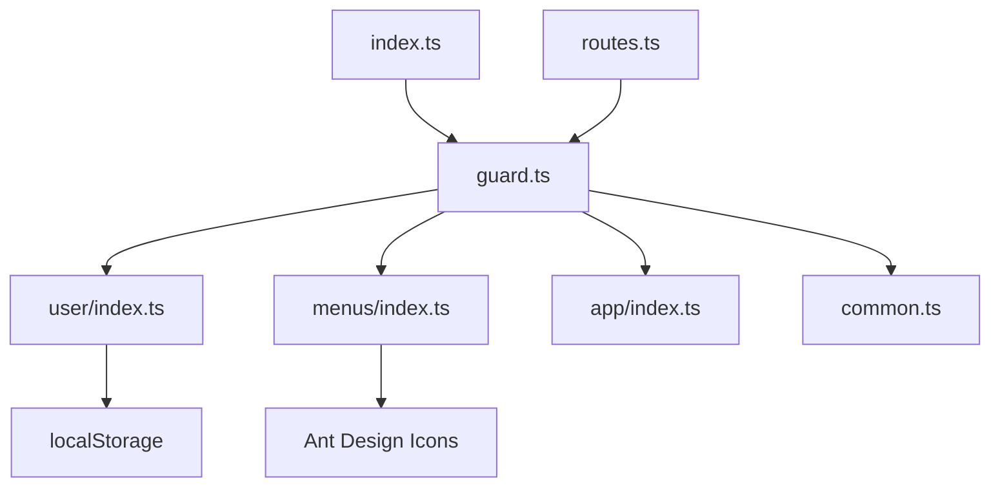

# 路由守卫机制

<cite>
**本文档中引用的文件**   
- [guard.ts](file://src/router/guard.ts#L1-L65)
- [user/index.ts](file://src/store/uedModule/user/index.ts#L1-L62)
- [menus/index.ts](file://src/store/uedModule/menus/index.ts#L1-L138)
- [index.ts](file://src/router/index.ts#L1-L52)
- [common.ts](file://src/api/common.ts#L1-L355)
- [routes.ts](file://src/router/routes.ts#L1-L278)
</cite>

## 目录
1. [简介](#简介)
2. [项目结构](#项目结构)
3. [核心组件](#核心组件)
4. [架构概述](#架构概述)
5. [详细组件分析](#详细组件分析)
6. [依赖分析](#依赖分析)
7. [性能考虑](#性能考虑)
8. [故障排除指南](#故障排除指南)
9. [结论](#结论)

## 简介
本文档深入解析了Vue项目中路由守卫的实现机制，重点分析了`guard.ts`文件中定义的全局前置守卫。文档详细说明了守卫函数如何拦截导航、执行权限校验、处理用户认证状态检查和动态路由注入。通过实际代码展示了守卫的执行顺序、`next()`函数的使用模式以及异步守卫的处理方式。同时，文档解释了守卫与状态管理（Pinia）的集成，如何从store中获取用户权限信息进行访问控制，并提供了常见守卫场景的实现方案，如登录保护、角色权限校验、页面离开确认等，以及典型错误处理模式。

## 项目结构
本项目采用模块化和分层的架构设计，主要分为配置、组件、公共资源、API接口、业务逻辑、路由、状态管理、主题和视图等目录。`src/router`目录下的`guard.ts`文件是路由守卫的核心实现，它与`store`目录下的状态管理模块紧密集成，共同实现了应用的权限控制和导航逻辑。

**图示来源**
- [guard.ts](file://src/router/guard.ts#L1-L65)
- [user/index.ts](file://src/store/uedModule/user/index.ts#L1-L62)
- [menus/index.ts](file://src/store/uedModule/menus/index.ts#L1-L138)
- [common.ts](file://src/api/common.ts#L1-L355)

**本节来源**
- [guard.ts](file://src/router/guard.ts#L1-L65)
- [index.ts](file://src/router/index.ts#L1-L52)

## 核心组件
路由守卫的核心组件是`setupPermissionGuard`函数，它注册了一个全局前置守卫，用于在每次路由跳转前执行权限校验和用户状态检查。该函数通过`useUserStore`、`useMenusStore`和`useAppStore`从Pinia状态管理中获取用户、菜单和应用状态，并根据这些状态决定是否允许导航。

**本节来源**
- [guard.ts](file://src/router/guard.ts#L1-L65)
- [user/index.ts](file://src/store/uedModule/user/index.ts#L1-L62)
- [menus/index.ts](file://src/store/uedModule/menus/index.ts#L1-L138)

## 架构概述
本项目的路由守卫架构基于Vue Router的导航守卫机制，结合Pinia状态管理和异步API调用，实现了完整的权限控制流程。当用户尝试访问一个路由时，全局前置守卫会首先检查用户是否已登录，然后根据用户权限和路由元数据决定是否允许访问。

**图示来源**
- [guard.ts](file://src/router/guard.ts#L1-L65)
- [common.ts](file://src/api/common.ts#L1-L355)
- [user/index.ts](file://src/store/uedModule/user/index.ts#L1-L62)
- [menus/index.ts](file://src/store/uedModule/menus/index.ts#L1-L138)

## 详细组件分析
### 全局前置守卫分析
`setupPermissionGuard`函数是路由守卫的核心，它通过`router.beforeEach`注册了一个异步前置守卫。该守卫函数接收`to`、`from`和`next`三个参数，其中`to`表示目标路由，`from`表示来源路由，`next`是一个函数，用于控制导航流程。

#### 守卫执行流程

**图示来源**
- [guard.ts](file://src/router/guard.ts#L1-L65)
- [common.ts](file://src/api/common.ts#L1-L355)

**本节来源**
- [guard.ts](file://src/router/guard.ts#L1-L65)

### 状态管理集成分析
路由守卫与Pinia状态管理深度集成，通过`useUserStore`、`useMenusStore`和`useAppStore`获取和设置应用状态。

#### 用户状态管理

**图示来源**
- [user/index.ts](file://src/store/uedModule/user/index.ts#L1-L62)

**本节来源**
- [user/index.ts](file://src/store/uedModule/user/index.ts#L1-L62)

#### 菜单状态管理

**图示来源**
- [menus/index.ts](file://src/store/uedModule/menus/index.ts#L1-L138)

**本节来源**
- [menus/index.ts](file://src/store/uedModule/menus/index.ts#L1-L138)

## 依赖分析
路由守卫模块依赖于多个核心模块，包括状态管理、API接口和路由配置。这些模块之间的依赖关系确保了权限控制逻辑的完整性和一致性。

**图示来源**
- [guard.ts](file://src/router/guard.ts#L1-L65)
- [user/index.ts](file://src/store/uedModule/user/index.ts#L1-L62)
- [menus/index.ts](file://src/store/uedModule/menus/index.ts#L1-L138)
- [common.ts](file://src/api/common.ts#L1-L355)
- [index.ts](file://src/router/index.ts#L1-L52)
- [routes.ts](file://src/router/routes.ts#L1-L278)

**本节来源**
- [guard.ts](file://src/router/guard.ts#L1-L65)
- [user/index.ts](file://src/store/uedModule/user/index.ts#L1-L62)
- [menus/index.ts](file://src/store/uedModule/menus/index.ts#L1-L138)
- [common.ts](file://src/api/common.ts#L1-L355)

## 性能考虑
路由守卫的性能主要受异步API调用的影响。为了优化性能，建议在用户登录后一次性获取所有必要的权限和菜单数据，并将其缓存到状态管理中，避免每次导航都进行网络请求。此外，可以考虑对频繁访问的路由进行预加载，以提升用户体验。

## 故障排除指南
### 常见问题及解决方案
1. **用户登录后仍被重定向到登录页**
   - 检查`userStore.token`是否正确设置
   - 确认`localStorage`中的`user-store`数据是否完整
   - 验证`WHITE_LIST`配置是否正确

2. **菜单无法显示**
   - 检查`getMenus()` API是否返回正确的数据格式
   - 确认`menusStore.setMenus()`是否被正确调用
   - 验证菜单数据是否符合`MenuType`接口定义

3. **权限校验失败**
   - 检查`getPermissions()`返回的权限ID是否与路由元数据匹配
   - 确认`userStore.permissionIds`是否正确更新
   - 验证路由的`meta.permissionId`配置是否正确

**本节来源**
- [guard.ts](file://src/router/guard.ts#L1-L65)
- [user/index.ts](file://src/store/uedModule/user/index.ts#L1-L62)
- [menus/index.ts](file://src/store/uedModule/menus/index.ts#L1-L138)
- [common.ts](file://src/api/common.ts#L1-L355)

## 结论
本文档详细解析了Vue项目中路由守卫的实现机制，展示了如何通过全局前置守卫、状态管理和API调用实现完整的权限控制。通过深入分析`guard.ts`文件的实现，我们了解了守卫函数的执行顺序、`next()`函数的使用模式以及异步守卫的处理方式。同时，文档也展示了守卫与Pinia状态管理的集成方式，以及如何从store中获取用户权限信息进行访问控制。这些实现方案为构建安全、可靠的Vue应用提供了有力的支持。