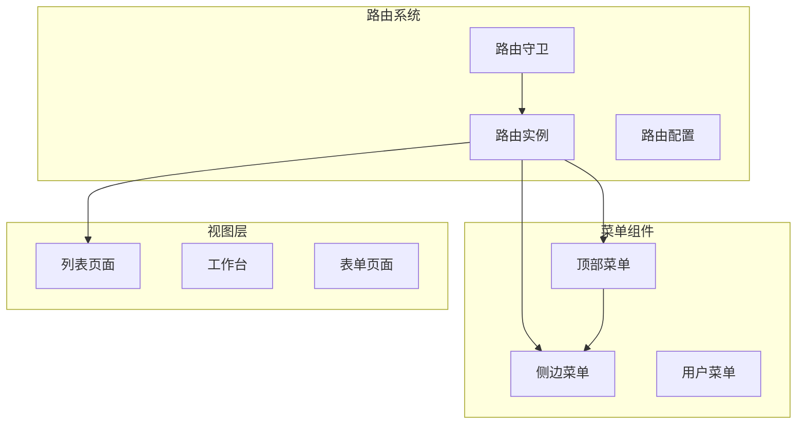
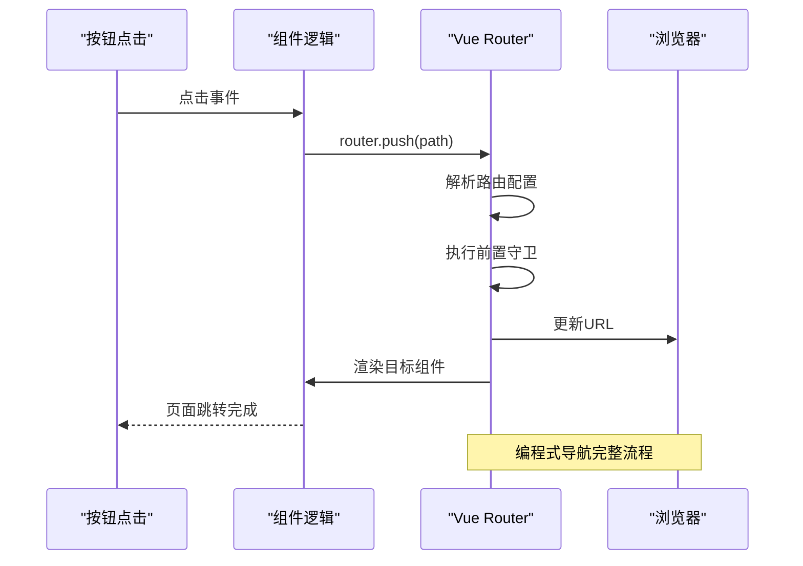
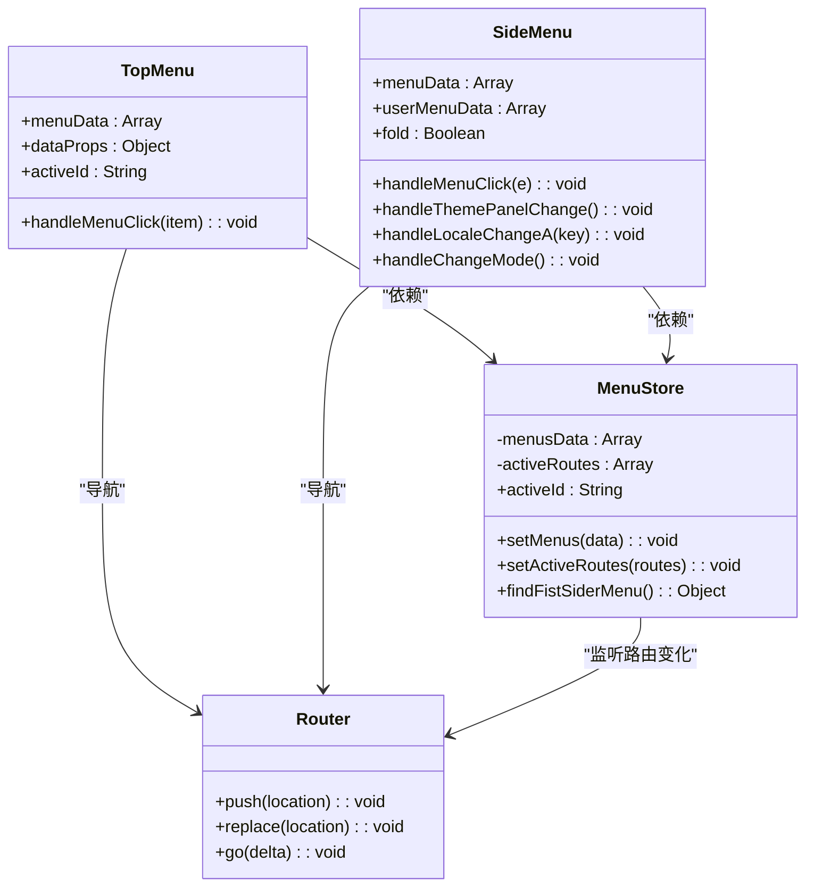
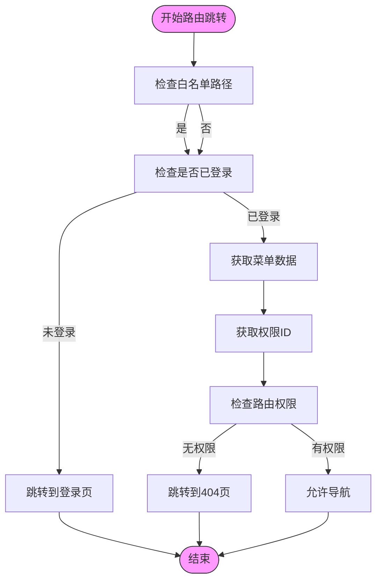

# 路由导航模式

<cite>
**本文档中引用的文件**   
- [index.ts](file://src/router/index.ts)
- [routes.ts](file://src/router/routes.ts)
- [guard.ts](file://src/router/guard.ts)
- [topMenu.vue](file://src/components/uedModule/menu/topMenu.vue)
- [sideMenu.vue](file://src/components/uedModule/menu/sideMenu.vue)
- [list.vue](file://src/views/uedTypical/baseList/components/list.vue)
- [helper.ts](file://src/micro/microApi/helper.ts)
</cite>

## 目录
1. [项目结构分析](#项目结构分析)
2. [核心路由配置](#核心路由配置)
3. [编程式导航实现](#编程式导航实现)
4. [声明式导航与菜单联动](#声明式导航与菜单联动)
5. [路由参数传递与接收](#路由参数传递与接收)
6. [导航守卫与权限控制](#导航守卫与权限控制)
7. [特殊导航需求实现](#特殊导航需求实现)
8. [导航性能优化建议](#导航性能优化建议)

## 项目结构分析

项目采用模块化结构，路由相关代码集中在`src/router`目录下，菜单组件位于`src/components/uedModule/menu`目录，页面视图存放在`src/views`目录。这种清晰的分层结构有利于维护和扩展。



**图示来源**
- [index.ts](file://src/router/index.ts#L1-L50)
- [topMenu.vue](file://src/components/uedModule/menu/topMenu.vue#L1-L80)
- [sideMenu.vue](file://src/components/uedModule/menu/sideMenu.vue#L1-L260)

## 核心路由配置

路由系统基于Vue Router 4构建，采用模块化配置方式。主路由配置文件`index.ts`负责创建路由实例并应用全局守卫，而具体的路由规则定义在`routes.ts`文件中。

### 路由实例创建

```typescript
const router = createRouter({
  history: process.env.HISTORY_TYPE === 'history' ? createWebHistory(basePath) : createWebHashHistory(basePath),
  routes: waterRoutes
});
```

路由实例根据环境变量选择history或hash模式，并将扁平化的路由数组作为配置。系统还实现了路由扁平化处理函数`routeToArr`，用于将嵌套路由转换为平级结构，便于菜单渲染和权限管理。

### 路由规则定义

路由配置采用`RouteRecordRaw`类型定义，包含路径、名称、组件和元数据等信息。特殊路由如外部链接通过`beforeEnter`守卫实现：

```typescript
{
  name: 'base::das-readdy',
  path: '/das-readdy',
  beforeEnter() {
    const { token } = useUserStore();
    window.open(`https://10.20.114.19:8888/das-readdy?readdyAuthToken=${token}`, '_blank');
    return false; // 阻止原页面跳转
  },
  component: () => import('@/views/uedTypical/iframe/index.vue'),
  meta: {
    title: 'I18N.layout.dasReaddy',
    permissionId: 'base::workBench:index',
    fullScreen: true
  }
}
```

**本节来源**
- [index.ts](file://src/router/index.ts#L1-L50)
- [routes.ts](file://src/router/routes.ts#L1-L200)

## 编程式导航实现

编程式导航通过`router.push`和`router.go`等方法实现，在项目中广泛应用于按钮点击事件和业务逻辑跳转。

### router.push方法

在列表页面的新增按钮中，使用`router.push`进行页面跳转：

```typescript
function add() {
  router.push({
    path: '/work-list/add'
  });
}
```

这种方法允许传递完整的路由对象，支持路径、查询参数和命名路由等多种形式。

### router.go方法

在子应用中，使用`router.go(-1)`实现返回上一页功能：

```typescript
function goAbout() {
  router.go(-1);
}
```

`router.go`方法操作浏览器历史记录栈，参数为正数时前进，为负数时后退。

### 微应用导航处理

项目还实现了微应用环境下的特殊导航处理：

```typescript
export function microMenuNavigation(menu: MenuType) {
  menuNavigationRewrite(menu);
}
```

该函数根据菜单项的模块属性判断是否为微应用路由，并调用相应的路由实例进行跳转。



**图示来源**
- [list.vue](file://src/views/uedTypical/baseList/components/list.vue#L1-L200)
- [helper.ts](file://src/micro/microApi/helper.ts#L1-L100)

**本节来源**
- [list.vue](file://src/views/uedTypical/baseList/components/list.vue#L1-L200)
- [helper.ts](file://src/micro/microApi/helper.ts#L1-L100)

## 声明式导航与菜单联动

项目通过自定义菜单组件实现声明式导航，将菜单数据与路由系统深度集成。

### 顶部菜单实现

顶部菜单组件`topMenu.vue`接收菜单数据和属性配置，通过`microMenuNavigation`处理点击事件：

```vue
<template>
  <UedTopMenu
    :active-id="activeId"
    :props="dataProps"
    :data="menuData"
    @menu-click="handleMenuClick"
  >
  </UedTopMenu>
</template>

<script setup>
const handleMenuClick = (item: any) => {
  microMenuNavigation(item);
};
</script>
```

### 侧边菜单实现

侧边菜单组件`sideMenu.vue`功能更为复杂，除了导航功能外，还集成了主题切换、语言切换等系统功能：

```vue
<template>
  <UedSideMenu
    v-model:active-id="menuActiveId"
    @menu-click="handleMenuClick"
  >
    <template #footer>
      <!-- 系统功能按钮 -->
      <UserMenu :menu-data="userMenuData"/>
    </template>
  </UedSideMenu>
</template>
```

菜单点击事件同样通过`microMenuNavigation`处理，确保统一的导航行为。

### 菜单与路由联动机制

菜单组件通过Pinia状态管理与路由系统联动，`activeId`从`menusStore`中获取，确保菜单选中状态与当前路由一致：

```typescript
const menusStore = useMenusStore();
const { activeId } = storeToRefs(menusStore);
```

这种设计实现了菜单状态的集中管理，避免了组件间的直接依赖。



**图示来源**
- [topMenu.vue](file://src/components/uedModule/menu/topMenu.vue#L1-L80)
- [sideMenu.vue](file://src/components/uedModule/menu/sideMenu.vue#L1-L260)
- [index.ts](file://src/store/uedModule/menus/index.ts#L1-L150)

**本节来源**
- [topMenu.vue](file://src/components/uedModule/menu/topMenu.vue#L1-L80)
- [sideMenu.vue](file://src/components/uedModule/menu/sideMenu.vue#L1-L260)

## 路由参数传递与接收

项目中路由参数的传递主要通过编程式导航的`router.push`方法实现，支持路径参数和查询参数两种方式。

### 路径参数传递

在列表页面的新增功能中，通过指定路径实现参数传递：

```typescript
function add() {
  router.push({
    path: '/work-list/add'
  });
}
```

这种方式将参数直接编码在URL路径中，适合表示资源层级关系。

### 查询参数传递

虽然当前代码示例中未直接展示查询参数传递，但`router.push`方法支持完整的路由位置对象，可以传递查询参数：

```typescript
router.push({
  path: '/search',
  query: {
    keyword: 'example',
    page: '1'
  }
});
```

### 参数接收

目标页面可以通过`useRoute`钩子接收路由参数：

```typescript
import { useRoute } from 'vue-router';

const route = useRoute();
const keyword = route.query.keyword;
const id = route.params.id;
```

项目中的路由守卫也展示了查询参数的处理：

```typescript
if (to.query) {
  const { code, state } = to.query;
  if (code && state === 'relogin') {
    // 处理登录参数
  }
}
```

**本节来源**
- [list.vue](file://src/views/uedTypical/baseList/components/list.vue#L1-L200)
- [guard.ts](file://src/router/guard.ts#L1-L65)

## 导航守卫与权限控制

路由守卫是项目权限控制的核心机制，通过全局前置守卫实现登录验证和权限检查。

### 全局前置守卫

`guard.ts`文件中定义了`setupPermissionGuard`函数，注册全局前置守卫：

```typescript
export function setupPermissionGuard(router: Router) {
  router.beforeEach(async (to, _, next) => {
    // 白名单处理
    if (WHITE_LIST.includes(to.path)) {
      if (to.path === '/login' && userStore.token) {
        next({ path: '/' });
      }
      next();
    } else if (userStore.token) {
      // 权限检查逻辑
      if (!userStore.permissionIds.includes(to.meta.permissionId as string)) {
        next('/404');
        return;
      }
      next();
    } else {
      next('/login');
    }
  });
}
```

### 权限控制流程

守卫执行流程包括：
1. 白名单路径直接放行
2. 已登录用户检查菜单和权限数据
3. 验证当前用户是否有访问目标路由的权限
4. 无权限则跳转到404页面
5. 未登录用户跳转到登录页

### 特殊路由处理

守卫还处理了特殊场景，如钉钉登录回调：

```typescript
if (to.query) {
  const { code, state } = to.query;
  if (code && state === 'relogin') {
    const res = await fetchDingTalkUserInfo(code as string);
    // 处理登录信息
  }
}
```



**图示来源**
- [guard.ts](file://src/router/guard.ts#L1-L65)

**本节来源**
- [guard.ts](file://src/router/guard.ts#L1-L65)

## 特殊导航需求实现

项目实现了多种特殊导航需求，满足复杂的业务场景。

### 外部链接跳转

通过`beforeEnter`守卫实现外部链接跳转，同时阻止原页面跳转：

```typescript
beforeEnter() {
  window.open('https://chatv.das-security.cn/chat', '_blank');
  return false;
}
```

### 微应用导航集成

项目支持微前端架构下的导航集成，通过`microMenuNavigation`函数处理微应用路由：

```typescript
export function menuNavigationRewrite(menu: MenuType) {
  if (menu.module) {
    if (isActiveApp(menu.module)) {
      microApp.router.push({
        name: menu.module,
        path: menu.url
      });
      return;
    }
  }
  router.push(menu.url);
}
```

### 导航历史管理

在子应用中实现导航历史管理，确保浏览器前进后退按钮正常工作：

```typescript
window.addEventListener('popstate', () => {
  const fullPath = location.pathname.replace('/micro-app/angular14', '') + location.search + location.hash;
  this.ngZone.run(() => {
    this.router.navigateByUrl(fullPath);
  });
});
```

### 滚动行为配置

虽然代码中未直接展示滚动行为配置，但Vue Router支持在路由实例中配置滚动行为：

```typescript
const router = createRouter({
  // ...其他配置
  scrollBehavior(to, from, savedPosition) {
    if (savedPosition) {
      return savedPosition;
    } else {
      return { top: 0 };
    }
  }
});
```

**本节来源**
- [routes.ts](file://src/router/routes.ts#L1-L200)
- [helper.ts](file://src/micro/microApi/helper.ts#L1-L100)
- [example/angular/src/app/app.component.ts](file://src/micro/example/angular/src/app/app.component.ts#L1-L22)

## 导航性能优化建议

基于项目现状，提出以下导航性能优化建议：

### 路由懒加载优化

项目已使用动态导入实现路由懒加载，建议进一步优化chunk分割：

```typescript
component: () => import(
  /* webpackChunkName: "workbench" */
  '@/views/uedTypical/workBench/index.vue'
)
```

### 路由预加载

在用户可能跳转的页面上预加载路由组件：

```typescript
// 在首页预加载工作台
const workbenchRoute = import('@/views/uedTypical/workBench/index.vue');

// 用户点击时直接使用预加载的组件
```

### 导航守卫优化

避免在守卫中进行过多异步操作，可以缓存权限数据：

```typescript
// 缓存权限检查结果
const permissionCache = new Map();
const checkPermission = (permissionId) => {
  if (permissionCache.has(permissionId)) {
    return permissionCache.get(permissionId);
  }
  // 执行检查逻辑
  const result = /* 检查结果 */;
  permissionCache.set(permissionId, result);
  return result;
};
```

### 组件缓存策略

对频繁切换的页面使用`<keep-alive>`缓存：

```vue
<keep-alive>
  <router-view v-if="$route.meta.keepAlive" />
</keep-alive>
<router-view v-if="!$route.meta.keepAlive" />
```

### 错误处理优化

完善导航错误处理，提供友好的用户提示：

```typescript
router.onError((error) => {
  console.error('路由导航错误:', error);
  // 显示错误提示
});
```