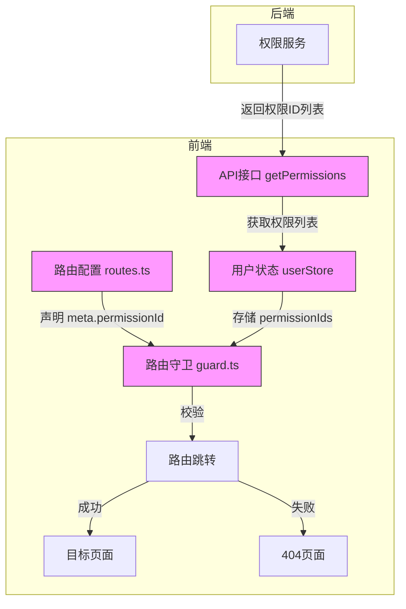
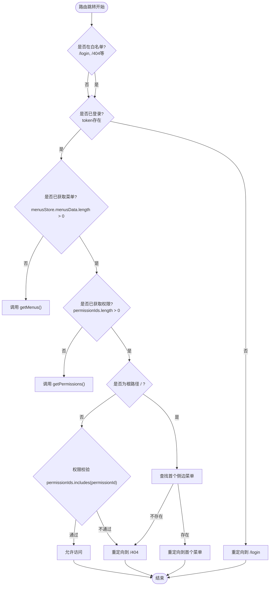
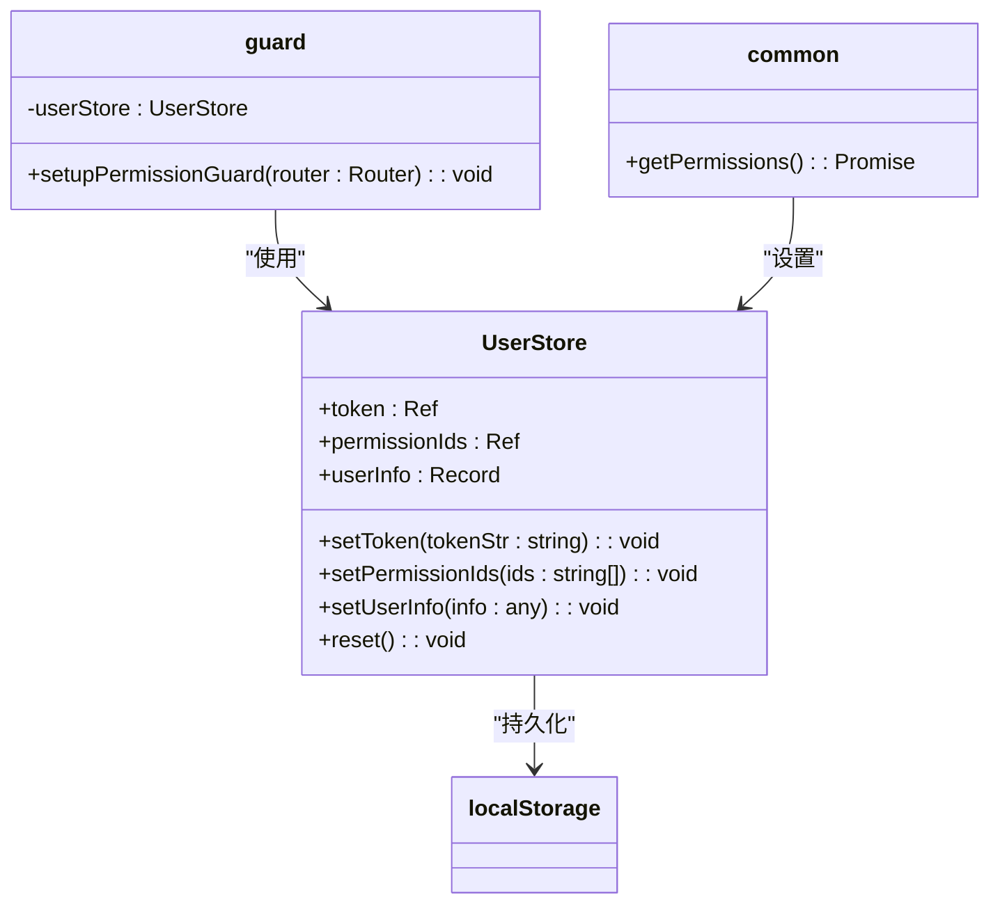
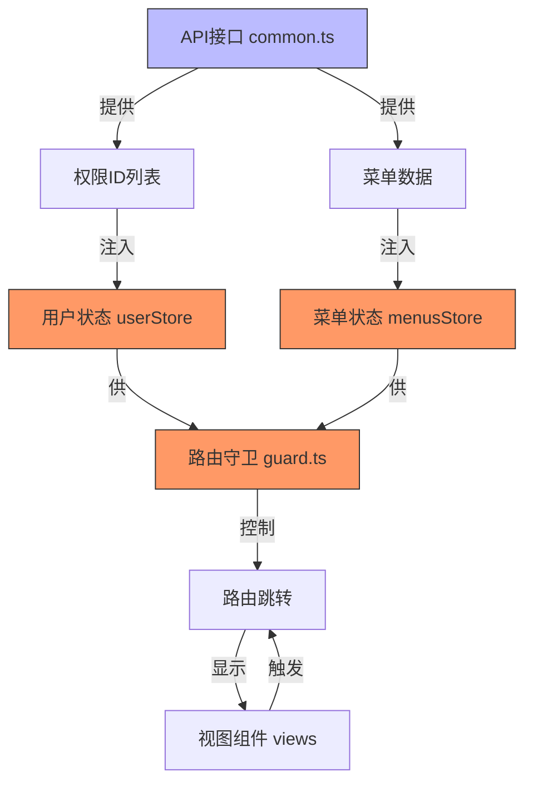

# 路由权限集成

<cite>
**本文档中引用的文件**   
- [routes.ts](file://src/router/routes.ts)
- [guard.ts](file://src/router/guard.ts)
- [user/index.ts](file://src/store/uedModule/user/index.ts)
- [menus/index.ts](file://src/store/uedModule/menus/index.ts)
- [common.ts](file://src/api/common.ts)
- [index.ts](file://src/router/index.ts)
- [routerCenter/index.ts](file://src/micro/routerCenter/index.ts)
</cite>

## 目录
1. [引言](#引言)
2. [项目结构](#项目结构)
3. [核心组件](#核心组件)
4. [架构概述](#架构概述)
5. [详细组件分析](#详细组件分析)
6. [依赖分析](#依赖分析)
7. [性能考虑](#性能考虑)
8. [故障排除指南](#故障排除指南)
9. [结论](#结论)

## 引言
本文档系统性地文档化了路由与权限控制的集成方案。详细说明了如何利用路由元信息（meta字段）定义页面访问权限，结合`guard.ts`中的守卫逻辑实现基于角色或权限码的访问控制。解释了动态路由生成机制，如何根据用户权限动态加载可访问的路由配置。结合`store`中用户模块的状态管理，展示了权限数据的获取与验证流程。提供了权限配置的最佳实践，包括权限标识设计、权限校验策略和无权限访问的处理方式，并给出了扩展自定义权限规则的方法。

## 项目结构
项目采用模块化设计，核心源代码位于`src`目录下。主要模块包括`api`（API接口）、`components`（UI组件）、`router`（路由配置）、`service`（服务层）、`store`（状态管理）和`views`（视图组件）。路由与权限控制的核心逻辑分布在`src/router`和`src/store`目录中，通过`src/api/common.ts`提供权限数据接口。

**Section sources**
- [project_structure](file://#L1-L50)

## 核心组件
路由权限集成的核心组件包括：
- **路由配置** (`src/router/routes.ts`): 定义应用的路由结构，通过`meta`字段声明页面权限。
- **路由守卫** (`src/router/guard.ts`): 实现全局前置守卫，拦截路由跳转，进行权限验证。
- **用户状态管理** (`src/store/uedModule/user/index.ts`): 存储用户令牌、权限ID列表和用户信息。
- **菜单状态管理** (`src/store/uedModule/menus/index.ts`): 管理侧边栏和顶部菜单的显示逻辑。
- **权限API** (`src/api/common.ts`): 提供获取菜单和权限ID列表的异步接口。

**Section sources**
- [routes.ts](file://src/router/routes.ts#L1-L10)
- [guard.ts](file://src/router/guard.ts#L1-L10)
- [user/index.ts](file://src/store/uedModule/user/index.ts#L1-L10)
- [menus/index.ts](file://src/store/uedModule/menus/index.ts#L1-L10)
- [common.ts](file://src/api/common.ts#L1-L10)

## 架构概述
系统采用基于Vue Router的前端路由方案，结合Pinia进行状态管理，实现细粒度的权限控制。整体架构遵循“声明式权限定义 -> 动态权限获取 -> 守卫逻辑校验”的流程。



**Diagram sources **
- [routes.ts](file://src/router/routes.ts#L1-L30)
- [guard.ts](file://src/router/guard.ts#L1-L70)
- [user/index.ts](file://src/store/uedModule/user/index.ts#L1-L70)
- [common.ts](file://src/api/common.ts#L1-L50)

## 详细组件分析

### 路由元信息与权限定义
路由的权限控制通过`meta`字段实现。在`src/router/routes.ts`文件中，每个路由记录（`RouteRecordRaw`）的`meta`对象包含一个`permissionId`字段，用于指定访问该页面所需的权限标识。

```typescript
{
  name: 'base::workBench',
  path: '/workBench',
  component: () => import('@/views/uedTypical/workBench/index.vue'),
  meta: {
    title: 'I18N.layout.gongZuoTai',
    permissionId: 'base::workBench:index'
  }
}
```

**关键点**:
- **权限标识设计**: `permissionId`采用`模块名::资源名:操作`的命名规范（如`base::workBench:index`），便于管理和扩展。
- **公共页面**: 可通过`meta.public`字段标记公共页面，绕过权限校验。
- **特殊处理**: 对于需要在新窗口打开的页面（如`/das-readdy`），使用`beforeEnter`钩子执行跳转并阻止原页面加载。

**Section sources**
- [routes.ts](file://src/router/routes.ts#L1-L250)

### 路由守卫逻辑分析
`src/router/guard.ts`文件中的`setupPermissionGuard`函数为Vue Router注册了全局前置守卫（`beforeEach`）。该守卫是权限校验的核心逻辑。



**关键逻辑**:
1.  **白名单放行**: 路径在`WHITE_LIST`（如`/login`, `/404`）中的页面直接放行。
2.  **登录状态检查**: 若用户未登录（`token`不存在），则重定向到登录页。
3.  **权限数据获取**: 用户登录后，若`menusStore`或`userStore`中尚未缓存菜单或权限ID，则调用`getMenus()`和`getPermissions()`进行异步获取，并存入Pinia Store。
4.  **根路径处理**: 访问根路径`/`时，自动重定向到用户可访问的首个侧边栏菜单。
5.  **权限校验**: 对于非白名单且已登录的请求，检查用户的`permissionIds`数组是否包含目标路由的`meta.permissionId`。若不包含且非公共页面，则重定向到`/404`。

**Section sources**
- [guard.ts](file://src/router/guard.ts#L1-L70)

### 用户状态与权限数据流
`src/store/uedModule/user/index.ts`文件定义了`user` Store，使用Pinia管理用户相关的状态。



**关键点**:
- **状态定义**: `token`存储用户认证令牌，`permissionIds`存储用户拥有的权限ID列表，`userInfo`存储用户基本信息。
- **数据持久化**: `restore()`函数在Store初始化时从`localStorage`恢复状态，确保页面刷新后数据不丢失。
- **数据获取**: `setPermissionIds`方法由`guard.ts`中的守卫逻辑调用，将从`getPermissions()` API获取的权限ID列表存入Store。

**Diagram sources **
- [user/index.ts](file://src/store/uedModule/user/index.ts#L1-L70)
- [guard.ts](file://src/router/guard.ts#L39-L41)
- [common.ts](file://src/api/common.ts#L200-L210)

### 动态路由与菜单生成
虽然本项目未在`routes.ts`中实现动态路由的完全动态化（路由是静态声明的），但通过`src/router/index.ts`中的`routeToArr`函数和`src/micro/routerCenter/index.ts`中的`traverseRoutes`方法，展示了动态处理路由的机制。

- **`routeToArr`函数**: 将嵌套的路由结构（包含`children`）扁平化为一维数组，并为每个路由节点的`meta`字段注入`parentRoutes`信息，用于面包屑导航。
- **`RouterCenter`类**: 在微前端场景下，负责管理不同子应用的路由。`traverseRoutes`方法递归遍历路由树，将其注册到中心路由映射表中，并支持根据`meta`信息配置默认页面。

**Section sources**
- [index.ts](file://src/router/index.ts#L30-L60)
- [routerCenter/index.ts](file://src/micro/routerCenter/index.ts#L150-L220)

## 依赖分析
系统各模块间依赖关系清晰，形成了一个闭环。



**关键依赖**:
- **`common.ts` -> `userStore`/`menusStore`**: API层是权限和菜单数据的源头。
- **`userStore`/`menusStore` -> `guard.ts`**: 状态管理层为守卫逻辑提供校验所需的数据。
- **`guard.ts` -> `Vue Router`**: 守卫逻辑直接控制路由的跳转行为。

**Diagram sources **
- [common.ts](file://src/api/common.ts#L1-L356)
- [user/index.ts](file://src/store/uedModule/user/index.ts#L1-L70)
- [menus/index.ts](file://src/store/uedModule/menus/index.ts#L1-L140)
- [guard.ts](file://src/router/guard.ts#L1-L70)

## 性能考虑
- **权限预加载**: 在用户登录后首次访问受保护页面时，会并行或串行地获取菜单和权限数据。建议在登录成功后立即预加载这些数据，以提升后续页面跳转的响应速度。
- **状态持久化**: 使用`localStorage`持久化`userStore`，避免了每次刷新页面都重新请求权限数据，提升了用户体验。
- **路由扁平化**: `routeToArr`函数将嵌套路由扁平化，便于进行高效的路由匹配和权限校验。

## 故障排除指南
- **问题**: 用户登录后无法访问任何页面，一直重定向到`/404`。
  - **检查点**: 确认`getPermissions()` API返回的权限ID列表是否正确，且与路由`meta.permissionId`匹配。
- **问题**: 菜单无法显示。
  - **检查点**: 确认`getMenus()` API返回的数据结构是否符合`MenuType`接口定义，特别是`path`和`children`字段。
- **问题**: 页面刷新后需要重新登录。
  - **检查点**: 检查`userStore`的`restore()`函数是否正常执行，以及`localStorage`中`user-store`的值是否正确。

**Section sources**
- [guard.ts](file://src/router/guard.ts#L50-L60)
- [user/index.ts](file://src/store/uedModule/user/index.ts#L50-L60)
- [common.ts](file://src/api/common.ts#L1-L356)

## 结论
该路由权限集成方案设计合理，通过路由元信息声明权限、路由守卫执行校验、状态管理存储数据、API接口提供数据源，形成了一套完整的前端权限控制体系。方案具备良好的可维护性和扩展性，权限标识的命名规范清晰，易于管理。通过结合微前端路由中心，也展现了对复杂应用架构的支持能力。遵循此方案，可以有效地保护应用资源，确保用户只能访问其被授权的功能。