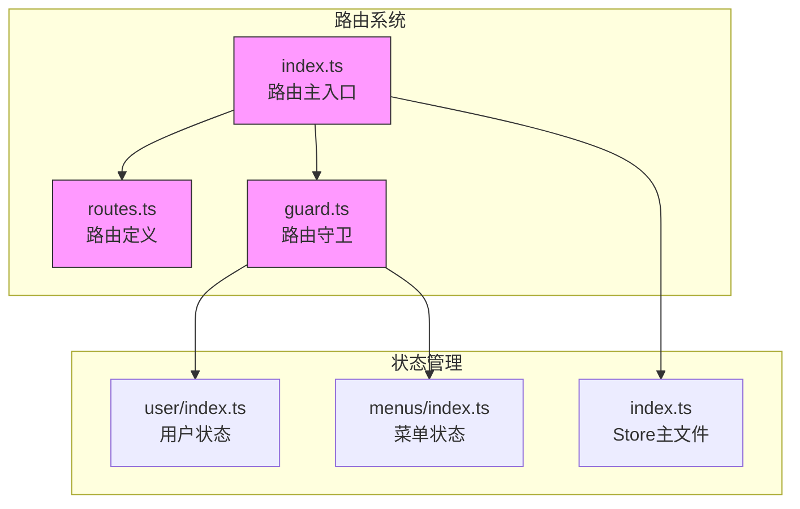
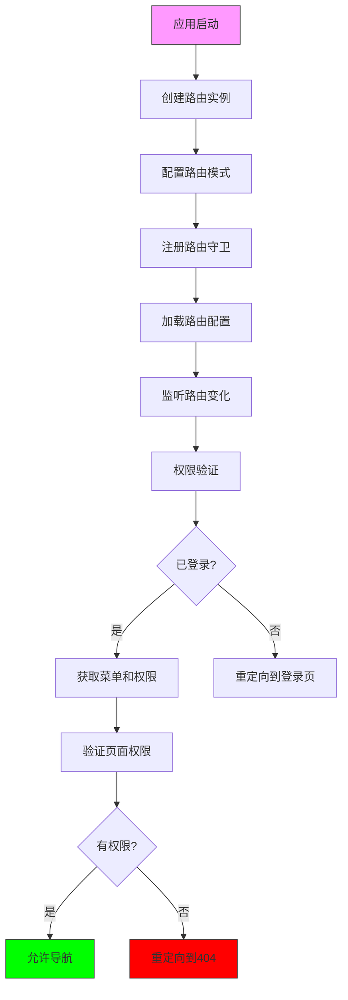
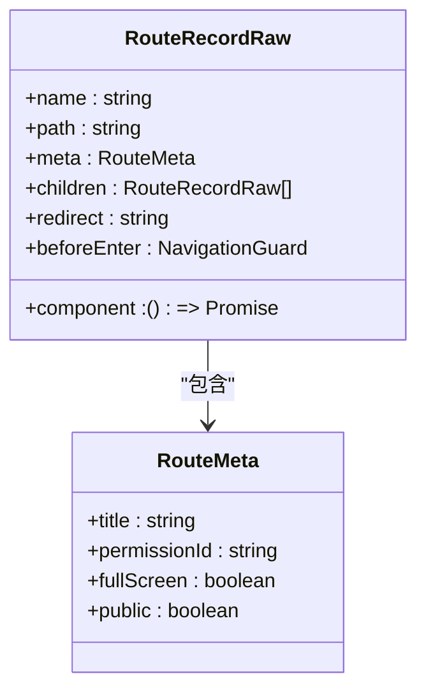
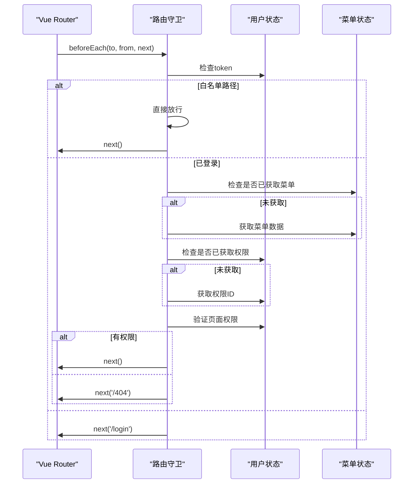
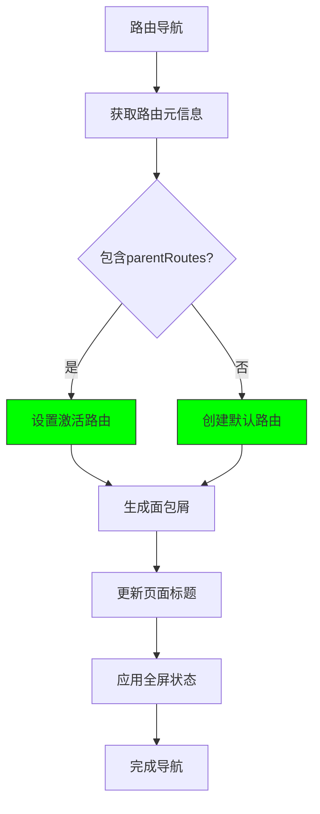
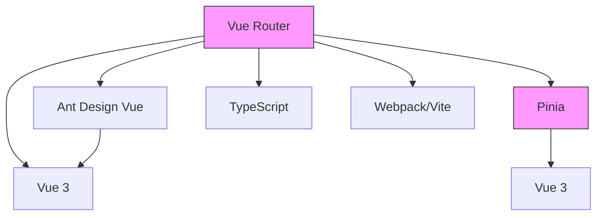

# 路由系统

<cite>
**本文档中引用的文件**   
- [index.ts](file://src/router/index.ts)
- [routes.ts](file://src/router/routes.ts)
- [guard.ts](file://src/router/guard.ts)
- [types.ts](file://src/store/uedModule/menus/types.ts)
- [user/index.ts](file://src/store/uedModule/user/index.ts)
- [menus/index.ts](file://src/store/uedModule/menus/index.ts)
- [index.ts](file://src/store/index.ts)
- [layout/index.vue](file://src/components/uedModule/layout/index.vue)
</cite>

## 目录
1. [简介](#简介)
2. [项目结构](#项目结构)
3. [核心组件](#核心组件)
4. [架构概述](#架构概述)
5. [详细组件分析](#详细组件分析)
6. [依赖分析](#依赖分析)
7. [性能考虑](#性能考虑)
8. [故障排除指南](#故障排除指南)
9. [结论](#结论)

## 简介
本文档全面介绍了Vue Router在项目中的实现与配置。重点涵盖路由注册机制、动态路由加载、嵌套路由结构以及路由懒加载的实现方式。详细说明了路由守卫（guard）的实现逻辑，包括全局前置守卫、路由独享守卫和组件内守卫的应用场景。结合代码示例展示路由参数传递、查询参数处理和编程式导航的使用方法。阐述了路由与权限控制的集成方式，以及如何通过路由元信息（meta）实现页面权限校验、标题设置和面包屑生成。提供了常见问题解决方案，如路由跳转失效、重复导航错误等，并给出了性能优化建议。

## 项目结构
项目中的路由系统主要由三个核心文件组成，位于`src/router`目录下：
- `index.ts`: 路由主入口文件，负责创建和配置Vue Router实例
- `routes.ts`: 路由定义文件，包含所有路由的配置和结构
- `guard.ts`: 路由守卫文件，实现权限控制和导航守卫逻辑

此外，路由系统与状态管理(store)紧密集成，特别是`user`和`menus`模块，用于处理用户权限和菜单数据。



**Diagram sources**
- [index.ts](file://src/router/index.ts)
- [routes.ts](file://src/router/routes.ts)
- [guard.ts](file://src/router/guard.ts)
- [user/index.ts](file://src/store/uedModule/user/index.ts)
- [menus/index.ts](file://src/store/uedModule/menus/index.ts)
- [index.ts](file://src/store/index.ts)

**Section sources**
- [index.ts](file://src/router/index.ts)
- [routes.ts](file://src/router/routes.ts)
- [guard.ts](file://src/router/guard.ts)

## 核心组件
路由系统的核心组件包括路由配置、路由守卫和状态管理集成。路由配置定义了应用的所有导航路径，路由守卫实现了权限控制和导航逻辑，状态管理则提供了用户权限和菜单数据的持久化存储。

**Section sources**
- [index.ts](file://src/router/index.ts#L1-L53)
- [routes.ts](file://src/router/routes.ts#L1-L270)
- [guard.ts](file://src/router/guard.ts#L1-L66)

## 架构概述
路由系统的架构基于Vue Router 4，采用模块化设计，将路由配置、守卫逻辑和状态管理分离。系统通过`createRouter`创建路由实例，使用`createWebHashHistory`或`createWebHistory`根据环境变量选择路由模式。路由守卫在`setupPermissionGuard`函数中注册，实现了全局前置守卫来处理权限验证和重定向逻辑。



**Diagram sources**
- [index.ts](file://src/router/index.ts#L1-L53)
- [guard.ts](file://src/router/guard.ts#L1-L66)

## 详细组件分析

### 路由配置分析
路由配置文件`routes.ts`定义了应用的所有路由，采用`RouteRecordRaw`类型进行类型约束。路由配置包括名称、路径、组件和元信息等属性。系统实现了路由懒加载，通过动态`import()`语法按需加载组件，优化了应用的初始加载性能。



**Diagram sources**
- [routes.ts](file://src/router/routes.ts#L1-L270)

#### 路由注册机制
路由注册机制通过`index.ts`文件中的`createRouter`函数实现。系统首先将嵌套路由转换为平级路由，然后创建路由实例。路由模式根据环境变量`HISTORY_TYPE`选择，支持hash和history两种模式。

```typescript
const router = createRouter({
  history: process.env.HISTORY_TYPE === 'history' ? createWebHistory(basePath) : createWebHashHistory(basePath),
  routes: waterRoutes
});
```

**Section sources**
- [index.ts](file://src/router/index.ts#L1-L53)

#### 动态路由加载
动态路由加载通过`routeToArr`函数实现，该函数将多层嵌套路由转换为平级路由数组。转换过程中，系统会拼接路由路径，并将父级路由信息存储在`meta.parentRoutes`中，用于后续的面包屑生成。

```typescript
function routeToArr(routesData: RouteRecordRaw[]) {
  const waterRoutes: RouteRecordRaw[] = [];
  function setRouteToMap(_routes: RouteRecordRaw[], parents: RouteItemType[]) {
    _routes.forEach((item) => {
      if (!/^\//.test(item.path)) {
        const parentsPath = parents[0]?.path ?? '';
        item.path = `${parentsPath}/${item.path}`;
      }
      const routeItems = [
        {
          path: item.path,
          title: item?.meta?.title || '',
          component: !!item.component
        } as RouteItemType,
        ...parents
      ];
      item.meta = {
        ...item.meta,
        parentRoutes: routeItems
      };
      waterRoutes.push(pruneRoute(item));
      if (item.children) {
        setRouteToMap(item.children, routeItems);
      }
    });
  }
  setRouteToMap(routesData, []);
  return waterRoutes;
}
```

**Section sources**
- [index.ts](file://src/router/index.ts#L1-L53)

### 路由守卫分析
路由守卫是权限控制的核心，通过`setupPermissionGuard`函数注册全局前置守卫。守卫逻辑处理用户登录状态验证、权限检查和页面重定向。



**Diagram sources**
- [guard.ts](file://src/router/guard.ts#L1-L66)

#### 全局前置守卫
全局前置守卫在`guard.ts`文件中实现，处理所有路由导航。守卫首先检查钉钉登录回调，然后根据路径是否在白名单中决定是否需要权限验证。对于需要验证的路径，系统会检查用户登录状态、获取菜单和权限数据，并验证页面访问权限。

```typescript
export function setupPermissionGuard(router: Router) {
  router.beforeEach(async (to, _, next) => {
    const userStore = useUserStore();
    if (to.query) {
      const { code, state } = to.query;
      if (code && state === 'relogin') {
        const res = await fetchDingTalkUserInfo(code as string);
        if (res.code === 200) {
          const { data } = res;
          const { accessToken, user } = data;
          userStore.setToken(accessToken);
          userStore.setUserInfo(user);
        }
      }
    }
    const appStore = useAppStore();
    const menusStore = useMenusStore();
    if (to.path !== '/themeConfig') {
      appStore.setThemePanelVisible(false);
    }
    if (WHITE_LIST.includes(to.path)) {
      if (to.path === '/login' && userStore.token) {
        next({ path: '/' });
      }
      next();
    } else if (userStore.token) {
      if (!menusStore.menusData.length) {
        const menusData = await getMenus();
        menusStore.setMenus(menusData);
      }
      if (!userStore.permissionIds.length) {
        const permissionIds = await getPermissions();
        userStore.setPermissionIds(permissionIds);
      }
      if (to.path === '/') {
        const firstMenu = menusStore.findFistSiderMenu();
        if (firstMenu && firstMenu.path) {
          next(firstMenu.path);
          return;
        }
        next('/404');
        return;
      }
      if (!userStore.permissionIds.includes(to.meta.permissionId as string) && !to.meta.public) {
        next('/404');
        return;
      }
      next();
    } else {
      next({
        path: '/login'
      });
    }
  });
}
```

**Section sources**
- [guard.ts](file://src/router/guard.ts#L1-L66)

#### 路由独享守卫
路由独享守卫在`routes.ts`文件中通过`beforeEnter`钩子实现。这些守卫用于特定路由的导航逻辑，如打开外部链接并阻止原页面跳转。

```typescript
{
  name: 'base::das-readdy',
  path: '/das-readdy',
  beforeEnter() {
    const { token } = useUserStore();
    window.open(`https://10.20.114.19:8888/das-readdy?readdyAuthToken=${token}`, '_blank');
    return false; // 阻止原页面跳转
  },
  component: () => import('@/views/uedTypical/iframe/index.vue'),
  meta: {
    title: 'I18N.layout.dasReaddy',
    permissionId: 'base::workBench:index',
    fullScreen: true
  }
}
```

**Section sources**
- [routes.ts](file://src/router/routes.ts#L1-L270)

### 状态管理集成分析
路由系统与Pinia状态管理紧密集成，通过`useUserStore`和`useMenusStore`获取用户权限和菜单数据。用户状态存储在localStorage中，实现了数据持久化。

```mermaid
classDiagram
class UserStore {
+token : Ref<string | undefined>
+permissionIds : Ref<string[]>
+userInfo : Record<string, any>
+setToken(tokenStr : string) : void
+setPermissionIds(ids : string[]) : void
+setUserInfo(info : any) : void
+reset() : void
}
class MenusStore {
+menusData : Ref<MenuType[]>
+menusMap : Map<string, MenuType[]>
+activeRoutes : Ref<RouteItemType[]>
+setMenus(menus : MenuType[]) : void
+setActiveRoutes(routes : RouteItemType[]) : void
+findFistSiderMenu(id? : string) : MenuType | undefined
}
UserStore --> "1" Pinia
MenusStore --> "1" Pinia
guard.ts --> UserStore : "使用"
guard.ts --> MenusStore : "使用"
layout/index.vue --> MenusStore : "使用"
```

**Diagram sources**
- [user/index.ts](file://src/store/uedModule/user/index.ts#L1-L63)
- [menus/index.ts](file://src/store/uedModule/menus/index.ts#L1-L139)
- [index.ts](file://src/store/index.ts#L1-L14)

#### 用户状态管理
用户状态管理通过`user/index.ts`文件实现，使用Pinia定义store。状态包括token、权限ID列表和用户信息，提供了相应的setter方法和重置方法。数据通过`pinia-plugin-persistedstate`插件持久化到localStorage。

```typescript
export default defineStore<'user', UserStore>(
  'user',
  () => {
    const token = ref<string | undefined>(undefined);
    const userInfo = reactive({});
    const setToken = (tokenStr: string) => {
      token.value = tokenStr;
    };
    const permissionIds = ref<string[]>([]);
    const setPermissionIds = (ids: string[]) => {
      permissionIds.value = ids;
    };

    const setUserInfo = (info: any) => {
      Object.assign(userInfo, info);
    };
    const reset = () => {
      token.value = undefined;
      permissionIds.value = [];
      Object.assign(userInfo, {});
    };

    const restore = () => {
      if (localStorage.getItem('user-store')) {
        const userStore = JSON.parse(localStorage.getItem('user-store') || '{}');
        Object.assign(userInfo, userStore.userInfo);
        token.value = userStore.token;
        permissionIds.value = userStore.permissionIds;
      }
    };
    restore();
    return {
      token,
      permissionIds,
      setToken,
      setPermissionIds,
      reset,
      userInfo,
      setUserInfo
    };
  },
  {
    persist: {
      key: 'user-store',
      storage: localStorage
    }
  }
);
```

**Section sources**
- [user/index.ts](file://src/store/uedModule/user/index.ts#L1-L63)

#### 菜单状态管理
菜单状态管理通过`menus/index.ts`文件实现，负责处理菜单数据的存储、转换和查询。系统将菜单数据转换为Ant Design Vue组件所需的格式，并提供了查找第一个侧边栏菜单、计算激活菜单和面包屑等实用方法。

```typescript
export default defineStore('menus', () => {
  const menusData = ref<MenuType[]>([]);
  const menusMap = new Map<string, MenuType[]>();
  const setMenus = (menus: MenuType[]) => {
    menusData.value = menus;
    dataToMenuMap(menus, menusMap);
  };
  const findFistSiderMenu = (id?: string): MenuType | undefined => {
    let siderMenus: MenuType[] = [];
    if (!id) {
      siderMenus = [...[...menusData.value].reverse()];
    } else {
      const headerMenu = menusData.value.find((item) => item.id === id);
      if (!headerMenu || !headerMenu.children || headerMenu.children.length === 0) {
        return;
      }
      siderMenus = [...[...headerMenu.children].reverse()];
    }
    let targetMenu: MenuType | undefined;
    while (!targetMenu && siderMenus.length > 0) {
      const menu = siderMenus.pop();
      if (menu?.path) {
        targetMenu = menu;
        break;
      }
      if (menu?.children) {
        siderMenus.push(...[...menu.children].reverse());
      }
    }
    return targetMenu;
  };
  // ... 其他逻辑
});
```

**Section sources**
- [menus/index.ts](file://src/store/uedModule/menus/index.ts#L1-L139)

### 路由元信息分析
路由元信息用于存储页面相关的附加数据，如标题、权限ID和全屏状态。这些信息在路由守卫和布局组件中被使用，实现页面权限校验、标题设置和面包屑生成。



**Diagram sources**
- [layout/index.vue](file://src/components/uedModule/layout/index.vue#L33-L72)
- [routes.ts](file://src/router/routes.ts#L1-L270)

#### 页面权限校验
页面权限校验在路由守卫中实现，通过比较用户权限ID列表和路由元信息中的`permissionId`来判断用户是否有访问权限。

```typescript
if (!userStore.permissionIds.includes(to.meta.permissionId as string) && !to.meta.public) {
  next('/404');
  return;
}
```

**Section sources**
- [guard.ts](file://src/router/guard.ts#L1-L66)

#### 标题设置
页面标题通过路由元信息中的`title`字段设置，通常使用国际化键值，如`I18N.layout.gongZuoTai`。

```typescript
meta: {
  title: 'I18N.layout.gongZuoTai',
  permissionId: 'base::workBench:index'
}
```

**Section sources**
- [routes.ts](file://src/router/routes.ts#L1-L270)

#### 面包屑生成
面包屑通过菜单状态管理中的`activeBreadcrumb`计算属性生成，结合了激活菜单和路由层级信息。

```typescript
const activeBreadcrumb = computed(() => {
  return [...[...activeMenus.value].reverse(), ...activeRoutes.value.slice(0, activeRoutes.value.length - 1)];
});
```

**Section sources**
- [menus/index.ts](file://src/store/uedModule/menus/index.ts#L1-L139)

## 依赖分析
路由系统依赖于多个核心模块和外部库，形成了复杂的依赖关系网络。



**Diagram sources**
- [package.json](file://package.json)
- [tsconfig.json](file://tsconfig.json)

## 性能考虑
路由系统在性能方面进行了多项优化：

1. **路由懒加载**：通过动态`import()`语法按需加载组件，减少初始包大小
2. **状态持久化**：使用`pinia-plugin-persistedstate`插件将用户状态持久化到localStorage，避免重复获取
3. **路由扁平化**：将嵌套路由转换为平级路由，提高路由匹配效率
4. **权限缓存**：在用户登录后缓存权限数据，避免每次导航都重新获取

## 故障排除指南

### 常见问题及解决方案

#### 路由跳转失效
**问题描述**：调用`router.push()`后页面没有跳转
**可能原因**：
- 目标路由不存在或路径错误
- 路由守卫阻止了导航
- 在子应用中未正确代理路由

**解决方案**：
1. 检查目标路由是否在`routes.ts`中正确定义
2. 检查路由守卫逻辑，确保没有意外阻止导航
3. 在微前端场景下，确保正确代理了子应用的路由

```typescript
// 在微前端中正确代理路由
microApp.router.push({
  name: module,
  path: menu.url
});
```

**Section sources**
- [guard.ts](file://src/router/guard.ts#L1-L66)
- [microApi/helper.ts](file://src/micro/microApi/helper.ts#L1-L43)

#### 重复导航错误
**问题描述**：控制台出现"Navigation cancelled from '/xxx' to '/xxx' with a new navigation"错误
**可能原因**：在导航守卫中多次调用`next()`函数

**解决方案**：
1. 确保在每个条件分支中只调用一次`next()`
2. 使用`return`语句避免后续代码执行

```typescript
if (to.path === '/') {
  const firstMenu = menusStore.findFistSiderMenu();
  if (firstMenu && firstMenu.path) {
    next(firstMenu.path);
    return; // 添加return防止后续执行
  }
  next('/404');
  return; // 添加return防止后续执行
}
```

**Section sources**
- [guard.ts](file://src/router/guard.ts#L1-L66)

#### 权限验证失败
**问题描述**：已登录用户无法访问有权限的页面
**可能原因**：
- 权限ID不匹配
- 权限数据未正确加载
- 路由元信息中的`permissionId`错误

**解决方案**：
1. 检查API返回的权限ID与路由配置中的`permissionId`是否一致
2. 确保在路由守卫中正确获取了权限数据
3. 验证路由元信息配置是否正确

```typescript
// 确保权限数据已加载
if (!userStore.permissionIds.length) {
  const permissionIds = await getPermissions();
  userStore.setPermissionIds(permissionIds);
}
```

**Section sources**
- [guard.ts](file://src/router/guard.ts#L1-L66)
- [user/index.ts](file://src/store/uedModule/user/index.ts#L1-L63)

## 结论
本文档全面介绍了Vue Router在项目中的实现与配置。系统通过模块化设计，将路由配置、守卫逻辑和状态管理分离，实现了灵活的路由管理和严格的权限控制。路由懒加载和状态持久化优化了应用性能，而详细的错误处理和故障排除指南确保了系统的稳定运行。整体架构清晰，易于维护和扩展，为复杂的企业级应用提供了可靠的路由解决方案。