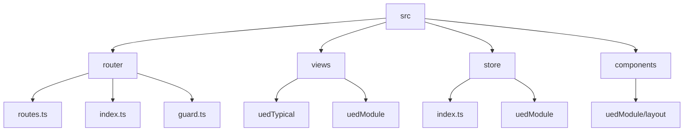
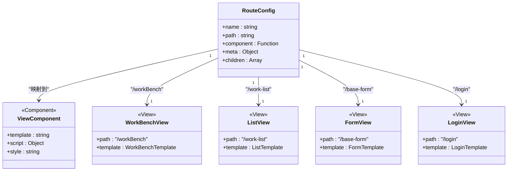
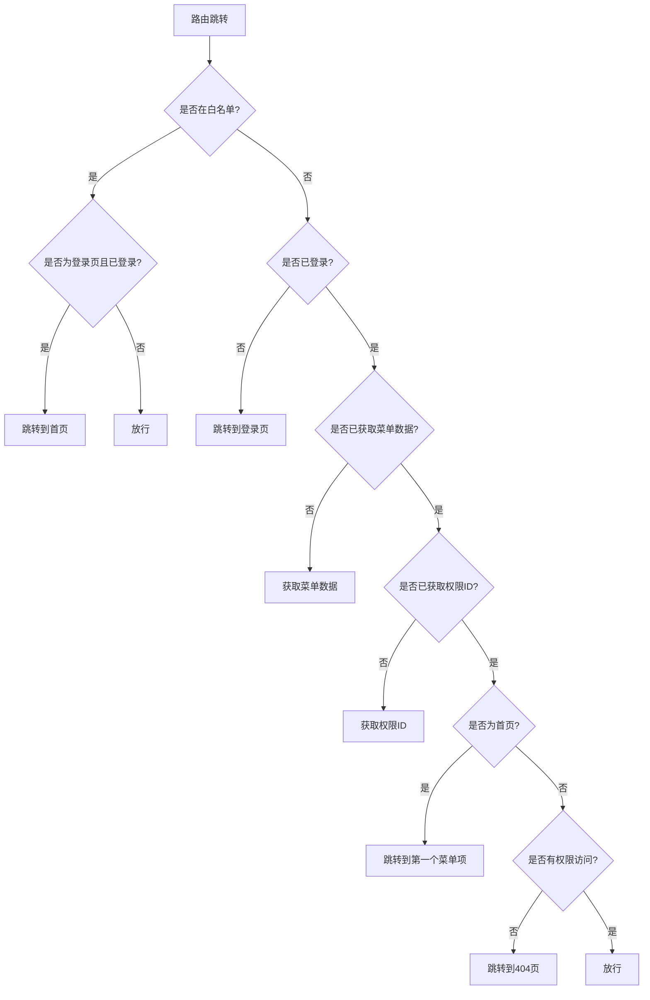

# 路由配置

<cite>
**本文档引用的文件**   
- [routes.ts](file://src/router/routes.ts#L0-L278)
- [index.ts](file://src/router/index.ts#L0-L52)
- [guard.ts](file://src/router/guard.ts#L0-L65)
- [index.ts](file://src/store/index.ts#L0-L13)
- [user/index.ts](file://src/store/uedModule/user/index.ts#L0-L62)
- [menus/index.ts](file://src/store/uedModule/menus/index.ts#L0-L138)
- [app/index.ts](file://src/store/uedModule/app/index.ts#L0-L80)
- [theme/index.ts](file://src/store/uedModule/theme/index.ts#L0-L158)
- [layout/index.vue](file://src/components/uedModule/layout/index.vue#L0-L304)
- [login/index.vue](file://src/views/uedModule/login/index.vue)
- [workBench/index.vue](file://src/views/uedTypical/workBench/index.vue)
- [baseList/index.vue](file://src/views/uedTypical/baseList/index.vue)
- [baseList/components/Add.vue](file://src/views/uedTypical/baseList/components/Add.vue)
</cite>

## 目录
1. [项目结构](#项目结构)
2. [核心路由配置](#核心路由配置)
3. [路由模块化组织](#路由模块化组织)
4. [路由与视图组件映射](#路由与视图组件映射)
5. [路由权限控制](#路由权限控制)
6. [嵌套路由实现](#嵌套路由实现)
7. [路由懒加载](#路由懒加载)
8. [路由配置最佳实践](#路由配置最佳实践)

## 项目结构

项目采用基于功能域的模块化组织方式，路由配置位于`src/router`目录下，与视图组件、状态管理等模块分离。主要结构如下：



**图示来源**
- [routes.ts](file://src/router/routes.ts#L0-L278)
- [index.ts](file://src/router/index.ts#L0-L52)
- [layout/index.vue](file://src/components/uedModule/layout/index.vue#L0-L304)

**本节来源**
- [routes.ts](file://src/router/routes.ts#L0-L278)
- [index.ts](file://src/router/index.ts#L0-L52)

## 核心路由配置

路由配置的核心文件是`src/router/routes.ts`，定义了应用的路由表结构。路由表由`routes`和`wihitetRoutes`两个数组组成，分别表示主路由和白名单路由。

```typescript
const routes: RouteRecordRaw[] = [
  {
    name: 'home',
    path: '/',
    redirect: '/workBench'
  },
  {
    name: 'base::workBench',
    path: '/workBench',
    component: () => import('@/views/uedTypical/workBench/index.vue'),
    meta: {
      title: 'I18N.layout.gongZuoTai',
      permissionId: 'base::workBench:index'
    }
  }
];

const wihitetRoutes: RouteRecordRaw[] = [
  {
    name: 'login',
    path: '/login',
    component: () => import('@/views/uedModule/login/index.vue'),
    meta: {
      title: '登录',
      fullScreen: true
    }
  },
  {
    name: '404',
    path: '/404',
    component: () => import('@/views/uedTypical/NotFound/index.vue'),
    meta: {
      title: '404',
      fullScreen: true
    }
  }
];
```

路由配置使用`RouteRecordRaw`类型定义，包含以下关键属性：
- **name**: 路由名称，用于标识路由
- **path**: 路由路径，支持静态和动态路径
- **component**: 路由组件，使用异步导入实现懒加载
- **meta**: 路由元信息，包含标题、权限ID等附加数据
- **redirect**: 重定向配置
- **children**: 子路由配置，实现嵌套路由

**本节来源**
- [routes.ts](file://src/router/routes.ts#L0-L278)

## 路由模块化组织

路由配置采用模块化组织策略，将路由按功能域进行拆分。主路由文件`routes.ts`中定义了多个功能模块的路由，如工作台、列表页、表单页、详情页等。

```mermaid
graph TD
A[路由模块] --> B[工作台模块]
A --> C[列表模块]
A --> D[表单模块]
A --> E[详情模块]
A --> F[配置模块]
A --> G[外部链接模块]
B --> H[/workBench]
B --> I[/dashboard]
C --> J[/work-list]
C --> K[/work-list/add]
D --> L[/base-form]
E --> M[/base-detail]
F --> N[/themeConfig]
F --> O[/loginConfig]
G --> P[/das-readdy]
G --> Q[/chat-v]
G --> R[/chat-bi]
```

路由模块化组织的优势：
1. **可维护性**: 按功能域组织路由，便于管理和维护
2. **可扩展性**: 新增功能模块时，只需添加相应的路由配置
3. **可读性**: 路由结构清晰，易于理解

**图示来源**
- [routes.ts](file://src/router/routes.ts#L0-L278)
- [index.ts](file://src/router/index.ts#L0-L52)

**本节来源**
- [routes.ts](file://src/router/routes.ts#L0-L278)

## 路由与视图组件映射

路由配置通过`component`属性与视图组件建立映射关系。视图组件位于`src/views`目录下，按功能模块组织。



具体映射示例：
- `/workBench` → `@/views/uedTypical/workBench/index.vue`
- `/work-list` → `@/views/uedTypical/baseList/index.vue`
- `/base-form` → `@/views/uedTypical/baseForm/index.vue`
- `/login` → `@/views/uedModule/login/index.vue`

**图示来源**
- [routes.ts](file://src/router/routes.ts#L0-L278)
- [layout/index.vue](file://src/components/uedModule/layout/index.vue#L0-L304)

**本节来源**
- [routes.ts](file://src/router/routes.ts#L0-L278)
- [login/index.vue](file://src/views/uedModule/login/index.vue)
- [workBench/index.vue](file://src/views/uedTypical/workBench/index.vue)
- [baseList/index.vue](file://src/views/uedTypical/baseList/index.vue)

## 路由权限控制

路由权限控制通过`src/router/guard.ts`中的`setupPermissionGuard`函数实现，采用前置守卫（beforeEach）进行权限验证。



权限控制流程：
1. 检查目标路由是否在白名单中（如登录页、404页）
2. 如果已登录，检查是否已获取菜单数据和权限ID
3. 验证用户是否有权限访问目标路由
4. 根据验证结果决定是否放行或重定向

```typescript
export function setupPermissionGuard(router: Router) {
  router.beforeEach(async (to, _, next) => {
    const userStore = useUserStore();
    
    if (WHITE_LIST.includes(to.path)) {
      if (to.path === '/login' && userStore.token) {
        next({ path: '/' });
      }
      next();
    } else if (userStore.token) {
      // 获取菜单数据和权限ID
      if (!menusStore.menusData.length) {
        const menusData = await getMenus();
        menusStore.setMenus(menusData);
      }
      if (!userStore.permissionIds.length) {
        const permissionIds = await getPermissions();
        userStore.setPermissionIds(permissionIds);
      }
      
      // 权限验证
      if (!userStore.permissionIds.includes(to.meta.permissionId as string) && !to.meta.public) {
        next('/404');
        return;
      }
      next();
    } else {
      next({ path: '/login' });
    }
  });
}
```

**图示来源**
- [guard.ts](file://src/router/guard.ts#L0-L65)

**本节来源**
- [guard.ts](file://src/router/guard.ts#L0-L65)
- [user/index.ts](file://src/store/uedModule/user/index.ts#L0-L62)
- [menus/index.ts](file://src/store/uedModule/menus/index.ts#L0-L138)

## 嵌套路由实现

嵌套路由通过`children`属性实现，允许在父路由下定义子路由。这种结构适用于具有层级关系的页面，如列表页下的新增页面。

```typescript
{
  name: 'base::work-list',
  path: '/work-list',
  component: () => import('@/views/uedTypical/baseList/index.vue'),
  meta: {
    title: 'I18N.layout.lieBiaoYe',
    permissionId: 'base::workBench:index'
  },
  children: [
    {
      name: 'base::work-list-add',
      path: 'add',
      component: () => import('@/views/uedTypical/baseList/components/Add.vue'),
      meta: {
        title: '新增',
        permissionId: 'base::workBench:index'
      }
    }
  ]
}
```

嵌套路由的特点：
1. **路径继承**: 子路由的路径相对于父路由
2. **组件嵌套**: 父路由组件中需要包含`<router-view>`来渲染子路由
3. **元信息继承**: 子路由可以继承父路由的元信息

```mermaid
graph TD
A[/work-list] --> B[/work-list/add]
A --> C[/work-list/edit]
A --> D[/work-list/detail]
style A fill:#f9f,stroke:#333,stroke-width:2px
style B fill:#bbf,stroke:#333,stroke-width:1px
style C fill:#bbf,stroke:#333,stroke-width:1px
style D fill:#bbf,stroke:#333,stroke-width:1px
```

**图示来源**
- [routes.ts](file://src/router/routes.ts#L0-L278)

**本节来源**
- [routes.ts](file://src/router/routes.ts#L0-L278)
- [baseList/index.vue](file://src/views/uedTypical/baseList/index.vue)
- [baseList/components/Add.vue](file://src/views/uedTypical/baseList/components/Add.vue)

## 路由懒加载

路由懒加载通过动态导入（`import()`）实现，将路由组件分割成独立的代码块，按需加载，优化应用性能。

```typescript
{
  name: 'base::workBench',
  path: '/workBench',
  component: () => import('@/views/uedTypical/workBench/index.vue'),
  meta: {
    title: 'I18N.layout.gongZuoTai',
    permissionId: 'base::workBench:index'
  }
}
```

懒加载的优势：
1. **减少初始加载时间**: 只加载当前路由所需的代码
2. **降低内存占用**: 未访问的路由组件不会加载到内存中
3. **提高用户体验**: 页面加载更快，响应更及时

特殊注释语法用于指定代码块名称：
```typescript
{
  name: 'base::componentsGuide',
  path: '/componentsGuide',
  component: () => import(/* webpackChunkName: "componentsGuide" */ '@/views/uedTypical/componentsGuide/index.vue'),
  meta: {
    title: 'I18N.api.common.yinDaoTiShiZuJian',
    permissionId: 'base::workBench:index',
    fullScreen: true
  }
}
```

**本节来源**
- [routes.ts](file://src/router/routes.ts#L0-L278)

## 路由配置最佳实践

### 路由命名规范
1. **统一前缀**: 使用`base::`作为基础路由的命名前缀
2. **功能域划分**: 按功能模块命名，如`workBench`、`work-list`、`base-form`
3. **语义化命名**: 名称应清晰表达路由的用途

### 路径设计原则
1. **简洁明了**: 路径应简短且易于理解
2. **层级清晰**: 使用斜杠分隔层级，如`/work-list/add`
3. **避免重复**: 不同功能的路由应有唯一的路径

### 模块化组织方式
1. **功能域拆分**: 将路由按功能模块组织
2. **白名单分离**: 将无需权限验证的路由单独管理
3. **动态路由**: 使用参数化路径处理动态内容

### 元信息使用
1. **标题管理**: 通过`meta.title`统一管理页面标题
2. **权限控制**: 通过`meta.permissionId`实现细粒度权限控制
3. **特殊配置**: 通过`meta.fullScreen`等字段控制页面特殊行为

```typescript
// 示例：遵循最佳实践的路由配置
{
  name: 'base::dashboard',
  path: '/dashboard',
  component: () => import('@/views/uedTypical/dashboardManage/index.vue'),
  meta: {
    title: 'I18N.layout.yiBiaopan',
    permissionId: 'base::workBench:index'
  }
}
```

**本节来源**
- [routes.ts](file://src/router/routes.ts#L0-L278)
- [index.ts](file://src/router/index.ts#L0-L52)
- [guard.ts](file://src/router/guard.ts#L0-L65)