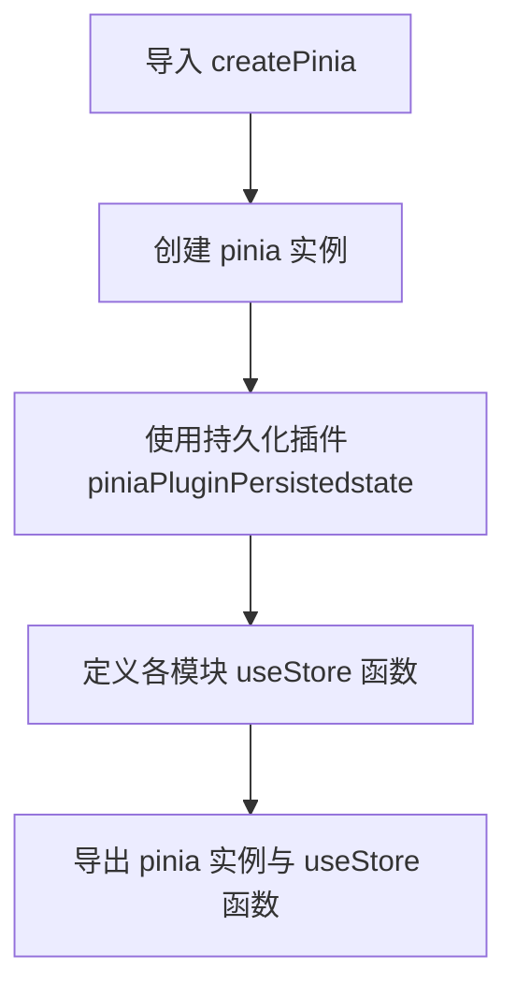
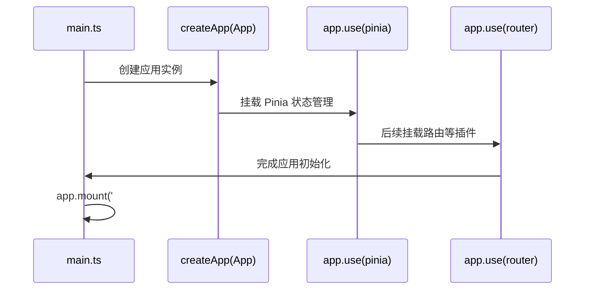
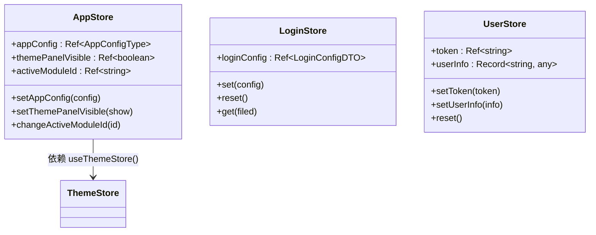

# Pinia 使用指南

<cite>
**本文档中引用的文件**  
- [src/store/index.ts](file://src/store/index.ts)
- [src/main.ts](file://src/main.ts)
- [src/store/uedModule/app/index.ts](file://src/store/uedModule/app/index.ts)
- [src/store/uedModule/login/index.ts](file://src/store/uedModule/login/index.ts)
- [src/store/uedModule/user/index.ts](file://src/store/uedModule/user/index.ts)
</cite>

## 目录
1. [项目结构](#项目结构)
2. [Pinia 实例创建与插件配置](#pinia-实例创建与插件配置)
3. [在 Vue 应用中挂载 Store](#在-vue-应用中挂载-store)
4. [定义 Store：defineStore 与组合式 API 风格](#定义-storedefinestore-与组合式-api-风格)
5. [在组件中使用 Store](#在组件中使用-store)
6. [自动类型推导与开发体验优化](#自动类型推导与开发体验优化)
7. [Pinia 相比 Vuex 的优势及项目适用性](#pinia-相比-vuex-的优势及项目适用性)

## 项目结构

本项目采用模块化方式组织 Pinia Store，所有状态管理逻辑集中于 `src/store` 目录下。该目录包含多个功能模块（如 `app`、`login`、`user` 等），每个模块独立维护其状态逻辑，并通过 `index.ts` 统一导出。

**Section sources**
- [src/store/index.ts](file://src/store/index.ts)
- [src/store/uedModule/app/index.ts](file://src/store/uedModule/app/index.ts)

## Pinia 实例创建与插件配置

在 `src/store/index.ts` 文件中，通过 `createPinia()` 创建 Pinia 实例，并使用 `pinia-plugin-persistedstate` 插件实现状态的持久化存储。该插件将指定 Store 的状态自动保存至 `localStorage`，确保页面刷新后状态不丢失。

此外，该文件还统一导入并导出各个模块的 `useStore` 函数，便于在组件中按需引入。



**Diagram sources**
- [src/store/index.ts](file://src/store/index.ts#L1-L14)

**Section sources**
- [src/store/index.ts](file://src/store/index.ts#L1-L14)

## 在 Vue 应用中挂载 Store

在 `src/main.ts` 中，创建 Vue 应用实例后，通过 `app.use(pinia)` 将 Pinia 实例挂载到全局应用上下文中。这一步是使用 Pinia 的必要前提，确保所有组件均可访问共享状态。



**Diagram sources**
- [src/main.ts](file://src/main.ts#L1-L38)

**Section sources**
- [src/main.ts](file://src/main.ts#L1-L38)

## 定义 Store：defineStore 与组合式 API 风格

本项目采用 **组合式 API 风格**（Setup Store）定义 Store，使用 `defineStore` 函数创建模块化状态。每个 Store 模块（如 `app`、`login`、`user`）均返回一个包含响应式状态（`ref`、`reactive`）和操作方法的对象。

以 `app` 模块为例，`appConfig`、`themePanelVisible` 等状态使用 `ref` 定义，通过 `setAppConfig`、`setThemePanelVisible` 等函数进行修改，符合 Vue 3 的响应式设计范式。



**Diagram sources**
- [src/store/uedModule/app/index.ts](file://src/store/uedModule/app/index.ts#L1-L81)
- [src/store/uedModule/login/index.ts](file://src/store/uedModule/login/index.ts#L1-L58)
- [src/store/uedModule/user/index.ts](file://src/store/uedModule/user/index.ts#L1-L63)

**Section sources**
- [src/store/uedModule/app/index.ts](file://src/store/uedModule/app/index.ts#L1-L81)
- [src/store/uedModule/login/index.ts](file://src/store/uedModule/login/index.ts#L1-L58)
- [src/store/uedModule/user/index.ts](file://src/store/uedModule/user/index.ts#L1-L63)

## 在组件中使用 Store

在任意组件中，可通过导入对应的 `useStore` 函数来访问状态、actions 和 getters。例如：

- 导入 `useAppStore` 获取应用配置
- 导入 `useUserStore` 管理用户登录状态
- 导入 `useLoginStore` 控制登录界面行为

状态访问与修改均通过解构或直接调用方法完成，无需 `mapState` 或 `mapActions` 辅助函数，代码更直观简洁。

```typescript
// 示例：在组件中使用
const appStore = useAppStore();
const userStore = useUserStore();

// 访问状态
console.log(appStore.appConfig.value.title);

// 调用 action
userStore.setToken('abc123');
appStore.setThemePanelVisible(true);
```

**Section sources**
- [src/store/index.ts](file://src/store/index.ts#L1-L14)
- [src/store/uedModule/app/index.ts](file://src/store/uedModule/app/index.ts#L1-L81)
- [src/store/uedModule/user/index.ts](file://src/store/uedModule/user/index.ts#L1-L63)

## 自动类型推导与开发体验优化

Pinia 原生支持 TypeScript，所有 Store 的状态和方法均具备完整的类型推导能力。开发者无需手动声明返回类型，TypeScript 可自动推断 `ref`、`computed` 和函数参数类型，极大提升开发效率与代码安全性。

此外，Pinia 支持热模块替换（HMR），在开发环境下修改 Store 文件后，页面状态不会丢失，提升调试体验。项目中通过 `defineStore` 的命名参数和模块化结构，进一步增强了可维护性与可测试性。

**Section sources**
- [src/store/uedModule/app/index.ts](file://src/store/uedModule/app/index.ts#L1-L81)
- [src/store/uedModule/login/index.ts](file://src/store/uedModule/login/index.ts#L1-L58)
- [src/store/uedModule/user/index.ts](file://src/store/uedModule/user/index.ts#L1-L63)

## Pinia 相比 Vuex 的优势及项目适用性

相较于 Vuex，Pinia 具备以下显著优势：

| 特性 | Pinia | Vuex |
|------|-------|------|
| **API 风格** | 支持组合式 API，更符合 Vue 3 设计理念 | 选项式 API 为主，语法较冗长 |
| **TypeScript 支持** | 原生支持，类型推导完善 | 需额外配置，类型支持较弱 |
| **模块化** | 天然模块化，无需命名空间 | 需通过 modules 和命名空间管理 |
| **持久化** | 通过插件 `pinia-plugin-persistedstate` 简单集成 | 需手动实现或使用第三方库 |
| **HMR 支持** | 原生支持，开发体验佳 | 支持有限，需额外配置 |

在本项目中，Pinia 的轻量、模块化和类型安全特性完美契合复杂前端应用的状态管理需求，尤其适用于多模块、高可维护性的企业级项目。

**Section sources**
- [src/store/index.ts](file://src/store/index.ts#L1-L14)
- [src/store/uedModule/app/index.ts](file://src/store/uedModule/app/index.ts#L1-L81)
- [src/store/uedModule/login/index.ts](file://src/store/uedModule/login/index.ts#L1-L58)
- [src/store/uedModule/user/index.ts](file://src/store/uedModule/user/index.ts#L1-L63)