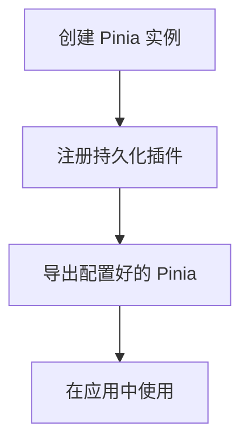
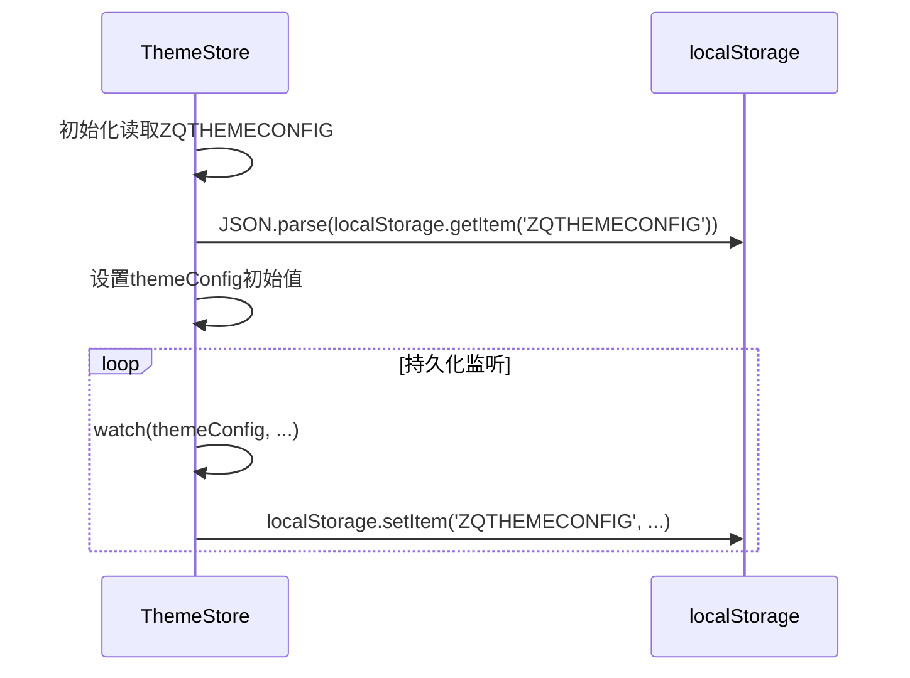

# 持久化机制

<cite>
**本文档引用文件**  
- [src/store/index.ts](file://src/store/index.ts)
- [src/store/uedModule/app/index.ts](file://src/store/uedModule/app/index.ts)
- [src/store/uedModule/theme/index.ts](file://src/store/uedModule/theme/index.ts)
- [src/store/uedModule/app/defaultConfig.ts](file://src/store/uedModule/app/defaultConfig.ts)
- [src/store/uedModule/theme/defaultConfig.ts](file://src/store/uedModule/theme/defaultConfig.ts)
</cite>

## 目录
1. [简介](#简介)
2. [持久化插件配置](#持久化插件配置)
3. [模块级持久化实现](#模块级持久化实现)
4. [持久化策略与行为分析](#持久化策略与行为分析)
5. [自定义扩展与边界情况](#自定义扩展与边界情况)

## 简介
本项目通过Pinia状态管理库结合`pinia-plugin-persistedstate`插件，实现了关键用户状态的本地持久化存储。该机制确保用户在刷新页面或重新访问时，其个性化配置（如主题偏好、界面布局等）能够自动恢复，提升用户体验一致性。核心持久化逻辑集中在`src/store`目录下的模块定义中，特别是`app`和`theme`模块。

## 持久化插件配置
项目在根存储（Pinia）实例中全局注册了`pinia-plugin-persistedstate`插件，为所有启用了持久化选项的store提供基础支持。



**Diagram sources**
- [src/store/index.ts](file://src/store/index.ts#L1-L13)

**Section sources**
- [src/store/index.ts](file://src/store/index.ts#L1-L13)

## 模块级持久化实现
### 应用配置模块 (app)
`app` store用于管理全局应用配置，如系统标题、登录页配置等。该模块通过`persist`选项明确启用了持久化，并指定了自定义的存储键名。

```mermaid
classDiagram
class AppStore {
+appConfig : Ref~AppConfigType~
+watermark : Ref~string~
+themePanelVisible : Ref~boolean~
+activeModuleId : Ref~string~
+fullScreen : Ref~boolean~
+setAppConfig(config)
+setLoginConfig(config)
+setWatermark(watermarkStr)
+setThemePanelVisible(show)
+changeActiveModuleId(id)
+setFullScreen(isFull)
}
AppStore : persist : { key : 'app-store', storage : localStorage }
```

**Diagram sources**
- [src/store/uedModule/app/index.ts](file://src/store/uedModule/app/index.ts#L15-L80)

**Section sources**
- [src/store/uedModule/app/index.ts](file://src/store/uedModule/app/index.ts#L15-L80)
- [src/store/uedModule/app/defaultConfig.ts](file://src/store/uedModule/app/defaultConfig.ts#L1-L20)

### 主题配置模块 (theme)
与`app`模块不同，`theme` store并未直接使用`pinia-plugin-persistedstate`的`persist`选项。而是通过手动监听`themeConfig`的变化，并将其直接写入`localStorage`，实现了更精细的控制。



**Diagram sources**
- [src/store/uedModule/theme/index.ts](file://src/store/uedModule/theme/index.ts#L1-L158)

**Section sources**
- [src/store/uedModule/theme/index.ts](file://src/store/uedModule/theme/index.ts#L1-L158)
- [src/store/uedModule/theme/defaultConfig.ts](file://src/store/uedModule/theme/defaultConfig.ts#L1-L22)

## 持久化策略与行为分析
### 存储策略对比
| 特性 | `app` 模块 (插件式) | `theme` 模块 (手动式) |
| :--- | :--- | :--- |
| **实现方式** | 使用 `pinia-plugin-persistedstate` | 手动调用 `localStorage` API |
| **存储键名** | `app-store` | `ZQTHEMECONFIG` |
| **存储位置** | `localStorage` | `localStorage` |
| **序列化** | 插件自动处理 (JSON.stringify) | 手动处理 (JSON.stringify) |
| **灵活性** | 较低，遵循插件规则 | 较高，可自定义逻辑 |
| **初始化** | 插件自动从存储恢复 | 手动在store初始化时读取 |

### 数据序列化过程
两种方式最终都将JavaScript对象序列化为JSON字符串进行存储。`pinia-plugin-persistedstate`在store状态变化时自动触发序列化，并将结果存入指定的`storage`（此处为`localStorage`）。`theme`模块则在`watch`回调中显式调用`JSON.stringify`。

### 环境行为差异
由于均使用`localStorage`，在不同浏览器环境下行为一致。但在以下场景需注意：
- **无痕/隐私模式**：`localStorage`可能被禁用或在会话结束后清除。
- **跨设备同步**：`localStorage`是本地存储，无法实现跨设备同步，用户在不同设备上的配置会独立存在。

## 自定义扩展与边界情况
### 自定义持久化逻辑扩展
对于需要更复杂逻辑的场景（如加密存储、多端同步），可在`theme`模块的模式基础上进行扩展：
1.  **加密/解密**：在`localStorage.setItem`前对数据进行加密，在读取后解密。
2.  **版本迁移**：在初始化读取时检查存储数据的版本号，执行必要的数据结构迁移。
3.  **错误回退**：`JSON.parse`操作应包裹在`try-catch`中，防止存储数据损坏导致应用崩溃。

### 可能遇到的边界情况及解决方案
| 边界情况 | 风险 | 解决方案 |
| :--- | :--- | :--- |
| **存储空间限制** | 浏览器`localStorage`通常有5-10MB限制，超出会抛出`QuotaExceededError` | 1. 监听`setItem`异常，提供清理提示。<br>2. 仅持久化必要字段，避免存储大对象。 |
| **跨设备同步问题** | 用户无法在手机和电脑间同步偏好设置 | 1. 引入后端用户配置服务。<br>2. 利用浏览器同步功能（如Chrome Sync）或第三方云存储。 |
| **数据结构变更** | 代码更新导致store结构变化，旧存储数据无法解析 | 1. 在`watch`或插件恢复逻辑中加入版本号检查。<br>2. 提供默认值兜底，使用`{ ...defaultConfig, ...storedConfig }`模式合并。 |
| **敏感信息泄露** | 将密码等敏感信息误存入`localStorage` | 1. 严格审查持久化字段，避免存储敏感数据。<br>2. 对必须存储的敏感信息进行加密。 |