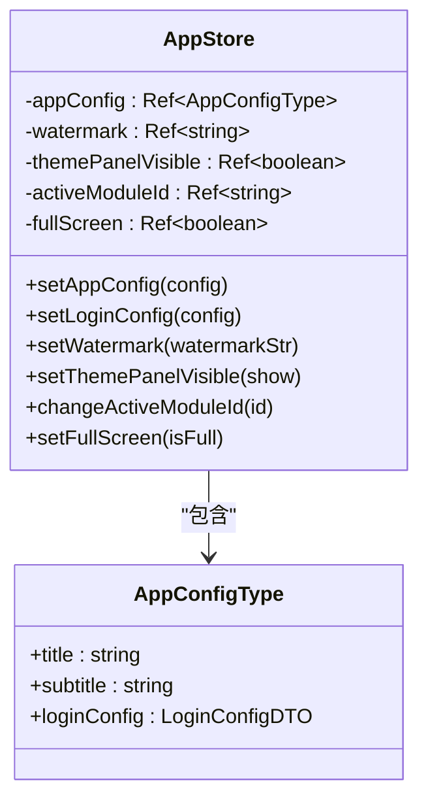
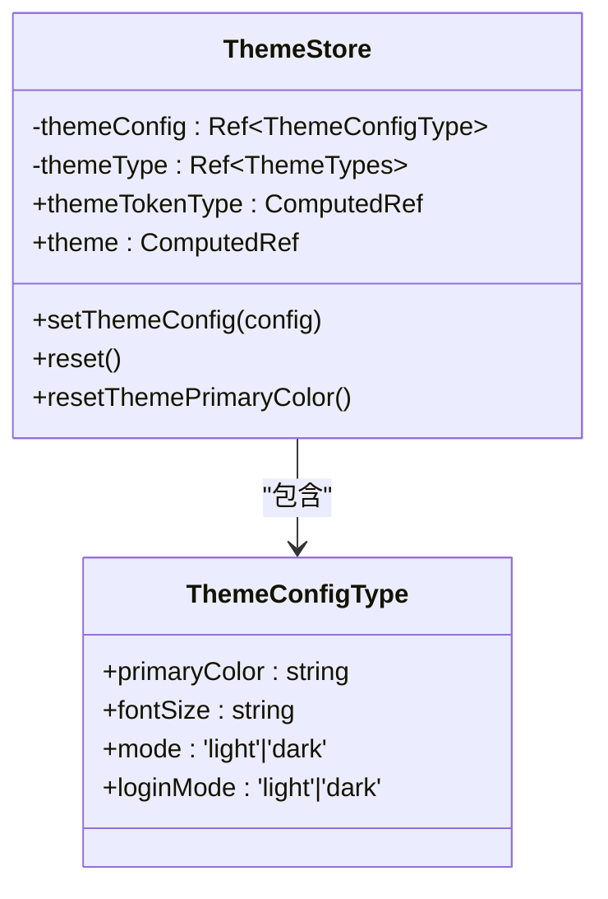
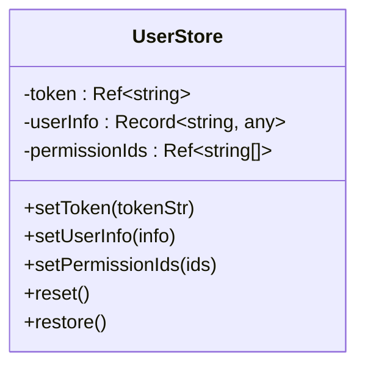
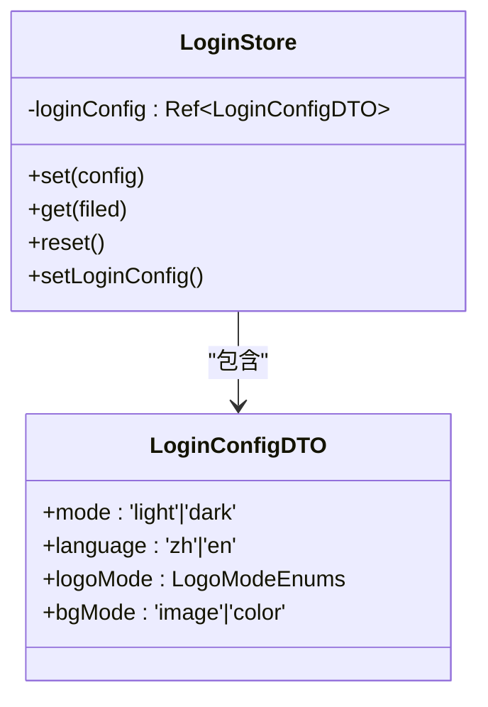
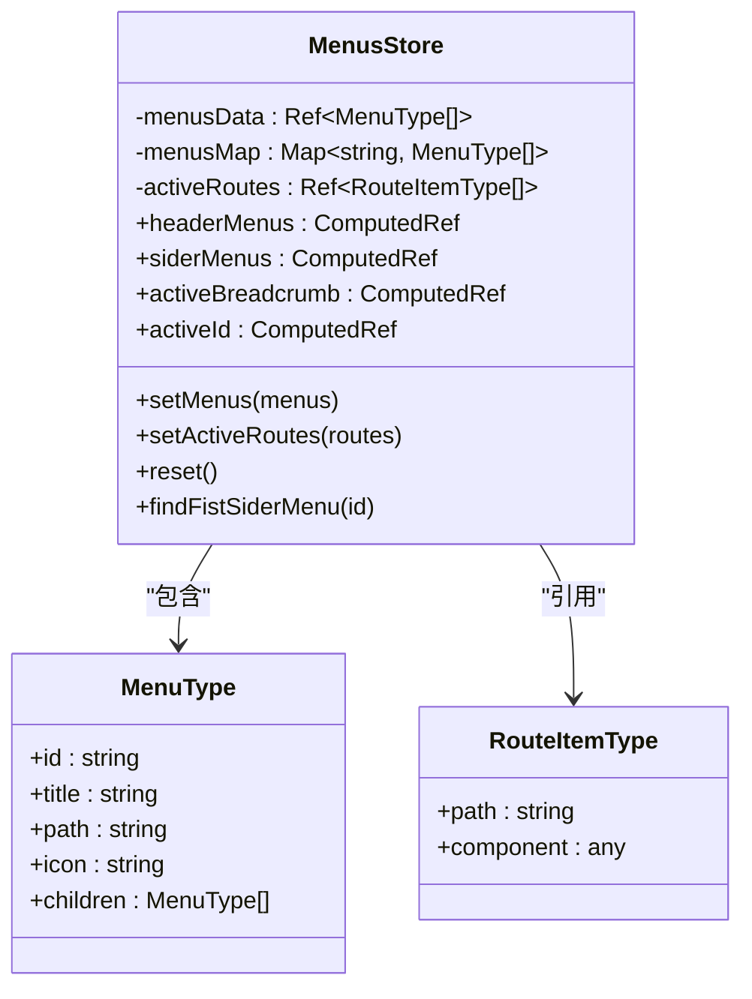
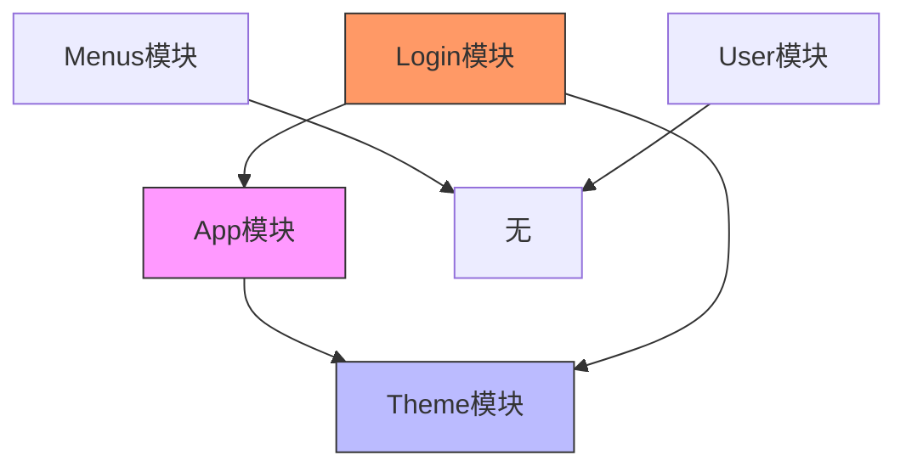

# 模块化设计

<cite>
**本文档引用文件**  
- [app/index.ts](file://src/store/uedModule/app/index.ts)
- [app/defaultConfig.ts](file://src/store/uedModule/app/defaultConfig.ts)
- [app/types.ts](file://src/store/uedModule/app/types.ts)
- [theme/index.ts](file://src/store/uedModule/theme/index.ts)
- [theme/defaultConfig.ts](file://src/store/uedModule/theme/defaultConfig.ts)
- [theme/types.ts](file://src/store/uedModule/theme/types.ts)
- [user/index.ts](file://src/store/uedModule/user/index.ts)
- [login/index.ts](file://src/store/uedModule/login/index.ts)
- [login/defaultConfig.ts](file://src/store/uedModule/login/defaultConfig.ts)
- [login/types.ts](file://src/store/uedModule/login/types.ts)
- [menus/index.ts](file://src/store/uedModule/menus/index.ts)
- [menus/types.ts](file://src/store/uedModule/menus/types.ts)
</cite>

## 目录
1. [引言](#引言)
2. [模块职责划分概览](#模块职责划分概览)
3. [App模块：全局配置与基础状态管理](#app模块全局配置与基础状态管理)
4. [Theme模块：主题系统联动管理](#theme模块主题系统联动管理)
5. [User模块：用户信息处理](#user模块用户信息处理)
6. [Login模块：登录状态与配置管理](#login模块登录状态与配置管理)
7. [Menus模块：菜单数据存储与操作](#menus模块菜单数据存储与操作)
8. [模块间依赖关系与解耦设计](#模块间依赖关系与解耦设计)
9. [模块通信最佳实践示例](#模块通信最佳实践示例)
10. [总结](#总结)

## 引言
本设计文档旨在深入解析 `src/store/uedModule` 下各状态模块的职责划分与实现细节。通过分析 `app`、`theme`、`user`、`login` 和 `menus` 五个核心模块，阐述其在 Vue 3 + Pinia 架构下的模块化设计思想，涵盖 state 结构设计、actions 业务逻辑封装、getters 计算属性定义，并说明模块间的数据依赖关系及避免耦合的设计考量。

**模块来源**
- [app/index.ts](file://src/store/uedModule/app/index.ts)
- [theme/index.ts](file://src/store/uedModule/theme/index.ts)
- [user/index.ts](file://src/store/uedModule/user/index.ts)
- [login/index.ts](file://src/store/uedModule/login/index.ts)
- [menus/index.ts](file://src/store/uedModule/menus/index.ts)

## 模块职责划分概览
各模块职责明确，遵循单一职责原则：

| 模块名称 | 主要职责 | 状态持久化 | 关键依赖 |
|--------|--------|----------|--------|
| **App模块** | 管理应用全局配置、水印、全屏状态等 | localStorage | theme模块 |
| **Theme模块** | 管理主题色、明暗模式、字体大小等UI主题配置 | localStorage | 无 |
| **User模块** | 管理用户登录态、权限ID、用户信息等认证数据 | localStorage | 无 |
| **Login模块** | 管理登录页配置（模式、语言、背景图等） | localStorage | app模块 |
| **Menus模块** | 管理菜单结构、激活路径、面包屑生成等导航逻辑 | 内存 | 无 |

**模块来源**
- [app/index.ts](file://src/store/uedModule/app/index.ts)
- [theme/index.ts](file://src/store/uedModule/theme/index.ts)
- [user/index.ts](file://src/store/uedModule/user/index.ts)
- [login/index.ts](file://src/store/uedModule/login/index.ts)
- [menus/index.ts](file://src/store/uedModule/menus/index.ts)

## App模块：全局配置与基础状态管理

App模块负责维护应用的全局配置和基础UI状态，是系统配置的中枢。

### State结构设计
- `appConfig`: 应用主配置对象，包含标题、子标题、登录配置等
- `watermark`: 水印文本内容
- `themePanelVisible`: 主题控制面板是否可见
- `activeModuleId`: 当前面板激活的模块ID
- `fullScreen`: 全屏状态标志

### Actions业务逻辑封装
- `setAppConfig`: 合并默认配置与传入配置，确保配置完整性
- `setLoginConfig`: 更新登录配置，并同步更新主题模块的登录模式
- `setWatermark`: 设置水印内容
- `setThemePanelVisible`: 控制主题面板显示/隐藏
- `changeActiveModuleId`: 切换面板激活模块
- `setFullScreen`: 设置全屏状态

### Getters计算属性
无显式getters，通过ref直接暴露响应式状态。



**图示来源**
- [app/index.ts](file://src/store/uedModule/app/index.ts#L10-L80)
- [app/types.ts](file://src/store/uedModule/app/types.ts)

**本节来源**
- [app/index.ts](file://src/store/uedModule/app/index.ts#L1-L80)
- [app/defaultConfig.ts](file://src/store/uedModule/app/defaultConfig.ts#L1-L20)

## Theme模块：主题系统联动管理

Theme模块负责管理UI主题配置，实现明暗模式切换与主题色动态调整。

### State结构设计
- `themeConfig`: 主题配置对象，包含颜色、字体、布局等
- `themeType`: 当前主题类型（明/暗）
- `theme`: 计算得出的Ant Design主题Token

### Actions业务逻辑封装
- `setThemeConfig`: 更新主题配置，自动持久化到localStorage
- `reset`: 重置为主题默认配置
- `resetThemePrimaryColor`: 重置主题色为默认值

### Getters计算属性
- `themeTokenType`: 返回当前主题模式（light/dark）
- `theme`: 计算属性，生成完整的Ant Design主题配置对象，包含动态生成的主色系、字体大小等



**图示来源**
- [theme/index.ts](file://src/store/uedModule/theme/index.ts#L1-L158)
- [theme/types.ts](file://src/store/uedModule/theme/types.ts)

**本节来源**
- [theme/index.ts](file://src/store/uedModule/theme/index.ts#L1-L158)
- [theme/defaultConfig.ts](file://src/store/uedModule/theme/defaultConfig.ts#L1-L22)

## User模块：用户信息处理

User模块负责管理用户认证相关状态，包括登录态、权限和用户信息。

### State结构设计
- `token`: 用户认证Token
- `userInfo`: 用户信息对象
- `permissionIds`: 用户权限ID列表

### Actions业务逻辑封装
- `setToken`: 设置用户Token
- `setUserInfo`: 更新用户信息
- `setPermissionIds`: 设置用户权限
- `reset`: 重置所有用户状态
- `restore`: 从localStorage恢复用户状态

### Getters计算属性
无显式getters，通过ref和reactive直接暴露状态。



**图示来源**
- [user/index.ts](file://src/store/uedModule/user/index.ts#L1-L62)

**本节来源**
- [user/index.ts](file://src/store/uedModule/user/index.ts#L1-L62)

## Login模块：登录状态与配置管理

Login模块专门管理登录页面的配置信息，支持动态切换。

### State结构设计
- `loginConfig`: 登录配置对象，继承自App模块的默认配置

### Actions业务逻辑封装
- `set`: 更新登录配置，自动同步到localStorage，并触发国际化和主题切换
- `get`: 获取指定配置项
- `reset`: 重置为默认配置
- `setLoginConfig`: 持久化配置到localStorage

### 特殊逻辑
- 在`onMounted`中初始化国际化和主题
- `set`方法会调用`setTheme`和`setI18n`实现联动



**图示来源**
- [login/index.ts](file://src/store/uedModule/login/index.ts#L1-L57)
- [login/types.ts](file://src/store/uedModule/login/types.ts)

**本节来源**
- [login/index.ts](file://src/store/uedModule/login/index.ts#L1-L57)
- [login/defaultConfig.ts](file://src/store/uedModule/login/defaultConfig.ts#L1-L3)

## Menus模块：菜单数据存储与操作

Menus模块负责管理应用的菜单结构和导航状态。

### State结构设计
- `menusData`: 原始菜单数据
- `menusMap`: 路径到菜单层级的映射表
- `activeRoutes`: 激活的路由栈
- `activeMenus`: 激活的菜单路径

### Actions业务逻辑封装
- `setMenus`: 设置菜单数据，自动生成menusMap
- `setActiveRoutes`: 设置激活路由
- `reset`: 重置所有菜单状态
- `findFistSiderMenu`: 查找侧边栏第一个可用菜单

### Getters计算属性
- `headerMenus`: 计算顶部菜单项
- `siderMenus`: 计算侧边栏菜单项
- `activeBreadcrumb`: 计算面包屑路径
- `activeId`: 计算当前激活的顶级菜单ID



**图示来源**
- [menus/index.ts](file://src/store/uedModule/menus/index.ts#L1-L138)
- [menus/types.ts](file://src/store/uedModule/menus/types.ts)

**本节来源**
- [menus/index.ts](file://src/store/uedModule/menus/index.ts#L1-L138)

## 模块间依赖关系与解耦设计

### 依赖关系分析


### 解耦设计考量
1. **单向依赖**：App模块依赖Theme模块，但反之不成立
2. **配置继承**：Login模块复用App模块的defaultConfig，避免重复定义
3. **事件驱动**：Login模块通过调用外部函数（setTheme/setI18n）实现联动，而非直接修改其他模块状态
4. **独立职责**：User和Menus模块完全独立，减少耦合风险
5. **持久化分离**：各模块独立管理自己的localStorage键名

**图示来源**
- [app/index.ts](file://src/store/uedModule/app/index.ts#L1-L80)
- [theme/index.ts](file://src/store/uedModule/theme/index.ts#L1-L158)
- [login/index.ts](file://src/store/uedModule/login/index.ts#L1-L57)

**本节来源**
- [app/index.ts](file://src/store/uedModule/app/index.ts#L1-L80)
- [theme/index.ts](file://src/store/uedModule/theme/index.ts#L1-L158)
- [login/index.ts](file://src/store/uedModule/login/index.ts#L1-L57)

## 模块通信最佳实践示例

### 1. 配置同步模式
```typescript
// App模块中同步登录配置到主题
setLoginConfig(config) {
  appConfig.value.loginConfig = config;
  themeStore.setThemeConfig({ 
    ...themeStore.themeConfig, 
    loginMode: config.mode 
  });
}
```

### 2. 事件触发模式
```typescript
// Login模块中触发外部系统变更
set(config) {
  loginConfig.value = config;
  setTheme(config.mode);     // 触发主题切换
  setI18n(config.language);  // 触发语言切换
}
```

### 3. 计算属性联动
```typescript
// Theme模块中基于配置计算主题Token
const theme = computed(() => {
  return {
    token: themeTokens[themeConfig.value.mode],
    algorithm: themeConfig.value.mode === 'dark' ? darkAlgorithm : defaultAlgorithm
  };
});
```

### 4. 映射表优化查询
```typescript
// Menus模块中构建路径到菜单的映射
function dataToMenuMap(menus, map, parents = []) {
  menus.forEach(item => {
    if (item.path) {
      map.set(item.path, [item, ...parents]);
    }
    if (item.children) {
      dataToMenuMap(item.children, map, [item, ...parents]);
    }
  });
}
```

**本节来源**
- [app/index.ts](file://src/store/uedModule/app/index.ts#L1-L80)
- [theme/index.ts](file://src/store/uedModule/theme/index.ts#L1-L158)
- [login/index.ts](file://src/store/uedModule/login/index.ts#L1-L57)
- [menus/index.ts](file://src/store/uedModule/menus/index.ts#L1-L138)

## 总结
`src/store/uedModule` 采用模块化设计，各模块职责清晰：
- **App模块**作为配置中枢，协调全局状态
- **Theme模块**实现动态主题系统
- **User模块**专注认证状态管理
- **Login模块**专一处理登录配置
- **Menus模块**提供完整的导航解决方案

通过合理的依赖管理和通信模式，实现了高内聚、低耦合的状态管理架构，为应用的可维护性和可扩展性奠定了坚实基础。