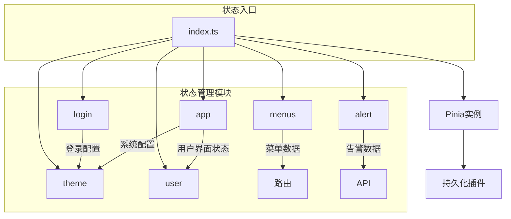
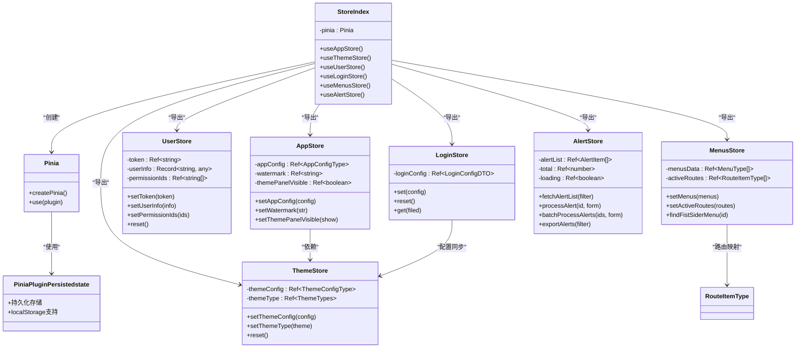
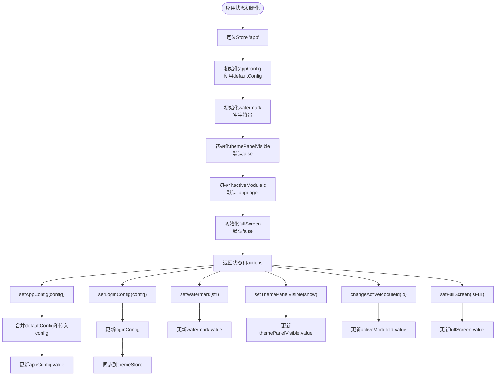
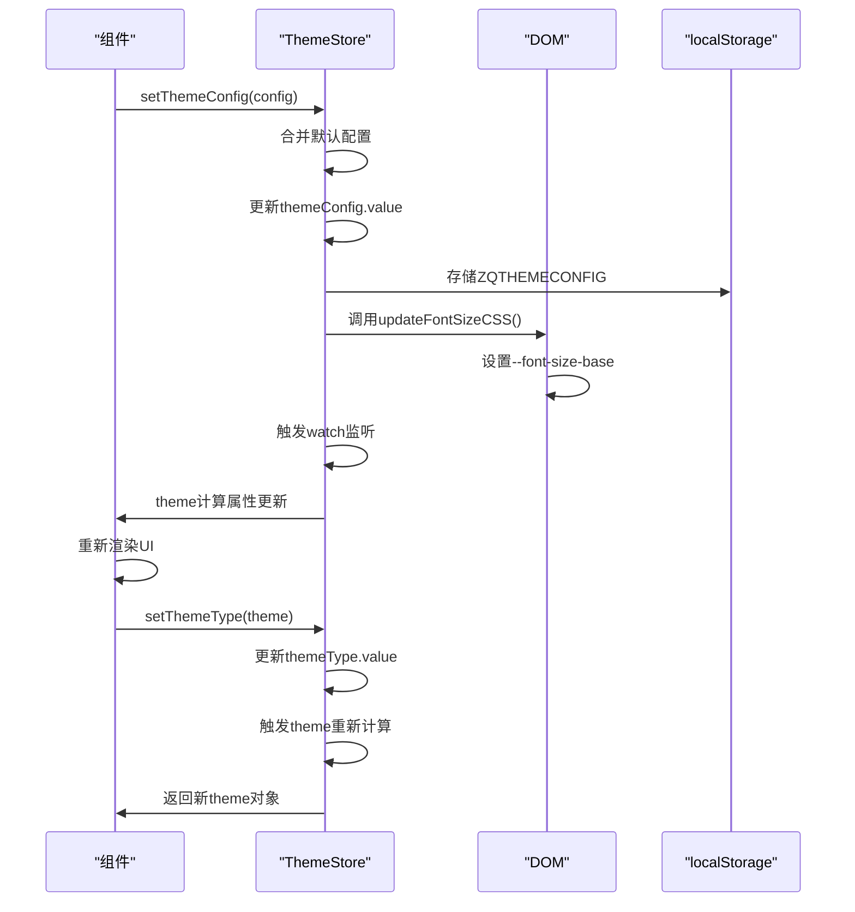
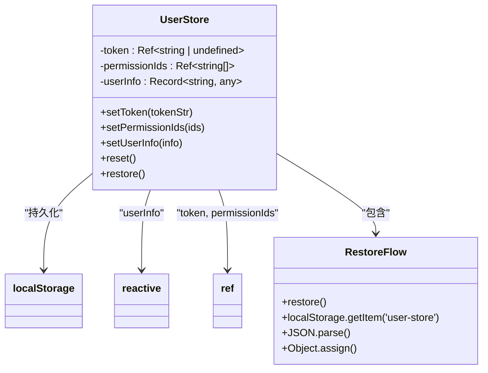
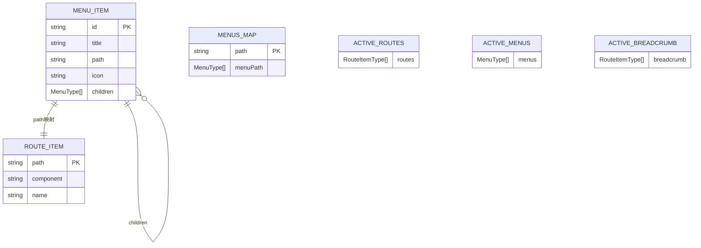
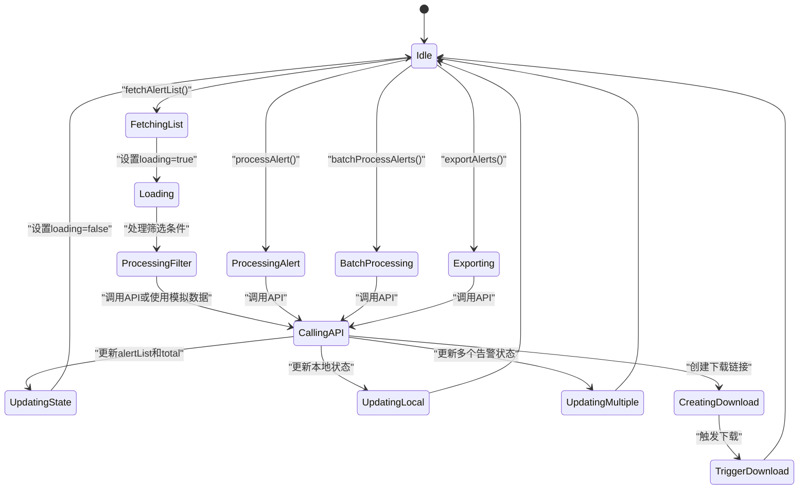
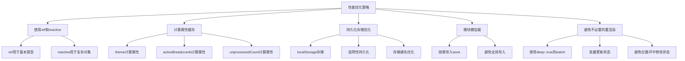
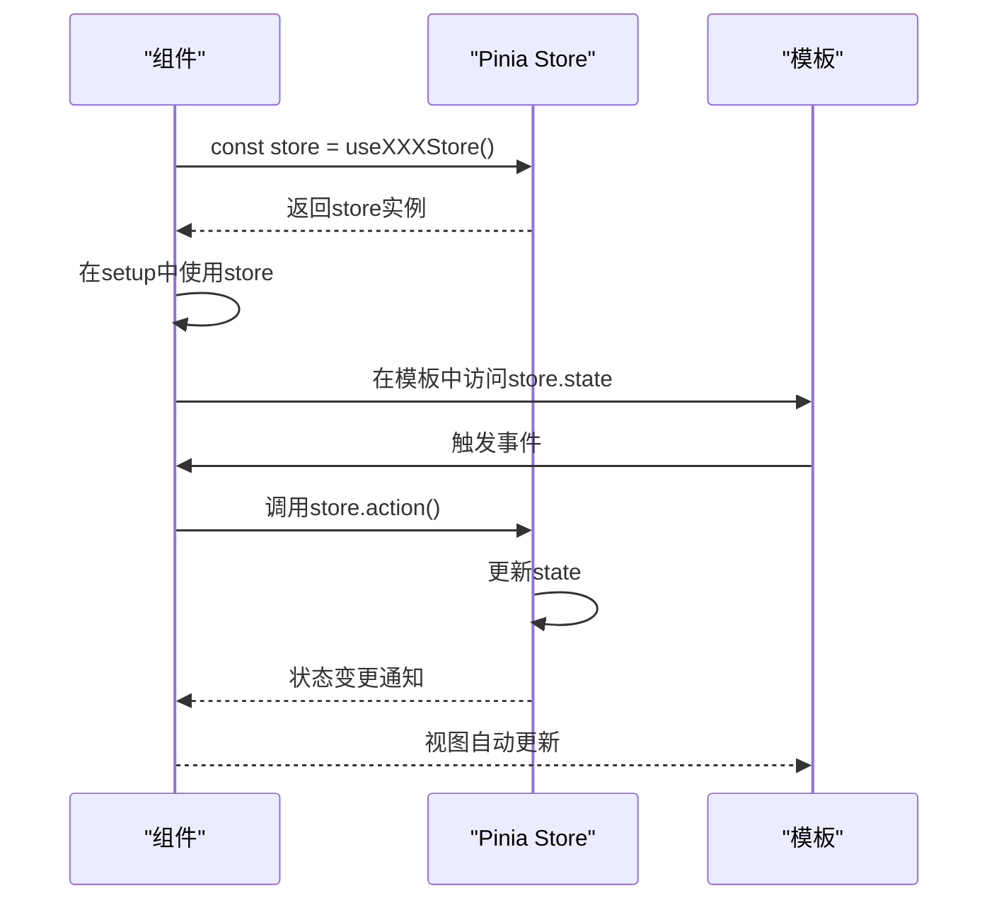

# 状态管理

<cite>
**本文档引用的文件**  
- [src/store/index.ts](file://src/store/index.ts)
- [src/store/uedModule/app/index.ts](file://src/store/uedModule/app/index.ts)
- [src/store/uedModule/theme/index.ts](file://src/store/uedModule/theme/index.ts)
- [src/store/uedModule/user/index.ts](file://src/store/uedModule/user/index.ts)
- [src/store/uedModule/login/index.ts](file://src/store/uedModule/login/index.ts)
- [src/store/uedModule/menus/index.ts](file://src/store/uedModule/menus/index.ts)
- [src/store/uedModule/alert/index.ts](file://src/store/uedModule/alert/index.ts)
</cite>

## 目录
1. [项目结构](#项目结构)
2. [核心状态模块](#核心状态模块)
3. [状态管理架构概述](#状态管理架构概述)
4. [详细模块分析](#详细模块分析)
5. [依赖关系分析](#依赖关系分析)
6. [性能考虑](#性能考虑)
7. [最佳实践与优化建议](#最佳实践与优化建议)

## 项目结构

本项目采用模块化的状态管理设计，所有Pinia状态模块集中存放在`src/store/uedModule`目录下，通过`src/store/index.ts`统一导出。这种结构实现了功能模块的清晰划分和集中管理。



**图示来源**  
- [src/store/index.ts](file://src/store/index.ts#L1-L13)
- [src/store/uedModule](file://src/store/uedModule)

**本节来源**  
- [src/store](file://src/store)

## 核心状态模块

项目中的核心状态模块包括app、theme、user、login、menus和alert，每个模块负责特定领域的状态管理。`store/index.ts`作为统一入口，通过Pinia插件实现状态持久化，确保关键用户配置在页面刷新后得以保留。

**本节来源**  
- [src/store/index.ts](file://src/store/index.ts#L1-L13)
- [src/store/uedModule](file://src/store/uedModule)

## 状态管理架构概述

系统采用Pinia作为状态管理解决方案，通过模块化设计将不同功能领域的状态分离。`store/index.ts`文件创建Pinia实例并注册持久化插件，然后导入各个功能模块的store，最后统一导出供组件使用。



**图示来源**  
- [src/store/index.ts](file://src/store/index.ts#L1-L13)
- [src/store/uedModule/app/index.ts](file://src/store/uedModule/app/index.ts#L1-L80)
- [src/store/uedModule/theme/index.ts](file://src/store/uedModule/theme/index.ts#L1-L158)
- [src/store/uedModule/user/index.ts](file://src/store/uedModule/user/index.ts#L1-L62)
- [src/store/uedModule/login/index.ts](file://src/store/uedModule/login/index.ts#L1-L57)
- [src/store/uedModule/menus/index.ts](file://src/store/uedModule/menus/index.ts#L1-L138)
- [src/store/uedModule/alert/index.ts](file://src/store/uedModule/alert/index.ts#L1-L362)

## 详细模块分析

### 应用状态模块 (app)

应用状态模块管理全局的应用配置，包括系统配置、水印设置、主题面板可见性等。该模块通过引用主题模块实现配置联动，确保用户界面的一致性。



**图示来源**  
- [src/store/uedModule/app/index.ts](file://src/store/uedModule/app/index.ts#L1-L80)

**本节来源**  
- [src/store/uedModule/app/index.ts](file://src/store/uedModule/app/index.ts#L1-L80)

### 主题状态模块 (theme)

主题状态模块负责管理应用的视觉主题，包括颜色、字体大小、明暗模式等。模块通过计算属性动态生成Ant Design Vue组件库的主题token，实现主题的实时切换。



**图示来源**  
- [src/store/uedModule/theme/index.ts](file://src/store/uedModule/theme/index.ts#L1-L158)

**本节来源**  
- [src/store/uedModule/theme/index.ts](file://src/store/uedModule/theme/index.ts#L1-L158)

### 用户状态模块 (user)

用户状态模块管理用户认证相关状态，包括认证令牌、权限ID和用户信息。模块在初始化时会尝试从本地存储恢复状态，实现用户会话的持久化。



**图示来源**  
- [src/store/uedModule/user/index.ts](file://src/store/uedModule/user/index.ts#L1-L62)

**本节来源**  
- [src/store/uedModule/user/index.ts](file://src/store/uedModule/user/index.ts#L1-L62)

### 登录配置模块 (login)

登录配置模块管理登录页面的配置信息，如语言设置、登录模式等。模块在设置配置时会同步更新全局的国际化和主题设置，确保用户体验的一致性。

```mermaid
flowchart LR
A[LoginStore初始化] --> B[从localStorage读取ZQ_LOGIN_CONFIG]
B --> C[创建loginConfig Ref]
C --> D[返回store API]
D --> E[set方法]
E --> F[更新loginConfig.value]
F --> G[存储到localStorage]
G --> H[调用setTheme()]
H --> I[调用setI18n()]
I --> J[更新全局主题和语言]
D --> K[reset方法]
K --> L[重置为defaultLoginConfig]
L --> G
D --> M[get方法]
M --> N[获取指定字段值]
```

**图示来源**  
- [src/store/uedModule/login/index.ts](file://src/store/uedModule/login/index.ts#L1-L57)

**本节来源**  
- [src/store/uedModule/login/index.ts](file://src/store/uedModule/login/index.ts#L1-L57)

### 菜单状态模块 (menus)

菜单状态模块负责管理应用的导航菜单，包括顶部菜单、侧边栏菜单和面包屑导航。模块通过Map数据结构建立路径到菜单项的映射，实现高效的菜单查找。



**图示来源**  
- [src/store/uedModule/menus/index.ts](file://src/store/uedModule/menus/index.ts#L1-L138)

**本节来源**  
- [src/store/uedModule/menus/index.ts](file://src/store/uedModule/menus/index.ts#L1-L138)

### 告警状态模块 (alert)

告警状态模块管理系统的告警数据，提供完整的CRUD操作和批量处理功能。模块封装了API调用逻辑，为组件提供简洁的状态管理接口。



**图示来源**  
- [src/store/uedModule/alert/index.ts](file://src/store/uedModule/alert/index.ts#L1-L362)

**本节来源**  
- [src/store/uedModule/alert/index.ts](file://src/store/uedModule/alert/index.ts#L1-L362)

## 依赖关系分析

各状态模块之间存在明确的依赖关系，通过合理的模块划分实现了关注点分离。`store/index.ts`作为中心枢纽，协调各个模块的初始化和导出。

```mermaid
graph TD
Index["store/index.ts"] --> App["app模块"]
Index --> Theme["theme模块"]
Index --> User["user模块"]
Index --> Login["login模块"]
Index --> Menus["menus模块"]
Index --> Alert["alert模块"]
App --> Theme : "useThemeStore()"
Login --> Theme : "setTheme()"
Login --> I18n : "setI18n()"
Menus --> Icons : "Ant Design Icons"
Alert --> API : "alertApi"
Index --> PiniaPlugin["pinia-plugin-persistedstate"]
App --> Persist : "persist: {key: 'app-store'}"
User --> Persist : "persist: {key: 'user-store'}"
Login --> Persist : "persist: {key: 'login-store'}"
style Index fill:#4CAF50,stroke:#388E3C
style App fill:#2196F3,stroke:#1976D2
style Theme fill:#2196F3,stroke:#1976D2
style User fill:#2196F3,stroke:#1976D2
style Login fill:#2196F3,stroke:#1976D2
style Menus fill:#2196F3,stroke:#1976D2
style Alert fill:#2196F3,stroke:#1976D2
style PiniaPlugin fill:#FF9800,stroke:#F57C00
```

**图示来源**  
- [src/store/index.ts](file://src/store/index.ts#L1-L13)
- [src/store/uedModule/app/index.ts](file://src/store/uedModule/app/index.ts#L1-L80)
- [src/store/uedModule/theme/index.ts](file://src/store/uedModule/theme/index.ts#L1-L158)
- [src/store/uedModule/user/index.ts](file://src/store/uedModule/user/index.ts#L1-L62)
- [src/store/uedModule/login/index.ts](file://src/store/uedModule/login/index.ts#L1-L57)
- [src/store/uedModule/menus/index.ts](file://src/store/uedModule/menus/index.ts#L1-L138)
- [src/store/uedModule/alert/index.ts](file://src/store/uedModule/alert/index.ts#L1-L362)

**本节来源**  
- [src/store/index.ts](file://src/store/index.ts#L1-L13)
- [src/store/uedModule](file://src/store/uedModule)

## 性能考虑

状态管理系统的性能主要体现在以下几个方面：状态更新的响应性、持久化存储的效率、计算属性的优化以及模块间的依赖管理。



**本节来源**  
- [src/store/uedModule](file://src/store/uedModule)

## 最佳实践与优化建议

### 状态使用示例

在组件中使用store的典型模式：



### 最佳实践

1. **模块化设计**：将状态按功能领域拆分为独立模块，便于维护和测试
2. **单一状态源**：确保每个状态只在一个store中定义，避免状态冗余
3. **使用计算属性**：对于派生状态，使用computed属性而非在组件中计算
4. **合理使用持久化**：仅对需要跨会话保留的状态启用持久化
5. **错误处理**：在actions中包含适当的错误处理逻辑
6. **类型安全**：充分利用TypeScript的类型系统，确保状态的一致性

### 优化建议

1. **避免过度使用store**：仅将需要跨组件共享的状态放入store
2. **批量更新**：在可能的情况下，批量更新相关状态以减少触发次数
3. **选择性订阅**：只订阅组件实际需要的状态，避免不必要的重渲染
4. **内存管理**：在组件销毁时清理不必要的监听器和定时器
5. **性能监控**：定期检查状态更新的频率和性能影响

**本节来源**  
- [src/store](file://src/store)
- [src/store/uedModule](file://src/store/uedModule)