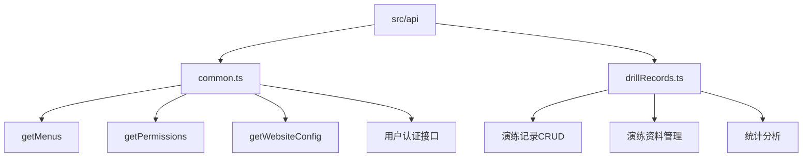
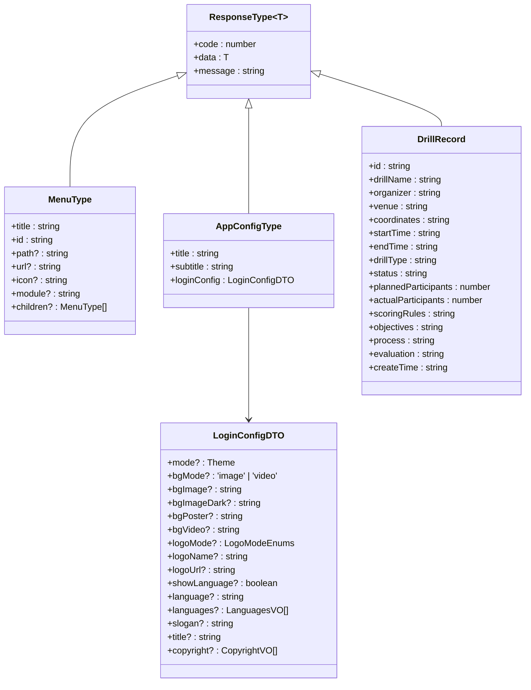
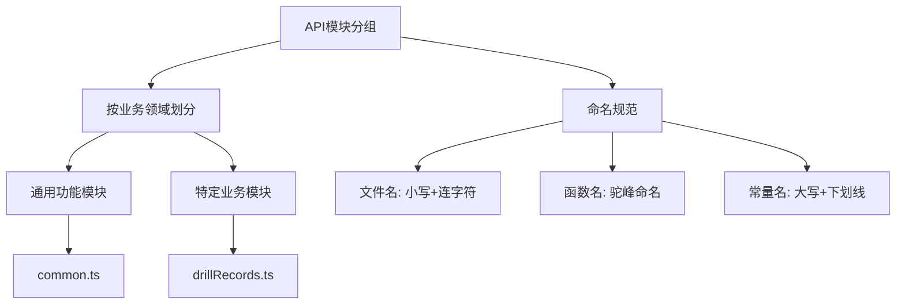
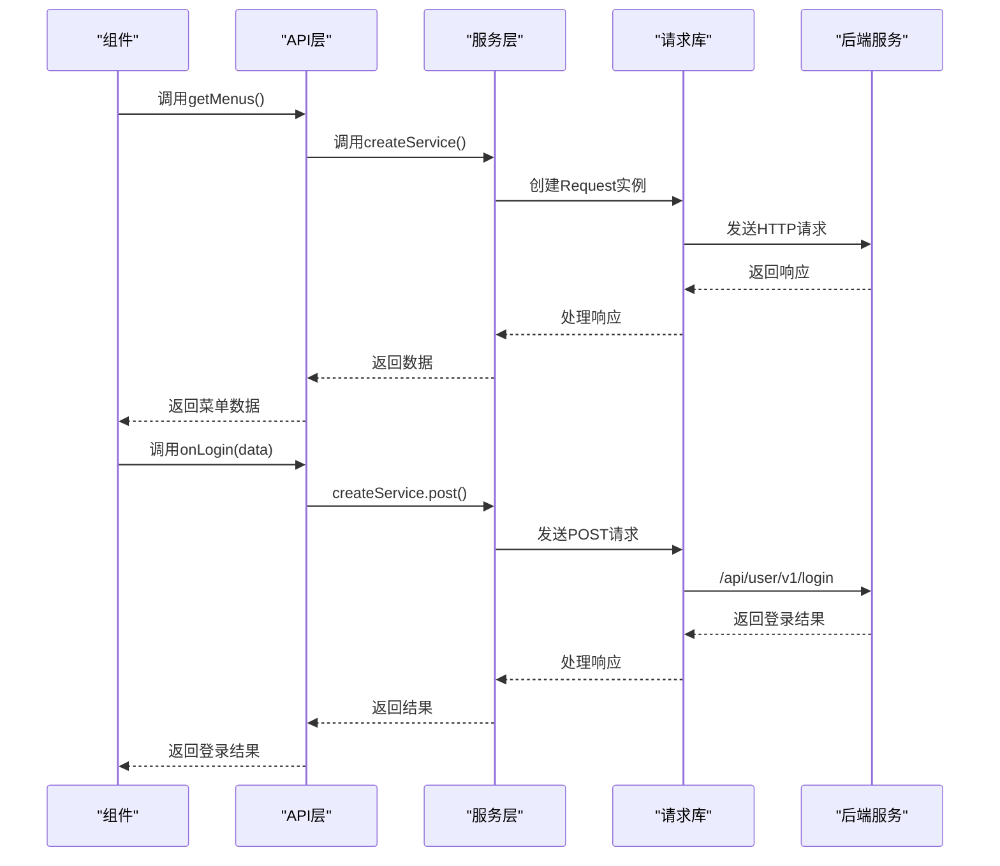
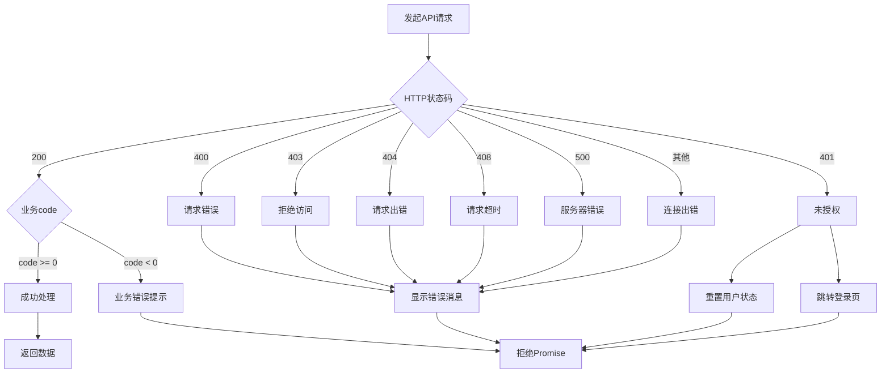
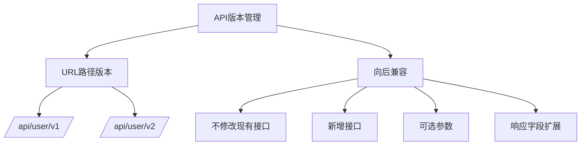

# API接口层结构

<cite>
**本文档引用的文件**   
- [common.ts](file://src/api/common.ts)
- [drillRecords.ts](file://src/api/drillRecords.ts)
- [index.ts](file://src/service/index.ts)
- [index.ts](file://src/libs/fetch/index.ts)
- [types.ts](file://src/libs/fetch/types.ts)
- [types.ts](file://src/store/uedModule/menus/types.ts)
- [types.ts](file://src/store/uedModule/app/types.ts)
- [types.ts](file://src/views/uedModule/login/types.ts)
- [guard.ts](file://src/router/guard.ts)
</cite>

## 目录
1. [API接口组织方式](#api接口组织方式)
2. [类型安全实现](#类型安全实现)
3. [API模块分组与命名规范](#api模块分组与命名规范)
4. [前后端契约实现](#前后端契约实现)
5. [服务层调用关系](#服务层调用关系)
6. [类型推导与错误处理](#类型推导与错误处理)
7. [接口文档维护](#接口文档维护)
8. [版本管理与向后兼容](#版本管理与向后兼容)

## API接口组织方式

src/api目录采用功能模块化组织方式，将API接口按业务领域进行分组。当前项目包含两个主要API模块：common.ts和drillRecords.ts，分别处理通用功能和演练记录相关功能。



**Diagram sources**
- [common.ts](file://src/api/common.ts)
- [drillRecords.ts](file://src/api/drillRecords.ts)

**Section sources**
- [common.ts](file://src/api/common.ts)
- [drillRecords.ts](file://src/api/drillRecords.ts)

## 类型安全实现

API接口通过TypeScript接口定义实现了完整的类型安全，确保前后端数据契约的严格一致性。接口定义包括请求参数、响应数据的精确类型描述。

### 请求与响应类型定义



**Diagram sources**
- [types.ts](file://src/libs/fetch/types.ts#L3-L15)
- [types.ts](file://src/store/uedModule/menus/types.ts#L1-L15)
- [types.ts](file://src/store/uedModule/app/types.ts#L1-L27)
- [types.ts](file://src/views/uedModule/login/types.ts#L1-L61)
- [drillRecords.ts](file://src/api/drillRecords.ts#L1-L60)

**Section sources**
- [types.ts](file://src/libs/fetch/types.ts#L3-L15)
- [types.ts](file://src/store/uedModule/menus/types.ts#L1-L15)
- [types.ts](file://src/store/uedModule/app/types.ts#L1-L27)
- [types.ts](file://src/views/uedModule/login/types.ts#L1-L61)
- [drillRecords.ts](file://src/api/drillRecords.ts#L1-L60)

### 类型安全特性

1. **响应数据泛型化**: 通过ResponseType<T>泛型接口，确保每个API调用返回的数据类型安全
2. **精确的字段类型**: 所有字段都有明确的类型定义，避免any类型使用
3. **可选属性标记**: 使用?标记可选属性，准确反映API契约
4. **联合类型**: 使用'literal' | 'literal'语法定义有限值集合
5. **嵌套类型**: 支持复杂对象的嵌套类型定义

## API模块分组与命名规范

API模块采用基于业务领域的分组策略，每个模块文件对应一个业务功能域。命名规范遵循清晰、描述性的原则。

### 模块分组策略

| 模块名称 | 功能领域 | 主要接口 |
|---------|--------|---------|
| common.ts | 通用功能 | 菜单、权限、用户认证 |
| drillRecords.ts | 演练记录 | CRUD操作、统计分析 |

### 命名规范

1. **文件命名**: 使用小写字母和连字符，描述业务领域
2. **函数命名**: 采用动词+名词的驼峰命名法
3. **常量命名**: 全大写字母，下划线分隔



**Diagram sources**
- [common.ts](file://src/api/common.ts)
- [drillRecords.ts](file://src/api/drillRecords.ts)

**Section sources**
- [common.ts](file://src/api/common.ts)
- [drillRecords.ts](file://src/api/drillRecords.ts)

## 前后端契约实现

通过TypeScript接口定义实现了严格的前后端契约，确保接口的稳定性和可维护性。

### 契约实现机制

1. **接口定义即契约**: TypeScript接口定义直接作为前后端数据契约
2. **编译时检查**: 在编译阶段发现类型不匹配问题
3. **IDE智能提示**: 提供完整的代码补全和错误提示
4. **文档自动生成**: 接口定义可作为API文档的基础

### 契约示例

```typescript
// 菜单数据契约
export interface MenuType {
  title: string;
  id: string;
  path?: string;
  icon?: string;
  module?: string;
  children?: MenuType[];
}

// 演练记录契约
export interface DrillRecord {
  id: string;
  drillName: string;
  organizer: string;
  venue: string;
  coordinates: string;
  startTime: string;
  endTime: string;
  drillType: string;
  status: string;
  plannedParticipants: number;
  actualParticipants: number;
  scoringRules: string;
  objectives: string;
  process: string;
  evaluation: string;
  createTime: string;
}
```

**Section sources**
- [types.ts](file://src/store/uedModule/menus/types.ts#L1-L15)
- [drillRecords.ts](file://src/api/drillRecords.ts#L1-L60)

## 服务层调用关系

API接口层与服务层通过清晰的调用关系进行集成，实现了关注点分离。

### 调用关系图



**Diagram sources**
- [common.ts](file://src/api/common.ts)
- [index.ts](file://src/service/index.ts)
- [index.ts](file://src/libs/fetch/index.ts)

**Section sources**
- [common.ts](file://src/api/common.ts#L304-L354)
- [index.ts](file://src/service/index.ts)
- [index.ts](file://src/libs/fetch/index.ts)

### 服务层实现

服务层通过Request类封装了底层HTTP请求，提供了统一的API调用接口：

```typescript
class Request {
  private instance: AxiosInstance;
  
  constructor(createConfig: CreateAxiosConfig) {
    this.instance = axios.create(createConfig);
    // 请求拦截器
    this.instance.interceptors.request.use(/* ... */);
    // 响应拦截器
    this.instance.interceptors.response.use(/* ... */);
  }
  
  request<D>(config: RequestConfigType): Promise<ResponseType<D>> {
    return new Promise((resolve, reject) => {
      this.instance(config)
        .then((res) => {
          if (res.data.code < 0 && config.showError) {
            message.error(res.data.msg);
            reject(res.data);
            return;
          }
          resolve(res.data);
        })
        .catch((err) => {
          reject(err);
        });
    });
  }
  
  public get<D = any>(url: string, params?: any, config?: RequestConfigType) {
    return this.request<D>({
      showError: true,
      ...(config || {}),
      method: 'GET',
      params,
      url
    });
  }
  
  // 其他HTTP方法...
}
```

## 类型推导与错误处理

系统实现了完整的类型推导和错误处理机制，确保API调用的安全性和可靠性。

### 类型推导机制

1. **泛型参数推导**: 通过<D>泛型参数实现响应数据的类型推导
2. **函数重载**: 不同HTTP方法共享相同的类型推导逻辑
3. **接口继承**: 基础响应类型通过继承扩展特定业务类型

### 错误处理流程



**Diagram sources**
- [index.ts](file://src/libs/fetch/index.ts#L14-L80)

**Section sources**
- [index.ts](file://src/libs/fetch/index.ts#L14-L80)
- [types.ts](file://src/libs/fetch/types.ts#L3-L15)

### 错误处理实现

```typescript
// 响应拦截器中的错误处理
this.instance.interceptors.response.use(
  (res: AxiosResponse) => {
    return res;
  },
  (err: any) => {
    let msg = '';
    switch (err.response.status) {
      case 400:
        msg = '请求错误(400)';
        break;
      case 401:
        msg = '未授权，请重新登录(401)';
        this.userStore.reset();
        this.menusStroe.reset();
        router.replace('/login');
        break;
      case 403:
        msg = '拒绝访问(403)';
        break;
      case 404:
        msg = '请求出错(404)';
        break;
      case 408:
        msg = '请求超时(408)';
        break;
      case 500:
        msg = '服务器错误(500)';
        break;
      default:
        msg = `连接出错(${err.response.status})!`;
    }
    message.error(msg);
    return Promise.reject(err);
  }
);

// 业务错误处理
request<D>(config: RequestConfigType): Promise<ResponseType<D>> {
  return new Promise((resolve, reject) => {
    this.instance(config)
      .then((res) => {
        // 当返回的 body 内的 code 小于 0 时，进入错误提示
        if (res.data.code < 0 && config.showError) {
          message.error(res.data.msg);
          reject(res.data);
          return;
        }
        resolve(res.data);
      })
      .catch((err) => {
        reject(err);
      });
  });
}
```

## 接口文档维护

接口文档通过代码即文档的方式进行维护，确保文档与实现的一致性。

### 文档维护策略

1. **代码注释**: 通过JSDoc风格注释描述接口功能
2. **类型定义**: TypeScript接口定义作为文档的核心
3. **示例代码**: 提供使用示例
4. **集中管理**: 所有API接口集中在src/api目录

### 文档示例

```typescript
/**
 * 获取菜单数据
 * @returns 菜单数据数组
 * @example
 * const menus = await getMenus();
 * console.log(menus);
 */
export async function getMenus(): Promise<MenuType[]> {
  // 实现代码
}

/**
 * 用户登录
 * @param data 登录数据
 * @returns 登录结果
 * @example
 * const result = await onLogin({ username, password });
 * console.log(result);
 */
export async function onLogin(data: any): Promise<any> {
  return createService.post('/api/user/v1/login', data);
}
```

**Section sources**
- [common.ts](file://src/api/common.ts)

## 版本管理与向后兼容

系统通过URL路径版本控制实现API版本管理，确保向后兼容性。

### 版本管理策略

1. **URL路径版本**: 在API路径中包含版本号，如/api/user/v1/
2. **向后兼容**: 保持旧版本API的稳定性
3. **渐进式升级**: 新功能在新版本中引入
4. **废弃策略**: 通过文档标记即将废弃的API

### 版本控制示例

```typescript
// v1版本登录接口
export async function onLogin(data: any): Promise<any> {
  return createService.post('/api/user/v1/login', data);
}

// v1版本注册接口
export async function onRegister(data: any): Promise<any> {
  return createService.post('/api/user/v1/register', data);
}

// v1版本获取验证码接口
export async function getCaptcha(): Promise<any> {
  return createService.get('/api/user/v1/captcha');
}
```

### 向后兼容实现

1. **不修改现有接口**: 避免破坏现有客户端
2. **新增接口而非修改**: 通过新增接口实现新功能
3. **可选参数**: 新增参数设置为可选，保持向后兼容
4. **响应字段扩展**: 允许响应中包含额外字段



**Diagram sources**
- [common.ts](file://src/api/common.ts#L304-L354)

**Section sources**
- [common.ts](file://src/api/common.ts#L304-L354)
- [nginx.conf](file://nginx.conf#L45-L102)