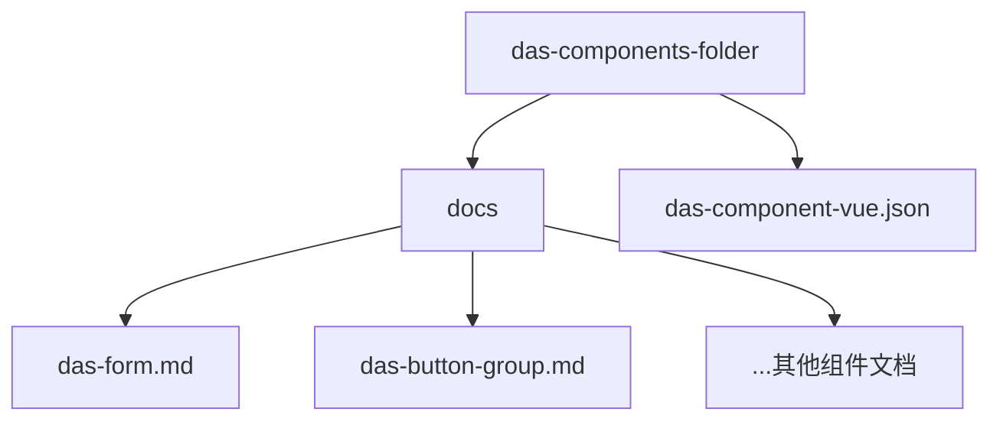
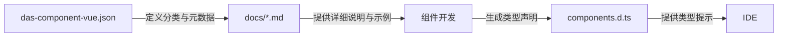
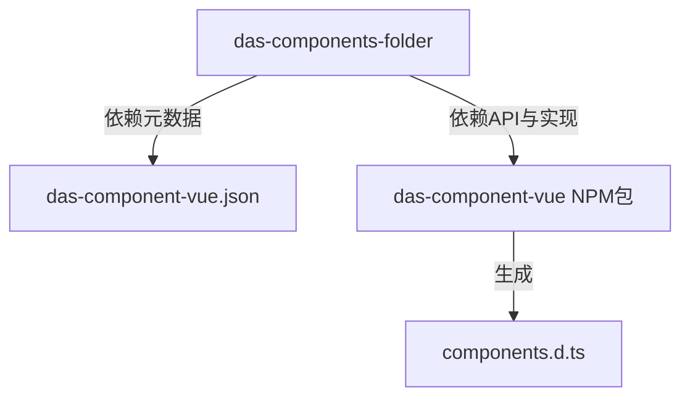

# DAS组件文档结构

<cite>
**本文档中引用的文件**   
- [das-form.md](file://das-components-folder/docs/das-form.md)
- [das-component-vue.json](file://das-components-folder/das-component-vue.json)
- [components.d.ts](file://components.d.ts)
- [interface.d.ts](file://node_modules/das-component-vue/es/form/interface.d.ts)
</cite>

## 目录
1. [简介](#简介)
2. [项目结构](#项目结构)
3. [核心组件](#核心组件)
4. [架构概述](#架构概述)
5. [详细组件分析](#详细组件分析)
6. [依赖分析](#依赖分析)
7. [性能考虑](#性能考虑)
8. [故障排除指南](#故障排除指南)
9. [结论](#结论)

## 简介
本文档旨在深入解析 `das-components-folder` 目录的组织结构，重点阐述 DAS 组件文档的编写规范、内容结构以及文档与实际代码的映射关系。文档将详细说明 `docs` 子目录中各组件 Markdown 文件的构成，包括 API 说明、使用示例、属性和事件回调，并分析 `das-component-vue.json` 文件作为组件元数据配置的作用。最终目标是展示该目录如何支持文档驱动的组件开发流程。

## 项目结构
`das-components-folder` 目录是 DAS 组件库的核心，其结构清晰，分为文档和配置两大部分。



**Diagram sources**
- [das-component-vue.json](file://das-components-folder/das-component-vue.json)
- [das-form.md](file://das-components-folder/docs/das-form.md)

**Section sources**
- [das-component-vue.json](file://das-components-folder/das-component-vue.json)
- [das-form.md](file://das-components-folder/docs/das-form.md)

## 核心组件
`das-form` 组件是 DAS 组件库中“数据录入”类别下的核心组件，它基于 Ant Design Vue 的表单功能进行了深度扩展，提供了更灵活的布局和更丰富的交互特性。

**Section sources**
- [das-form.md](file://das-components-folder/docs/das-form.md#L0-L28)
- [das-component-vue.json](file://das-components-folder/das-component-vue.json#L100-L110)

## 架构概述
DAS 组件库采用文档驱动的开发模式。`das-component-vue.json` 文件作为中心化的元数据配置，定义了所有组件的分类、描述和使用场景。每个组件的详细 API、示例和用法则在 `docs` 目录下的独立 Markdown 文件中进行维护。这种分离使得文档可以独立于代码进行编写和预览，同时通过类型声明文件（如 `components.d.ts`）确保了开发时的类型安全。



**Diagram sources**
- [das-component-vue.json](file://das-components-folder/das-component-vue.json)
- [components.d.ts](file://components.d.ts)

## 详细组件分析

### das-form 组件分析
`das-form` 组件文档（`das-form.md`）遵循了统一的编写规范，内容结构清晰，易于理解。

#### 组件说明与使用场景
文档首先通过 **组件说明** 和 **何时使用** 两个部分，从宏观上介绍了组件的功能和适用场景。这有助于开发者快速判断该组件是否满足其需求。

```markdown
## 组件说明
DasForm 是一个基于 Ant Design Vue 的表单组件，在原有基础上扩展了更灵活的布局方式。主要特点：
- 支持水平布局、垂直布局、行内布局、行内垂直布局
- ...

## 何时使用
- 需要收集用户输入信息时
- 需要对输入的数据进行校验时
- ...
```

**Section sources**
- [das-form.md](file://das-components-folder/docs/das-form.md#L0-L50)

#### 交互演示与使用示例
文档的核心是 **交互演示** 和多个 **使用示例**（如 `das-form-01 基础用法`）。这些部分通过 `:::demo` 代码块提供了可运行的 Vue 代码片段，直观地展示了组件的用法。

```vue
<template>
  <das-form :model="formState" :rules="rules" @finish="onFinish">
    <das-form-item label="名称" name="basic_name" required>
      <a-input v-model:value="formState.basic_name" />
    </das-form-item>
    <!-- ... -->
  </das-form>
</template>
```

这些示例不仅展示了 API 的调用方式，还包含了完整的 `script` 部分，说明了如何在 `setup` 中定义 `ref`、`reactive` 数据和事件处理函数，为开发者提供了完整的参考。

**Section sources**
- [das-form.md](file://das-components-folder/docs/das-form.md#L99-L160)

#### API 说明
文档的后半部分详细列出了 `DasForm`、`DasFormItem` 和 `DasFormGroup` 的 Props（属性），以表格形式呈现，包括参数名、说明、类型和默认值。这是开发者查阅 API 的主要依据。

```markdown
### DasFormItem Props

| 参数 | 说明 | 类型 | 默认值 |
| --- | --- | --- | --- |
| label | 标签文本 | `string \| slot` | - |
| name | 表单域字段名 | `string \| number \| (string \| number)[]` | - |
| ...
```

**Section sources**
- [das-form.md](file://das-components-folder/docs/das-form.md#L1055-L1085)

### 组件文档与代码的映射关系
尽管在 `src/components` 目录下未能直接找到 `das-form` 的实现文件，但通过分析 `components.d.ts` 和 `node_modules` 中的类型定义，可以确认其存在和结构。

`components.d.ts` 文件中的全局组件声明揭示了 `das-form` 是从 `das-component-vue` 包中导入的：
```typescript
declare module 'vue' {
  export interface GlobalComponents {
    DasForm: typeof import('das-component-vue')['DasForm']
    DasFormItem: typeof import('das-component-vue')['DasFormItem']
    // ...
  }
}
```

同时，在 `node_modules/das-component-vue/es/form/interface.d.ts` 中可以找到其接口定义：
```typescript
export interface DasFormProps extends Omit<AFormProps, 'ref'> {
  layout?: 'horizontal' | 'vertical' | 'inline' | 'inline-vertical';
  inlineLabelWidth?: string;
  inlineColumns?: number;
  // ...
}
```
这表明 `das-form` 组件的 API 是在 `das-component-vue` 库中定义的，而 `das-components-folder/docs` 目录下的文档是对其的外部说明。

**Section sources**
- [components.d.ts](file://components.d.ts#L77-L78)
- [interface.d.ts](file://node_modules/das-component-vue/es/form/interface.d.ts#L5)

## 依赖分析
`das-components-folder` 目录本身不包含组件的实现代码，它依赖于外部的 `das-component-vue` npm 包。`das-component-vue.json` 文件作为配置中心，管理着所有组件的元数据。`docs` 目录下的 Markdown 文件则依赖于 `das-component-vue` 的实际 API 来编写示例和说明。



**Diagram sources**
- [das-component-vue.json](file://das-components-folder/das-component-vue.json)
- [components.d.ts](file://components.d.ts)

## 性能考虑
由于 `das-components-folder` 主要包含文档和配置，其对应用性能的影响极小。然而，`das-form` 组件本身支持的复杂功能（如动态表单项、互斥显示）在处理大量数据时可能会影响性能。建议在实际使用中，对于动态生成的复杂表单，进行性能测试和优化。

## 故障排除指南
当遇到 `das-form` 组件相关问题时，可以按照以下步骤排查：
1.  **检查文档**：首先查阅 `das-form.md` 文档，确认 API 使用是否正确。
2.  **检查类型**：利用 `components.d.ts` 提供的类型提示，检查代码中是否存在类型错误。
3.  **检查依赖**：确保 `das-component-vue` 包已正确安装且版本匹配 `das-component-vue.json` 中的 `version` 字段。
4.  **检查示例**：参考文档中的 `:::demo` 示例，对比自己的代码。

**Section sources**
- [das-form.md](file://das-components-folder/docs/das-form.md)
- [das-component-vue.json](file://das-components-folder/das-component-vue.json#L2)

## 结论
`das-components-folder` 目录通过将组件文档（`docs`）与元数据配置（`das-component-vue.json`）分离，建立了一套高效的文档驱动开发流程。Markdown 文档提供了详尽的 API 说明和可交互的使用示例，而 JSON 配置文件则统一管理了组件的分类和基本信息。这种结构不仅便于维护，也极大地提升了开发者的使用体验，实现了从文档到代码实现的完整链条。