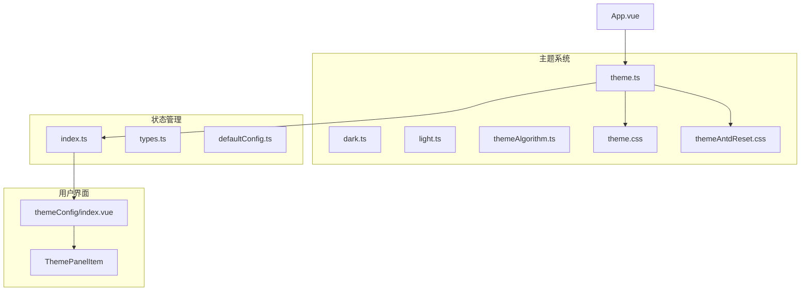
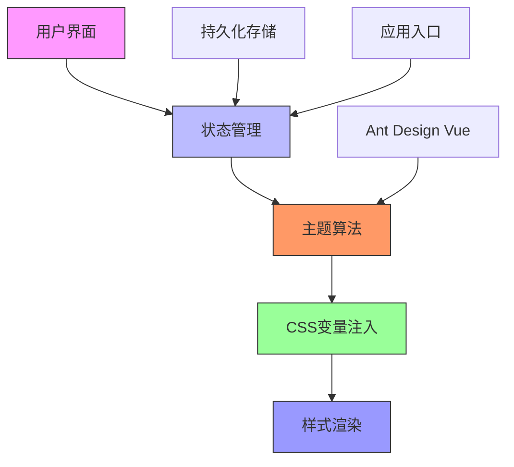
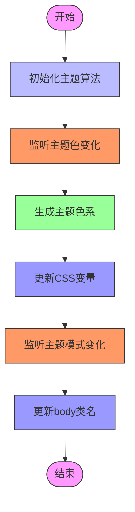
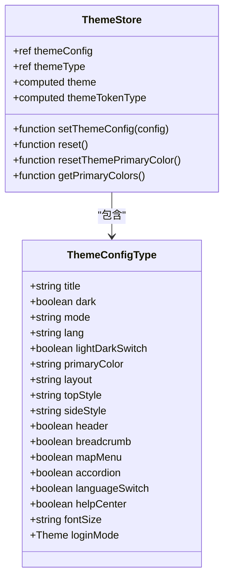
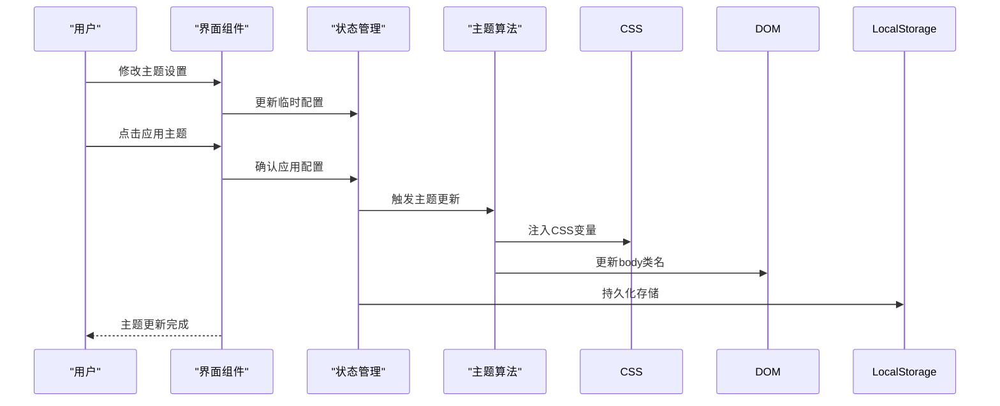
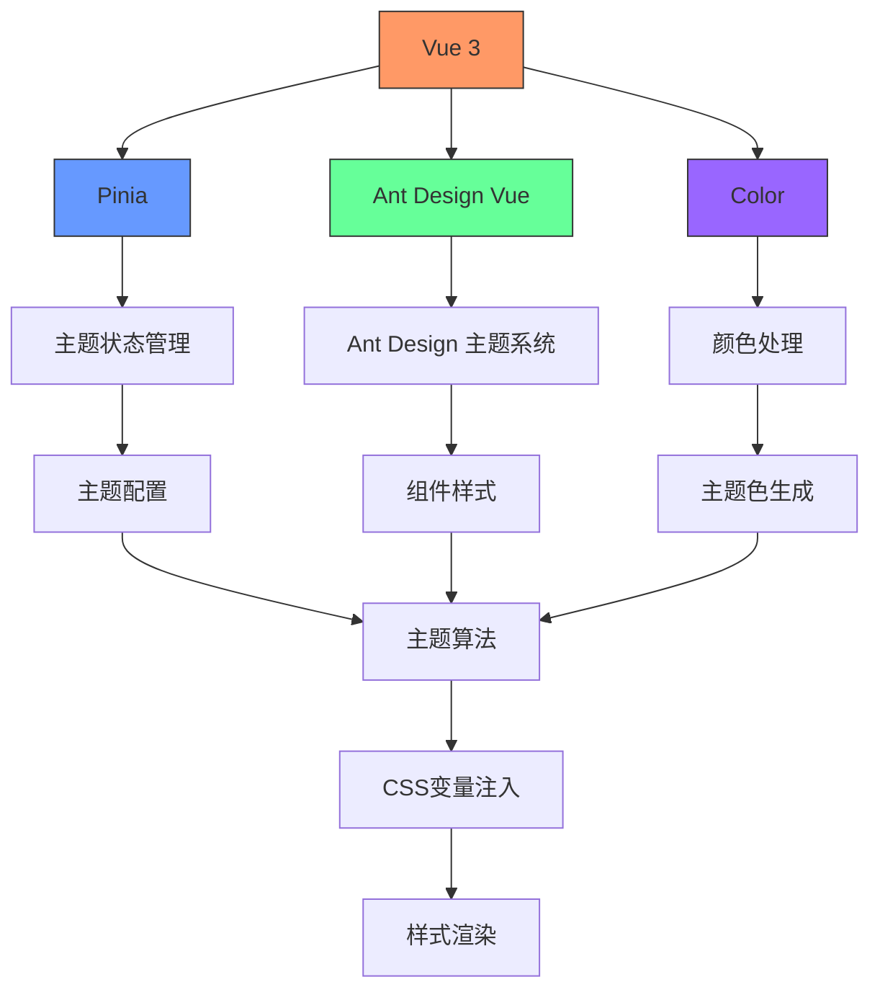

# 主题系统结构

<cite>
**本文档引用的文件**   
- [theme.ts](file://src/theme/theme.ts)
- [dark.ts](file://src/theme/dark.ts)
- [light.ts](file://src/theme/light.ts)
- [themeAlgorithm.ts](file://src/theme/themeAlgorithm.ts)
- [index.ts](file://src/store/uedModule/theme/index.ts)
- [themeConfig/index.vue](file://src/views/uedModule/themeConfig/index.vue)
- [theme.css](file://src/theme/theme.css)
- [themeAntdReset.css](file://src/theme/themeAntdReset.css)
- [App.vue](file://src/App.vue)
</cite>

## 目录
1. [简介](#简介)
2. [项目结构](#项目结构)
3. [核心组件](#核心组件)
4. [架构概述](#架构概述)
5. [详细组件分析](#详细组件分析)
6. [依赖分析](#依赖分析)
7. [性能考虑](#性能考虑)
8. [故障排除指南](#故障排除指南)
9. [结论](#结论)

## 简介
本文档详细解析了Vue项目模板中的主题管理系统，重点分析了主题注册与切换的核心逻辑、CSS变量注入机制、动态样式更新原理，以及深色/浅色主题的具体配置。文档还阐述了主题生成算法的实现原理，支持自定义主题的扩展，并提供了主题切换的触发方式和持久化存储方案。

## 项目结构
主题系统主要位于`src/theme`目录下，包含核心的主题配置文件和算法实现。系统通过Pinia状态管理、CSS变量和Ant Design Vue组件库的集成，实现了完整的主题管理功能。

**图示来源**
- [theme.ts](file://src/theme/theme.ts)
- [index.ts](file://src/store/uedModule/theme/index.ts)
- [themeConfig/index.vue](file://src/views/uedModule/themeConfig/index.vue)

## 核心组件
主题系统的核心组件包括主题令牌定义、主题算法实现、状态管理模块和用户界面组件。系统通过组合这些组件，实现了灵活的主题管理和动态样式更新功能。

**组件来源**
- [theme.ts](file://src/theme/theme.ts)
- [themeAlgorithm.ts](file://src/theme/themeAlgorithm.ts)
- [index.ts](file://src/store/uedModule/theme/index.ts)

## 架构概述
主题系统采用分层架构设计，从底层的CSS变量定义到上层的用户界面交互，形成了完整的主题管理链条。系统通过状态管理作为中心枢纽，协调各个组件之间的数据流动和状态同步。

**图示来源**
- [App.vue](file://src/App.vue)
- [index.ts](file://src/store/uedModule/theme/index.ts)
- [themeAlgorithm.ts](file://src/theme/themeAlgorithm.ts)

## 详细组件分析

### 主题令牌分析
主题令牌是主题系统的基础，定义了深色和浅色主题的具体设计参数，包括颜色、间距、字体等设计令牌。

#### 深色主题配置

```mermaid
classDiagram
class DarkToken {
+string colorPrimary : '#3B71EE'
+string colorSuccess : '#1DB969'
+string colorWarning : '#FF7F29'
+string colorError : '#F53C3C'
+string colorInfo : '#60687b'
+string colorTextBase : '#878ea0'
+string colorPrimaryBg : 'rgba(59, 113, 238, 0.12)'
+number borderRadius : 3
+boolean wireframe : false
+string colorPrimaryActive : '#6E9EFD'
+string colorPrimaryBorder : '#3B71EE'
+string colorPrimaryBorderHover : '#2E55AD'
+string colorPrimaryHover : '#2E55AD'
+string colorPrimaryTextActive : '#6E9EFD'
+string colorPrimaryTextHover : '#2E55AD'
+string colorPrimaryBgHover : '#C0D9FF'
+string colorSuccessBg : '#153D3C'
+string colorSuccessBgHover : '#152C36'
+string colorSuccessBorder : '#1DB969'
+string colorSuccessBorderHover : '#1B8356'
+string colorSuccessActive : '#4CD284'
+string colorSuccessTextHover : '#1B8356'
+string colorSuccessTextActive : '#4CD284'
+string colorSuccessHover : '#1B8356'
+string colorWarningBg : '#48302D'
+string colorWarningBgHover : '#2E252E'
+string colorWarningBorder : '#FF7F29'
+string colorWarningBorderHover : '#AE5E2D'
+string colorWarningHover : '#AE5E2D'
+string colorWarningActive : '#FEA562'
+string colorWarningTextHover : '#AE5E2D'
+string colorWarningTextActive : '#FEA562'
+string colorErrorBg : '#452232'
+string colorErrorBgHover : '#2D1F31'
+string colorErrorBorder : '#F53C3C'
+string colorErrorBorderHover : '#A73239'
+string colorErrorHover : '#A73239'
+string colorErrorActive : '#F87C79'
+string colorErrorTextHover : '#A73239'
+string colorErrorTextActive : '#F87C79'
+string colorInfoBg : '#394052'
+string colorInfoBgHover : '#272E3D'
+string colorInfoBorder : '#60687b'
+string colorInfoBorderHover : '#444C5D'
+string colorInfoHover : '#444C5D'
+string colorInfoActive : '#878EA0'
+string colorInfoText : '#60687B'
+string colorInfoTextHover : '#444C5D'
+string colorInfoTextActive : '#878EA0'
+string colorTextQuaternary : '#60687B'
+string colorBorder : '#444C5D'
+string colorBorderSecondary : '#394052'
+string colorFill : '#2E3545'
+string colorFillSecondary : '#272E3D'
+string colorText : '#ffffff'
+string colorTextSecondary : '#B0B8C8'
+string colorTextTertiary : '#878EA0'
+string colorBgContainer : '#141821'
+string colorBgElevated : '#1C222E'
+string colorBgSpotlight : '#2E3545'
+string colorPrimaryText : '#3B71EE'
+string colorBgBase : '#2e3545'
+string colorFillTertiary : '#1C222E'
+string colorFillQuaternary : '#141821'
+string colorBgMask : 'rgba(0, 0, 0, 0.40)'
+string colorBgLayout : '#141821'
+string colorWarningText : '#FF7F29'
+string colorErrorText : '#F53C3C'
+string colorBgSelect : '#2E3545'
+string colorBgSelectHover : '#394052'
}
```

**图示来源**
- [dark.ts](file://src/theme/dark.ts)

#### 浅色主题配置

```mermaid
classDiagram
class LightToken {
+string colorPrimary : '#134BEA'
+string colorSuccess : '#1DB969'
+string colorWarning : '#FF7F29'
+string colorError : '#F53C3C'
+string colorInfo : '#60687b'
+string colorTextBase : '#1E2435'
+string colorPrimaryBg : 'rgba(19, 75, 234, 0.12)'
+number borderRadius : 3
+boolean wireframe : false
+string colorPrimaryActive : '#6E9EFD'
+string colorPrimaryBorder : '#134BEA'
+string colorPrimaryBorderHover : '#2E55AD'
+string colorPrimaryHover : '#2E55AD'
+string colorPrimaryTextActive : '#6E9EFD'
+string colorPrimaryTextHover : '#2E55AD'
+string colorPrimaryBgHover : '#C0D9FF'
+string colorSuccessBg : '#E8FFEF'
+string colorSuccessBgHover : '#F1F2F5'
+string colorSuccessBorder : '#1DB969'
+string colorSuccessBorderHover : '#1B8356'
+string colorSuccessActive : '#4CD284'
+string colorSuccessTextHover : '#1B8356'
+string colorSuccessTextActive : '#4CD284'
+string colorSuccessHover : '#1B8356'
+string colorWarningBg : '#FFF5E8'
+string colorWarningBgHover : '#F1F2F5'
+string colorWarningBorder : '#FF7F29'
+string colorWarningBorderHover : '#AE5E2D'
+string colorWarningHover : '#AE5E2D'
+string colorWarningActive : '#FEA562'
+string colorWarningTextHover : '#AE5E2D'
+string colorWarningTextActive : '#FEA562'
+string colorErrorBg : '#FFE8E8'
+string colorErrorBgHover : '#F1F2F5'
+string colorErrorBorder : '#F53C3C'
+string colorErrorBorderHover : '#A73239'
+string colorErrorHover : '#A73239'
+string colorErrorActive : '#F87C79'
+string colorErrorTextHover : '#A73239'
+string colorErrorTextActive : '#F87C79'
+string colorInfoBg : '#F1F2F5'
+string colorInfoBgHover : '#F1F2F5'
+string colorInfoBorder : '#60687b'
+string colorInfoBorderHover : '#444C5D'
+string colorInfoHover : '#444C5D'
+string colorInfoActive : '#878EA0'
+string colorInfoText : '#60687B'
+string colorInfoTextHover : '#444C5D'
+string colorInfoTextActive : '#878EA0'
+string colorTextQuaternary : '#ADB1BC'
+string colorBorder : '#CBD0DB'
+string colorBorderSecondary : '#E9EAF0'
+string colorFill : '#F1F2F5'
+string colorFillSecondary : '#F6F7FB'
+string colorText : '#1E2435'
+string colorTextSecondary : '#353C51'
+string colorTextTertiary : '#7E8494'
+string colorBgContainer : '#FFFFFF'
+string colorBgElevated : '#FFFFFF'
+string colorBgSpotlight : '#F1F2F5'
+string colorPrimaryText : '#134BEA'
+string colorBgBase : '#FFFFFF'
+string colorFillTertiary : '#F6F7FB'
+string colorFillQuaternary : '#F1F2F5'
+string colorBgMask : 'rgba(0, 0, 0, 0.40)'
+string colorBgLayout : '#F6F7FB'
+string colorWarningText : '#FF7F29'
+string colorErrorText : '#F53C3C'
+string colorBgSelect : '#F1F2F5'
+string colorBgSelectHover : '#F1F2F5'
}
```

**图示来源**
- [light.ts](file://src/theme/light.ts)

### 主题算法分析
主题算法模块负责处理主题的动态生成和CSS变量的注入，是主题系统的核心逻辑部分。

**图示来源**
- [themeAlgorithm.ts](file://src/theme/themeAlgorithm.ts)

### 状态管理分析
状态管理模块使用Pinia实现，负责管理主题配置的状态，并提供持久化存储功能。

**图示来源**
- [index.ts](file://src/store/uedModule/theme/index.ts)
- [types.ts](file://src/store/uedModule/theme/types.ts)

### 用户界面分析
主题配置界面提供了用户友好的主题设置功能，包括主题模式、主题色、字号等设置。

**图示来源**
- [themeConfig/index.vue](file://src/views/uedModule/themeConfig/index.vue)
- [index.ts](file://src/store/uedModule/theme/index.ts)

## 依赖分析
主题系统依赖于多个核心库和组件，形成了完整的依赖链条。

**图示来源**
- [package.json](file://package.json)
- [App.vue](file://src/App.vue)

## 性能考虑
主题系统在设计时考虑了性能优化，通过以下方式确保高效的主题切换和样式更新：

1. **CSS变量注入**：使用CSS自定义属性（CSS变量）实现主题切换，避免了频繁的DOM操作和样式重计算。
2. **批量更新**：通过`nextTick`确保DOM更新的批量处理，减少重排和重绘。
3. **深监听优化**：在状态管理中使用`deep: true`的监听器，确保配置变化的及时响应。
4. **算法优化**：主题色生成算法使用预计算和缓存机制，避免重复计算。

## 故障排除指南
### 常见问题及解决方案

1. **主题切换不生效**
   - 检查`App.vue`中是否正确引入了`themeAlgorithm`
   - 确认`themeConfig`状态是否正确更新
   - 检查CSS变量是否正确注入到DOM中

2. **深色模式样式异常**
   - 确认`body`元素是否正确添加了`theme-dark`类名
   - 检查`dark.ts`中的颜色配置是否正确
   - 验证`themeAntdReset.css`是否正确覆盖了Ant Design的默认样式

3. **主题色不一致**
   - 检查`getPrimaryColors`函数是否正确生成了主题色系
   - 确认CSS变量是否正确更新
   - 验证`themeAlgorithm`中的颜色计算逻辑

4. **持久化存储失效**
   - 检查`localStorage`中`ZQTHEMECONFIG`项是否存在
   - 确认`watch`监听器是否正确触发存储操作
   - 验证页面初始化时是否正确读取了存储的配置

**组件来源**
- [index.ts](file://src/store/uedModule/theme/index.ts)
- [themeAlgorithm.ts](file://src/theme/themeAlgorithm.ts)
- [App.vue](file://src/App.vue)

## 结论
本文档详细解析了Vue项目模板中的主题管理系统，涵盖了主题注册与切换的核心逻辑、CSS变量注入和动态样式更新机制。系统通过`theme.ts`中的主题注册与切换逻辑，结合`dark.ts`和`light.ts`中的具体配置，实现了完整的主题管理功能。`themeAlgorithm.ts`中的主题生成算法支持自定义主题的扩展，而主题切换的触发方式和持久化存储方案确保了用户体验的一致性。整体系统设计合理，性能优化到位，为项目提供了灵活且高效的主题管理解决方案。