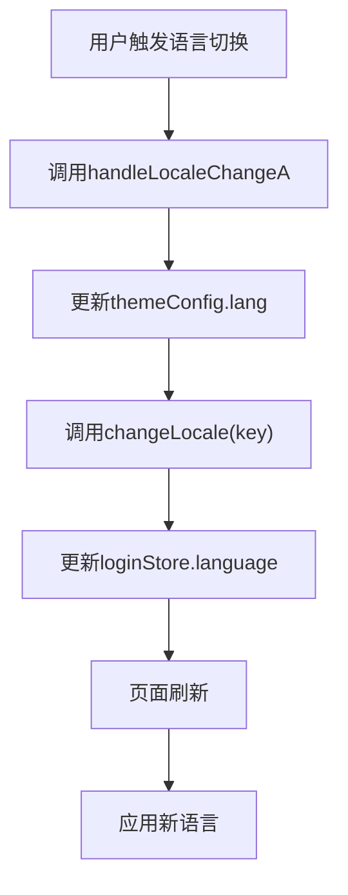
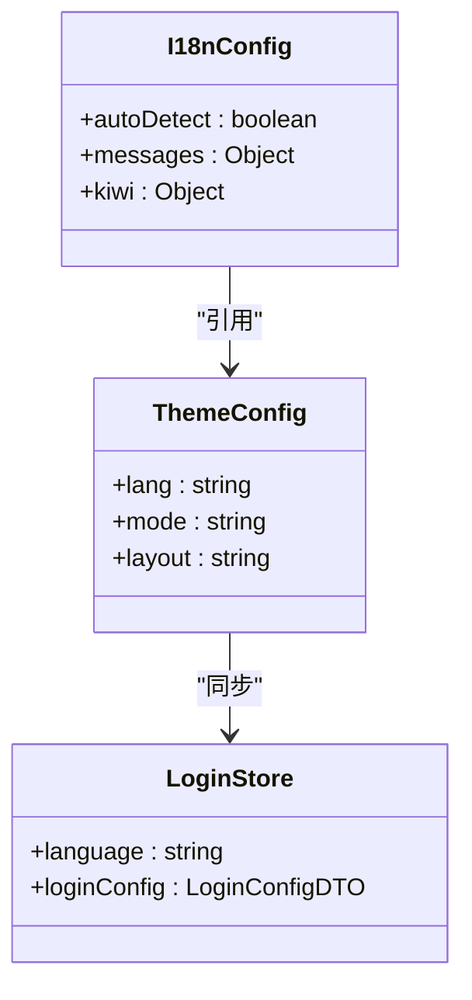
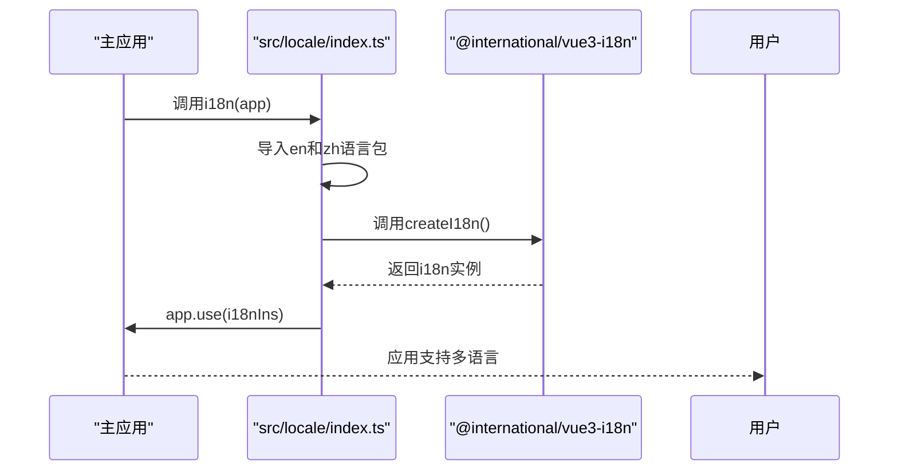
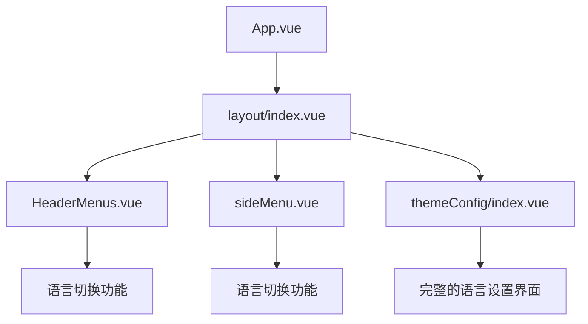
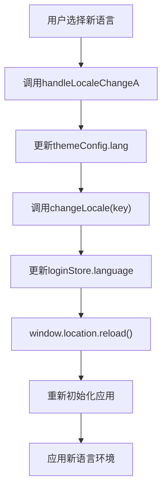

# 国际化结构

<cite>
**本文档引用的文件**   
- [index.ts](file://src/locale/index.ts)
- [themeConfig/index.vue](file://src/views/uedModule/themeConfig/index.vue)
- [layout/index.vue](file://src/components/uedModule/layout/index.vue)
- [HeaderMenus.vue](file://src/components/uedModule/layout/comps/HeaderMenus.vue)
- [sideMenu.vue](file://src/components/uedModule/menu/sideMenu.vue)
- [login/index.vue](file://src/views/uedModule/login/index.vue)
- [package-lock.json](file://package-lock.json)
</cite>

## 目录
1. [国际化实现方案概述](#国际化实现方案概述)
2. [多语言资源组织结构](#多语言资源组织结构)
3. [i18n实例初始化流程](#i18n实例初始化流程)
4. [Vue组件集成使用](#vue组件集成使用)
5. [语言资源维护规范](#语言资源维护规范)
6. [翻译函数使用示例](#翻译函数使用示例)
7. [高级特性说明](#高级特性说明)

## 国际化实现方案概述

本项目采用基于`@international/vue3-i18n`库的国际化解决方案，通过在`src/locale/index.ts`文件中创建i18n实例来实现多语言支持。系统目前支持简体中文（zh-CN）和英语（en）两种语言，通过模块化的方式组织语言资源，并提供动态语言切换功能。

**Section sources**
- [index.ts](file://src/locale/index.ts)

## 多语言资源组织结构

### 语言包加载机制

项目的多语言资源通过`src/locale/index.ts`文件进行组织和加载。该文件导入了来自`.kiwi`目录的中英文语言包，并将其注册到i18n实例中。

```typescript
import { createI18n } from '@international/vue3-i18n';
import en from '../../.kiwi/en-US';
import zh from '../../.kiwi/zh-CN';
```

语言包的组织结构遵循以下模式：
- 每种语言对应一个独立的模块
- 语言包通过相对路径导入
- 语言资源以嵌套对象的形式组织

### 动态切换实现

语言动态切换功能通过`changeLocale`函数实现，该函数来自`@international/vue3-i18n`库。在多个组件中（如HeaderMenus、sideMenu、login等）都实现了语言切换功能。



**Diagram sources**
- [index.ts](file://src/locale/index.ts)
- [HeaderMenus.vue](file://src/components/uedModule/layout/comps/HeaderMenus.vue)

### 默认语言设置

系统默认语言设置通过以下方式实现：
1. 在i18n实例初始化时，`autoDetect`选项被设置为`false`，表示不自动检测浏览器语言
2. 语言状态存储在Pinia store中（`themeConfig.value.lang`）
3. 初始语言由应用配置决定



**Diagram sources**
- [index.ts](file://src/locale/index.ts)
- [themeConfig/index.vue](file://src/views/uedModule/themeConfig/index.vue)

**Section sources**
- [index.ts](file://src/locale/index.ts)
- [themeConfig/index.vue](file://src/views/uedModule/themeConfig/index.vue)

## i18n实例初始化流程

### 初始化函数

i18n实例的初始化通过`src/locale/index.ts`文件中的默认导出函数完成：

```typescript
export default function i18n(app: any) {
  const i18nIns = createI18n(app, {
    autoDetect: false,
    messages: {
      zh: { I18N: zh },
      en: { I18N: en }
    },
    kiwi: {
      zh,
      en
    }
  });
  app.use(i18nIns);
}
```

### 初始化流程



**Diagram sources**
- [index.ts](file://src/locale/index.ts)

### 配置选项说明

| 配置项 | 值 | 说明 |
|------|-----|------|
| autoDetect | false | 禁用自动语言检测 |
| messages | 对象 | 存储各语言的翻译消息 |
| kiwi | 对象 | 存储原始语言包数据 |

**Section sources**
- [index.ts](file://src/locale/index.ts)

## Vue组件集成使用

### 模板中的使用

在Vue组件模板中，通过`$t()`函数进行文本翻译：

```vue
<BlockCard
  :title="$t('I18N.layout.duoYuYanSheZhi')"
  class="block-area"
  id="language"
>
  <div class="page-item-title">{{ $t('I18N.layout.yuYan') }}</div>
</BlockCard>
```

### 脚本中的使用

在Vue组件的脚本部分，直接引用`I18N`对象：

```typescript
const levelOptions = ref([
  {
    label: I18N.common.yiJiCaiDan,
    value: 1
  },
  {
    label: I18N.common.erJiCaiDan,
    value: 2
  }
]);
```

### 组件集成示例



**Diagram sources**
- [layout/index.vue](file://src/components/uedModule/layout/index.vue)
- [themeConfig/index.vue](file://src/views/uedModule/themeConfig/index.vue)

**Section sources**
- [themeConfig/index.vue](file://src/views/uedModule/themeConfig/index.vue)
- [layout/index.vue](file://src/components/uedModule/layout/index.vue)

## 语言资源维护规范

### 资源文件结构

虽然`.kiwi`目录在当前文件系统中不可见，但从代码引用可以看出其预期结构：

```
.kiwi/
├── en-US.ts
└── zh-CN.ts
```

### 命名规范

语言资源的命名遵循以下规范：
- 使用标准的语言代码（zh、en）
- 资源键采用PascalCase命名法
- 按功能模块组织（如`I18N.layout`、`I18N.common`）

### 支持的语言

根据文档说明，目前支持以下语言：

| 语言 | 文件名 |
|------|-------|
| 简体中文 | zh-CN |
| 英语 | en |

**Section sources**
- [das-locale-provider.md](file://das-components-folder/docs/das-locale-provider.md)

## 翻译函数使用示例

### 模板中使用$t()函数

```vue
<template>
  <div class="setting-wrapper">
    <BlockCard
      :title="$t('I18N.layout.duoYuYanSheZhi')"
    >
      <div class="page-item-title">{{ $t('I18N.layout.yuYan') }}</div>
      <a-select v-model:value="config.lang" @change="handleLocaleChangeA">
        <a-select-option value="zh">简体中文</a-select-option>
        <a-select-option value="en">English</a-select-option>
      </a-select>
    </BlockCard>
    <a-button @click="useTheme">{{ $t('I18N.layout.yingYongDangQianZhuTi') }}</a-button>
  </div>
</template>
```

### 脚本中直接引用

```typescript
const menuConfig = ref({
  userMenu: [
    {
      id: 1,
      name: I18N.layout.tuiChuDengLu
    }
  ],
  menuData: [
    {
      id: 1,
      name: I18N.layout.genericTypicalPage,
      children: [
        {
          id: 'workBench',
          name: I18N.layout.gongZuoTai
        }
      ]
    }
  ]
});
```

### 表单验证消息

```typescript
const rules: any = ref({
  name: [{ required: true, message: I18N.layout.qingShuRuCaiDanMingCheng, trigger: 'blur' }],
  level: [{ required: true, message: I18N.layout.qingShuRuCaiDanTiXi, trigger: 'blur' }],
  parentId: [{ required: true, message: I18N.layout.suoShuYiJiCaiDan, trigger: 'change' }]
});
```

**Section sources**
- [themeConfig/index.vue](file://src/views/uedModule/themeConfig/index.vue)
- [layout/index.vue](file://src/components/uedModule/layout/index.vue)
- [login/index.vue](file://src/views/uedModule/login/index.vue)

## 高级特性说明

### 占位符替换

虽然在当前代码中没有直接体现，但基于`vue-i18n`的实现，系统支持占位符替换功能：

```typescript
// 示例语法
$t('I18N.message.hello', { name: '张三' })
```

### 复数形式

同样，基于`vue-i18n`的能力，系统支持复数形式的翻译：

```typescript
// 示例语法
$t('I18N.message.items', { count: 5 })
```

### 动态语言切换流程



**Diagram sources**
- [HeaderMenus.vue](file://src/components/uedModule/layout/comps/HeaderMenus.vue)
- [sideMenu.vue](file://src/components/uedModule/menu/sideMenu.vue)
- [login/index.vue](file://src/views/uedModule/login/index.vue)

**Section sources**
- [HeaderMenus.vue](file://src/components/uedModule/layout/comps/HeaderMenus.vue)
- [sideMenu.vue](file://src/components/uedModule/menu/sideMenu.vue)
- [login/index.vue](file://src/views/uedModule/login/index.vue)