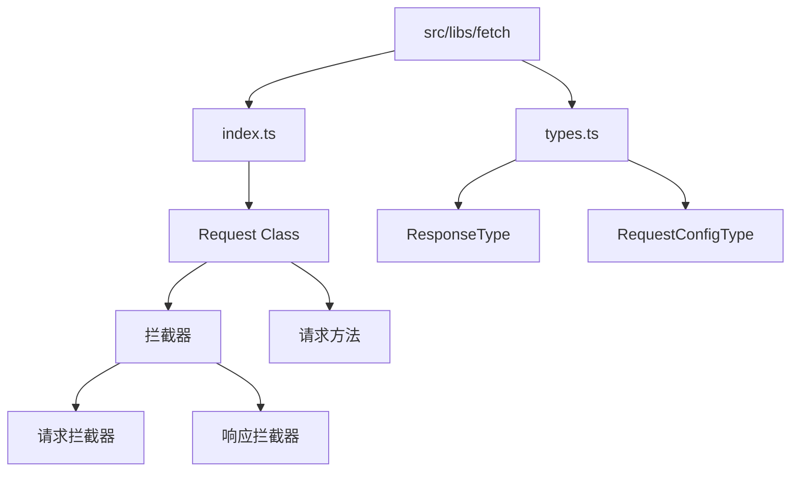
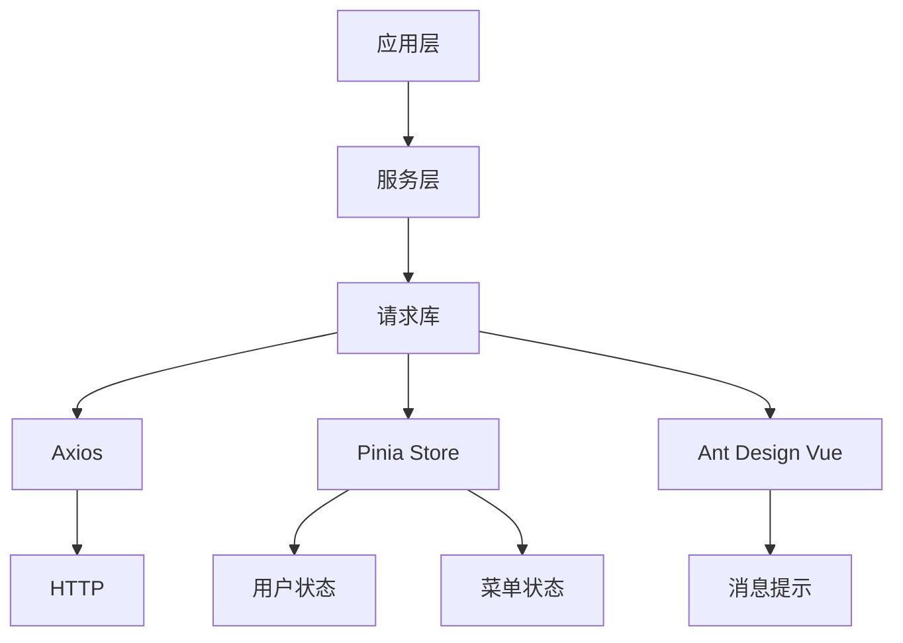
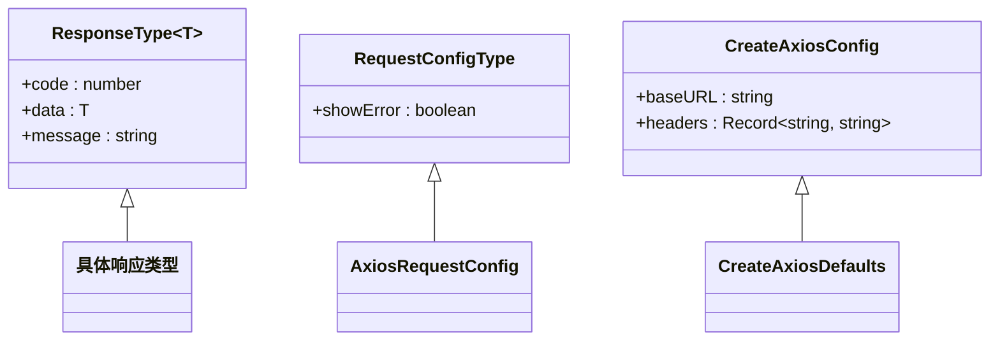
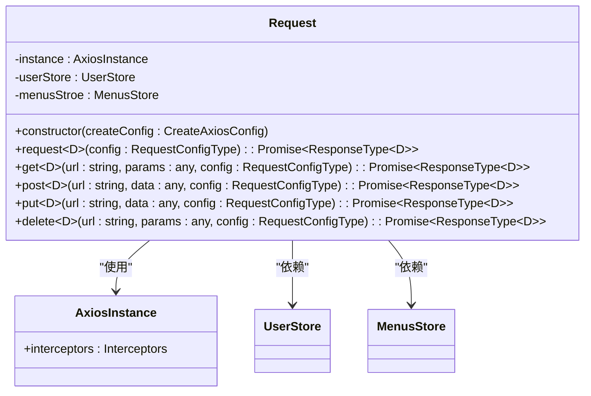
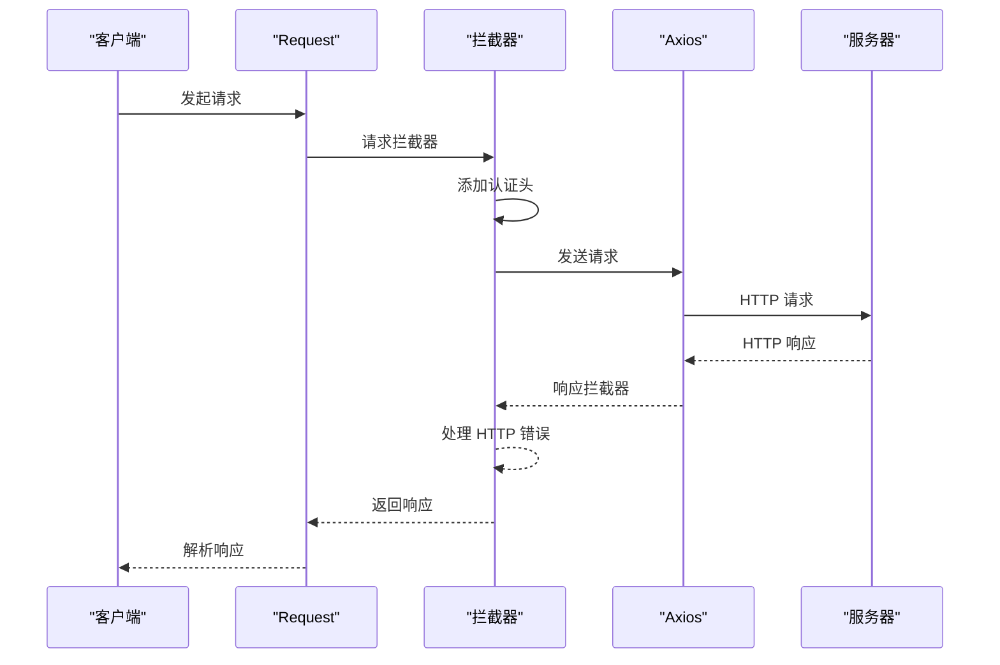
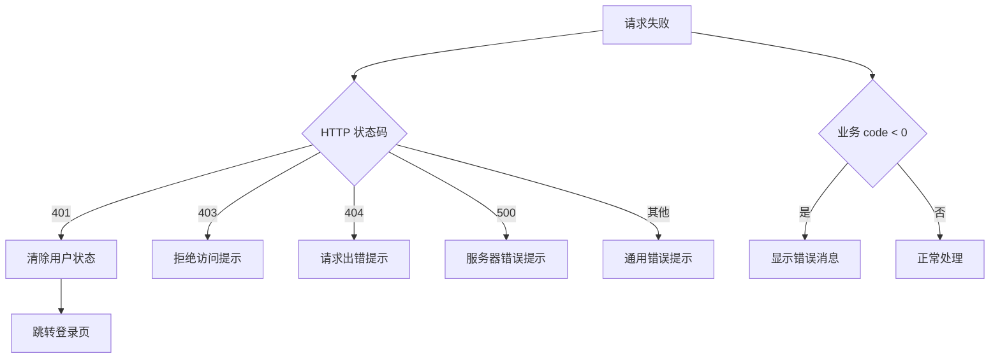
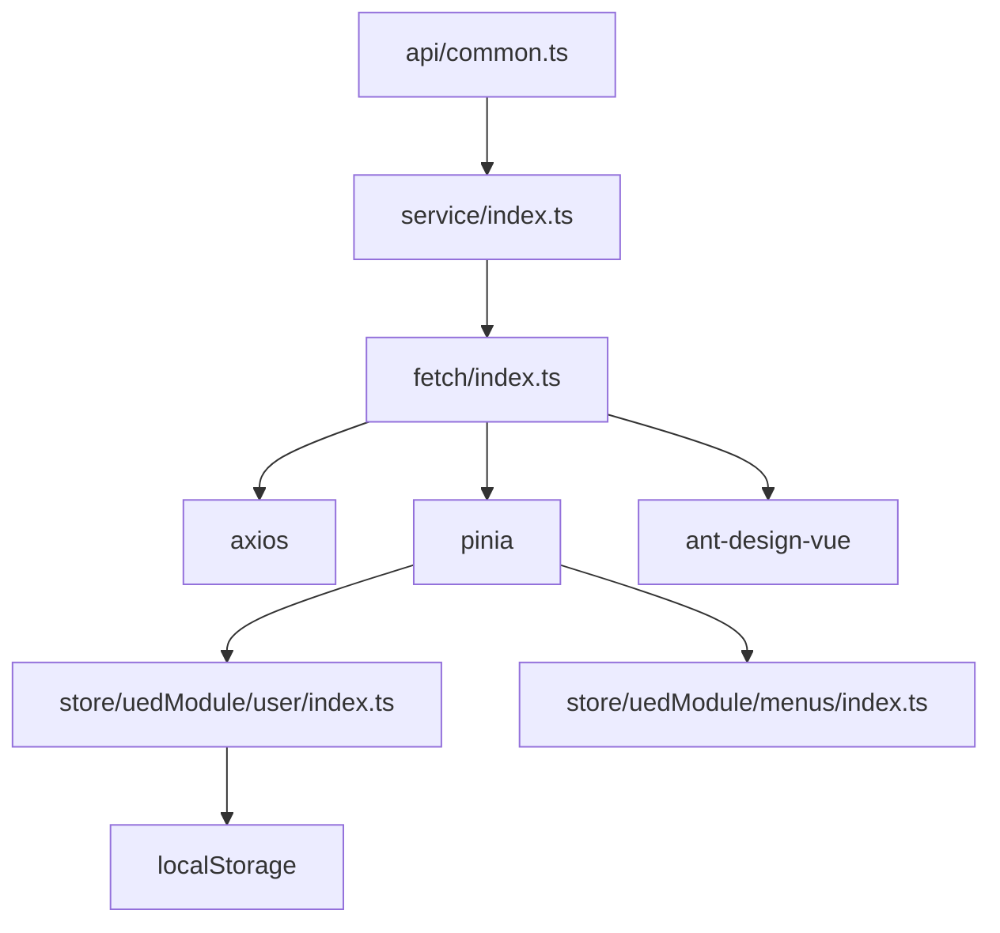

# 工具库结构

<cite>
**本文档中引用的文件**  
- [types.ts](file://src/libs/fetch/types.ts)
- [index.ts](file://src/libs/fetch/index.ts)
- [service/index.ts](file://src/service/index.ts)
- [api/common.ts](file://src/api/common.ts)
- [store/uedModule/user/index.ts](file://src/store/uedModule/user/index.ts)
- [store/index.ts](file://src/store/index.ts)
- [mock-server.js](file://mock-server.js)
</cite>

## 目录
1. [简介](#简介)
2. [项目结构](#项目结构)
3. [核心组件](#核心组件)
4. [架构概述](#架构概述)
5. [详细组件分析](#详细组件分析)
6. [依赖分析](#依赖分析)
7. [性能考虑](#性能考虑)
8. [故障排除指南](#故障排除指南)
9. [结论](#结论)

## 简介
本文件详细解析了 `src/libs/fetch` 目录下的 HTTP 请求工具库实现细节。该库基于 Axios 封装，提供了统一的请求客户端设计，支持拦截器链、请求/响应转换、错误统一处理等核心功能。通过类型定义和可扩展设计，该工具库实现了良好的类型安全性和灵活性，适用于复杂的企业级前端应用。

## 项目结构
`fetch` 工具库位于 `src/libs/fetch` 目录下，包含两个核心文件：
- `index.ts`：请求客户端主实现
- `types.ts`：类型契约定义

该结构遵循了模块化设计原则，将类型定义与实现分离，提高了代码的可维护性和可读性。

**图示来源**
- [index.ts](file://src/libs/fetch/index.ts)
- [types.ts](file://src/libs/fetch/types.ts)

**本节来源**
- [index.ts](file://src/libs/fetch/index.ts)
- [types.ts](file://src/libs/fetch/types.ts)

## 核心组件
`fetch` 工具库的核心是一个名为 `Request` 的类，它封装了 Axios 实例并提供了增强的 HTTP 请求功能。该类通过拦截器实现了自动认证、错误处理等关键特性。

**本节来源**
- [index.ts](file://src/libs/fetch/index.ts#L1-L140)

## 架构概述
该请求库采用分层架构设计，底层基于 Axios，上层通过封装提供更友好的 API 和增强功能。

**图示来源**
- [index.ts](file://src/libs/fetch/index.ts#L1-L140)
- [service/index.ts](file://src/service/index.ts#L1-L11)

## 详细组件分析

### 请求类型契约分析
`types.ts` 文件定义了请求和响应的核心类型契约，确保了类型安全。

**图示来源**
- [types.ts](file://src/libs/fetch/types.ts#L1-L15)

**本节来源**
- [types.ts](file://src/libs/fetch/types.ts#L1-L15)

### 请求客户端实现分析
`Request` 类是整个工具库的核心，实现了完整的 HTTP 客户端功能。

**图示来源**
- [index.ts](file://src/libs/fetch/index.ts#L14-L140)

**本节来源**
- [index.ts](file://src/libs/fetch/index.ts#L1-L140)

### 拦截器链分析
请求库通过 Axios 拦截器实现了请求/响应的预处理和后处理。

**图示来源**
- [index.ts](file://src/libs/fetch/index.ts#L14-L59)

**本节来源**
- [index.ts](file://src/libs/fetch/index.ts#L14-L59)

### 错误统一处理分析
请求库实现了全面的错误处理机制，包括 HTTP 状态码处理和业务错误处理。

**图示来源**
- [index.ts](file://src/libs/fetch/index.ts#L30-L59)
- [index.ts](file://src/libs/fetch/index.ts#L82-L95)

**本节来源**
- [index.ts](file://src/libs/fetch/index.ts#L30-L59)
- [index.ts](file://src/libs/fetch/index.ts#L82-L95)

## 依赖分析
请求库与其他模块存在明确的依赖关系，形成了完整的调用链。

**图示来源**
- [api/common.ts](file://src/api/common.ts#L1-L355)
- [service/index.ts](file://src/service/index.ts#L1-L11)
- [index.ts](file://src/libs/fetch/index.ts#L1-L140)
- [store/index.ts](file://src/store/index.ts#L1-L13)

**本节来源**
- [api/common.ts](file://src/api/common.ts#L1-L355)
- [service/index.ts](file://src/service/index.ts#L1-L11)

## 性能考虑
虽然请求库本身不直接涉及性能优化，但其设计考虑了以下性能相关因素：
- 通过拦截器避免了重复的认证逻辑
- 统一的错误处理减少了错误处理代码的重复
- 类型安全减少了运行时错误的可能性

## 故障排除指南
### 常见问题及解决方案
1. **请求未携带认证头**
   - 检查 `userStore` 中的 `token` 是否正确设置
   - 确认 Pinia store 已正确初始化

2. **401 错误后未跳转登录页**
   - 检查路由配置是否正确
   - 确认 `router.replace('/login')` 能正常执行

3. **错误消息未显示**
   - 检查 `ant-design-vue` 的 `message` 组件是否正确导入
   - 确认网络请求确实返回了错误状态

**本节来源**
- [index.ts](file://src/libs/fetch/index.ts#L30-L59)
- [index.ts](file://src/libs/fetch/index.ts#L82-L95)
- [store/uedModule/user/index.ts](file://src/store/uedModule/user/index.ts#L1-L62)

## 结论
`fetch` 工具库通过封装 Axios，提供了一个功能完整、类型安全的 HTTP 请求客户端。其核心特性包括：
- 基于拦截器的认证机制
- 统一的错误处理
- 友好的 API 封装
- 良好的类型定义

该设计模式可作为企业级前端项目的标准请求库实现参考。