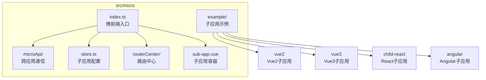
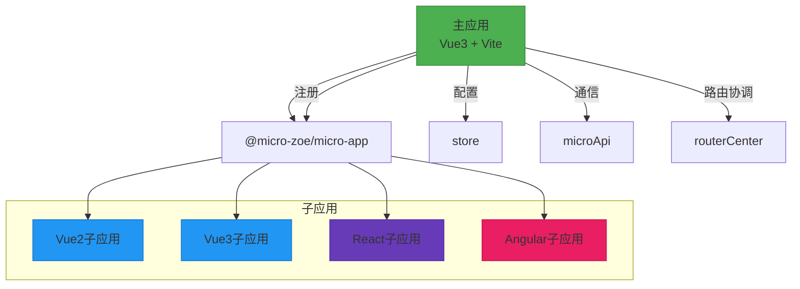
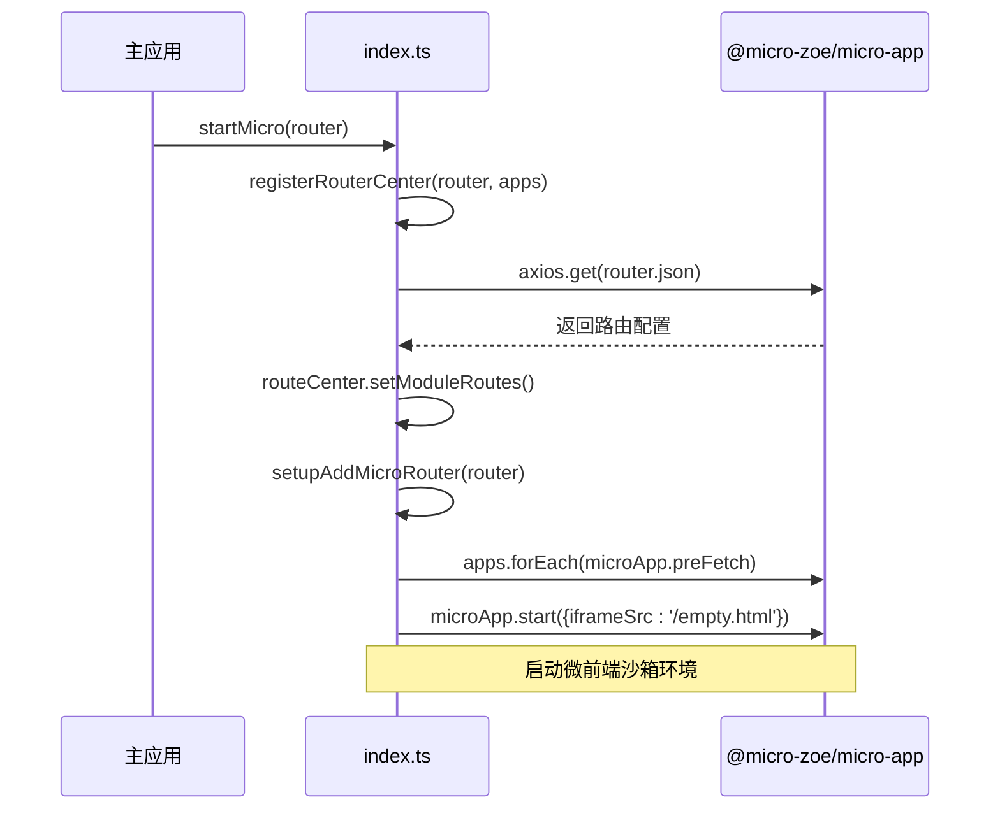
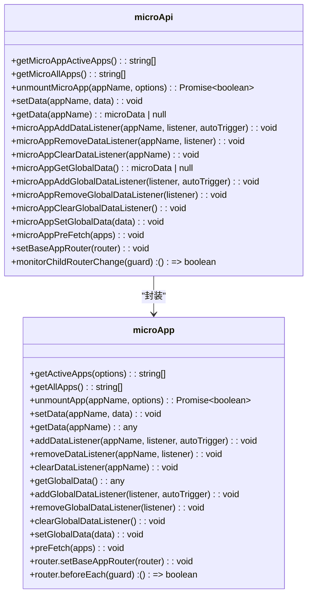
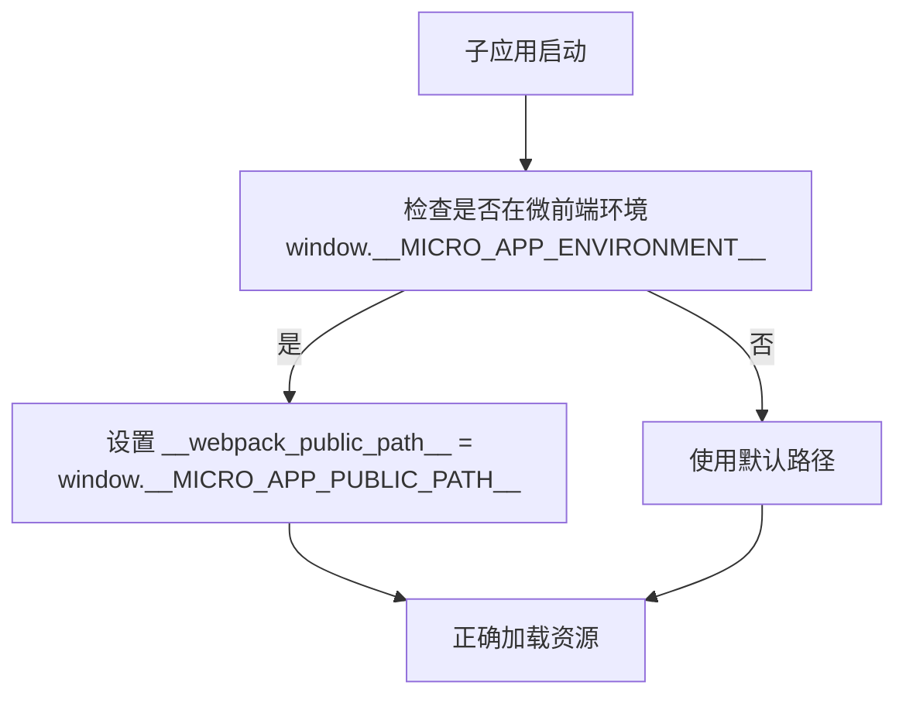
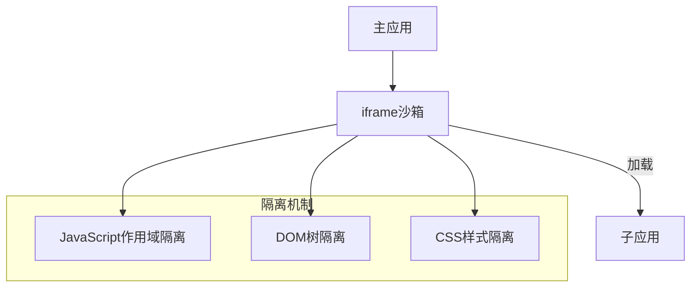
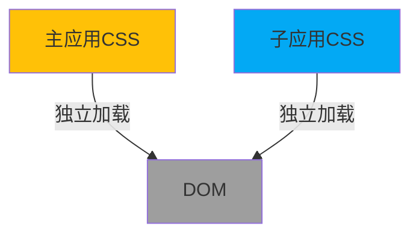
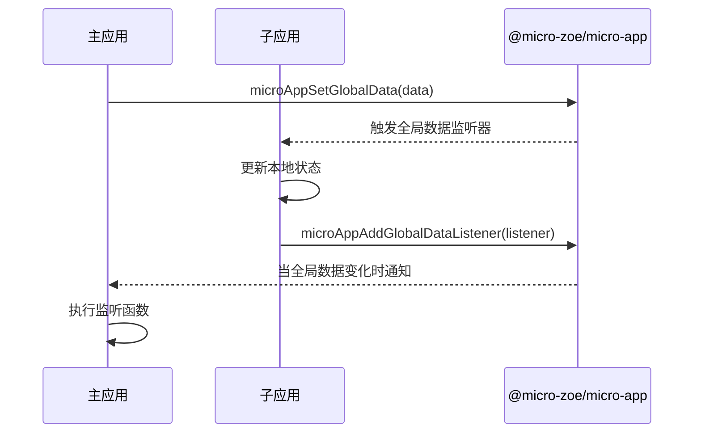
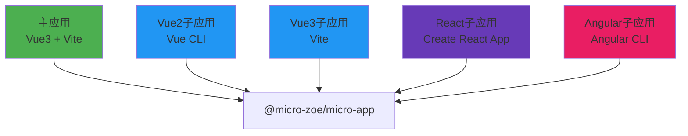

# 微前端结构

<cite>
**本文档中引用的文件**
- [index.ts](file://src/micro/index.ts)
- [microApi/index.ts](file://src/micro/microApi/index.ts)
- [store.ts](file://src/micro/store.ts)
- [sub-app.vue](file://src/micro/sub-app.vue)
- [vue3/src/main.js](file://src/micro/example/vue3/src/main.js)
- [child-react/src/public-path.js](file://src/micro/example/child-react/src/public-path.js)
- [vue3/src/public-path.js](file://src/micro/example/vue3/src/public-path.js)
- [vue3/package.json](file://src/micro/example/vue3/package.json)
- [child-react/package.json](file://src/micro/example/child-react/package.json)
- [vue2/package.json](file://src/micro/example/vue2/package.json)
- [angular/package.json](file://src/micro/example/angular/package.json)
</cite>

## 目录
1. [简介](#简介)
2. [项目结构](#项目结构)
3. [核心组件](#核心组件)
4. [架构概览](#架构概览)
5. [详细组件分析](#详细组件分析)
6. [依赖分析](#依赖分析)
7. [性能考虑](#性能考虑)
8. [故障排除指南](#故障排除指南)
9. [结论](#结论)

## 简介
本文档深入解析了基于 `@micro-zoe/micro-app` 的微前端架构实现。该架构支持多技术栈子应用（Vue2、Vue3、React、Angular）的集成，通过主应用统一管理子应用的注册、生命周期、路由协调和状态同步。文档重点分析了微应用注册与生命周期管理机制、跨应用通信API、不同技术栈子应用的集成方式、运行时路径处理、沙箱隔离策略和样式冲突解决方案。

## 项目结构
`src/micro` 目录是微前端架构的核心，包含主应用对子应用的管理逻辑和多个子应用示例。



**Diagram sources**
- [index.ts](file://src/micro/index.ts)
- [store.ts](file://src/micro/store.ts)

**Section sources**
- [index.ts](file://src/micro/index.ts)
- [store.ts](file://src/micro/store.ts)

## 核心组件
微前端架构的核心组件包括：
- **微应用注册与生命周期管理**：由 `index.ts` 文件实现，负责启动微前端框架并注册子应用。
- **跨应用通信API**：由 `microApi/index.ts` 文件提供，包括数据共享、事件总线和全局状态管理。
- **子应用状态管理**：由 `store.ts` 文件定义，使用Pinia存储子应用的配置信息。
- **路由中心**：由 `routerCenter/index.ts` 实现，协调主应用与子应用之间的路由。

**Section sources**
- [index.ts](file://src/micro/index.ts)
- [microApi/index.ts](file://src/micro/microApi/index.ts)
- [store.ts](file://src/micro/store.ts)
- [routerCenter/index.ts](file://src/micro/routerCenter/index.ts)

## 架构概览
该微前端架构采用主从模式，主应用作为基座，负责加载和管理多个独立开发、独立部署的子应用。



**Diagram sources**
- [index.ts](file://src/micro/index.ts)
- [microApi/index.ts](file://src/micro/microApi/index.ts)
- [store.ts](file://src/micro/store.ts)

## 详细组件分析

### 微应用注册与生命周期管理
`index.ts` 文件是微前端的入口，通过 `startMicro` 函数启动微前端框架。



**Diagram sources**
- [index.ts](file://src/micro/index.ts#L1-L65)

**Section sources**
- [index.ts](file://src/micro/index.ts#L1-L65)

### 跨应用通信API
`microApi/index.ts` 文件封装了 `@micro-zoe/micro-app` 提供的API，实现跨应用通信。



**Diagram sources**
- [microApi/index.ts](file://src/micro/microApi/index.ts#L1-L136)

**Section sources**
- [microApi/index.ts](file://src/micro/microApi/index.ts#L1-L136)

### 不同技术栈子应用集成

#### Vue3子应用集成
Vue3子应用通过Vite构建，其 `main.js` 文件是入口点。

```javascript
import { createApp } from 'vue';
import App from './App.vue';
import router from './router';
import './style.css';

createApp(App).use(router).mount('#app');
```

**Section sources**
- [vue3/src/main.js](file://src/micro/example/vue3/src/main.js#L1-L12)

#### React子应用集成
React子应用通过Create React App构建，其 `public-path.js` 文件处理运行时路径。

```javascript
if (window.__MICRO_APP_ENVIRONMENT__) {
  // eslint-disable-next-line
  __webpack_public_path__ = window.__MICRO_APP_PUBLIC_PATH__
}
```

**Section sources**
- [child-react/src/public-path.js](file://src/micro/example/child-react/src/public-path.js#L1-L4)

### 运行时路径处理
子应用通过 `public-path.js` 文件动态设置 `__webpack_public_path__`，确保在微前端环境中资源正确加载。



**Diagram sources**
- [child-react/src/public-path.js](file://src/micro/example/child-react/src/public-path.js#L1-L4)
- [vue3/src/public-path.js](file://src/micro/example/vue3/src/public-path.js#L1-L4)

**Section sources**
- [child-react/src/public-path.js](file://src/micro/example/child-react/src/public-path.js#L1-L4)
- [vue3/src/public-path.js](file://src/micro/example/vue3/src/public-path.js#L1-L4)

### 沙箱隔离策略
微前端框架通过 `microApp.start({iframeSrc: '/empty.html'})` 启动沙箱环境，`empty.html` 文件提供一个纯净的iframe上下文，实现JS和DOM的隔离。



**Diagram sources**
- [index.ts](file://src/micro/index.ts#L63-L65)

**Section sources**
- [index.ts](file://src/micro/index.ts#L63-L65)

### 样式冲突解决方案
该架构通过以下方式解决样式冲突：
1. **子应用独立CSS文件**：每个子应用打包成独立的CSS文件，减少全局污染。
2. **CSS作用域**：Vue子应用使用 `<style scoped>`，React子应用使用CSS Modules。
3. **主应用样式隔离**：主应用和子应用的样式文件分开加载，避免相互影响。



**Section sources**
- [vue3/package.json](file://src/micro/example/vue3/package.json)
- [child-react/package.json](file://src/micro/example/child-react/package.json)

### 主子应用间状态同步最佳实践
通过 `microApi` 提供的全局数据API实现主子应用间状态同步。



**Diagram sources**
- [microApi/index.ts](file://src/micro/microApi/index.ts#L100-L130)

**Section sources**
- [microApi/index.ts](file://src/micro/microApi/index.ts#L100-L130)

## 依赖分析
各子应用使用不同的技术栈和构建工具，但都通过 `@micro-zoe/micro-app` 与主应用通信。



**Diagram sources**
- [vue3/package.json](file://src/micro/example/vue3/package.json)
- [child-react/package.json](file://src/micro/example/child-react/package.json)
- [vue2/package.json](file://src/micro/example/vue2/package.json)
- [angular/package.json](file://src/micro/example/angular/package.json)

**Section sources**
- [vue3/package.json](file://src/micro/example/vue3/package.json)
- [child-react/package.json](file://src/micro/example/child-react/package.json)
- [vue2/package.json](file://src/micro/example/vue2/package.json)
- [angular/package.json](file://src/micro/example/angular/package.json)

## 性能考虑
- **预加载**：通过 `microApp.preFetch` 预加载子应用，提升用户体验。
- **按需加载**：子应用在需要时才加载，减少初始加载时间。
- **资源隔离**：每个子应用独立打包，避免资源冗余。

## 故障排除指南
- **子应用无法加载**：检查 `apps` 配置中的 `url` 是否正确，确保子应用服务已启动。
- **样式冲突**：确保子应用使用了CSS作用域或CSS Modules。
- **通信失败**：检查 `microApp` 是否已正确启动，监听器是否正确注册。

**Section sources**
- [index.ts](file://src/micro/index.ts)
- [microApi/index.ts](file://src/micro/microApi/index.ts)

## 结论
该微前端架构成功实现了多技术栈子应用的集成，通过 `@micro-zoe/micro-app` 提供了完善的沙箱隔离、跨应用通信和路由协调机制。主应用通过 `store.ts` 统一管理子应用配置，通过 `microApi` 封装通信API，降低了集成复杂度。各子应用通过 `public-path.js` 处理运行时路径，确保在微前端环境中正常运行。整体架构清晰，扩展性强，适合大型复杂应用的微前端改造。