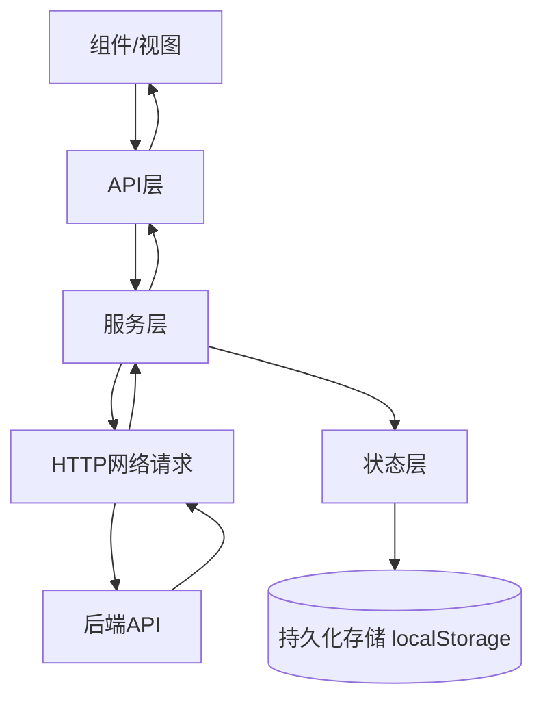
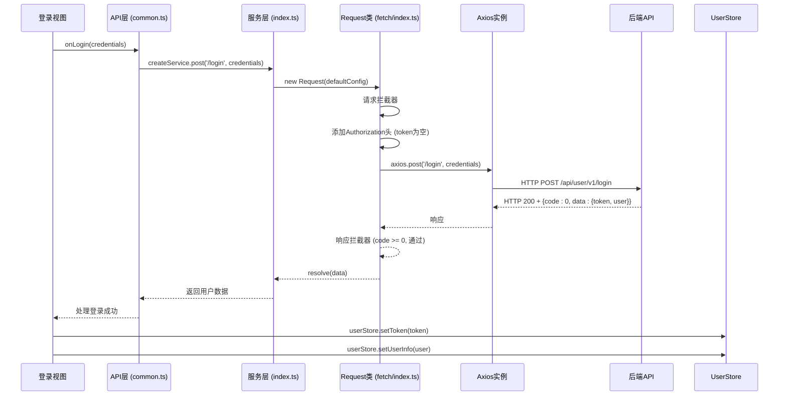

# 服务层结构

<cite>
**本文档中引用的文件**  
- [index.ts](file://src/service/index.ts#L1-L12)
- [common.ts](file://src/api/common.ts#L1-L355)
- [index.ts](file://src/libs/fetch/index.ts#L1-L140)
- [types.ts](file://src/libs/fetch/types.ts#L1-L16)
- [index.ts](file://src/store/index.ts#L1-L13)
- [index.ts](file://src/store/uedModule/user/index.ts#L1-L62)
- [index.ts](file://src/store/uedModule/menus/index.ts#L1-L138)
- [guard.ts](file://src/router/guard.ts#L1-L65)
</cite>

## 目录

1. [服务层结构](#服务层结构)
2. [服务层组织结构与依赖注入](#服务层组织结构与依赖注入)
3. [服务层与API层、状态层的协作模式](#服务层与api层状态层的协作模式)
4. [服务模块划分与命名规范](#服务模块划分与命名规范)
5. [服务实例获取与调用链路](#服务实例获取与调用链路)
6. [单元测试与模拟策略](#单元测试与模拟策略)

## 服务层组织结构与依赖注入

`src/service/index.ts` 文件是整个项目服务层的核心入口，负责创建和导出统一的网络请求服务实例。该文件通过 `createService` 工厂函数封装了底层请求库的初始化逻辑，实现了配置集中化与实例单例化。

```typescript
import Request from '@/libs/fetch';

function createService() {
  const defaultConfig = {
    baseURL: process.env.API_BASE_PATH || '/',
    timeout: Number(process.env.TIME_OUT || 1000 * 60)
  };
  const request = new Request(defaultConfig);
  return request;
}

export default createService();
```

该设计体现了典型的依赖注入（Dependency Injection）模式：
- **依赖抽象**：`Request` 类封装了底层 `axios` 实例及其拦截器逻辑，作为可注入的服务依赖。
- **配置注入**：通过 `defaultConfig` 对象将环境变量（如 `API_BASE_PATH` 和 `TIME_OUT`）注入到服务实例中，实现运行时配置解耦。
- **单例输出**：`createService()` 函数在模块加载时立即执行，返回一个全局唯一的请求实例，确保整个应用使用一致的网络配置。

此机制有效管理了服务的生命周期——服务实例在应用启动时创建，伴随应用整个生命周期存在，避免了重复初始化开销。

**Section sources**
- [index.ts](file://src/service/index.ts#L1-L12)

## 服务层与API层、状态层的协作模式

服务层、API层和状态层共同构成了前端应用的数据处理核心，三者通过清晰的职责划分和紧密的协作实现高效的数据流管理。

### 协作架构图



**Diagram sources**
- [index.ts](file://src/service/index.ts#L1-L12)
- [common.ts](file://src/api/common.ts#L1-L355)
- [index.ts](file://src/libs/fetch/index.ts#L1-L140)
- [index.ts](file://src/store/uedModule/user/index.ts#L1-L62)

### API层调用服务层

API层位于 `src/api/` 目录下，其职责是定义具体的业务接口。它直接导入并使用服务层提供的 `createService` 实例发起网络请求。

以 `src/api/common.ts` 中的登录接口为例：

```typescript
import createService from '@/service';

export async function onLogin(data: any): Promise<any> {
  return createService.post('/api/user/v1/login', data);
}
```

API层通过调用服务实例的 `post`、`get` 等方法，将业务请求转发给服务层。这实现了业务逻辑与网络传输细节的分离。

### 服务层集成状态层

服务层（`Request` 类）在 `src/libs/fetch/index.ts` 中直接依赖状态层（Pinia store），实现了请求拦截器中的状态驱动逻辑。

```typescript
import pinia, { useUserStore, useMenusStore } from '@/store';

export default class Request {
  private instance: AxiosInstance;
  private userStore = useUserStore(pinia); // 注入用户状态
  private menusStroe = useMenusStore(pinia); // 注入菜单状态

  constructor(createConfig: CreateAxiosConfig) {
    // 请求拦截器：自动添加认证Token
    this.instance.interceptors.request.use((config) => {
      const { token } = this.userStore;
      if (token) {
        config.headers.Authorization = `Bearer ${token}`;
      }
      return config;
    });

    // 响应拦截器：处理全局错误与状态重置
    this.instance.interceptors.response.use(
      (res) => res,
      (err) => {
        switch (err.response.status) {
          case 401:
            message.error('未授权，请重新登录(401)');
            this.userStore.reset(); // 清除用户状态
            this.menusStroe.reset(); // 清除菜单状态
            router.replace('/login'); // 跳转登录页
            break;
          // ... 其他错误处理
        }
        return Promise.reject(err);
      }
    );
  }
}
```

此设计体现了服务层对状态层的深度集成：
- **请求增强**：从 `userStore` 获取 `token` 并自动注入到请求头，实现无感认证。
- **状态联动**：当收到401未授权响应时，服务层主动调用 `userStore.reset()` 和 `menusStroe.reset()` 清除本地状态，保证应用状态一致性。

### 状态层初始化依赖API层

状态层的初始化过程也依赖API层获取数据。例如，在路由守卫 `src/router/guard.ts` 中：

```typescript
import { getMenus, getPermissions } from '@/api/common';
import { useMenusStore, useUserStore } from '@/store';

router.beforeEach(async (to, _, next) => {
  const userStore = useUserStore();
  const menusStore = useMenusStore();

  if (userStore.token) {
    // 若未获取菜单，则调用API层获取
    if (!menusStore.menusData.length) {
      const menusData = await getMenus();
      menusStore.setMenus(menusData);
    }
    // 若未获取权限，则调用API层获取
    if (!userStore.permissionIds.length) {
      const permissionIds = await getPermissions();
      userStore.setPermissionIds(permissionIds);
    }
  }
});
```

这形成了一个闭环：**组件 -> API层 -> 服务层 -> 状态层 -> 组件**。状态层作为数据的“单一可信来源”，由API层和守卫逻辑负责填充和更新。

**Section sources**
- [common.ts](file://src/api/common.ts#L1-L355)
- [index.ts](file://src/libs/fetch/index.ts#L1-L140)
- [index.ts](file://src/store/index.ts#L1-L13)
- [index.ts](file://src/store/uedModule/user/index.ts#L1-L62)
- [index.ts](file://src/store/uedModule/menus/index.ts#L1-L138)
- [guard.ts](file://src/router/guard.ts#L1-L65)

## 服务模块划分与命名规范

本项目的服务层采用极简的模块划分策略，体现了“少即是多”的设计哲学。

### 模块划分原则

1.  **单一职责**：`src/service/index.ts` 仅负责创建和导出一个全局的、配置统一的网络请求服务实例。所有网络请求都通过这个单一入口发出。
2.  **关注点分离**：将“请求配置与实例化”（服务层）与“业务接口定义”（API层）分离。API层按业务领域（如 `common.ts`, `drillRecords.ts`）进行文件划分，而服务层保持通用性。
3.  **避免过度设计**：没有为每个业务域创建独立的服务类，而是通过API层的函数来组织业务逻辑，降低了架构复杂度。

### 命名规范

- **文件命名**：服务层核心文件命名为 `index.ts`，符合其作为模块入口的定位。API层文件采用 `功能名.ts` 的命名方式（如 `common.ts`），清晰表达其业务范畴。
- **函数命名**：API层函数采用 `动词+名词` 的语义化命名，如 `getMenus()`, `onLogin()`, `getCaptcha()`，直观地描述了其功能。
- **类命名**：底层请求库命名为 `Request`，简洁明了地表达了其核心作用。

这种划分和命名方式极大地支持了业务功能的可扩展性：
- **添加新业务**：只需在 `src/api/` 目录下创建新的 `.ts` 文件，并在其中导入 `createService` 来定义新的API函数，无需修改服务层核心代码。
- **修改网络库**：如果需要更换底层HTTP库（如从axios切换到fetch），只需修改 `src/libs/fetch/index.ts` 中的 `Request` 类实现，上层API和业务代码几乎无需改动。

**Section sources**
- [index.ts](file://src/service/index.ts#L1-L12)
- [common.ts](file://src/api/common.ts#L1-L355)

## 服务实例获取与调用链路

### 服务实例获取方式

服务实例的获取方式非常直接且统一：

1.  **导入**：任何需要发起网络请求的模块（通常是API层）只需通过 `import createService from '@/service';` 导入。
2.  **使用**：直接调用 `createService` 返回的实例上的方法（`get`, `post`, `put`, `delete`）。

```typescript
// 在 src/api/anyModule.ts 中
import createService from '@/service';

// 发起一个GET请求
const result = await createService.get('/api/data', { id: 1 });
```

由于 `createService` 是一个立即执行的工厂函数并导出单例，因此所有导入它的模块都共享同一个服务实例，保证了配置和拦截器的全局一致性。

### 典型服务调用链路

以用户登录为例，完整的调用链路如下：



**Diagram sources**
- [index.ts](file://src/service/index.ts#L1-L12)
- [common.ts](file://src/api/common.ts#L1-L355)
- [index.ts](file://src/libs/fetch/index.ts#L1-L140)

**Section sources**
- [index.ts](file://src/service/index.ts#L1-L12)
- [common.ts](file://src/api/common.ts#L1-L355)
- [index.ts](file://src/libs/fetch/index.ts#L1-L140)

## 单元测试与模拟策略

虽然项目中未直接提供服务层的测试文件，但基于其设计，可以制定有效的测试策略。

### 单元测试目标

1.  **测试API层函数**：验证API层函数是否正确地调用了服务实例的方法，并传递了正确的参数。
2.  **测试服务层拦截器**：验证请求拦截器是否正确添加了Token，响应拦截器是否能正确处理各种HTTP错误码。

### 模拟（Mock）策略

1.  **模拟 `createService` 实例**：
    - 在测试API层时，可以使用 Jest 等测试框架的 `jest.mock('@/service')` 来模拟整个服务模块。
    - 创建一个模拟的 `request` 对象，其 `post`、`get` 等方法返回预设的Promise结果。
    - 断言这些方法是否被以正确的参数调用。

    ```typescript
    // 示例：测试 onLogin 函数
    import { onLogin } from '@/api/common';
    import createService from '@/service';

    jest.mock('@/service');

    test('onLogin should call service.post with correct url and data', async () => {
      const mockData = { username: 'test', password: '123' };
      const mockResponse = { code: 0, data: { token: 'abc' } };
      (createService.post as jest.Mock).mockResolvedValue(mockResponse);

      const result = await onLogin(mockData);

      expect(createService.post).toHaveBeenCalledWith('/api/user/v1/login', mockData);
      expect(result).toEqual(mockResponse.data);
    });
    ```

2.  **模拟 `useUserStore` 状态**：
    - 在测试服务层拦截器时，需要模拟Pinia store的状态。
    - 可以创建一个模拟的 `userStore` 对象，其 `token` 属性可被测试代码控制。
    - 将这个模拟的store注入到 `Request` 类的实例中，然后触发请求，检查请求头是否包含预期的Token。

这种分层模拟的策略，使得可以独立地测试API层的业务逻辑和服务层的通用行为，确保了代码的可测试性和可靠性。

**Section sources**
- [index.ts](file://src/service/index.ts#L1-L12)
- [common.ts](file://src/api/common.ts#L1-L355)
- [index.ts](file://src/libs/fetch/index.ts#L1-L140)
- [index.ts](file://src/store/uedModule/user/index.ts#L1-L62)