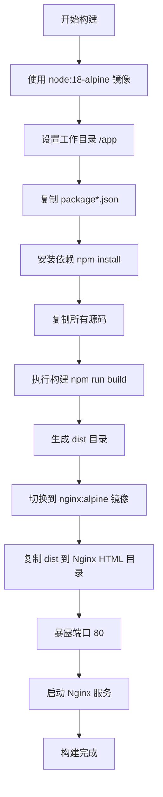
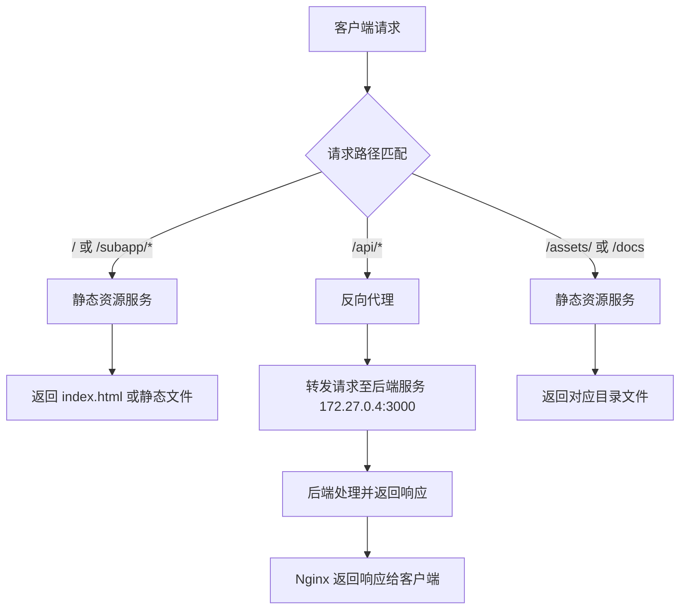
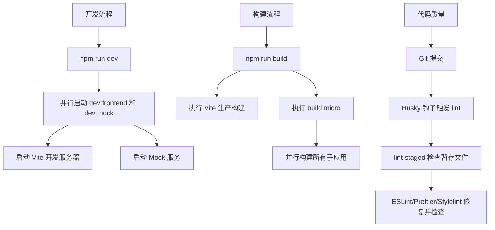

# 根目录文件结构

<cite>
**本文档中引用的文件**  
- [.npmrc](file://.npmrc)
- [Dockerfile](file://Dockerfile)
- [nginx.conf](file://nginx.conf)
- [README.md](file://README.md)
- [package.json](file://package.json)
</cite>

## 目录
1. [项目结构分析](#项目结构分析)
2. [核心配置文件解析](#核心配置文件解析)
3. [.npmrc配置分析](#npmrc配置分析)
4. [Dockerfile多阶段构建策略](#dockerfile多阶段构建策略)
5. [nginx.conf反向代理与静态资源服务](#nginxconf反向代理与静态资源服务)
6. [README.md文档结构与维护规范](#readmemd文档结构与维护规范)
7. [package.json脚本与依赖管理](#packagejson脚本与依赖管理)

## 项目结构分析

本项目采用模块化、分层的前端架构设计，主要包含以下目录结构：

- **configs/**：存放Vite构建配置文件，包括基础、开发、生产、库构建等不同环境的配置
- **das-components-folder/**：组件文档与组件元数据配置
- **public/**：静态资源文件，如HTML模板
- **src/**：源代码主目录，包含API、组件、路由、状态管理等
- **micro/**：微前端子应用及集成相关代码
- 根目录包含Docker、Nginx、包管理等基础设施配置

项目以Vue 3 + TypeScript为核心技术栈，结合Vite构建工具，支持微前端架构，具备完整的国际化、主题定制、权限管理等功能。

**Section sources**
- [package.json](file://package.json#L1-L159)

## 核心配置文件解析

本节将深入分析项目根目录下的关键配置文件，涵盖包管理、容器化部署、服务器配置、项目元信息及文档规范等方面，全面解析其设计原则与实现机制。

## .npmrc配置分析

`.npmrc`文件用于配置npm包管理器的行为，本项目通过该文件指定了私有npm仓库地址，实现依赖包的安全管理和内部分发。

```ini
registry = https://ci.das-security.cn/repository/ah_npm/
```

### 配置说明

- **registry**：指定npm包的下载源为公司内部的私有仓库`https://ci.das-security.cn/repository/ah_npm/`，确保所有依赖包均从受控的内部源获取，提升安全性和稳定性。
- **认证管理**：虽然当前文件未包含认证信息（如`_auth`或`//ci.das-security.cn/:_authToken`），但通常此类私有仓库需要通过npm login或环境变量配置认证令牌，实现安全访问。

该配置确保了项目依赖的一致性和安全性，避免了对外部公共仓库的依赖，符合企业级开发的安全规范。

**Section sources**
- [.npmrc](file://.npmrc#L0-L0)

## Dockerfile多阶段构建策略

Dockerfile采用多阶段构建（Multi-stage Build）策略，有效分离构建环境与运行环境，优化镜像大小并提升安全性。

```dockerfile
# 构建阶段
FROM node:18-alpine as builder

WORKDIR /app
COPY package*.json ./
RUN npm install
COPY . .
RUN npm run build
# 生产阶段
FROM nginx:alpine
COPY --from=builder /app/dist /usr/share/nginx/html/frontend/dist
EXPOSE 80
CMD ["nginx", "-g", "daemon off;"]
```

### 构建阶段（builder）

- **基础镜像**：使用`node:18-alpine`作为构建镜像，Alpine Linux版本体积小，适合构建环境。
- **依赖安装**：先复制`package*.json`并执行`npm install`，利用Docker层缓存机制，仅在依赖变更时重新安装。
- **源码复制与构建**：复制项目源码并执行`npm run build`，生成生产环境的静态资源文件至`dist`目录。

### 生产阶段（运行环境）

- **基础镜像**：使用`nginx:alpine`作为运行时镜像，轻量且专为Web服务优化。
- **资源复制**：通过`COPY --from=builder`仅将构建产物`/app/dist`复制到Nginx的HTML目录，避免将Node.js环境和源码暴露在生产镜像中。
- **端口暴露**：`EXPOSE 80`声明服务端口。
- **启动命令**：以守护进程模式启动Nginx，确保容器持续运行。

### 优势分析

- **镜像优化**：生产镜像不包含Node.js、源码和开发依赖，体积显著减小。
- **安全加固**：运行环境最小化，降低攻击面。
- **职责分离**：构建与运行环境解耦，符合关注点分离原则。



**Diagram sources**
- [Dockerfile](file://Dockerfile#L0-L12)

**Section sources**
- [Dockerfile](file://Dockerfile#L0-L12)

## nginx.conf反向代理与静态资源服务

`nginx.conf`配置文件定义了Web服务器的核心行为，包括静态资源服务、路由重写和反向代理功能。

### 主要配置解析

```nginx
server {
    listen       80;
    listen  [::]:80;
    server_name  localhost;

    set $service_url http://172.27.0.4:3000;

    location / {
        root   /usr/share/nginx/html;
        add_header Access-Control-Allow-Origin *;
        index  index.html index.htm;
        try_files $uri $uri/ /index.html;
    }
    
    location /assets/ {
        alias /usr/share/nginx/html/assets/;
        try_files $uri $uri/ =404;
    }
    
    location /docs {
        alias /usr/share/nginx/html/docs/;
        index index.html index.htm;
        try_files $uri $uri/ =404;   
    }
    
    location  /subapp/vue2 {
        root /usr/share/nginx/html; 
        index  index.html index.htm;
        try_files $uri $uri/ /subapp/vue2/index.html;
    }
    # ... 其他子应用配置类似 ...
    
    location /api {
      proxy_pass $service_url$request_uri;
      proxy_http_version 1.1;
      proxy_set_header Upgrade $http_upgrade;
      proxy_set_header Connection "Upgrade";
      proxy_set_header Host $host;
      proxy_set_header X-Real-IP $remote_addr;
      proxy_set_header X-Forwarded-For $proxy_add_x_forwarded_for;
      proxy_set_header X-Forwarded-Proto $scheme;
      proxy_connect_timeout 6000s;
      proxy_send_timeout 6000s;
      proxy_read_timeout 6000s;
      proxy_buffering off;
      add_header Access-Control-Allow-Origin *;
      add_header Access-Control-Allow-Methods 'GET, POST, OPTIONS';
      add_header Access-Control-Allow-Headers '*';
  }
}
```

### 静态资源服务

- **根路径`/`**：通过`try_files $uri $uri/ /index.html;`实现前端路由的History模式支持，确保刷新页面时正确返回`index.html`。
- **`/assets/`和`/docs`路径**：使用`alias`指令映射到特定目录，`try_files`确保文件不存在时返回404。
- **微前端子应用路径**（如`/subapp/vue2`）：为每个子应用配置独立的`try_files`规则，指向各自的`index.html`，实现子应用的独立路由。

### 反向代理配置

- **`/api`路径**：将所有以`/api`开头的请求代理到后端服务`http://172.27.0.4:3000`。
- **WebSocket支持**：通过`proxy_http_version 1.1`和`Upgrade`头部支持WebSocket连接。
- **请求头转发**：设置`Host`、`X-Real-IP`等头部，确保后端能获取真实客户端信息。
- **超时设置**：长超时时间（6000秒）适应可能的长连接或大文件传输。
- **跨域支持**：通过`add_header`指令允许所有来源的跨域请求，适用于开发环境。



**Diagram sources**
- [nginx.conf](file://nginx.conf#L0-L102)

**Section sources**
- [nginx.conf](file://nginx.conf#L0-L102)

## README.md文档结构与维护规范

`README.md`是项目的入门文档，提供了项目概览、功能清单、使用指南等关键信息。

### 文档结构分析

- **项目标题**：`VUE3-TS-TEMPLATE`，明确技术栈。
- **待办事项（todo）**：以复选框形式列出项目已完成和待完成的功能，如Vue3、TypeScript、微前端等，直观展示项目进度。
- **已知bug**：列出已知问题，如VSCode校验规则与提交校验不一致。
- **使用文档**：提供外部Wiki链接，指向详细的开发文档、Q&A和工程结构说明，实现文档解耦。
- **UI KIT图标**：详细说明图标库（iconfont）的使用方法，包括类名修改和下拉箭头替换。
- **主题使用方式**：指导如何引入Ant Design Vue的样式和主题变量。
- **请求使用方式**：提供国际化文档链接。

### 维护规范

- **外部化详细文档**：将详细的开发文档托管在Wiki系统，保持README简洁。
- **进度可视化**：使用复选框清晰展示功能完成情况。
- **配置指导**：对关键配置（如图标、主题）提供具体代码示例。

该README结构清晰，重点突出，有效引导开发者快速上手。

**Section sources**
- [README.md](file://README.md#L0-L79)

## package.json脚本与依赖管理

`package.json`是项目的元数据和依赖管理核心文件。

### 元信息

- **name**: `vue3-ts-vite-project`，项目名称。
- **version**: `1.0.0`，版本号。
- **description**: `智启vue3开发模板`，项目描述。
- **author**: 空，需补充。
- **license**: `MIT`，开源协议。

### 脚本命令（scripts）

- **`start`**: 调用`dev`，符合常规。
- **`dev`**: 并行执行`dev:frontend`和`dev:mock`，实现前端开发服务器与Mock服务同时启动。
- **`dev:frontend`**: 使用Vite启动开发服务器，指定开发配置文件。
- **`dev:mock`**: 启动`mock-server.js`，提供模拟API。
- **`build`**: 设置生产环境变量，使用Vite进行生产构建，并执行`build:micro`。
- **`lint`**: 执行`lint-staged`，对暂存区文件进行代码检查。
- **`lint-fix`**: 自动修复代码格式问题。
- **`prepare`**: 安装Husky Git钩子，实现提交前检查。
- **`i18n:*`**: 一系列国际化相关命令，用于初始化、提取、翻译等。
- **`bootstrap`**: 安装主项目及所有子应用依赖。
- **`start:micro` 和 `build:micro`**: 并行启动和构建所有微前端子应用。
- **`install:*`, `start-child:*`, `build-child:*`**: 针对不同子应用（Vue2, Vue3, React, Angular）的安装、启动和构建命令，体现微前端架构支持。

### 依赖管理

- **dependencies**: 列出生产依赖，包括Vue 3、Pinia、Ant Design Vue、Axios、ECharts等。
- **devDependencies**: 列出开发依赖，包括Vite、TypeScript、ESLint、Prettier、Husky、Commitlint等。
- **lint-staged**: 配置在Git暂存区文件上运行的代码质量工具。
- **resolutions**: 强制指定某些依赖的版本（如`strip-ansi`），解决依赖冲突。

### 配置原则

- **自动化**：通过脚本自动化开发、构建、代码检查等流程。
- **微前端支持**：提供对多框架子应用的完整生命周期管理命令。
- **代码质量**：集成Linting、格式化和Git钩子，保障代码规范。
- **模块化**：依赖清晰分类，便于维护。



**Diagram sources**
- [package.json](file://package.json#L0-L158)

**Section sources**
- [package.json](file://package.json#L0-L158)