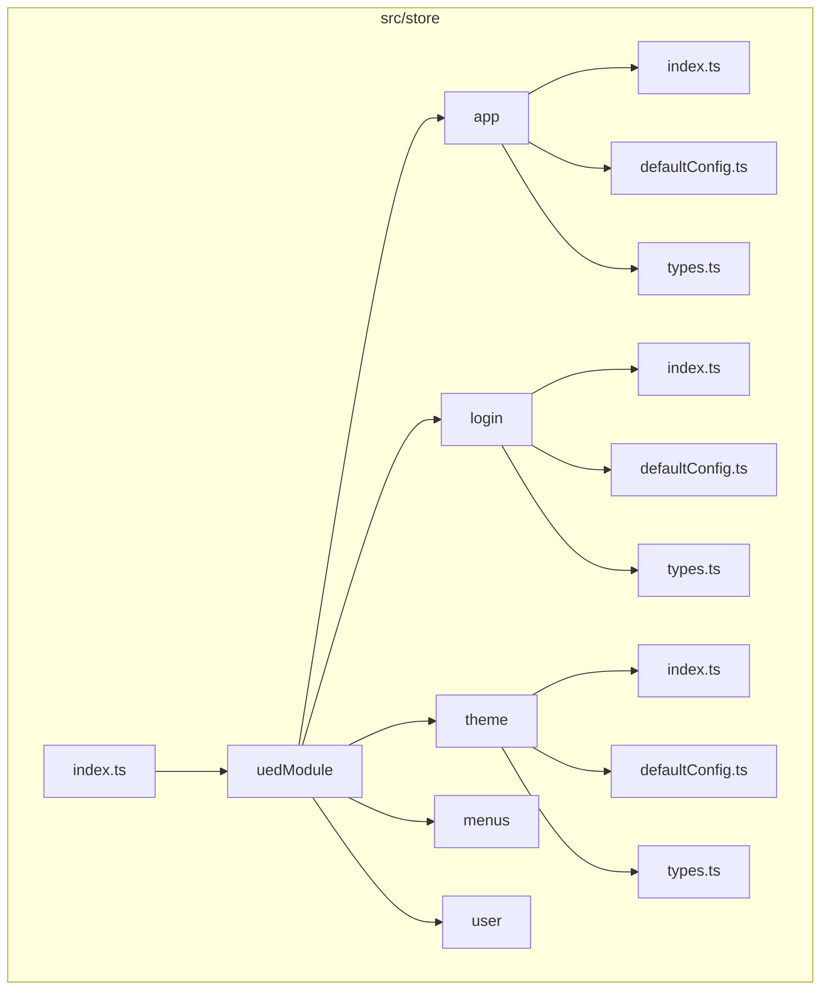
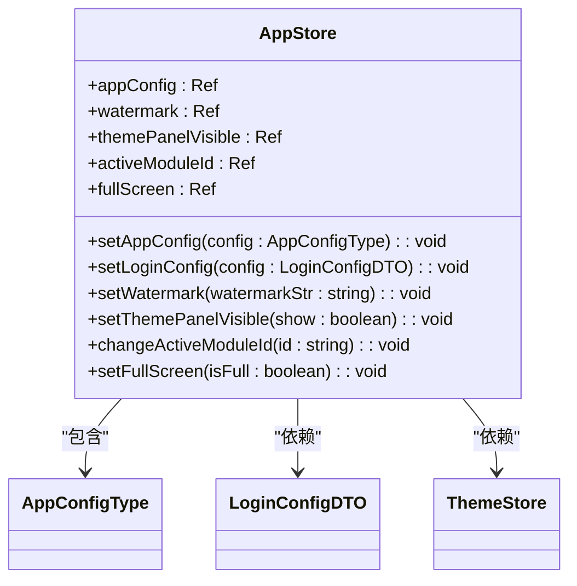
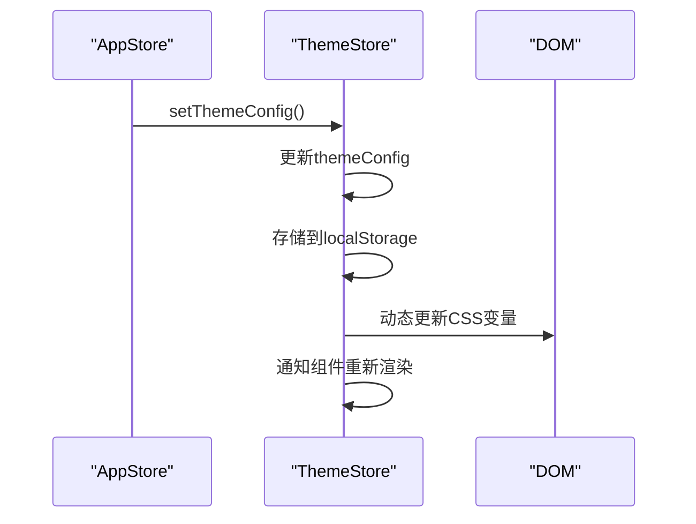
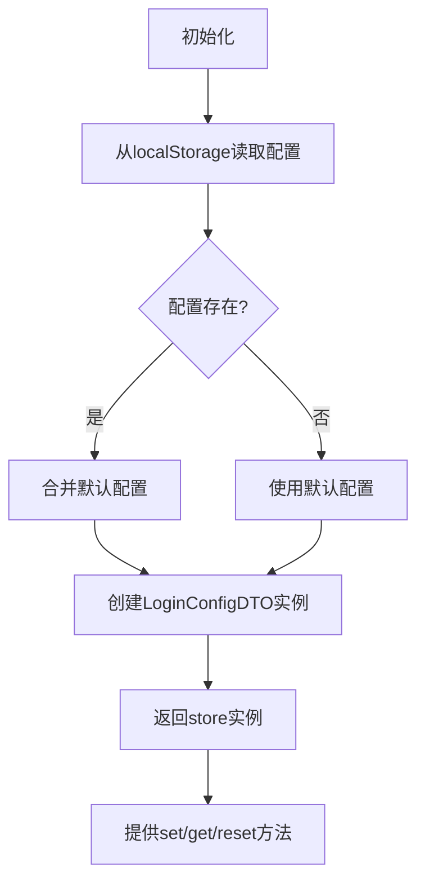

# 状态管理结构

<cite>
**本文档引用的文件**  
- [index.ts](file://src/store/index.ts)
- [app/index.ts](file://src/store/uedModule/app/index.ts)
- [app/defaultConfig.ts](file://src/store/uedModule/app/defaultConfig.ts)
- [app/types.ts](file://src/store/uedModule/app/types.ts)
- [theme/index.ts](file://src/store/uedModule/theme/index.ts)
- [theme/defaultConfig.ts](file://src/store/uedModule/theme/defaultConfig.ts)
- [theme/types.ts](file://src/store/uedModule/theme/types.ts)
- [login/index.ts](file://src/store/uedModule/login/index.ts)
- [login/defaultConfig.ts](file://src/store/uedModule/login/defaultConfig.ts)
- [login/types.ts](file://src/store/uedModule/login/types.ts)
- [types.ts](file://src/views/uedModule/login/types.ts)
</cite>

## 目录
1. [项目结构概览](#项目结构概览)
2. [Pinia状态管理初始化配置](#pinia状态管理初始化配置)
3. [模块化Store设计](#模块化store设计)
4. [默认状态定义](#默认状态定义)
5. [状态类型安全约束](#状态类型安全约束)
6. [状态读取、修改与订阅示例](#状态读取修改与订阅示例)
7. [Actions与Mutations最佳实践](#actions与mutations最佳实践)

## 项目结构概览

本项目采用模块化方式组织Pinia状态管理，所有store文件位于`src/store`目录下。核心结构分为两部分：根store初始化文件和模块化store实现。

模块化store位于`src/store/uedModule`目录下，包含`app`、`login`、`theme`、`menus`和`user`五个独立模块，每个模块遵循一致的组织结构：`index.ts`（主逻辑）、`defaultConfig.ts`（默认配置）和`types.ts`（类型定义）。



**图示来源**  
- [index.ts](file://src/store/index.ts)
- [app/index.ts](file://src/store/uedModule/app/index.ts)
- [theme/index.ts](file://src/store/uedModule/theme/index.ts)

## Pinia状态管理初始化配置

项目通过`src/store/index.ts`文件完成Pinia的初始化和插件集成。核心配置包括Pinia实例创建、持久化插件注册以及模块化store的统一导出。

```typescript
import { createPinia } from 'pinia';
import piniaPluginPersistedstate from 'pinia-plugin-persistedstate';
import useAppStore from './uedModule/app';
import useLoginStore from './uedModule/login';
import useMenusStore from './uedModule/menus';
import useThemeStore from './uedModule/theme';
import useUserStore from './uedModule/user';

const pinia = createPinia();
pinia.use(piniaPluginPersistedstate);

export { useAppStore, useLoginStore, useUserStore, useMenusStore, useThemeStore };
export default pinia;
```

该配置实现了以下功能：
- 使用`createPinia()`创建Pinia实例
- 集成`pinia-plugin-persistedstate`插件实现状态持久化
- 统一导入并导出所有模块化store，便于在应用中使用
- 通过`pinia.use()`方法注册持久化插件，使所有支持持久化的store自动保存到localStorage

**本节来源**  
- [index.ts](file://src/store/index.ts)

## 模块化Store设计

### App模块设计

`app`模块是核心配置模块，负责管理系统级配置。其设计体现了清晰的职责划分和状态管理原则。



**图示来源**  
- [app/index.ts](file://src/store/uedModule/app/index.ts#L21-L79)
- [app/types.ts](file://src/store/uedModule/app/types.ts)

App模块的主要职责包括：
- 管理系统全局配置`appConfig`
- 控制水印显示`watermark`
- 管理主题控制面板的可见性`themePanelVisible`
- 跟踪当前激活的模块ID`activeModuleId`
- 管理全屏状态`fullScreen`

该模块通过`defineStore`函数创建，采用组合式API风格，使用`ref`来定义响应式状态，并通过返回对象的方式暴露状态和操作方法。

### Theme模块设计

`theme`模块负责主题和UI样式的管理，与`app`模块存在紧密的交互关系。



**图示来源**  
- [theme/index.ts](file://src/store/uedModule/theme/index.ts)
- [app/index.ts](file://src/store/uedModule/app/index.ts#L45-L48)

Theme模块的关键特性：
- 支持动态主题切换（明暗模式）
- 实现主题色的自动生成和应用
- 管理字号、布局等UI配置
- 通过`watch`监听配置变化并自动更新
- 提供`computed`属性生成Ant Design Vue的主题token

### Login模块设计

`login`模块专门管理登录页面的配置状态，体现了单一职责原则。



**图示来源**  
- [login/index.ts](file://src/store/uedModule/login/index.ts)
- [login/defaultConfig.ts](file://src/store/uedModule/login/defaultConfig.ts)

Login模块的设计特点：
- 独立管理登录页的配置状态
- 与`app`模块共享默认配置
- 实现配置的持久化存储
- 提供便捷的配置读取和修改方法
- 在初始化时自动应用主题和语言设置

**本节来源**  
- [app/index.ts](file://src/store/uedModule/app/index.ts)
- [theme/index.ts](file://src/store/uedModule/theme/index.ts)
- [login/index.ts](file://src/store/uedModule/login/index.ts)

## 默认状态定义

### App模块默认配置

`app`模块的默认状态定义在`defaultConfig.ts`文件中，采用常量导出的方式。

```typescript
import { LoginConfigDTO, LogoModeEnums } from '@/views/uedModule/login/types';
import bgImageDark from '@/views/uedModule/loginConfig/login-dark.png';
import bgImage from '@/views/uedModule/loginConfig/login.png';
import { AppConfigType } from './types';

export const defaultConfig: AppConfigType = {
  title: '智启vue3孵化器系统',
  subtitle: 'webpack',
  loginConfig: new LoginConfigDTO({
    mode: 'light',
    logoMode: LogoModeEnums.IMAGE,
    logoName: '智启vue3孵化器系统',
    title: '欢迎登录',
    bgMode: 'image',
    bgImage,
    bgImageDark,
    logoUrl: '/logo.png'
  })
};
```

该配置定义了应用的初始状态，包括：
- 系统标题和副标题
- 登录页配置，通过`LoginConfigDTO`类实例化
- 背景图片路径
- Logo配置

### Login模块默认配置

`login`模块的默认配置采用了继承方式，复用`app`模块的配置。

```typescript
import { defaultConfig } from '../app/defaultConfig';

export const defaultLoginConfig = defaultConfig.loginConfig;
```

这种设计实现了配置的集中管理和复用，避免了重复定义，确保了配置的一致性。

### Theme模块默认配置

`theme`模块的默认配置独立定义，专注于UI主题相关设置。

```typescript
import { ThemeConfigType } from './types';

export const themeDefaultConfig: ThemeConfigType = {
  title: '',
  dark: false,
  mode: 'light',
  lang: localStorage.getItem('das-intl-locale') === 'zh' ? 'zh' : 'en',
  primaryColor: '#134BEA',
  lightDarkSwitch: true,
  languageSwitch: true,
  helpCenter: true,
  layout: 'top',
  topStyle: 'dark',
  sideStyle: 'light',
  header: true,
  breadcrumb: true,
  mapMenu: true,
  accordion: true,
  fontSize: '12px',
  loginMode: 'light'
};
```

该配置包含了丰富的UI选项：
- 主题模式（明暗）
- 语言设置
- 主题色
- 布局方式
- 字号设置
- 各种UI组件的显示开关

**本节来源**  
- [app/defaultConfig.ts](file://src/store/uedModule/app/defaultConfig.ts)
- [login/defaultConfig.ts](file://src/store/uedModule/login/defaultConfig.ts)
- [theme/defaultConfig.ts](file://src/store/uedModule/theme/defaultConfig.ts)

## 状态类型安全约束

### App模块类型定义

`app`模块的类型安全通过`types.ts`文件中的接口定义实现。

```typescript
import { LoginConfigDTO } from '@/views/uedModule/login/types';

export interface User {
  name: string;
  age: number;
  iphone: string;
  email: string;
  gender: string;
}

export interface AppConfigType {
  title: string;
  subtitle: string;
  loginConfig: LoginConfigDTO;
}
```

关键类型包括：
- `User`：用户信息接口
- `AppConfigType`：应用配置接口，依赖`LoginConfigDTO`类型

### Theme模块类型定义

`theme`模块的类型定义更加复杂，涵盖了各种UI配置选项。

```typescript
export interface ThemeConfigType {
  title: string;
  dark: boolean;
  mode: string;
  lang: string;
  lightDarkSwitch: boolean;
  primaryColor: string;
  layout: string;
  topStyle: string;
  sideStyle: string;
  header: boolean;
  breadcrumb: boolean;
  mapMenu: boolean;
  accordion: boolean;
  languageSwitch: boolean;
  helpCenter: boolean;
  fontSize: string;
  loginMode?: Theme;
}
```

该接口定义了完整的主题配置结构，包括：
- 布局相关属性
- 主题模式属性
- UI组件显示属性
- 可选的登录模式属性

### Login模块类型定义

`login`模块的类型定义采用了TypeScript的类型别名和泛型。

```typescript
export type LoginConfigStore = {
  name: 'ZQ_LOGIN_CONFIG';
  loginConfig: Ref<LoginConfigDTO>;
  get: (filed: keyof LoginConfigDTO) => LoginConfigDTO[keyof LoginConfigDTO];
  set: (config: Partial<LoginConfigDTO>) => void;
  reset: () => void;
};
```

关键类型特点：
- 使用`type`关键字定义类型别名
- 使用`Ref<T>`确保响应式
- 使用`keyof`操作符实现类型安全的属性访问
- 使用`Partial<T>`允许部分更新

### LoginConfigDTO完整定义

登录配置的核心数据传输对象在视图层定义，实现了配置的集中管理。

```typescript
export class LoginConfigDTO {
  mode?: Theme = 'light';
  bgMode?: 'image' | 'video' = 'image';
  bgImage?: string = '';
  bgImageDark?: string = '';
  logoMode?: LogoModeEnums = LogoModeEnums.IMAGE;
  logoName?: string = '';
  logoUrl?: string = '';
  showLanguage?: boolean = true;
  language?: string = 'zh';
  languages?: LanguagesVO[] = [];
  slogan?: string = '';
  title?: string = '智启';
  copyright?: CopyrightVO[] = [];
  
  constructor(v?: LoginConfigDTO) {
    Object.assign(this, { mode: 'light' }, v);
  }
}
```

该类的特点：
- 使用类语法定义，支持实例化
- 包含完整的登录页配置选项
- 提供默认值
- 构造函数支持对象合并

**本节来源**  
- [app/types.ts](file://src/store/uedModule/app/types.ts)
- [theme/types.ts](file://src/store/uedModule/theme/types.ts)
- [login/types.ts](file://src/store/uedModule/login/types.ts)
- [types.ts](file://src/views/uedModule/login/types.ts)

## 状态读取、修改与订阅示例

### 状态读取示例

```typescript
// 读取app模块的配置
import { useAppStore } from '@/store';
const appStore = useAppStore();
console.log(appStore.appConfig.value.title); // 输出: 智启vue3孵化器系统

// 读取theme模块的配置
import { useThemeStore } from '@/store';
const themeStore = useThemeStore();
console.log(themeStore.themeConfig.value.mode); // 输出: light

// 读取login模块的配置
import { useLoginStore } from '@/store';
const loginStore = useLoginStore();
console.log(loginStore.get('mode')); // 输出: light
```

### 状态修改示例

```typescript
// 修改app模块的配置
const appStore = useAppStore();
appStore.setAppConfig({
  title: '新标题',
  subtitle: '新副标题'
});

// 修改theme模块的配置
const themeStore = useThemeStore();
themeStore.setThemeConfig({
  ...themeStore.themeConfig.value,
  mode: 'dark',
  primaryColor: '#FF0000'
});

// 修改login模块的配置
const loginStore = useLoginStore();
loginStore.set({
  mode: 'dark',
  language: 'en'
});
```

### 状态订阅示例

```typescript
// 订阅app模块的状态变化
import { watch } from 'vue';
const appStore = useAppStore();

watch(
  () => appStore.appConfig.value,
  (newConfig, oldConfig) => {
    console.log('配置已更新:', newConfig);
    // 执行相关逻辑
  },
  { deep: true }
);

// 订阅theme模块的状态变化
const themeStore = useThemeStore();
watch(
  () => themeStore.themeConfig.value.mode,
  (newMode) => {
    console.log('主题模式已切换:', newMode);
    // 更新UI
  }
);
```

### 组件中使用示例

```vue
<script setup>
import { useAppStore, useThemeStore } from '@/store';
import { storeToRefs } from 'pinia';

// 使用storeToRefs保持解构后的响应性
const appStore = useAppStore();
const themeStore = useThemeStore();
const { appConfig } = storeToRefs(appStore);
const { themeConfig } = storeToRefs(themeStore);

// 直接使用响应式状态
const handleThemeChange = () => {
  themeStore.setThemeConfig({
    ...themeConfig.value,
    mode: themeConfig.value.mode === 'light' ? 'dark' : 'light'
  });
};
</script>

<template>
  <div>
    <h1>{{ appConfig.title }}</h1>
    <p>当前主题: {{ themeConfig.mode }}</p>
    <button @click="handleThemeChange">
      切换主题
    </button>
  </div>
</template>
```

**本节来源**  
- [app/index.ts](file://src/store/uedModule/app/index.ts)
- [theme/index.ts](file://src/store/uedModule/theme/index.ts)
- [login/index.ts](file://src/store/uedModule/login/index.ts)

## Actions与Mutations最佳实践

### Actions最佳实践

1. **单一职责原则**：每个action应只负责一个明确的功能
```typescript
// 好的做法
const setAppConfig = (config: AppConfigType) => {
  const value = { ...defaultConfig, ...config };
  appConfig.value = value;
};

// 避免的做法
const updateAllConfigs = (config: AppConfigType) => {
  // 同时更新多个模块的配置
  appConfig.value = { ...defaultConfig, ...config };
  themeStore.setThemeConfig({ ...themeStore.themeConfig, loginMode: config.loginConfig.mode });
  // 其他更新...
};
```

2. **异步操作封装**：将异步逻辑封装在action中
```typescript
const loadConfigFromServer = async () => {
  try {
    const response = await fetch('/api/config');
    const config = await response.json();
    setAppConfig(config);
  } catch (error) {
    console.error('加载配置失败:', error);
  }
};
```

3. **状态验证**：在修改状态前进行验证
```typescript
const setLoginConfig = (config: LoginConfigDTO) => {
  if (!config || !config.mode) {
    console.warn('无效的登录配置');
    return;
  }
  appConfig.value.loginConfig = new LoginConfigDTO(
    Object.assign(defaultConfig.loginConfig, appConfig.value.loginConfig, config)
  );
  themeStore.setThemeConfig({ ...themeStore.themeConfig, loginMode: appConfig.value.loginConfig.mode });
};
```

### Mutations最佳实践

在Pinia中，状态修改直接在store的返回函数中定义，相当于Vuex的mutations。

1. **同步修改**：确保状态修改是同步的
```typescript
// 同步修改状态
const setThemePanelVisible = (show: boolean) => {
  themePanelVisible.value = show;
};
```

2. **批量更新**：使用对象展开语法进行批量更新
```typescript
const setThemeConfig = (config: ThemeConfigType) => {
  const value = { ...themeDefaultConfig, ...config };
  themeConfig.value = value;
};
```

3. **避免直接修改**：通过方法修改状态，而不是直接暴露ref
```typescript
// 好的做法 - 通过方法修改
return {
  themeConfig,
  setThemeConfig
};

// 避免的做法 - 直接暴露可修改的ref
return {
  themeConfig // 外部可以直接修改themeConfig.value
};
```

### 持久化最佳实践

1. **选择性持久化**：只持久化需要保存的状态
```typescript
export default defineStore('app', () => {
  // ...
}, {
  persist: {
    key: 'app-store',
    storage: localStorage
  }
});
```

2. **持久化策略配置**：根据需求配置持久化选项
```typescript
// 可以配置更复杂的持久化策略
persist: {
  key: 'app-store',
  storage: localStorage,
  paths: ['appConfig', 'themeConfig'] // 只持久化特定路径
}
```

3. **初始化时恢复状态**：确保应用启动时正确恢复持久化状态
```typescript
// Pinia插件会自动处理状态恢复
// 无需手动从localStorage读取
```

### 类型安全最佳实践

1. **完整类型定义**：为store定义完整的类型接口
```typescript
interface AppStore {
  appConfig: Ref<AppConfigType>;
  watermark: Ref<string>;
  // ...其他状态
  setAppConfig: (config: AppConfigType) => void;
  // ...其他方法
}
```

2. **泛型使用**：利用Pinia的泛型支持
```typescript
export default defineStore<'app', AppStore>('app', () => {
  // ...
});
```

3. **类型推断**：合理利用TypeScript的类型推断
```typescript
// TypeScript可以推断出ref的类型
const themePanelVisible = ref<boolean>(false);
// 而不是显式声明
const themePanelVisible: Ref<boolean> = ref(false);
```

**本节来源**  
- [app/index.ts](file://src/store/uedModule/app/index.ts)
- [theme/index.ts](file://src/store/uedModule/theme/index.ts)
- [login/index.ts](file://src/store/uedModule/login/index.ts)