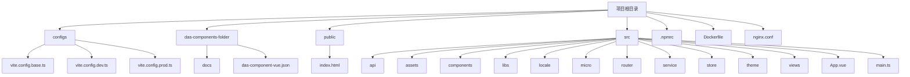
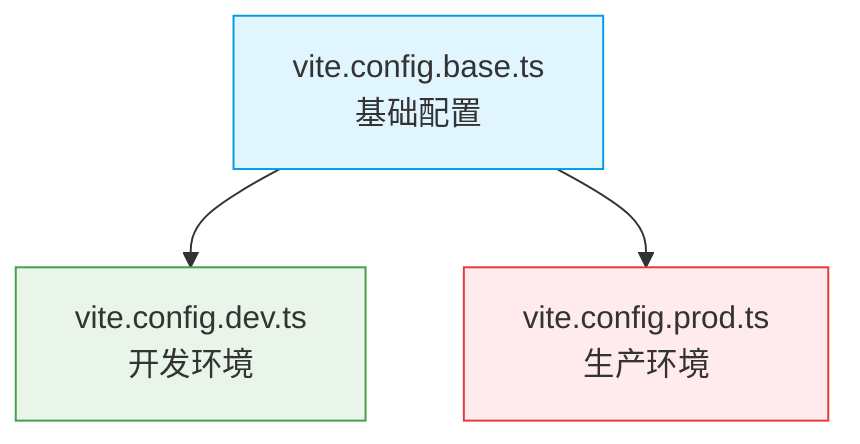

# 目录结构说明

<cite>
**本文档中引用的文件**  
- [vite.config.base.ts](file://configs/vite.config.base.ts#L1-L92)
- [vite.config.dev.ts](file://configs/vite.config.dev.ts#L1-L28)
- [vite.config.prod.ts](file://configs/vite.config.prod.ts#L1-L28)
- [das-component-vue.json](file://das-components-folder/das-component-vue.json#L1-L254)
- [main.ts](file://src/main.ts#L1-L38)
- [App.vue](file://src/App.vue#L1-L74)
- [index.ts](file://src/router/index.ts#L1-L53)
- [routes.ts](file://src/router/routes.ts#L1-L279)
- [index.ts](file://src/store/index.ts#L1-L14)
- [index.ts](file://src/theme/index.ts#L1-L13)
- [themeAlgorithm.ts](file://src/theme/themeAlgorithm.ts#L1-L69)
- [common.ts](file://src/api/common.ts#L1-L356)
- [index.ts](file://src/service/index.ts#L1-L13)
- [index.ts](file://src/libs/fetch/index.ts#L1-L141)
- [index.vue](file://src/components/uedModule/layout/index.vue#L1-L305)
- [HeaderMenus.vue](file://src/components/uedModule/layout/comps/HeaderMenus.vue#L1-L494)
- [SiderMenus.vue](file://src/components/uedModule/layout/comps/SiderMenus.vue#L1-L82)
</cite>

## 目录结构说明

本项目采用模块化、分层清晰的目录结构，旨在提升代码的可维护性、可扩展性和团队协作效率。整体结构遵循现代Vue 3应用的典型模式，并结合微前端、多环境配置和组件库集成等高级特性。

**Diagram sources**
- [vite.config.base.ts](file://configs/vite.config.base.ts#L1-L92)
- [das-component-vue.json](file://das-components-folder/das-component-vue.json#L1-L254)
- [main.ts](file://src/main.ts#L1-L38)
- [App.vue](file://src/App.vue#L1-L74)

**Section sources**
- [vite.config.base.ts](file://configs/vite.config.base.ts#L1-L92)
- [das-component-vue.json](file://das-components-folder/das-component-vue.json#L1-L254)
- [main.ts](file://src/main.ts#L1-L38)
- [App.vue](file://src/App.vue#L1-L74)

### configs目录：Vite多环境配置

`configs` 目录集中管理Vite的构建配置，通过配置文件的继承与合并，实现了开发、生产等不同环境的精细化控制。

#### 配置分工与继承关系

- **vite.config.base.ts**: 基础配置文件，定义了所有环境共用的核心设置，如插件、别名、基础路径等。
- **vite.config.dev.ts**: 开发环境配置，通过 `mergeConfig` 继承基础配置，并添加开发服务器（`server`）的特定设置，如端口、代理等。
- **vite.config.prod.ts**: 生产环境配置，同样继承基础配置，并添加生产优化插件，如 `vite-plugin-compression`（Gzip压缩）和 `imagemin`（图片压缩），以及代码分割（`manualChunks`）等。

这种分层配置模式确保了配置的DRY（Don't Repeat Yourself）原则，提高了配置的可维护性。

**Diagram sources**
- [vite.config.base.ts](file://configs/vite.config.base.ts#L1-L92)
- [vite.config.dev.ts](file://configs/vite.config.dev.ts#L1-L28)
- [vite.config.prod.ts](file://configs/vite.config.prod.ts#L1-L28)

**Section sources**
- [vite.config.base.ts](file://configs/vite.config.base.ts#L1-L92)
- [vite.config.dev.ts](file://configs/vite.config.dev.ts#L1-L28)
- [vite.config.prod.ts](file://configs/vite.config.prod.ts#L1-L28)

### das-components-folder目录：DAS组件文档与配置

该目录存放了DAS企业级组件库的相关资源。

- **docs**: 包含每个DAS组件的详细Markdown文档，用于说明组件的用途、API和使用场景。
- **das-component-vue.json**: 组件库的元数据配置文件，以JSON格式定义了所有组件的分类、名称、描述和使用时机。此文件为组件库的自动化文档生成和管理提供了数据基础。

### public目录：静态资源

`public` 目录存放无需构建处理的静态资源文件，这些文件会直接复制到构建输出目录的根路径下。
- **index.html**: 应用的主HTML模板，Vite构建时会以此为基础注入脚本和样式。
- **empty.html**: 可能用于特定场景（如微前端子应用）的空白页面模板。

### src目录：源码核心

`src` 目录是应用的源代码核心，其子目录遵循清晰的职责分离原则。

#### api目录
- **职责**: 定义与后端服务的接口契约。
- **内容**: `common.ts` 文件封装了获取菜单、权限、网站配置等通用API函数，是应用与后端交互的统一入口。

#### assets目录
- **职责**: 存放静态资源文件。
- **内容**: 
  - `font`: 字体图标文件（`iconfont.css`）。
  - `styles`: 全局样式重置文件（`reset.css`）。

#### components目录
- **职责**: 存放可复用的UI组件。
- **内容**: `uedModule` 下的组件（如 `layout`, `menu`）是项目自定义的通用模块，用于构建应用的基础UI框架。

#### libs目录
- **职责**: 存放第三方库的封装或自研工具库。
- **内容**: `fetch` 目录封装了基于Axios的网络请求库，提供了拦截器、错误处理等增强功能。

#### locale目录
- **职责**: 国际化（i18n）配置。
- **内容**: `index.ts` 是国际化模块的入口，负责加载和管理多语言资源。

#### micro目录
- **职责**: 微前端相关逻辑。
- **内容**: 包含多个子应用（`angular`, `react`, `vue2`, `vue3`）的示例，以及微前端API、路由中心等核心模块，实现了应用的模块化和独立部署。

#### router目录
- **职责**: 路由管理。
- **内容**: `index.ts` 和 `routes.ts` 定义了应用的路由表和导航守卫，`guard.ts` 负责权限校验。

#### service目录
- **职责**: 业务服务层。
- **内容**: `index.ts` 是服务层的入口，封装了 `libs/fetch` 并提供统一的请求实例，是 `api` 目录的底层依赖。

#### store目录
- **职责**: 状态管理（使用Pinia）。
- **内容**: `uedModule` 下按功能模块（`app`, `login`, `menus`, `theme`, `user`）组织状态，`index.ts` 是状态仓库的创建和插件（如持久化）的配置中心。

#### theme目录
- **职责**: 主题管理。
- **内容**: 包含明暗主题的Token定义（`light.ts`, `dark.ts`）、主题算法（`themeAlgorithm.ts`）和CSS变量，实现了动态主题切换。

#### views目录
- **职责**: 页面级视图组件。
- **内容**: `uedTypical` 包含各种典型页面（工作台、列表、表单等），`uedModule` 包含登录、主题配置等模块专属页面。

### 运维相关文件

根目录下的运维文件定义了应用的部署和运行环境。

- **.npmrc**: NPM包管理器的配置文件，可指定镜像源、认证信息等。
- **Dockerfile**: Docker镜像构建文件，定义了应用的容器化部署流程。
- **nginx.conf**: Nginx服务器的配置文件，用于生产环境的反向代理和静态资源服务。