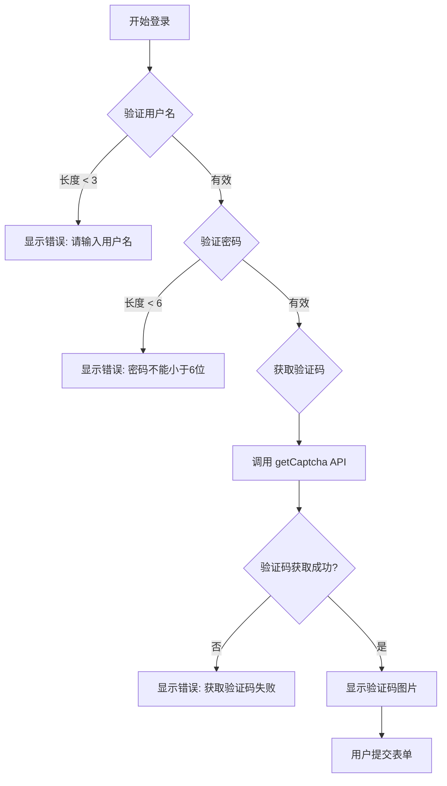
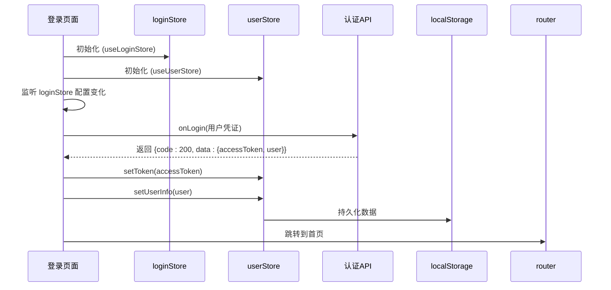
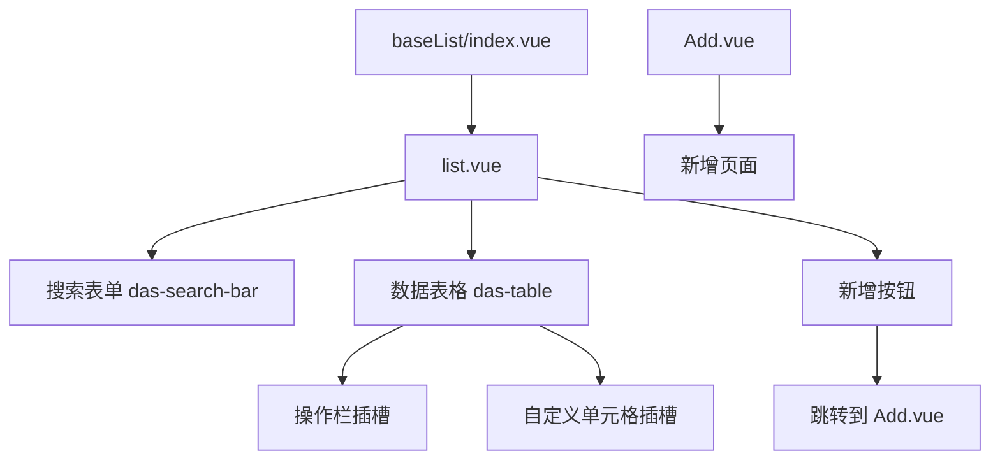
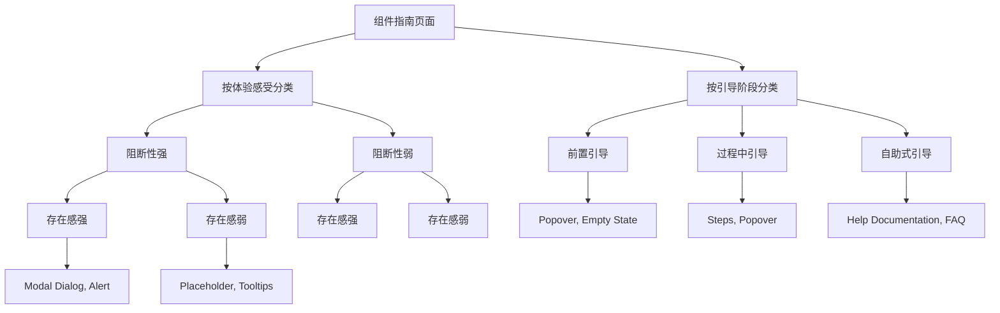

# 视图层结构

<cite>
**本文档中引用的文件**   
- [index.vue](file://src/views/uedModule/login/index.vue)
- [index.ts](file://src/store/uedModule/login/index.ts)
- [guard.ts](file://src/router/guard.ts)
- [index.ts](file://src/store/uedModule/user/index.ts)
- [list.vue](file://src/views/uedTypical/baseList/components/list.vue)
- [index.vue](file://src/views/uedTypical/baseList/index.vue)
- [Add.vue](file://src/views/uedTypical/baseList/components/Add.vue)
- [index.vue](file://src/views/uedTypical/componentsGuide/index.vue)
- [types.ts](file://src/views/uedModule/login/types.ts)
- [defaultConfig.ts](file://src/store/uedModule/login/defaultConfig.ts)
</cite>

## 目录

1. [页面组织结构与命名空间划分](#页面组织结构与命名空间划分)
2. [登录认证页面实现细节](#登录认证页面实现细节)
3. [典型业务页面架构模式](#典型业务页面架构模式)
4. [组件指南页面展示方式](#组件指南页面展示方式)
5. [页面与路由、状态管理集成](#页面与路由状态管理集成)

## 页面组织结构与命名空间划分

根据项目结构，`src/views` 目录下的页面被组织在两个主要的命名空间下：`uedModule` 和 `uedTypical`。这种划分体现了项目对不同功能模块的分类管理。

### uedModule 命名空间

`uedModule` 命名空间主要存放与核心框架、用户认证和系统配置相关的模块。这些模块通常是应用的基础功能，对整个系统的运行至关重要。

- **login**: 包含用户登录认证相关的页面和类型定义，是用户进入系统的入口。
- **loginConfig**: 包含登录页面的配置文件和演示页面，用于管理登录界面的外观和行为。
- **themeConfig**: 包含主题配置页面，用于管理系统主题。

该命名空间下的页面与 `src/store/uedModule` 中的状态管理模块紧密对应，例如 `login` 模块的状态由 `src/store/uedModule/login/index.ts` 管理，体现了功能模块的内聚性。

### uedTypical 命名空间

`uedTypical` 命名空间则存放典型的业务页面和通用功能页面。这些页面代表了应用中常见的业务场景和UI模式，为开发者提供了可复用的模板。

- **baseList**: 一个典型的列表页面，包含搜索、表格展示和操作等功能。
- **baseForm**: 一个典型的表单页面，用于数据录入。
- **baseDetail**: 一个典型的详情页面，用于展示数据详情。
- **componentsGuide**: 组件指南页面，用于展示和说明可用的UI组件。
- **dashboardManage**: 仪表盘管理页面。
- **workBench**: 工作台页面。
- **NotFound**: 404错误页面。

这种命名空间的划分清晰地将**系统级功能**（uedModule）与**业务级功能**（uedTypical）分离开来，有助于代码的维护和团队协作。

**Section sources**
- [index.vue](file://src/views/uedModule/login/index.vue)
- [index.vue](file://src/views/uedTypical/baseList/index.vue)
- [index.vue](file://src/views/uedTypical/componentsGuide/index.vue)

## 登录认证页面实现细节

登录页面（`src/views/uedModule/login/index.vue`）的实现是一个集成了表单验证、状态管理和路由守卫的完整流程。

### 表单验证

登录页面的表单验证通过在 `forms` 数据结构中定义 `rules` 属性来实现。该页面支持多种登录方式，每种方式都有独立的验证规则。



- **用户名验证**: 要求为字符串类型，必填，且最小长度为3个字符。
- **密码验证**: 要求为字符串类型，最小长度为6个字符，并通过自定义 `validator` 函数进行验证。
- **验证码获取**: 通过 `api` 函数异步调用 `getCaptcha` 接口，获取验证码图片的Base64编码。

### 状态管理集成

登录页面与Pinia状态管理库深度集成，主要涉及两个store：

1.  **`loginStore` (`src/store/uedModule/login/index.ts`)**: 管理登录页面自身的配置状态（如主题、语言、logo等）。登录页面通过 `useLoginStore()` 获取该store的实例，并在 `watch` 中监听 `loginStore.loginConfig` 的变化，以动态更新页面配置。
2.  **`userStore` (`src/store/uedModule/user/index.ts`)**: 管理用户的核心状态，包括 `token` 和 `userInfo`。当登录成功后，`handleLogin` 函数会调用 `userStore.setToken()` 和 `userStore.setUserInfo()` 来持久化用户信息。



### 路由守卫配合

登录页面与路由守卫（`src/router/guard.ts`）协同工作，确保应用的安全性。

- **白名单机制**: 路由守卫定义了 `WHITE_LIST`，包含 `/login`、`/404` 等无需登录即可访问的路径。
- **登录重定向**: 当用户访问非白名单路径且未登录时，路由守卫会自动将用户重定向到 `/login` 页面。
- **已登录拦截**: 当用户已登录（`userStore.token` 存在）并试图访问 `/login` 页面时，路由守卫会将其重定向到首页，防止重复登录。

**Section sources**
- [index.vue](file://src/views/uedModule/login/index.vue#L59-L112)
- [index.ts](file://src/store/uedModule/login/index.ts#L0-L57)
- [index.ts](file://src/store/uedModule/user/index.ts#L0-L62)
- [guard.ts](file://src/router/guard.ts#L0-L65)

## 典型业务页面架构模式

`baseList` 页面是典型业务页面的一个范例，其架构模式清晰，易于复用。

### 数据获取

在当前实现中，`baseList` 的数据是静态定义的，位于 `list.vue` 组件的 `data` 变量中。这是一个占位实现，实际项目中应通过API调用获取数据。

```typescript
const data: TableDataType[] = [
  {
    key: '1',
    name: 'Opc网关系统',
    age: '根组织',
    tags: ['重要资产', '核心资产']
  },
  // ... 其他数据
];
```

未来可扩展为在 `onMounted` 钩子中调用API，并将返回的数据赋值给 `data`。

### 加载状态

当前代码中没有显式的加载状态管理。一个完整的实现应该包含一个 `loading` 状态变量，用于在数据获取时显示加载动画。

```typescript
const loading = ref(false);
const fetchData = async () => {
  loading.value = true;
  try {
    const res = await getDataAPI();
    data.value = res.data;
  } finally {
    loading.value = false;
  }
};
```

然后在 `das-table` 组件上绑定 `:loading="loading"`。

### 错误处理

当前实现中没有错误处理逻辑。一个健壮的实现应该捕获API调用中的异常，并向用户展示友好的错误提示。

```typescript
try {
  const res = await getDataAPI();
  if (res.code !== 200) {
    throw new Error(res.message);
  }
  data.value = res.data;
} catch (error) {
  message.error(error.message || '数据加载失败');
}
```

### 架构图



**Section sources**
- [list.vue](file://src/views/uedTypical/baseList/components/list.vue#L0-L199)
- [index.vue](file://src/views/uedTypical/baseList/index.vue#L0-L21)
- [Add.vue](file://src/views/uedTypical/baseList/components/Add.vue#L0-L3)

## 组件指南页面展示方式

`componentsGuide` 页面（`src/views/uedTypical/componentsGuide/index.vue`）是一个精心设计的组件展示平台，旨在促进组件库的使用。

### 展示方式

该页面采用了两种主要的分类方式来组织和展示组件：

1.  **按引导阶段分类 (GUIDANCE PHASE)**:
    *   将组件分为“前置引导”、“过程中引导”和“自助式引导”三类。
    *   使用视觉化的箭头（`right-dark` 和 `right` div）来表示引导的流程和强度。
    *   每个分类下，组件按功能分组（如“欢迎页”、“新功能引导”），并以圆形按钮的形式列出，点击后在新窗口打开对应的文档链接。

2.  **按体验感受分类 (USER EXPERIENCE)**:
    *   构建了一个二维坐标系，X轴为“存在感”，Y轴为“阻断性”。
    *   将组件定位在坐标系中的不同象限，直观地展示其对用户体验的影响。
    *   例如，`Modal Dialog` 位于阻断性强、存在感强的区域，而 `Placeholder` 则位于阻断性弱、存在感弱的区域。

### 促进组件库使用

该页面通过以下方式促进组件库的使用：
- **统一入口**: 提供了一个集中访问所有组件文档的入口。
- **场景化分类**: 帮助开发者根据具体业务场景（如“新功能引导”）快速找到合适的组件。
- **体验化展示**: 通过坐标系帮助开发者理解不同组件的交互强度，做出更合适的设计选择。
- **直接链接**: 每个组件都链接到详细的文档页面，方便开发者深入学习。



**Section sources**
- [index.vue](file://src/views/uedTypical/componentsGuide/index.vue#L0-L300)

## 页面与路由、状态管理集成

项目中的页面、路由和状态管理形成了一个紧密集成的体系。

### 路由集成

页面通过 `src/router/routes.ts` 文件中的路由配置与URL路径关联。例如，`baseList` 页面的路径为 `/base-list`，`login` 页面的路径为 `/login`。路由守卫（`guard.ts`）在导航过程中进行权限检查，确保用户状态与访问路径的一致性。

### 状态管理集成

如前所述，页面通过 `useStore()` 钩子（如 `useLoginStore`, `useUserStore`）与Pinia store集成。这种模式实现了：
- **状态集中管理**: 用户信息、应用配置等全局状态被统一管理。
- **状态持久化**: 通过Pinia的 `persist` 插件，关键状态（如token）被自动保存到 `localStorage`。
- **响应式更新**: 页面组件能自动响应store中状态的变化。

这种集成方式使得页面逻辑更加清晰，状态流转更加可控，是现代Vue应用的标准实践。

**Section sources**
- [guard.ts](file://src/router/guard.ts#L0-L65)
- [index.ts](file://src/store/uedModule/user/index.ts#L0-L62)