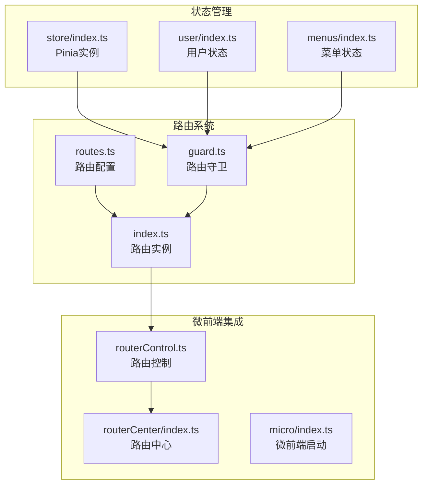
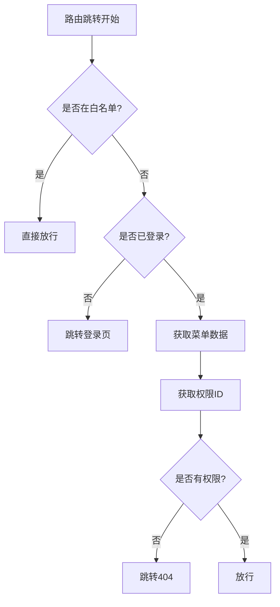
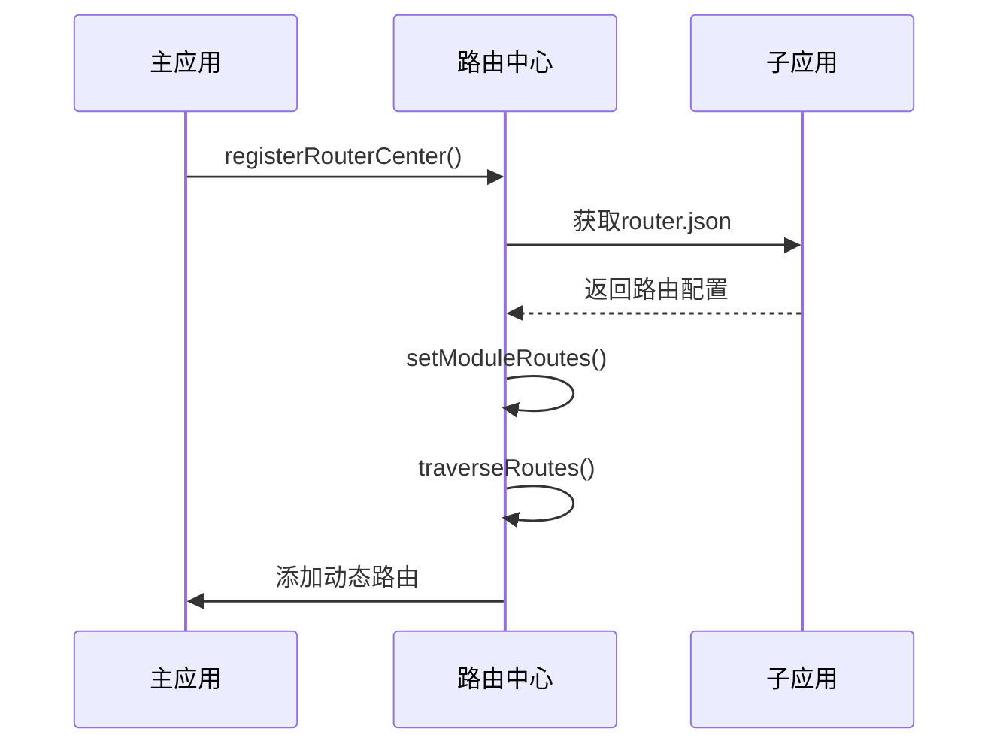
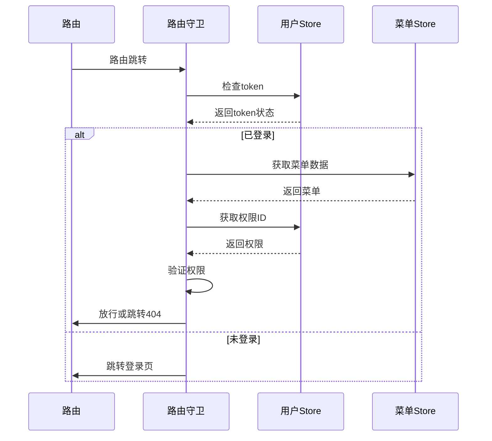

# 路由系统结构

<cite>
**本文档引用的文件**  
- [routes.ts](file://src/router/routes.ts)
- [guard.ts](file://src/router/guard.ts)
- [index.ts](file://src/router/index.ts)
- [store/index.ts](file://src/store/index.ts)
- [user/index.ts](file://src/store/uedModule/user/index.ts)
- [menus/index.ts](file://src/store/uedModule/menus/index.ts)
- [routerControl.ts](file://src/micro/routerControl.ts)
- [routerCenter/index.ts](file://src/micro/routerCenter/index.ts)
- [micro/index.ts](file://src/micro/index.ts)
- [home.vue](file://src/micro/example/vue2/src/components/home.vue)
- [App.js](file://src/micro/example/child-react/src/App.js)
</cite>

## 目录
1. [项目结构](#项目结构)
2. [路由配置模块化组织](#路由配置模块化组织)
3. [路由守卫与权限控制](#路由守卫与权限控制)
4. [路由实例创建与插件集成](#路由实例创建与插件集成)
5. [动态路由添加机制](#动态路由添加机制)
6. [编程式导航实现](#编程式导航实现)
7. [路由与状态管理协同机制](#路由与状态管理协同机制)

## 项目结构

`src/router` 目录是整个应用的路由中枢，包含三个核心文件：

- **routes.ts**：定义静态路由配置，包括路由路径、组件映射、元信息等
- **guard.ts**：实现路由守卫逻辑，负责权限验证和跳转控制
- **index.ts**：创建路由实例并集成守卫机制

此外，路由系统与状态管理（Pinia）深度集成，通过 `store` 模块管理用户状态、菜单数据和权限信息。



**Diagram sources**  
- [routes.ts](file://src/router/routes.ts#L1-L279)
- [guard.ts](file://src/router/guard.ts#L1-L66)
- [index.ts](file://src/router/index.ts#L1-L53)
- [store/index.ts](file://src/store/index.ts#L1-L14)

**Section sources**  
- [routes.ts](file://src/router/routes.ts#L1-L279)
- [guard.ts](file://src/router/guard.ts#L1-L66)
- [index.ts](file://src/router/index.ts#L1-L53)

## 路由配置模块化组织

### 路由元信息与懒加载

`routes.ts` 文件通过 `RouteRecordRaw` 类型定义路由配置，采用模块化方式组织路由。每个路由对象包含以下关键属性：

- **name**：路由名称，用于标识和跳转
- **path**：URL路径，支持动态参数
- **component**：组件懒加载，使用 `import()` 语法实现代码分割
- **meta**：路由元信息，包含权限控制所需数据

```typescript
{
  name: 'base::work-list',
  path: '/work-list',
  component: () => import('@/views/uedTypical/baseList/index.vue'),
  meta: {
    title: 'I18N.layout.lieBiaoYe',
    permissionId: 'base::workBench:index'
  },
  children: [/* 子路由 */]
}
```

**关键特性：**
- **懒加载**：所有组件均采用动态导入，实现按需加载
- **国际化支持**：`meta.title` 使用 I18N 键值，支持多语言
- **全屏模式**：`fullScreen` 标志位控制页面显示模式

### 嵌套路由实现

通过 `children` 属性实现嵌套路由，形成父子路由关系。例如 `/work-list` 路由包含 `add` 子路由：

```typescript
{
  name: 'base::work-list',
  path: '/work-list',
  component: () => import('@/views/uedTypical/baseList/index.vue'),
  children: [
    {
      name: 'base::work-list-add',
      path: 'add',
      component: () => import('@/views/uedTypical/baseList/components/Add.vue')
    }
  ]
}
```

### 特殊路由处理

部分路由使用 `beforeEnter` 钩子实现特殊逻辑，如外部链接跳转：

```typescript
{
  name: 'base::das-readdy',
  path: '/das-readdy',
  beforeEnter() {
    const { token } = useUserStore();
    window.open(`https://10.20.114.19:8888/das-readdy?readdyAuthToken=${token}`, '_blank');
    return false; // 阻止原页面跳转
  }
}
```

**Section sources**  
- [routes.ts](file://src/router/routes.ts#L1-L279)

## 路由守卫与权限控制

### 前置守卫执行流程

`guard.ts` 文件中的 `setupPermissionGuard` 函数注册全局前置守卫，控制路由跳转逻辑：



### 权限控制逻辑

守卫函数通过以下步骤实现权限控制：

1. **白名单检查**：`WHITE_LIST` 数组定义无需登录即可访问的路径
2. **登录状态验证**：检查 `userStore.token` 是否存在
3. **菜单数据获取**：首次访问时从 API 获取菜单配置
4. **权限ID获取**：获取用户拥有的权限标识符
5. **权限验证**：检查当前路由的 `permissionId` 是否在用户权限列表中

```typescript
export const WHITE_LIST: string[] = ['/404', '/login', '/ai-agent'];

router.beforeEach(async (to, _, next) => {
  const userStore = useUserStore();
  
  // 白名单放行
  if (WHITE_LIST.includes(to.path)) {
    if (to.path === '/login' && userStore.token) {
      next({ path: '/' });
    }
    next();
  } 
  // 登录状态验证
  else if (userStore.token) {
    // 获取菜单和权限数据
    if (!menusStore.menusData.length) {
      const menusData = await getMenus();
      menusStore.setMenus(menusData);
    }
    if (!userStore.permissionIds.length) {
      const permissionIds = await getPermissions();
      userStore.setPermissionIds(permissionIds);
    }
    // 权限验证
    if (!userStore.permissionIds.includes(to.meta.permissionId as string)) {
      next('/404');
      return;
    }
    next();
  } else {
    next('/login');
  }
});
```

**Section sources**  
- [guard.ts](file://src/router/guard.ts#L1-L66)

## 路由实例创建与插件集成

### 路由实例初始化

`index.ts` 文件负责创建路由实例并集成守卫机制：

```typescript
const router = createRouter({
  history: process.env.HISTORY_TYPE === 'history' ? createWebHistory(basePath) : createWebHashHistory(basePath),
  routes: waterRoutes
});

setupPermissionGuard(router);
export default router;
```

### 平级路由转换

通过 `routeToArr` 函数将多层嵌套路由转换为平级路由，便于权限控制和菜单生成：

```typescript
function routeToArr(routesData: RouteRecordRaw[]) {
  const waterRoutes: RouteRecordRaw[] = [];
  function setRouteToMap(_routes: RouteRecordRaw[], parents: RouteItemType[]) {
    _routes.forEach((item) => {
      // 拼接完整路径
      if (!/^\//.test(item.path)) {
        const parentsPath = parents[0]?.path ?? '';
        item.path = `${parentsPath}/${item.path}`;
      }
      // 设置父级路由信息
      item.meta = {
        ...item.meta,
        parentRoutes: [
          {
            path: item.path,
            title: item?.meta?.title || '',
            component: !!item.component
          } as RouteItemType,
          ...parents
        ]
      };
      waterRoutes.push(pruneRoute(item));
      if (item.children) {
        setRouteToMap(item.children, routeItems);
      }
    });
  }
  setRouteToMap(routesData, []);
  return waterRoutes;
}
```

**Section sources**  
- [index.ts](file://src/router/index.ts#L1-L53)

## 动态路由添加机制

### 微前端路由集成

通过 `routerCenter` 类实现微前端应用的动态路由管理：



### 动态路由添加实现

`routerControl.ts` 中的 `setupAddMicroRouter` 函数为每个微前端应用添加通配路由：

```typescript
export function setupAddMicroRouter(router: Router) {
  const microStore = useMicroStore();
  microStore.apps.forEach((app) => {
    if (!router.hasRoute(app.name)) {
      router.addRoute({
        path: `${app.baseroute}/:page*`,
        name: app.name,
        component: () => Promise.resolve(h(SubApp, { appInfo: app })),
        meta: {
          title: app.name,
          public: true,
          fullScreen: app.meta?.fullScreen || false
        }
      });
    }
  });
}
```

### 路由中心核心功能

`RouterCenter` 类提供以下核心功能：

- **setModuleRoutes**：注册子应用路由
- **traverseRoutes**：遍历并处理路由配置
- **getMeta**：获取路由元信息
- **initRegExpKeyToKey**：处理动态路由参数

**Diagram sources**  
- [routerCenter/index.ts](file://src/micro/routerCenter/index.ts#L1-L222)
- [routerControl.ts](file://src/micro/routerControl.ts#L1-L142)

**Section sources**  
- [routerCenter/index.ts](file://src/micro/routerCenter/index.ts#L1-L222)
- [routerControl.ts](file://src/micro/routerControl.ts#L1-L142)

## 编程式导航实现

### 基础编程式导航

在 Vue 组件中通过 `$router.push()` 实现编程式导航：

```vue
<template>
  <button @click="goToAdd">新增</button>
</template>

<script>
export default {
  methods: {
    goToAdd(){
      this.$router.push('/home/add')
    }
  }
}
</script>
```

### 跨应用导航

通过 `microApp` API 实现主应用与子应用之间的导航：

```javascript
// 跳转到子应用
window.microApp.getData().pushState('/vue3/about')

// 跳转到主应用
window.microApp.getData().pushState('/work-list')
```

### React 子应用导航

在 React 子应用中使用 `react-router-dom` 实现导航：

```jsx
import { Link } from 'react-router-dom';

function Home() {
  return (
    <div>
      <h1>Home页面</h1>
      <Link to="/about">跳转到About页面</Link>
    </div>
  )
}
```

**Section sources**  
- [home.vue](file://src/micro/example/vue2/src/components/home.vue#L1-L40)
- [App.js](file://src/micro/example/child-react/src/App.js#L1-L44)

## 路由与状态管理协同机制

### 状态管理集成

`store/index.ts` 创建 Pinia 实例并导出各模块的 Store：

```typescript
import { createPinia } from 'pinia';
import piniaPluginPersistedstate from 'pinia-plugin-persistedstate';

const pinia = createPinia();
pinia.use(piniaPluginPersistedstate);

export { useAppStore, useLoginStore, useUserStore, useMenusStore, useThemeStore };
export default pinia;
```

### 用户状态管理

`user/index.ts` 定义用户状态 Store，存储 token、权限 ID 和用户信息：

```typescript
export default defineStore<'user', UserStore>(
  'user',
  () => {
    const token = ref<string | undefined>(undefined);
    const permissionIds = ref<string[]>([]);
    const userInfo = reactive({});

    return {
      token,
      permissionIds,
      userInfo,
      setToken,
      setPermissionIds,
      setUserInfo,
      reset
    };
  },
  {
    persist: {
      key: 'user-store',
      storage: localStorage
    }
  }
);
```

### 菜单状态管理

`menus/index.ts` 管理菜单数据和激活状态：

- **menusData**：存储完整的菜单树
- **activeRoutes**：当前激活的路由层级
- **activeMenus**：当前激活的菜单项
- **activeBreadcrumb**：面包屑导航数据

```typescript
export default defineStore('menus', () => {
  const menusData = ref<MenuType[]>([]);
  const activeRoutes = ref<RouteItemType[]>([]);
  const activeMenus = computed(() => { /* ... */ });
  const activeBreadcrumb = computed(() => { /* ... */ });

  return {
    menusData,
    setMenus,
    setActiveRoutes,
    activeMenus,
    activeBreadcrumb
  };
});
```

### 协同工作机制

路由系统与状态管理的协同工作流程：



**Diagram sources**  
- [store/index.ts](file://src/store/index.ts#L1-L14)
- [user/index.ts](file://src/store/uedModule/user/index.ts#L1-L63)
- [menus/index.ts](file://src/store/uedModule/menus/index.ts#L1-L139)

**Section sources**  
- [store/index.ts](file://src/store/index.ts#L1-L14)
- [user/index.ts](file://src/store/uedModule/user/index.ts#L1-L63)
- [menus/index.ts](file://src/store/uedModule/menus/index.ts#L1-L139)