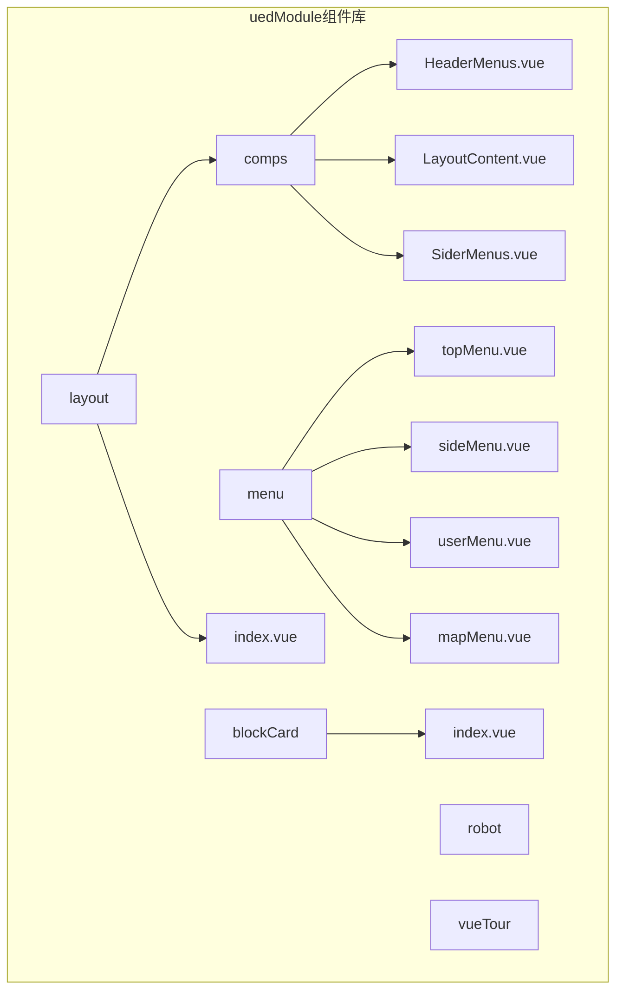
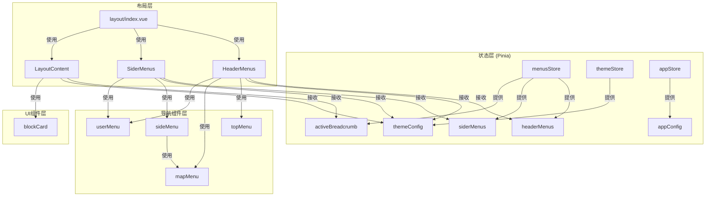
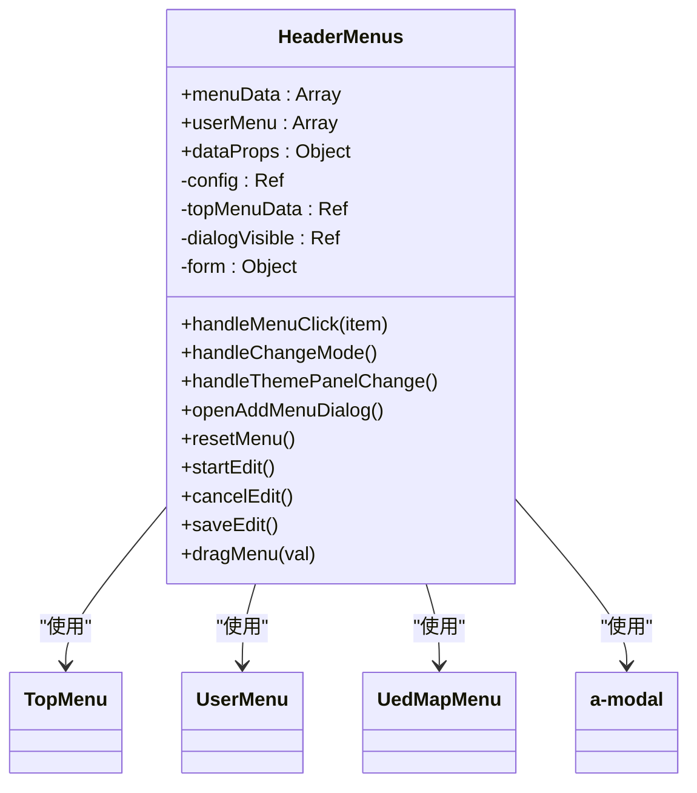
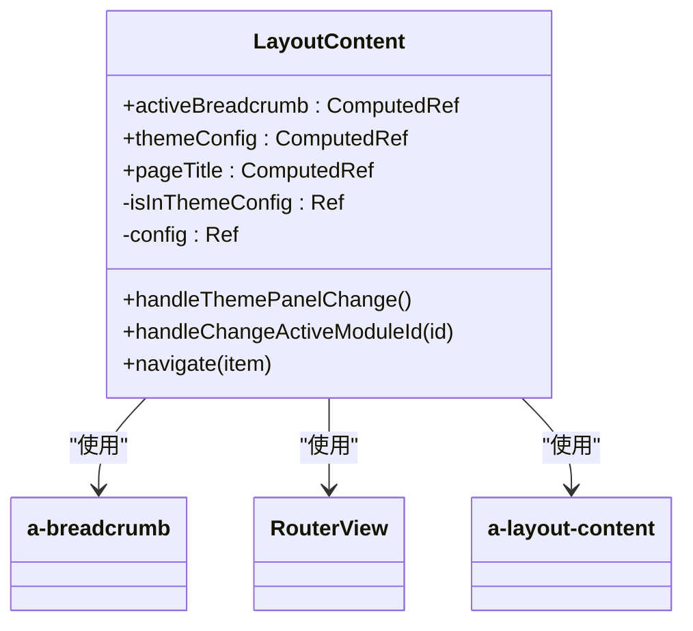
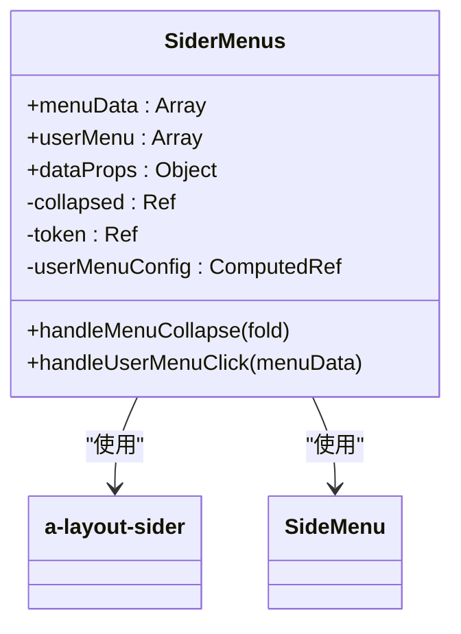
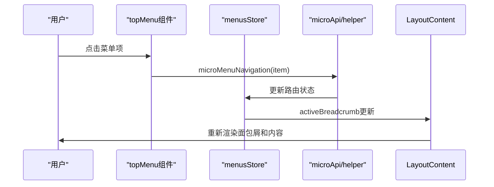
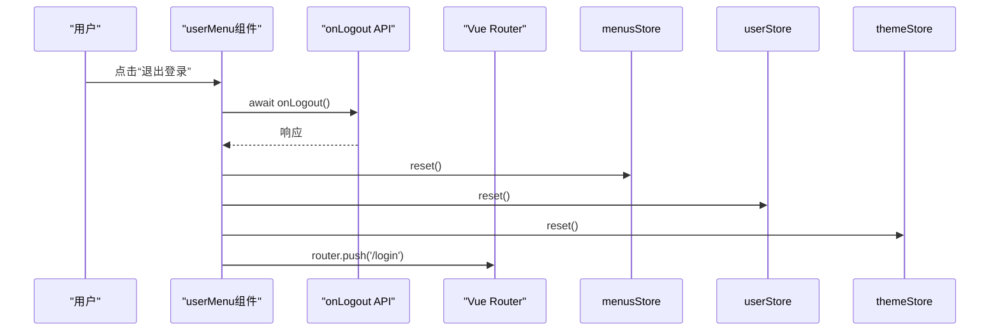

# 通用组件结构

<cite>
**本文档引用文件**   
- [HeaderMenus.vue](file://src/components/uedModule/layout/comps/HeaderMenus.vue)
- [LayoutContent.vue](file://src/components/uedModule/layout/comps/LayoutContent.vue)
- [SiderMenus.vue](file://src/components/uedModule/layout/comps/SiderMenus.vue)
- [index.vue](file://src/components/uedModule/layout/index.vue)
- [topMenu.vue](file://src/components/uedModule/menu/topMenu.vue)
- [sideMenu.vue](file://src/components/uedModule/menu/sideMenu.vue)
- [userMenu.vue](file://src/components/uedModule/menu/userMenu.vue)
- [mapMenu.vue](file://src/components/uedModule/menu/mapMenu.vue)
- [index.ts](file://src/store/uedModule/menus/index.ts)
- [index.ts](file://src/store/uedModule/theme/index.ts)
- [index.ts](file://src/store/uedModule/app/index.ts)
- [index.vue](file://src/components/uedModule/blockCard/index.vue)
</cite>

## 目录
1. [引言](#引言)
2. [项目结构](#项目结构)
3. [核心组件](#核心组件)
4. [架构概述](#架构概述)
5. [详细组件分析](#详细组件分析)
6. [依赖分析](#依赖分析)
7. [性能考虑](#性能考虑)
8. [故障排除指南](#故障排除指南)
9. [结论](#结论)

## 引言
本技术文档深入分析了`uedModule`组件库的架构设计，重点阐述了其布局系统、导航组件体系以及基础UI组件的设计理念。文档详细解析了`layout`布局组件的容器化设计思想，包括`HeaderMenus`、`LayoutContent`、`SiderMenus`的协作模式；剖析了`menu`导航组件体系中`topMenu`、`sideMenu`、`userMenu`的职责划分与状态同步机制；并介绍了`blockCard`等基础UI组件的可复用性设计。通过分析Pinia状态管理，揭示了组件间的依赖关系和通信模式，展示了如何通过`props`和事件实现组件解耦。

## 项目结构
`uedModule`组件库位于`src/components/uedModule`目录下，采用功能模块化组织方式，清晰地划分为布局、菜单、基础卡片等核心模块。



**图示来源**
- [项目结构](file://project_structure)

**本节来源**
- [项目结构](file://project_structure)

## 核心组件
`uedModule`组件库的核心由三大功能模块构成：`layout`（布局）、`menu`（导航）和`blockCard`（基础卡片）。`layout`模块通过`HeaderMenus`、`LayoutContent`和`SiderMenus`三个子组件，实现了灵活的容器化布局设计。`menu`模块则构建了一个完整的导航体系，`topMenu`、`sideMenu`、`userMenu`各司其职，通过Pinia状态管理实现数据同步。`blockCard`作为基础UI组件，提供了高度可复用的卡片式容器，支持插槽、属性透传和样式定制。

**本节来源**
- [HeaderMenus.vue](file://src/components/uedModule/layout/comps/HeaderMenus.vue)
- [LayoutContent.vue](file://src/components/uedModule/layout/comps/LayoutContent.vue)
- [SiderMenus.vue](file://src/components/uedModule/layout/comps/SiderMenus.vue)
- [topMenu.vue](file://src/components/uedModule/menu/topMenu.vue)
- [sideMenu.vue](file://src/components/uedModule/menu/sideMenu.vue)
- [userMenu.vue](file://src/components/uedModule/menu/userMenu.vue)
- [index.vue](file://src/components/uedModule/blockCard/index.vue)

## 架构概述
`uedModule`的整体架构基于Vue 3和Pinia，采用组件化和状态驱动的设计模式。应用的主布局由`layout/index.vue`控制，它根据全局状态决定渲染`HeaderMenus`、`SiderMenus`和`LayoutContent`。菜单数据和应用配置通过Pinia Store进行集中管理，实现了跨组件的状态同步。`HeaderMenus`和`SiderMenus`作为布局容器，负责渲染顶部和侧边导航，而`LayoutContent`则承载页面主要内容和面包屑导航。整个系统通过`props`向下传递数据，通过事件和Store进行状态更新，实现了清晰的单向数据流。



**图示来源**
- [index.vue](file://src/components/uedModule/layout/index.vue)
- [index.ts](file://src/store/uedModule/menus/index.ts)
- [index.ts](file://src/store/uedModule/theme/index.ts)
- [index.ts](file://src/store/uedModule/app/index.ts)

## 详细组件分析

### 布局组件分析
`layout`模块是整个应用的骨架，其核心思想是容器化设计，将不同的UI区域封装为独立的组件，通过主布局文件进行组合。

#### HeaderMenus 组件
`HeaderMenus`组件负责渲染应用的顶部导航栏。它根据`themeConfig.layout`的配置，决定是否显示`UedMapMenu`（地图式菜单）或`TopMenu`（顶部菜单）。该组件集成了多种用户操作功能，如帮助文档、多语言切换、字号调整、明暗模式切换和主题面板。它通过`props`接收`menuData`和`userMenu`数据，并将其传递给内部的`TopMenu`和`UserMenu`组件。



**图示来源**
- [HeaderMenus.vue](file://src/components/uedModule/layout/comps/HeaderMenus.vue)

**本节来源**
- [HeaderMenus.vue](file://src/components/uedModule/layout/comps/HeaderMenus.vue)

#### LayoutContent 组件
`LayoutContent`组件负责渲染页面的主体内容区域。其核心功能是根据`activeBreadcrumb`计算结果，动态生成面包屑导航。该组件通过`storeToRefs`从`menusStore`中获取`activeBreadcrumb`，并将其渲染为`a-breadcrumb`。同时，它也负责处理主题面板的显示逻辑，当用户进入`/themeConfig`路由时，会显示一个侧边设置面板，实现所见即所得的配置体验。



**图示来源**
- [LayoutContent.vue](file://src/components/uedModule/layout/comps/LayoutContent.vue)

**本节来源**
- [LayoutContent.vue](file://src/components/uedModule/layout/comps/LayoutContent.vue)

#### SiderMenus 组件
`SiderMenus`组件负责渲染应用的侧边栏。它使用`a-layout-sider`作为容器，并将`SideMenu`组件作为其内容。该组件通过`props`接收`menuData`和`userMenu`，并将其传递给`SideMenu`。它还实现了菜单的折叠功能，通过`collapsed`状态和`handleMenuCollapse`方法来控制侧边栏的展开与收起。



**图示来源**
- [SiderMenus.vue](file://src/components/uedModule/layout/comps/SiderMenus.vue)

**本节来源**
- [SiderMenus.vue](file://src/components/uedModule/layout/comps/SiderMenus.vue)

### 菜单组件体系分析
`menu`模块构建了一个分层的导航体系，通过`topMenu`、`sideMenu`、`userMenu`和`mapMenu`共同协作，为用户提供丰富的导航体验。

#### topMenu 与 sideMenu 组件
`topMenu`和`sideMenu`是应用的主要导航组件，它们都基于第三方库`@ued-material/menu`的`UedTopMenu`和`UedSideMenu`。这两个组件的职责是接收来自父组件的`menuData`，并将其渲染为可视化的菜单。它们通过`props`接收`activeId`（来自`menusStore`），以高亮当前激活的菜单项。点击菜单项时，会触发`handleMenuClick`方法，该方法调用`microMenuNavigation`来处理路由跳转。



**图示来源**
- [topMenu.vue](file://src/components/uedModule/menu/topMenu.vue)
- [sideMenu.vue](file://src/components/uedModule/menu/sideMenu.vue)
- [index.ts](file://src/store/uedModule/menus/index.ts)

**本节来源**
- [topMenu.vue](file://src/components/uedModule/menu/topMenu.vue)
- [sideMenu.vue](file://src/components/uedModule/menu/sideMenu.vue)

#### userMenu 组件
`userMenu`组件负责渲染用户相关的操作菜单，如“退出登录”。它同样基于`@ued-material/menu`的`UedUserMenu`。该组件通过`props`接收`menuData`，并将其渲染为一个下拉菜单。当用户点击“退出登录”时，`userMenuClick`方法会被触发，该方法会调用`onLogout` API，并重置`menusStore`、`userStore`和`themeStore`，最后将用户重定向到登录页。



**图示来源**
- [userMenu.vue](file://src/components/uedModule/menu/userMenu.vue)
- [index.ts](file://src/store/uedModule/menus/index.ts)
- [index.ts](file://src/store/uedModule/user/index.ts)
- [index.ts](file://src/store/uedModule/theme/index.ts)

**本节来源**
- [userMenu.vue](file://src/components/uedModule/menu/userMenu.vue)

#### 状态同步机制
菜单组件体系的状态同步依赖于Pinia Store。`menusStore`是核心，它维护了`menusData`（原始菜单数据）、`headerMenus`（计算出的顶部菜单）、`siderMenus`（计算出的侧边菜单）和`activeBreadcrumb`（面包屑）。当路由发生变化时，`layout/index.vue`中的`watchEffect`会调用`setActiveRoutes`，更新`activeRoutes`。`activeMenus`和`activeBreadcrumb`等计算属性会自动响应`activeRoutes`的变化，从而触发`topMenu`、`sideMenu`和`LayoutContent`的重新渲染。

```mermaid
flowchart TD
A[路由变化] --> B[layout/index.vue]
B --> C[menusStore.setActiveRoutes()]
C --> D[activeRoutes更新]
D --> E[activeMenus计算]
D --> F[activeBreadcrumb计算]
E --> G[sideMenu重新渲染]
F --> H[LayoutContent重新渲染]
```

**图示来源**
- [index.vue](file://src/components/uedModule/layout/index.vue)
- [index.ts](file://src/store/uedModule/menus/index.ts)

**本节来源**
- [index.vue](file://src/components/uedModule/layout/index.vue)
- [index.ts](file://src/store/uedModule/menus/index.ts)

### blockCard 基础UI组件分析
`blockCard`是一个高度可复用的基础UI组件，用于创建标准化的卡片式内容区域。

#### 可复用性设计
`blockCard`的设计体现了良好的可复用性原则。它通过`props`接收配置，通过`slots`接收内容，实现了内容与结构的分离。

**插槽使用**: 组件定义了三个具名插槽：
- `description`: 用于在标题后方插入描述性文字。
- `operation`: 用于在标题右侧插入操作按钮。
- `content`: 用于插入卡片的主要内容。

**属性透传**: 组件通过`props`接收`title`、`more`、`topBorder`、`titleBorder`、`twoColumns`和`contentPadding`等属性，允许父组件灵活地控制卡片的外观和行为。

**样式定制方案**: 组件使用CSS变量（如`var(--color-bg-container)`）和动态绑定的内联样式（`contentPaddingStyle`）来实现样式定制。`contentPadding`属性支持`Number`或`String`类型，提供了灵活的内边距设置方式。

```mermaid
classDiagram
class blockCard {
+title : String
+more : Boolean
+topBorder : Boolean
+titleBorder : Boolean
+twoColumns : Boolean
+contentPadding : Number or String
-contentPaddingStyle : ComputedRef
}
blockCard --> "slot : description" : "使用"
blockCard --> "slot : operation" : "使用"
blockCard --> "slot : content" : "使用"
```

**图示来源**
- [index.vue](file://src/components/uedModule/blockCard/index.vue)

**本节来源**
- [index.vue](file://src/components/uedModule/blockCard/index.vue)

## 依赖分析
`uedModule`组件库的组件间依赖关系清晰，主要通过Pinia Store进行状态共享，通过`props`进行数据传递。

```mermaid
graph TD
subgraph "Pinia Stores"
A[menusStore]
B[themeStore]
C[appStore]
end
subgraph "Layout Components"
D[HeaderMenus]
E[LayoutContent]
F[SiderMenus]
end
subgraph "Menu Components"
G[topMenu]
H[sideMenu]
I[userMenu]
J[mapMenu]
end
subgraph "UI Components"
K[blockCard]
end
A --> D : "提供 headerMenus"
A --> E : "提供 activeBreadcrumb"
A --> H : "提供 activeId"
B --> D : "提供 themeConfig"
B --> E : "提供 themeConfig"
B --> F : "提供 themeConfig"
B --> G : "提供 themeConfig"
B --> H : "提供 themeConfig"
B --> I : "提供 themeConfig"
C --> D : "提供 appConfig"
C --> E : "提供 themePanelVisible"
C --> F : "提供 appConfig"
D --> G : "传递 menuData"
D --> I : "传递 userMenu"
F --> H : "传递 menuData"
F --> I : "传递 userMenu"
E --> K : "使用"
```

**图示来源**
- [index.vue](file://src/components/uedModule/layout/index.vue)
- [index.ts](file://src/store/uedModule/menus/index.ts)
- [index.ts](file://src/store/uedModule/theme/index.ts)
- [index.ts](file://src/store/uedModule/app/index.ts)

**本节来源**
- [index.vue](file://src/components/uedModule/layout/index.vue)
- [index.ts](file://src/store/uedModule/menus/index.ts)
- [index.ts](file://src/store/uedModule/theme/index.ts)
- [index.ts](file://src/store/uedModule/app/index.ts)

## 性能考虑
该组件库在性能方面表现良好。通过使用Pinia的`computed`属性，确保了`headerMenus`、`siderMenus`和`activeBreadcrumb`等衍生数据的高效计算。组件的`props`和`slots`设计减少了不必要的重新渲染。`watchEffect`的使用确保了状态变化的及时响应。整体架构遵循了Vue的响应式原则，能够有效地管理复杂的状态和视图更新。

## 故障排除指南
- **菜单不显示**: 检查`menusStore`中的`menusData`是否已正确设置。确保`setMenus`方法被调用。
- **面包屑不更新**: 检查路由的`meta`信息是否正确配置了`parentRoutes`。确认`layout/index.vue`中的`watchEffect`逻辑是否正常执行。
- **主题不生效**: 检查`themeStore`中的`themeConfig`是否正确更新。确认`localStorage`中的`ZQTHEMECONFIG`项是否被正确写入。
- **组件样式错乱**: 检查全局CSS变量（如`--color-bg-container`）是否已正确定义。确认`themeTokens`是否被正确加载。

**本节来源**
- [index.ts](file://src/store/uedModule/menus/index.ts)
- [index.ts](file://src/store/uedModule/theme/index.ts)
- [index.vue](file://src/components/uedModule/layout/index.vue)

## 结论
`uedModule`组件库通过精心设计的容器化布局、分层的导航体系和可复用的基础UI组件，构建了一个现代化、可扩展的应用框架。其核心优势在于利用Pinia实现了高效的状态管理，使得组件间的通信和数据同步变得简单而可靠。`layout`、`menu`和`blockCard`等模块的设计充分体现了组件化开发的最佳实践，为构建复杂的企业级应用提供了坚实的基础。