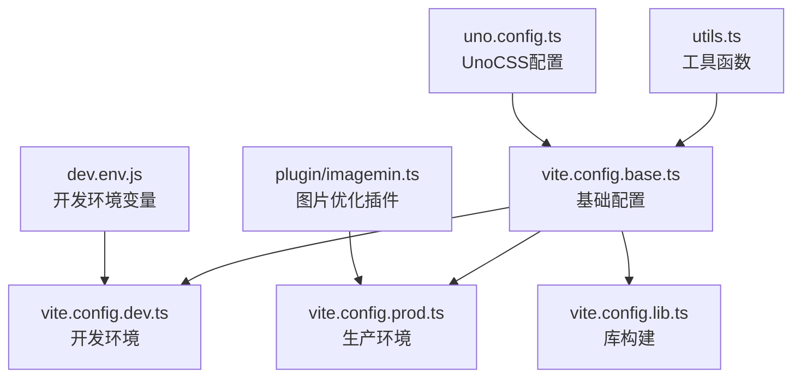
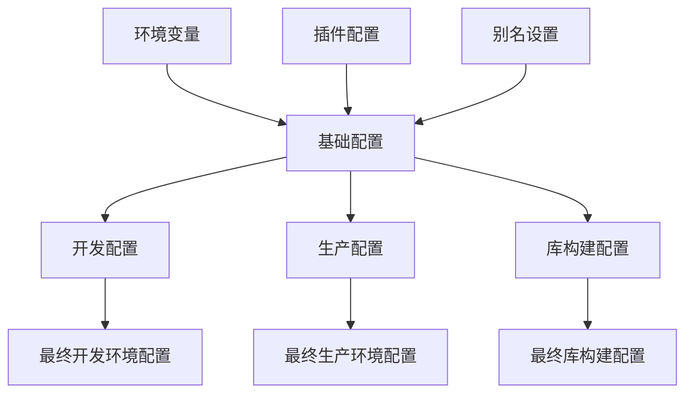

# 配置文件结构

<cite>
**本文档中引用的文件**  
- [vite.config.base.ts](file://configs/vite.config.base.ts)
- [vite.config.dev.ts](file://configs/vite.config.dev.ts)
- [vite.config.prod.ts](file://configs/vite.config.prod.ts)
- [vite.config.lib.ts](file://configs/vite.config.lib.ts)
- [utils.ts](file://configs/utils.ts)
- [imagemin.ts](file://configs/plugin/imagemin.ts)
- [dev.env.js](file://dev.env.js)
- [uno.config.ts](file://uno.config.ts)
</cite>

## 目录
1. [项目结构概述](#项目结构概述)
2. [基础Vite配置分析](#基础vite配置分析)
3. [开发环境配置详解](#开发环境配置详解)
4. [生产环境配置优化](#生产环境配置优化)
5. [UI库构建模式配置](#ui库构建模式配置)
6. [工具函数与插件复用机制](#工具函数与插件复用机制)
7. [配置继承与覆盖逻辑对比](#配置继承与覆盖逻辑对比)

## 项目结构概述

项目采用模块化配置方式，将Vite构建配置按环境和用途分离，形成清晰的配置体系。`configs`目录下包含基础配置、开发、生产、库构建等不同场景的配置文件，通过配置继承机制实现代码复用。



**图示来源**  
- [vite.config.base.ts](file://configs/vite.config.base.ts)
- [vite.config.dev.ts](file://configs/vite.config.dev.ts)
- [vite.config.prod.ts](file://configs/vite.config.prod.ts)
- [vite.config.lib.ts](file://configs/vite.config.lib.ts)
- [utils.ts](file://configs/utils.ts)
- [imagemin.ts](file://configs/plugin/imagemin.ts)
- [dev.env.js](file://dev.env.js)
- [uno.config.ts](file://uno.config.ts)

## 基础Vite配置分析

`vite.config.base.ts`作为所有环境配置的基础，定义了公共插件、别名设置和基础构建选项。

### 核心配置项
- **基础路径**: 通过`loadEnv()`加载环境变量确定`base`路径
- **插件体系**: 集成Vue、Vue JSX、微前端联邦、UnoCSS、自动导入等核心插件
- **别名设置**: 配置`@`指向`src`目录，支持模块化开发
- **CSS预处理**: 启用Less的JavaScript表达式支持

```typescript
export default defineConfig({
  base: env?.BASE_PATH || '/',
  plugins: [
    vue({ template: { compilerOptions: { isCustomElement: (tag) => /^(micro-app|ued-)/.test(tag) } } }),
    vueJsx(),
    federation({ name: 'home', filename: 'remoteEntry.js', exposes: { './axios': 'axios', './ant-design-vue': 'ant-design-vue', './dayjs': 'dayjs' } }),
    UnoCSS(),
    AutoImport({ imports: ['vue', 'vue-router'], dts: './auto-imports.d.ts' }),
    Components({ directoryAsNamespace: true, resolvers: [AntDesignVueResolver({ importStyle: false }), dasComponentResolver()] })
  ],
  resolve: {
    alias: [
      { find: '@', replacement: resolve(__dirname, '../src') },
      { find: 'vue', replacement: 'vue/dist/vue.esm-bundler.js' }
    ]
  }
});
```

**本节来源**  
- [vite.config.base.ts](file://configs/vite.config.base.ts#L0-L91)

## 开发环境配置详解

`vite.config.dev.ts`继承基础配置，扩展开发环境特有的热更新、代理设置和调试工具。

### 开发服务器配置
- **主机绑定**: `host: '0.0.0.0'`允许外部访问
- **端口设置**: 固定使用3000端口
- **文件系统**: 启用严格模式确保文件访问安全
- **代理配置**: 通过`dev.env.js`加载API代理规则

```typescript
export default mergeConfig(
  {
    mode: 'development',
    server: {
      fs: { strict: true },
      host: '0.0.0.0',
      port: 3000,
      proxy: devEnv.proxy
    },
    plugins: [
      // eslint({
      //   cache: false,
      //   include: ['src/**/*.ts', 'src/**/*.tsx', 'src/**/*.vue'],
      //   exclude: ['node_modules'],
      //   emitWarning: false
      // })
    ]
  },
  baseConfig
);
```

### 代理规则详情
开发环境通过代理将API请求转发到后端服务，避免跨域问题：

```javascript
module.exports = {
  proxy: {
    '^/assets': {
      target: proxy.DEV_PROXY_TARGET_local_server,
      changeOrigin: true,
      secure: false,
      rewrite: (path) => path.replace(/^\/assets/, '')
    },
    '^/screen': {
      target: proxy.DEV_PROXY_TARGET_local_server,
      changeOrigin: true,
      secure: false
    },
    '^/api/user': {
      target: proxy.DEV_PROXY_TARGET_local_server,
      changeOrigin: true,
      secure: false,
      logLevel: 'debug'
    },
    '^/api': {
      target: proxy.DEV_PROXY_TARGET_local_server,
      changeOrigin: true,
      secure: false
    }
  }
};
```

**本节来源**  
- [vite.config.dev.ts](file://configs/vite.config.dev.ts#L0-L27)
- [dev.env.js](file://dev.env.js#L0-L26)

## 生产环境配置优化

`vite.config.prod.ts`在基础配置上添加生产环境优化策略，提升性能和用户体验。

### 代码压缩与优化
- **Gzip压缩**: 使用`vite-plugin-compression`生成.gz压缩文件
- **图片优化**: 集成`vite-plugin-image-optimizer`压缩图片资源
- **代码分割**: 手动配置`manualChunks`将Vue核心库单独打包
- **警告阈值**: 设置`chunkSizeWarningLimit`为2000KB

```typescript
export default mergeConfig(
  {
    mode: 'production',
    plugins: [
      compressPlugin({ ext: '.gz' }),
      configImageminPlugin()
    ],
    build: {
      rollupOptions: {
        output: {
          manualChunks: {
            vue: ['vue', 'vue-router', 'pinia']
          }
        }
      },
      chunkSizeWarningLimit: 2000
    }
  },
  baseConfig
);
```

### 图片优化插件配置
`imagemin.ts`文件定义了图片压缩的具体参数：

```typescript
export default function configImageminPlugin() {
  const imageminPlugin = ViteImageOptimizer({
    jpg: { quality: 90 },
    png: { quality: 100 }
  })
  return imageminPlugin;
}
```

**本节来源**  
- [vite.config.prod.ts](file://configs/vite.config.prod.ts#L0-L27)
- [imagemin.ts](file://configs/plugin/imagemin.ts#L0-L17)

## UI库构建模式配置

`vite.config.lib.ts`专为构建UI库设计，采用UMD格式输出，便于在不同环境中使用。

### 库构建配置
- **入口文件**: 指向`src/remote-lib.js`
- **库名称**: 定义为`remoteLib`
- **输出格式**: 仅生成UMD格式文件
- **文件名**: 固定为`remoteLib`

```typescript
export default defineConfig({
  build: {
    lib: {
      entry: 'src/remote-lib.js',
      name: 'remoteLib',
      formats: ['umd'],
      fileName: 'remoteLib'
    }
  }
});
```

此配置适用于将项目中的组件库打包为独立的JavaScript文件，供其他项目通过script标签引入使用。

**本节来源**  
- [vite.config.lib.ts](file://configs/vite.config.lib.ts#L0-L12)

## 工具函数与插件复用机制

`utils.ts`文件提供了环境变量加载和路径处理等通用工具函数，支持配置的动态化和复用。

### 核心工具函数
- **loadEnv()**: 加载对应环境的`.env`文件，返回解析后的环境变量
- **getPath()**: 获取项目根目录下的绝对路径
- **packageInfo()**: 读取`package.json`内容，获取项目信息
- **outFileName()**: 自定义输出文件名，主入口文件使用项目名命名

```typescript
function loadEnv() {
  const mode = process.env.NODE_ENV || 'development';
  const env = dotenv.config({ path: getPath(`env.${mode}`) });
  if (env.error) {
    console.error(env.error);
    return {};
  }
  return env.parsed;
}

function outFileName(pathData) {
  const info = packageInfo();
  if (pathData.chunk.name === 'main') return `static/js/${info.name}.main.js`;
  return 'static/js/[name].[chunkhash].js';
}
```

这些工具函数被基础配置文件引用，实现了环境变量的动态加载和输出路径的灵活配置。

**本节来源**  
- [utils.ts](file://configs/utils.ts#L0-L29)

## 配置继承与覆盖逻辑对比

通过对比不同环境的配置文件，可以清晰地理解Vite配置的继承与覆盖机制。

### 配置差异对比表

| 配置项 | 基础配置 (base) | 开发配置 (dev) | 生产配置 (prod) | 库构建配置 (lib) |
|--------|----------------|---------------|----------------|------------------|
| **模式** | 未指定 | development | production | 未指定 |
| **服务器** | 无 | host: 0.0.0.0<br>port: 3000<br>proxy: devEnv.proxy | 无 | 无 |
| **插件** | Vue, Vue JSX, Federation, UnoCSS, AutoImport, Components | 继承基础插件<br>（注释ESLint） | 继承基础插件<br>+ compressPlugin<br>+ imageminPlugin | 仅基础插件 |
| **构建选项** | 空build对象 | 继承 | manualChunks<br>chunkSizeWarningLimit | lib配置 |
| **环境变量** | loadEnv() | 继承 | 继承 | 无 |
| **特殊功能** | 微前端联邦暴露 | API代理 | 资源压缩 | UMD库输出 |

### 配置继承机制
所有环境配置都通过`mergeConfig`函数继承`vite.config.base.ts`的基础配置，遵循"后覆盖前"的原则：



这种分层配置模式既保证了配置的一致性，又允许各环境根据需求进行特定优化，是现代前端项目配置管理的最佳实践。

**本节来源**  
- [vite.config.base.ts](file://configs/vite.config.base.ts)
- [vite.config.dev.ts](file://configs/vite.config.dev.ts)
- [vite.config.prod.ts](file://configs/vite.config.prod.ts)
- [vite.config.lib.ts](file://configs/vite.config.lib.ts)
- [utils.ts](file://configs/utils.ts)
- [imagemin.ts](file://configs/plugin/imagemin.ts)
- [dev.env.js](file://dev.env.js)