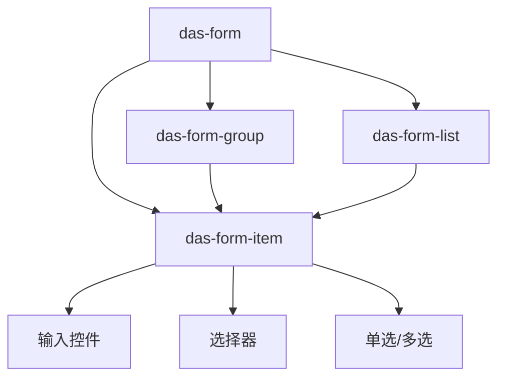

# DAS Form 表单

<cite>
**本文档引用文件**   
- [das-form.md](file://das-components-folder/docs/das-form.md)
- [das-select.md](file://das-components-folder/docs/das-select.md)
- [mapMenu.vue](file://src/components/uedModule/menu/mapMenu.vue)
</cite>

## 目录
1. [简介](#简介)
2. [核心功能与架构](#核心功能与架构)
3. [表单域管理](#表单域管理)
4. [表单校验机制](#表单校验机制)
5. [布局与样式配置](#布局与样式配置)
6. [高级功能](#高级功能)
7. [协同工作模式](#协同工作模式)
8. [常见问题与解决方案](#常见问题与解决方案)

## 简介

DAS Form 组件是基于 Ant Design Vue 的表单组件，旨在提供更灵活、功能更丰富的表单解决方案。它不仅继承了 Ant Design Form 的所有特性，还扩展了多种布局方式、分组管理、批量新增、互斥显示等高级功能，使其成为处理复杂数据输入场景的核心载体。本文档将深入解析 DAS Form 的各项能力，包括其表单域管理、校验规则、布局配置等，并提供在用户注册、配置管理等场景下的完整代码示例。

## 核心功能与架构

DAS Form 组件的核心功能围绕着灵活的布局、强大的数据管理和丰富的交互体验展开。其架构设计遵循模块化原则，通过 `das-form` 作为容器，`das-form-item` 作为基本单元，`das-form-group` 进行分组，以及 `das-form-list` 实现批量操作，构建了一个层次清晰、易于扩展的表单系统。



**Diagram sources**
- [das-form.md](file://das-components-folder/docs/das-form.md)

## 表单域管理

表单域（form item）是构成表单的基本单元，由 `das-form-item` 组件表示。每个表单域通过 `name` 属性与 `model` 对象中的字段进行绑定，实现数据的双向绑定。

### 关键属性

- **model**: 表单数据对象，是所有表单域数据的集合。
- **name**: 表单域的唯一标识，用于关联 `model` 中的字段。
- **label**: 表单域的标签文本，显示在输入控件之前。
- **required**: 布尔值，标记该字段是否为必填项。

### 动态表单项管理

DAS Form 支持动态添加和移除表单项，这主要通过 `das-form-list` 组件实现。`das-form-list` 可以以卡片或表格模式展示一组结构相同的表单项。

#### 批量新增表单项（表格模式）

此模式适用于需要以表格形式管理多条数据的场景，如批量配置IP地址。

```vue
<template>
  <das-form ref="formRef" :model="formState" @finish="onFinish">
    <das-form-list
      type="table"
      name="items"
      :min="1"
      :max="5"
      :columns="[
        { title: '元素', key: 'name' },
        { title: '备注', key: 'remark' },
        { title: '操作', key: 'action', width: 120, align: 'center' }
      ]"
      v-model:value="formState.items"
    >
      <template #bodyCell="{ column, record }">
        <template v-if="column.key === 'name'">
          <a-input v-model:value="record.name" placeholder="请输入内容" />
        </template>
        <template v-else-if="column.key === 'remark'">
          <a-input v-model:value="record.remark" placeholder="请输入备注" />
        </template>
      </template>
    </das-form-list>
    <a-space>
      <a-button type="primary" html-type="submit">提交</a-button>
      <a-button @click="handleReset">取消</a-button>
    </a-space>
  </das-form>
</template>

<script lang="ts" setup>
import { ref } from 'vue';

const formRef = ref();
const initialItems = [{ name: '元素测试', remark: '备注备注' }];
const formState = ref({ items: [...initialItems] });

const onFinish = (values: any) => {
  console.log('提交数据:', values);
};

const handleReset = () => {
  formRef.value?.resetFields();
  formState.value.items = [...initialItems];
};
</script>
```

**Section sources**
- [das-form.md](file://das-components-folder/docs/das-form.md#L922-L1122)

#### 批量新增表单项（卡片模式）

此模式适用于需要以卡片形式展示每条数据的场景，每条数据可以包含多个字段。

```vue
<template>
  <das-form ref="formRef" :model="formState" @finish="onFinish">
    <das-form-list
      type="card"
      name="items"
      :min="1"
      :max="5"
      v-model:value="formState.items"
    >
      <template #default="{ record }">
        <das-form-item label="元素">
          <a-input v-model:value="record.name" placeholder="请输入内容" />
        </das-form-item>
        <das-form-item label="备注">
          <a-input v-model:value="record.remark" placeholder="请输入备注" />
        </das-form-item>
      </template>
    </das-form-list>
    <a-space>
      <a-button type="primary" html-type="submit">提交</a-button>
      <a-button @click="handleReset">取消</a-button>
    </a-space>
  </das-form>
</template>
```

**Section sources**
- [das-form.md](file://das-components-folder/docs/das-form.md#L922-L1122)

## 表单校验机制

DAS Form 提供了强大的表单校验能力，通过 `rules` 属性定义校验规则，并通过 `validate`、`resetFields` 等方法进行控制。

### 校验规则 (rules)

`rules` 是一个对象，其键为表单域的 `name`，值为一个校验规则数组。每个规则可以包含 `required`、`message`、`trigger` 等属性。

```typescript
const rules = {
  basic_name: [{ required: true, message: '请输入名称', trigger: 'blur' }],
  basic_level: [{ required: true, message: '请选择等级', trigger: 'change' }]
};
```

### 核心方法

- **validate()**: 触发整个表单的校验。返回一个 Promise，校验通过时 resolve，失败时 reject。
- **resetFields()**: 重置表单数据和校验状态到初始值。
- **clearValidate()**: 移除指定表单项的校验结果。

### 异步校验实现

虽然文档中未明确说明，但根据 Ant Design Vue 的设计模式，DAS Form 的异步校验是通过在 `rules` 中返回一个 Promise 来实现的。例如，可以创建一个异步校验函数来检查用户名是否已存在。

```typescript
const asyncValidator = async (rule, value) => {
  if (!value) {
    return Promise.reject('请输入用户名');
  }
  // 模拟异步API调用
  const response = await checkUsernameExists(value);
  if (response.exists) {
    return Promise.reject('用户名已存在');
  }
  return Promise.resolve();
};

// 在 rules 中使用
const rules = {
  username: [{ validator: asyncValidator, trigger: 'blur' }]
};
```

**Section sources**
- [das-form.md](file://das-components-folder/docs/das-form.md#L1000-L1122)
- [mapMenu.vue](file://src/components/uedModule/menu/mapMenu.vue#L153-L352)

## 布局与样式配置

DAS Form 支持四种布局方式，以适应不同的使用场景。

### 布局方式

- **horizontal (水平布局)**: 标签在左，控件在右，适合详细的数据录入表单。
- **vertical (垂直布局)**: 标签在上，控件在下，适合移动端或窄屏场景。
- **inline (行内布局)**: 表单项水平排列，适合简单的查询表单。
- **inline-vertical (行内垂直布局)**: 结合了行内和垂直布局的特点。

### 自定义配置

- **label-width**: 通过 `inline-label-width` 属性可以统一设置行内布局时的标签宽度。
- **label-align**: 通过 `label-align` 属性可以设置标签的对齐方式（左对齐或右对齐）。

```vue
<das-form :layout="formLayout" :inline-label-width="'100px'" :label-align="labelAlign">
  <!-- 表单项 -->
</das-form>
```

**Section sources**
- [das-form.md](file://das-components-folder/docs/das-form.md#L500-L1000)

## 高级功能

### 表单分组 (das-form-group)

使用 `das-form-group` 可以将相关的表单项组织在一起，支持卡片式和可折叠模式。

```vue
<das-form-group id="basic" title="基本信息" :card="true">
  <das-form-item label="名称" name="groupName" required>
    <a-input v-model:value="formState.groupName" />
  </das-form-item>
</das-form-group>
```

### 导航锚点

当表单很长时，可以使用 `show-anchor` 属性开启导航锚点功能，帮助用户快速定位到不同的分组。

```vue
<das-form :show-anchor="true" anchor-position="right" :anchors="anchors">
  <!-- 分组 -->
</das-form>
```

### 互斥表单 (depends)

通过 `depends` 属性可以实现表单项的互斥显示。例如，当一个开关打开时，才显示其相关的配置项。

```vue
<das-form-item label="专家模式" name="expertMode">
  <a-switch v-model:checked="formState.expertMode" />
</das-form-item>
<das-form-item
  label="高级配置"
  name="advancedConfig"
  :depends="{ type: 'switch', field: 'expertMode', value: true }"
>
  <a-input v-model:value="formState.advancedConfig" />
</das-form-item>
```

**Section sources**
- [das-form.md](file://das-components-folder/docs/das-form.md#L500-L1000)

## 协同工作模式

DAS Form 组件可以与 DAS Select、DAS Input 等其他 DAS 组件无缝协同工作。

### 与 DAS Select 协同

在 `das-form-item` 中使用 `das-select` 作为输入控件，可以实现下拉选择功能。

```vue
<das-form-item label="等级" name="demo_level">
  <das-select
    v-model:value="config.model.demo_level"
    :options="levelOptions"
    style="width: 100%"
  />
</das-form-item>
```

### 与 DAS Input 协同

虽然 `das-input` 组件未在文档中找到，但可以推断其与 `a-input` 类似，可以直接在 `das-form-item` 中使用。

```vue
<das-form-item label="名称" name="demo_name" required>
  <a-input v-model:value="config.model.demo_name" placeholder="请输入内容" />
</das-form-item>
```

**Section sources**
- [das-form.md](file://das-components-folder/docs/das-form.md)
- [das-select.md](file://das-components-folder/docs/das-select.md)

## 常见问题与解决方案

### 表单数据重置失败

**问题**: 调用 `resetFields()` 后，表单数据未恢复到初始值。

**解决方案**: 确保 `model` 对象的初始值是在组件 `setup` 或 `created` 钩子中定义的，并且 `resetFields()` 被正确调用。如果使用了 `ref`，确保引用正确。

```typescript
// 正确的做法
const initialFormState = { ... };
const formState = ref({ ...initialFormState });

const handleReset = () => {
  formRef.value?.resetFields(); // 重置校验状态
  formState.value = { ...initialFormState }; // 手动重置数据
};
```

### 校验不触发

**问题**: 表单校验规则未按预期触发。

**解决方案**: 检查 `rules` 中的 `trigger` 属性是否设置正确。例如，`trigger: 'blur'` 表示在输入框失去焦点时触发，`trigger: 'change'` 表示在值改变时触发。确保 `name` 属性与 `model` 中的字段名完全匹配。

```typescript
// 确保 trigger 设置正确
const rules = {
  name: [{ required: true, message: '请输入名称', trigger: 'blur' }]
};
```

**Section sources**
- [das-form.md](file://das-components-folder/docs/das-form.md)
- [mapMenu.vue](file://src/components/uedModule/menu/mapMenu.vue#L153-L352)