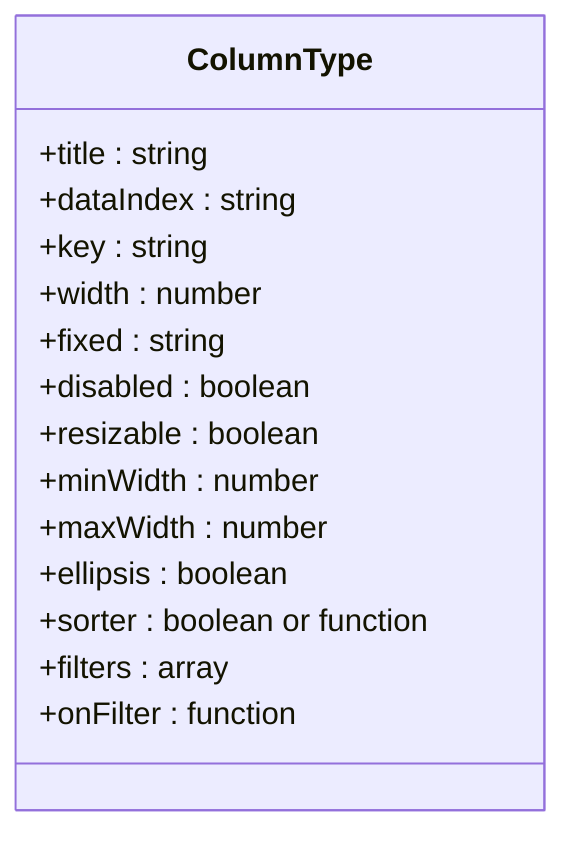
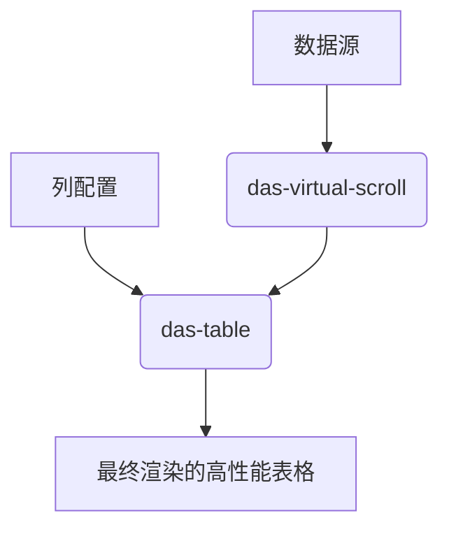

# DAS 表格

<cite>
**本文档引用文件**   
- [das-table.md](file://das-components-folder/docs/das-table.md#L0-L724)
- [das-virtual-scroll.md](file://das-components-folder/docs/das-virtual-scroll.md#L0-L149)
</cite>

## 目录
1. [简介](#简介)
2. [核心特性](#核心特性)
3. [列配置详解](#列配置详解)
4. [数据绑定与分页控制](#数据绑定与分页控制)
5. [自定义单元格渲染](#自定义单元格渲染)
6. [大数据量性能优化](#大数据量性能优化)
7. [后端API集成](#后端api集成)
8. [常见问题诊断与修复](#常见问题诊断与修复)

## 简介
DAS 表格组件是一个功能强大的数据展示核心组件，专为处理结构化数据而设计。它支持数据选择、排序、筛选、展开行等复杂交互，并提供灵活的表头和单元格内容自定义能力。该组件集成了操作栏、快捷查询、一键折叠、列设置等实用功能，极大地提升了数据展示的灵活性和用户体验。

**Section sources**
- [das-table.md](file://das-components-folder/docs/das-table.md#L0-L17)

## 核心特性
DAS 表格组件提供了一系列高级功能，使其成为复杂数据展示场景的理想选择。

### 动态参数配置
组件支持通过属性动态调整其行为，无需修改内部逻辑即可实现多种展示效果。
- **自定义刷新周期**：通过 `refreshIntervals` 属性设置可选的刷新时间间隔（单位：分钟），默认值为 `[5, 10, 20]`。
- **固定列设置**：在 `columns` 配置中，将某列的 `disabled` 属性设为 `true`，该列将作为固定项在列设置中始终显示。
- **隐藏多选框**：将 `selection` 属性设为 `false`，可隐藏表格左侧的多选框。
- **隐藏分页器**：将 `pagination` 属性设为 `false`，可隐藏分页工具栏。

### 表格内容展开
通过 `#expand` 插槽，可以为每一行数据定义展开内容，用于展示更详细的附加信息。

```vue
<template #expand="{ record }">
    详情 {{ record.name }}
</template>
```

### 表格吸附
通过 `sticky` 属性，可以实现表头和分页器的固定吸附效果，当表格内容滚动时，表头和分页器会固定在视口顶部。

```vue
<das-table :sticky="true" />
```

**Section sources**
- [das-table.md](file://das-components-folder/docs/das-table.md#L168-L231)
- [das-table.md](file://das-components-folder/docs/das-table.md#L232-L292)
- [das-table.md](file://das-components-folder/docs/das-table.md#L293-L344)

## 列配置详解
`columns` 属性是 DAS 表格的核心配置，它定义了表格的每一列的显示和行为。

### 基本列属性
| 属性 | 说明 | 类型 | 默认值 |
| --- | --- | --- | --- |
| **title** | 列头显示文字 | `string` | - |
| **dataIndex** | 列数据在数据项中对应的路径 | `string` | - |
| **key** | 列的唯一标识 | `string` | - |
| **width** | 列宽度 | `string\|number` | - |
| **fixed** | 列是否固定 | `boolean\|string` | false |
| **disabled** | 是否固定显示（不被列设置隐藏） | `boolean` | false |

### 高级列功能
- **列宽调整**：通过设置 `resizable: true` 和 `width`（必须为数字），用户可以拖动调整列宽。同时可设置 `minWidth` 和 `maxWidth` 限制调整范围。
- **内容省略**：设置 `ellipsis: true`，当单元格内容过长时会自动省略，并通过 tooltip 显示完整内容。
- **排序与筛选**：
  - **排序**：`sorter` 属性可设置为 `true`（启用默认排序）或一个自定义比较函数。
  - **筛选**：通过 `filters` 数组定义筛选菜单项，并通过 `onFilter` 函数定义本地筛选逻辑。



**Diagram sources**
- [das-table.md](file://das-components-folder/docs/das-table.md#L652-L679)

**Section sources**
- [das-table.md](file://das-components-folder/docs/das-table.md#L652-L679)

## 数据绑定与分页控制
DAS 表格通过 `dataSource` 和分页相关属性实现数据的展示和导航。

### 数据绑定
- **dataSource**：一个 `any[]` 类型的数组，包含表格要展示的所有数据行。
- **rowKey**：指定数据行的唯一标识字段名，默认为 `'id'`。对于没有 `id` 字段的数据，必须通过此属性指定。

### 分页控制
DAS 表格支持两种分页模式：
1.  **内部分页**：当不传递 `current` 和 `pageSize` 属性时，组件会自动处理所有数据的分页。
2.  **外部/服务端分页**：通过传递 `current`、`pageSize` 和 `total` 属性，由外部逻辑（通常是后端API）控制分页。

| 属性 | 说明 | 类型 | 默认值 |
| --- | --- | --- | --- |
| **current** | 当前页码 | `number` | 1 |
| **pageSize** | 每页展示行数 | `number` | 10 |
| **total** | 数据总条数 | `number` | 0 |
| **pagination** | 是否显示分页器 | `boolean` | true |

**Section sources**
- [das-table.md](file://das-components-folder/docs/das-table.md#L652-L679)

## 自定义单元格渲染
通过插槽（Slots），DAS 表格允许对表格的各个部分进行深度自定义。

### 核心插槽
| 插槽名 | 说明 | 作用域参数 |
| --- | --- | --- |
| **operate** | 操作栏插槽 | `{ rowSelection, rowSelectionData }` |
| **shortcut** | 快捷操作插槽 | - |
| **headerCell** | 自定义表头单元格 | `{ column }` |
| **bodyCell** | 自定义单元格内容 | `{ column, record, text }` |
| **expand** | 自定义展开行内容 | `{ record }` |

### 实现示例
以下示例展示了如何使用 `#bodyCell` 插槽根据不同的列渲染复杂内容，如标签、进度条、开关等。

```vue
<template #bodyCell="{ column, record }">
  <!-- 标签组 -->
  <div v-if="column.dataIndex === 'tags'">
    <a-tag v-for="(ite, ind) in record.tags.slice(0, 2)" :key="ind" color="processing">{{ite}}</a-tag>
    <a-popover v-if="record.tags.slice(2).length > 0">
      <template #content>
        <p v-for="ite in record.tags.slice(2)">{{ite}}</p>
      </template>
      <a-tag color="processing">+2</a-tag>
    </a-popover>
  </div>
  <!-- 进度条 -->
  <div v-if="column.dataIndex === 'progess'">
    <a-progress :percent="record.progess" />
  </div>
  <!-- 开关 -->
  <div v-if="column.dataIndex === 'switch'">
    <a-popconfirm :title="`确定${record.switch ? '关闭' : '开启'}此选项吗?`">
      <a-switch :checked="record.switch" />
    </a-popconfirm>
  </div>
  <!-- 复制功能 -->
  <div v-if="column.dataIndex === 'address'">
    <div class="das-table-copybox">
      <div>{{ record.address }}</div>
      <div class="das-copy-iconbox">
        <a-tooltip title="复制">
          <CopyOutlined/>
        </a-tooltip>
      </div>
    </div>
  </div>
</template>
```

**Section sources**
- [das-table.md](file://das-components-folder/docs/das-table.md#L403-L650)

## 大数据量性能优化
当数据量巨大时（例如超过1000条），直接渲染会导致页面卡顿。DAS 提供了 `das-virtual-scroll` 组件来解决此问题。

### 虚拟滚动原理
`das-virtual-scroll` 组件采用虚拟化技术，只渲染视口内可见的数据项，而非全部数据。这能显著减少 DOM 节点数量，提升滚动性能。

### 与 DAS 表格集成
虽然文档中未直接展示 `das-table` 与 `das-virtual-scroll` 的集成，但可以推断，对于超大数据集，应将 `das-virtual-scroll` 作为底层渲染引擎，而 `das-table` 负责提供列配置、排序、筛选等高级功能。两者结合可实现高性能的大型表格。



**Diagram sources**
- [das-virtual-scroll.md](file://das-components-folder/docs/das-virtual-scroll.md#L0-L149)

**Section sources**
- [das-virtual-scroll.md](file://das-components-folder/docs/das-virtual-scroll.md#L0-L149)

## 后端API集成
DAS 表格通过 `@change` 事件与后端API进行集成，实现服务端的排序、筛选和分页。

### 参数传递
当用户进行分页、排序或筛选操作时，`@change` 事件会触发，并携带以下参数：
- **pagination**：包含 `current`（当前页）和 `pageSize`（每页大小）。
- **filters**：一个对象，键为 `dataIndex`，值为选中的筛选值数组。
- **sorter**：包含排序字段 `field` 和排序方式 `order`（'ascend' 或 'descend'）。

### 集成模式
```vue
<das-table
  :data-source="dataSource"
  :current="currentPage"
  :total="total"
  @change="handleTableChange"
/>

<script setup>
const handleTableChange = (pagination, filters, sorter) => {
  // 构造请求参数
  const params = {
    page: pagination.current,
    size: pagination.pageSize,
    ...filters,
    sortBy: sorter.field,
    sortOrder: sorter.order
  };
  // 发起API请求获取新数据
  fetchData(params).then(response => {
    dataSource.value = response.data;
    total.value = response.total;
  });
};
</script>
```

**Section sources**
- [das-table.md](file://das-components-folder/docs/das-table.md#L345-L401)

## 常见问题诊断与修复
### 表头错位
**问题描述**：表格滚动时，表头与数据列无法对齐。
**可能原因与修复**：
1.  **列宽未固定**：如果列宽是动态计算的（如使用百分比），在数据加载或窗口缩放时可能导致错位。**修复方法**：为所有列设置固定的 `width` 值。
2.  **虚拟滚动集成问题**：如果与 `das-virtual-scroll` 集成，确保 `itemHeight` 设置正确且所有行高度一致。

### 固定列失效
**问题描述**：设置了 `fixed: 'left'` 或 `fixed: 'right'` 的列未能固定。
**可能原因与修复**：
1.  **缺少 scroll.x 配置**：固定列功能依赖于表格的横向滚动。**修复方法**：必须在 `scroll` 属性中设置 `x` 值（例如 `:scroll="{ x: 1800 }"`），以启用横向滚动。
2.  **父容器样式问题**：父容器的 CSS 可能影响了固定定位。**修复方法**：检查父容器是否有 `overflow: hidden` 等限制性样式。

### 注意事项
- 在 `#shortcut` 插槽中使用 `<a-form-item>` 时，该查询项会自动纳入高级筛选。
- 表格的 `sticky` 吸附功能依赖于父容器的 CSS 属性，需确保父容器有正确的 `position` 和 `overflow` 设置。

**Section sources**
- [das-table.md](file://das-components-folder/docs/das-table.md#L718-L724)