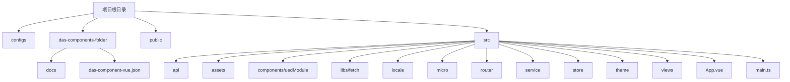
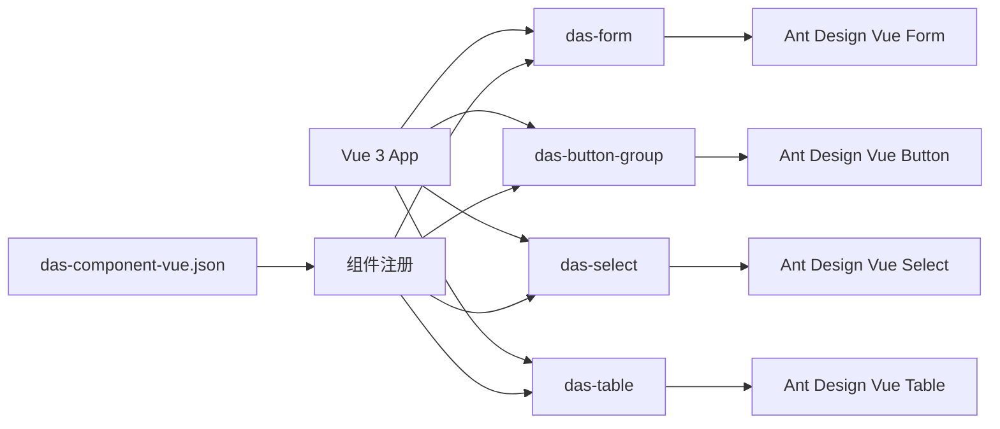
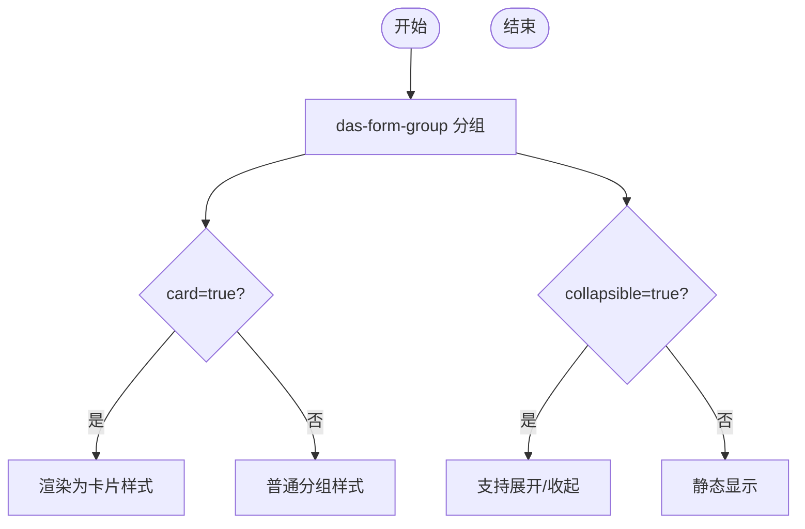
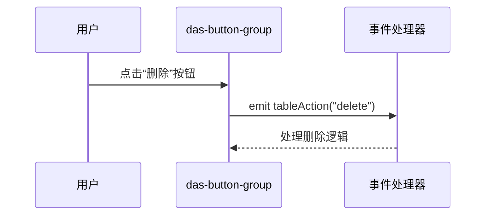
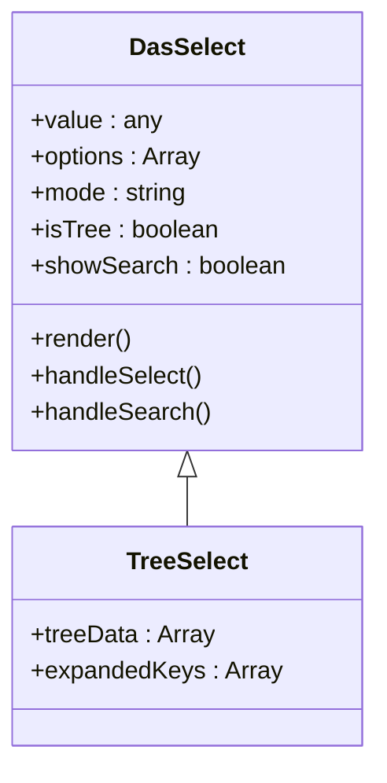

# DAS 基础组件库

<cite>
**本文档中引用的文件**  
- [das-form.md](file://das-components-folder/docs/das-form.md)
- [das-button-group.md](file://das-components-folder/docs/das-button-group.md)
- [das-select.md](file://das-components-folder/docs/das-select.md)
- [das-table.md](file://das-components-folder/docs/das-table.md)
- [das-component-vue.json](file://das-components-folder/das-component-vue.json)
</cite>

## 目录
1. [简介](#简介)
2. [项目结构](#项目结构)
3. [核心组件](#核心组件)
4. [架构概览](#架构概览)
5. [详细组件分析](#详细组件分析)
6. [依赖分析](#依赖分析)
7. [性能考量](#性能考量)
8. [常见问题与解决方案](#常见问题与解决方案)
9. [结论](#结论)

## 简介
DAS 基础组件库是一个基于 Vue 3 和 Ant Design Vue 构建的 UI 组件集合，旨在为前端开发提供一套统一、可复用、高可访问性的界面元素。该组件库覆盖了按钮、表单、表格、通知、弹窗等常用 UI 组件，支持灵活的布局、样式定制和国际化。本文档全面文档化该组件库中的核心组件，结合 Markdown 文档和 JSON 元数据，详细说明其用途、API 接口、使用示例及设计理念。

## 项目结构
项目采用模块化结构，主要分为配置、组件文档、公共资源和源码四大部分。组件文档集中存放在 `das-components-folder/docs` 目录下，每个组件有独立的 `.md` 文件说明其用法和 API。组件元数据通过 `das-component-vue.json` 进行统一注册和管理。



**图示来源**
- [das-component-vue.json](file://das-components-folder/das-component-vue.json)
- [project_structure](file://project_structure)

## 核心组件
DAS 组件库的核心组件包括表单（das-form）、按钮组（das-button-group）、选择器（das-select）和表格（das-table）等，这些组件均继承自 Ant Design Vue 并进行了功能扩展，以满足复杂业务场景的需求。

**组件来源**
- [das-form.md](file://das-components-folder/docs/das-form.md)
- [das-button-group.md](file://das-components-folder/docs/das-button-group.md)
- [das-select.md](file://das-components-folder/docs/das-select.md)
- [das-table.md](file://das-components-folder/docs/das-table.md)

## 架构概览
整个组件库采用基于 Vue 3 的组合式 API 架构，通过 `setup` 函数和 `ref`、`reactive` 等响应式 API 实现组件逻辑。组件通过 `props` 接收外部配置，通过 `emits` 触发事件，并支持 `slots` 进行内容分发。组件注册信息集中管理于 `das-component-vue.json` 中，便于统一维护和按需加载。



**图示来源**
- [das-component-vue.json](file://das-components-folder/das-component-vue.json)
- [das-form.md](file://das-components-folder/docs/das-form.md)
- [das-button-group.md](file://das-components-folder/docs/das-button-group.md)

## 详细组件分析

### das-form 表单组件分析
das-form 是一个功能强大的表单组件，扩展了 Ant Design Vue 的原生表单功能，支持多种布局方式、分组、导航锚点和互斥显示等高级特性。

#### 布局模式
支持四种布局：水平、垂直、行内、行内垂直，适应不同场景需求。

**API 属性表**

| 参数 | 说明 | 类型 | 默认值 |
| --- | --- | --- | --- |
| layout | 布局方式 | `'horizontal' \| 'vertical' \| 'inline' \| 'inline-vertical'` | `'horizontal'` |
| label-align | 标签对齐方式 | `'left' \| 'right'` | `'right'` |
| inline-label-width | 行内布局时标签宽度 | `string` | - |
| inline-columns | 行内布局时每行列数 | `number` | 3 |

#### 表单分组与导航
通过 `das-form-group` 实现分组，支持卡片式和可折叠模式。通过 `show-anchor` 启用导航锚点，支持自动识别和手动配置两种模式。



**图示来源**
- [das-form.md](file://das-components-folder/docs/das-form.md#das-form-06-表单分组)

**组件来源**
- [das-form.md](file://das-components-folder/docs/das-form.md)

### das-button-group 按钮组组件分析
按钮组组件支持多种业务场景，包括表单操作、分步表单、树结构操作、筛选、表格操作等。

#### 按钮类型与配置
通过 `type` 参数区分不同使用场景，如 `form`、`step`、`table` 等。每种类型有对应的配置属性。

**API 属性表**

| 参数 | 说明 | 类型 | 默认值 |
| --- | --- | --- | --- |
| type | 按钮组类型 | `'form' \| 'step' \| 'tree' \| 'filter' \| 'table' \| 'row'` | `'form'` |
| form-type | 表单类型（新增/编辑） | `'add' \| 'edit'` | `'add'` |
| actions | 表格操作按钮列表 | `TableButton[]` | `[]` |
| has-selection | 是否有选中项 | `boolean` | `false` |

#### 事件处理
组件提供丰富的事件回调，如 `tableAction`、`search`、`reset` 等，便于处理用户交互。



**图示来源**
- [das-button-group.md](file://das-components-folder/docs/das-button-group.md#events)

**组件来源**
- [das-button-group.md](file://das-components-folder/docs/das-button-group.md)

### das-select 选择器组件分析
选择器组件支持基础选择、分组选择、树形选择等多种模式，具备搜索、虚拟滚动、最大选择数限制等高级功能。

#### 选择模式
支持单选、多选、标签模式（tags），可通过 `mode` 属性设置。

**API 属性表**

| 参数 | 说明 | 类型 | 默认值 |
| --- | --- | --- | --- |
| mode | 选择模式 | `'default' \| 'multiple' \| 'tags'` | `'default'` |
| is-tree | 是否为树形选择器 | `boolean` | `false` |
| show-search | 是否显示搜索框 | `boolean` | `false` |
| select-max-count | 多选时最大可选数量 | `number` | - |

#### 高级功能
- **下拉搜索**：在下拉面板内独立搜索框，适用于大数据量。
- **快捷全选**：提供一键全选/取消功能。
- **横向拉伸**：支持拖拽调整下拉面板宽度。



**图示来源**
- [das-select.md](file://das-components-folder/docs/das-select.md)

**组件来源**
- [das-select.md](file://das-components-folder/docs/das-select.md)

### das-table 表格组件分析
表格组件提供数据展示、排序、筛选、分页、列设置等完整功能，支持自定义列、插槽和异步加载。

#### 核心功能
- 支持固定列、可拖拽列宽、列排序
- 内置分页器，支持远程分页
- 支持行内操作按钮组（das-button-group）
- 可通过 `columns-setting` 组件实现列的显示/隐藏

#### 性能优化
- 使用虚拟滚动处理大数据量
- 支持懒加载子节点数据
- 提供 `row-key` 优化渲染性能

**API 属性表（示例）**

| 参数 | 说明 | 类型 | 默认值 |
| --- | --- | --- | --- |
| data | 表格数据源 | `Array` | `[]` |
| columns | 列配置 | `Array` | `[]` |
| pagination | 分页配置 | `Object` | `{}` |
| loading | 是否加载中 | `boolean` | `false` |

**组件来源**
- [das-table.md](file://das-components-folder/docs/das-table.md)

## 依赖分析
组件库主要依赖 Ant Design Vue 作为基础 UI 框架，通过 `vite.config` 系列文件进行构建配置。组件之间通过 props 和 events 进行通信，低耦合高内聚。`das-component-vue.json` 作为组件注册中心，实现了组件的集中管理和按需加载。

```mermaid
graph TD
A[das-components] --> B[ant-design-vue]
A --> C[vue@3]
D[vite.config] --> A
E[das-component-vue.json] --> A
```

**图示来源**
- [das-component-vue.json](file://das-components-folder/das-component-vue.json)
- [vite.config.base.ts](file://configs/vite.config.base.ts)

## 性能考量
- **虚拟滚动**：在 `das-select` 和 `das-table` 中使用，避免渲染大量 DOM 节点。
- **按需加载**：通过 `das-component-vue.json` 配置，支持组件的懒加载。
- **防抖搜索**：在搜索功能中使用防抖，避免频繁触发请求。
- **响应式设计**：组件支持不同屏幕尺寸下的自适应布局。

## 常见问题与解决方案

### 样式覆盖问题
当自定义样式无法生效时，可能是由于 CSS 优先级不足。解决方案：
1. 使用 `!important` 强制覆盖
2. 在 `style` 标签中添加 `scoped` 并使用深度选择器 `::v-deep`
3. 在全局样式中定义

### 异步加载失败
当组件异步加载失败时，检查：
- 网络连接是否正常
- 组件路径是否正确
- `das-component-vue.json` 中的注册信息是否准确
- 使用 `try-catch` 包裹异步加载逻辑，并提供 fallback UI

### 表单验证不触发
确保：
- `rules` 配置正确
- `name` 属性与 `model` 中的字段对应
- 使用 `ref` 调用 `validate()` 方法手动触发验证

## 结论
DAS 基础组件库提供了一套完整、灵活、高性能的 UI 组件解决方案。通过标准化的设计和丰富的 API，显著提升了开发效率和用户体验。建议在项目中统一使用该组件库，并遵循其设计规范，以保证界面的一致性和可维护性。