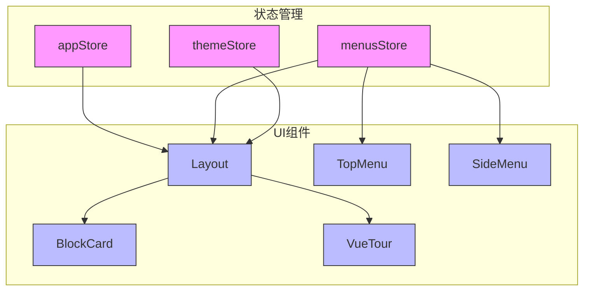
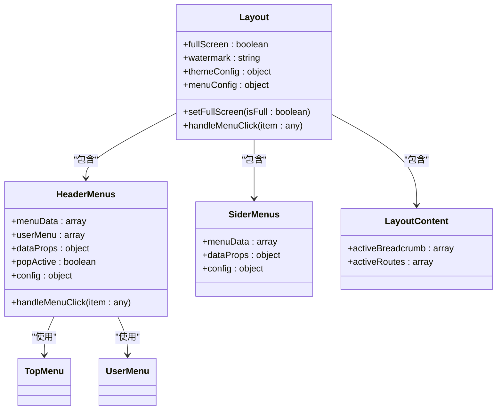
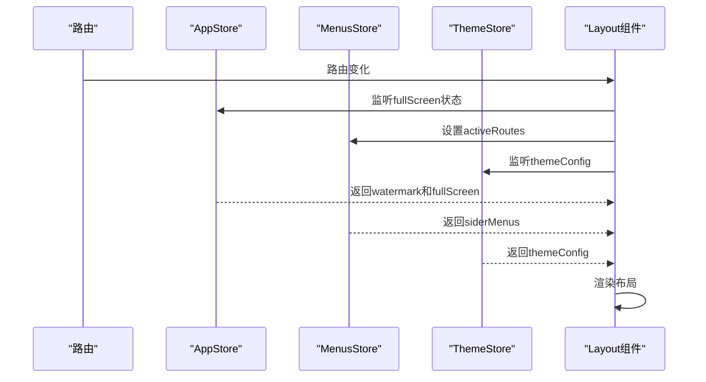
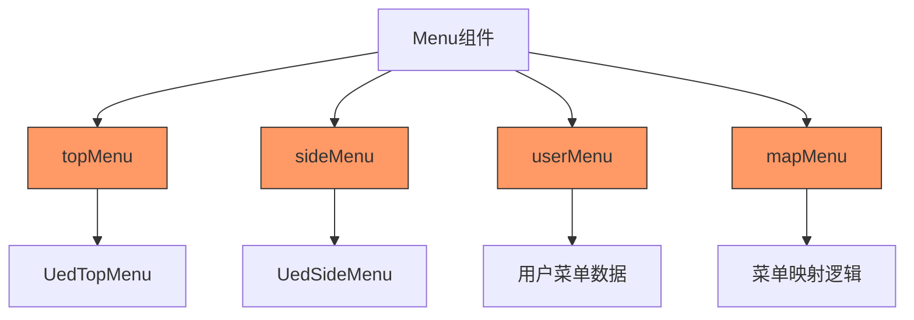
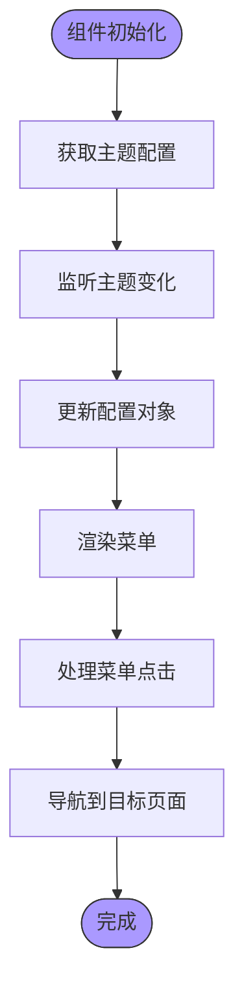
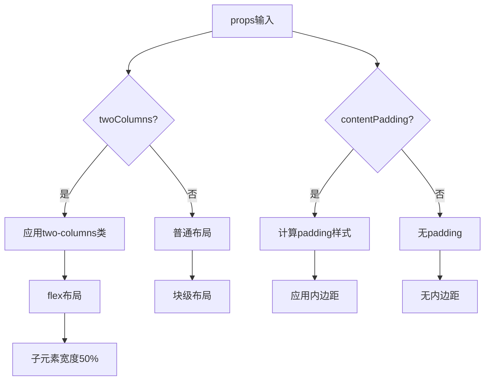
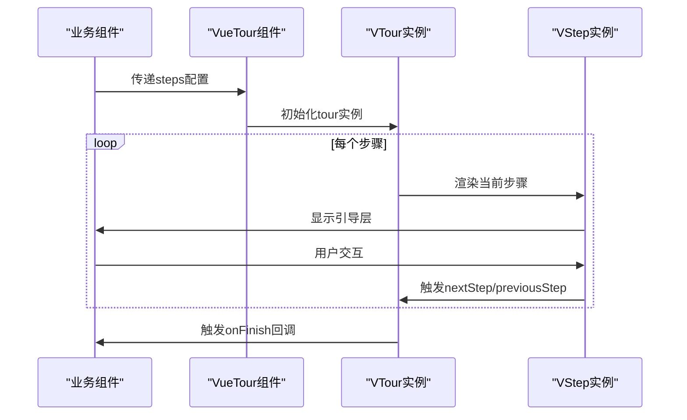
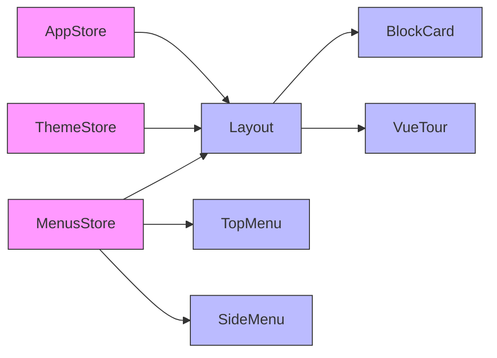

# UED 模块化业务组件

<cite>
**本文档引用文件**   
- [index.vue](file://src/components/uedModule/layout/index.vue)
- [HeaderMenus.vue](file://src/components/uedModule/layout/comps/HeaderMenus.vue)
- [LayoutContent.vue](file://src/components/uedModule/layout/comps/LayoutContent.vue)
- [SiderMenus.vue](file://src/components/uedModule/layout/comps/SiderMenus.vue)
- [topMenu.vue](file://src/components/uedModule/menu/topMenu.vue)
- [sideMenu.vue](file://src/components/uedModule/menu/sideMenu.vue)
- [userMenu.vue](file://src/components/uedModule/menu/userMenu.vue)
- [mapMenu.vue](file://src/components/uedModule/menu/mapMenu.vue)
- [index.vue](file://src/components/uedModule/blockCard/index.vue)
- [index.vue](file://src/components/uedModule/vueTour/index.vue)
- [index.ts](file://src/store/uedModule/app/index.ts)
- [index.ts](file://src/store/uedModule/menus/index.ts)
- [index.ts](file://src/store/uedModule/theme/index.ts)
</cite>

## 目录
1. [项目结构](#项目结构)
2. [核心组件](#核心组件)
3. [架构概览](#架构概览)
4. [详细组件分析](#详细组件分析)
5. [依赖关系分析](#依赖关系分析)

## 项目结构

UED模块化业务组件位于`src/components/uedModule`目录下，包含布局系统、菜单组件、卡片容器和引导式交互组件等核心业务组件。该模块通过Pinia进行状态管理，实现了组件间的高效数据联动。

```mermaid
graph TB
subgraph "UED模块"
A[blockCard]
B[layout]
C[menu]
D[vueTour]
end
B --> E[HeaderMenus]
B --> F[LayoutContent]
B --> G[SiderMenus]
C --> H[topMenu]
C --> I[sideMenu]
C --> J[userMenu]
C --> K[mapMenu]
A -.-> "卡片容器"
B -.-> "布局系统"
C -.-> "菜单组件"
D -.-> "引导式交互"
```

**图示来源**
- [项目结构](file://src/components/uedModule)

**本节来源**
- [项目结构](file://src/components/uedModule)

## 核心组件

UED模块化业务组件主要包括四大核心部分：布局系统（Layout）、顶部/侧边菜单（TopMenu/SideMenu）、卡片容器（BlockCard）和引导式交互组件（VueTour）。这些组件通过props和emit实现父子通信，并与Pinia store进行数据联动，形成了完整的业务组件体系。

**本节来源**
- [index.vue](file://src/components/uedModule/layout/index.vue)
- [index.vue](file://src/components/uedModule/blockCard/index.vue)
- [index.vue](file://src/components/uedModule/vueTour/index.vue)

## 架构概览

UED模块采用基于Vue 3的组合式API架构，通过Pinia实现全局状态管理。组件间通过props传递数据，通过emit触发事件，形成了清晰的单向数据流。布局系统作为容器，整合了顶部菜单、侧边菜单和内容区域，实现了灵活的页面布局。



**图示来源**
- [index.ts](file://src/store/uedModule/app/index.ts)
- [index.ts](file://src/store/uedModule/menus/index.ts)
- [index.ts](file://src/store/uedModule/theme/index.ts)
- [index.vue](file://src/components/uedModule/layout/index.vue)

## 详细组件分析

### 布局系统分析

布局系统是UED模块的核心容器组件，负责整合页面的整体结构。它通过响应式设计适配不同屏幕尺寸，并支持全屏模式切换。

#### 布局组件结构


**图示来源**
- [index.vue](file://src/components/uedModule/layout/index.vue)
- [HeaderMenus.vue](file://src/components/uedModule/layout/comps/HeaderMenus.vue)
- [SiderMenus.vue](file://src/components/uedModule/layout/comps/SiderMenus.vue)
- [LayoutContent.vue](file://src/components/uedModule/layout/comps/LayoutContent.vue)

**本节来源**
- [index.vue](file://src/components/uedModule/layout/index.vue)

#### 布局系统数据流


**图示来源**
- [index.vue](file://src/components/uedModule/layout/index.vue)
- [index.ts](file://src/store/uedModule/app/index.ts)
- [index.ts](file://src/store/uedModule/menus/index.ts)
- [index.ts](file://src/store/uedModule/theme/index.ts)

### 菜单组件分析

菜单组件包括顶部菜单、侧边菜单、用户菜单和映射菜单，通过统一的数据结构实现菜单的动态渲染和权限控制。

#### 菜单组件关系


**图示来源**
- [topMenu.vue](file://src/components/uedModule/menu/topMenu.vue)
- [sideMenu.vue](file://src/components/uedModule/menu/sideMenu.vue)
- [userMenu.vue](file://src/components/uedModule/menu/userMenu.vue)
- [mapMenu.vue](file://src/components/uedModule/menu/mapMenu.vue)

**本节来源**
- [topMenu.vue](file://src/components/uedModule/menu/topMenu.vue)

#### 顶部菜单数据联动


**图示来源**
- [topMenu.vue](file://src/components/uedModule/menu/topMenu.vue)
- [index.ts](file://src/store/uedModule/theme/index.ts)

### 卡片容器分析

卡片容器组件提供了一种标准化的内容展示方式，支持标题、描述、操作按钮和两列布局等特性。

#### 卡片容器结构
```mermaid
classDiagram
class BlockCard {
+title : string
+more : boolean
+topBorder : boolean
+titleBorder : boolean
+twoColumns : boolean
+contentPadding : number|string
+contentPaddingStyle : computed
}
BlockCard : "插槽 : description"
BlockCard : "插槽 : operation"
BlockCard : "插槽 : content"
```

**图示来源**
- [index.vue](file://src/components/uedModule/blockCard/index.vue)

**本节来源**
- [index.vue](file://src/components/uedModule/blockCard/index.vue)

#### 卡片容器响应式设计


**图示来源**
- [index.vue](file://src/components/uedModule/blockCard/index.vue)

### 引导式交互组件分析

引导式交互组件基于第三方库@ued-material/vue-tour封装，提供产品功能引导和新用户教程功能。

#### 引导式交互组件结构
```mermaid
classDiagram
class VueTour {
+name : string
+steps : array
+callbacks : object
+options : object
+tour : object
+currentStep : number
+previousStep()
+nextStep()
+stop()
+skip()
+finish()
}
VueTour : "插槽 : actions"
VueTour --> VTour : "使用"
VueTour --> VStep : "使用"
```

**图示来源**
- [index.vue](file://src/components/uedModule/vueTour/index.vue)

**本节来源**
- [index.vue](file://src/components/uedModule/vueTour/index.vue)

#### 引导式交互流程


**图示来源**
- [index.vue](file://src/components/uedModule/vueTour/index.vue)

## 依赖关系分析

UED模块各组件之间存在明确的依赖关系，通过Pinia store实现状态共享，通过props和emit实现组件通信。



**图示来源**
- [index.ts](file://src/store/uedModule/app/index.ts)
- [index.ts](file://src/store/uedModule/menus/index.ts)
- [index.ts](file://src/store/uedModule/theme/index.ts)
- [index.vue](file://src/components/uedModule/layout/index.vue)
- [topMenu.vue](file://src/components/uedModule/menu/topMenu.vue)
- [sideMenu.vue](file://src/components/uedModule/menu/sideMenu.vue)
- [index.vue](file://src/components/uedModule/blockCard/index.vue)
- [index.vue](file://src/components/uedModule/vueTour/index.vue)

**本节来源**
- [index.ts](file://src/store/index.ts)
- [index.vue](file://src/components/uedModule/layout/index.vue)