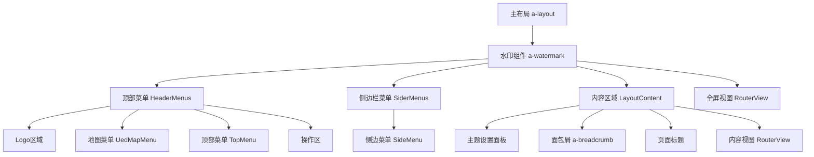
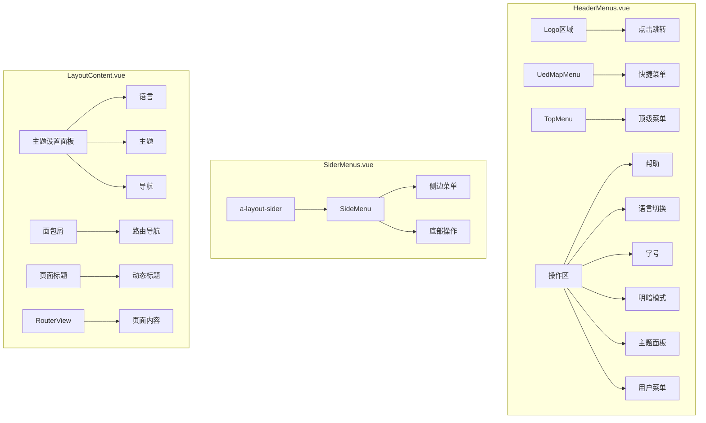
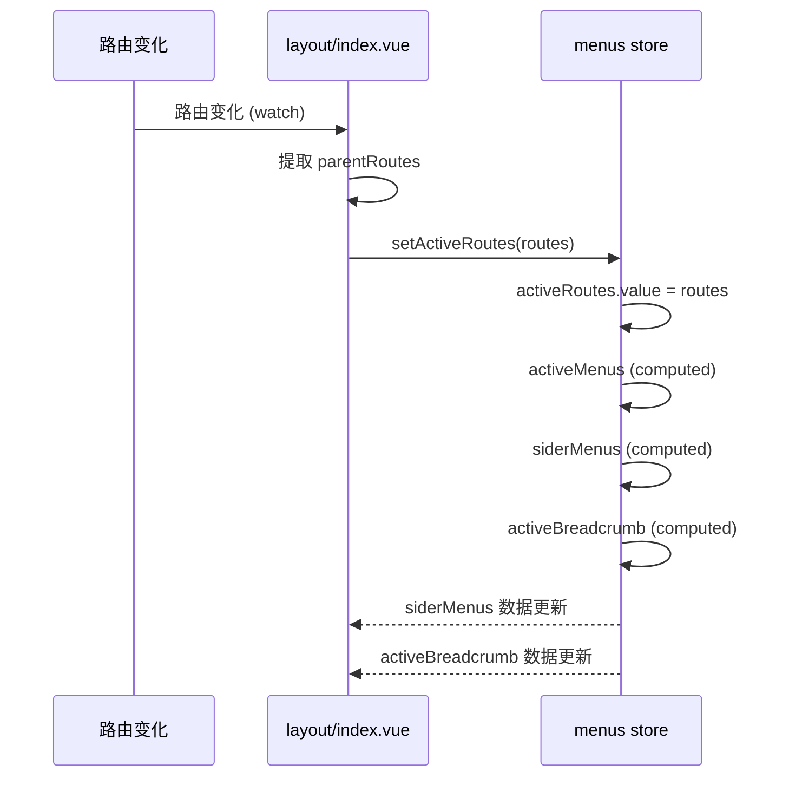

# 布局组件

<cite>
**本文档引用的文件**   
- [index.vue](file://src/components/uedModule/layout/index.vue)
- [HeaderMenus.vue](file://src/components/uedModule/layout/comps/HeaderMenus.vue)
- [SiderMenus.vue](file://src/components/uedModule/layout/comps/SiderMenus.vue)
- [LayoutContent.vue](file://src/components/uedModule/layout/comps/LayoutContent.vue)
- [index.ts](file://src/store/uedModule/menus/index.ts)
- [index.ts](file://src/store/uedModule/app/index.ts)
- [index.ts](file://src/store/uedModule/theme/index.ts)
- [sideMenu.vue](file://src/components/uedModule/menu/sideMenu.vue)
- [topMenu.vue](file://src/components/uedModule/menu/topMenu.vue)
- [userMenu.vue](file://src/components/uedModule/menu/userMenu.vue)
</cite>

## 目录
1. [主布局结构](#主布局结构)
2. [状态联动机制](#状态联动机制)
3. [响应式与移动端适配](#响应式与移动端适配)
4. [微前端集成方案](#微前端集成方案)
5. [布局定制化](#布局定制化)

## 主布局结构

主布局组件 `layout/index.vue` 采用 Ant Design Vue 的 `a-layout` 组件构建了完整的页面框架，通过组合 `HeaderMenus`、`SiderMenus` 和 `LayoutContent` 三个核心子组件，实现了灵活的布局模式。该布局支持多种配置，如侧边栏布局（side）、混合布局（mix）和顶部布局。



**图示来源**
- [index.vue](file://src/components/uedModule/layout/index.vue#L1-L305)
- [HeaderMenus.vue](file://src/components/uedModule/layout/comps/HeaderMenus.vue#L1-L494)
- [SiderMenus.vue](file://src/components/uedModule/layout/comps/SiderMenus.vue#L1-L82)
- [LayoutContent.vue](file://src/components/uedModule/layout/comps/LayoutContent.vue#L1-L304)

**主布局源码结构分析**

主布局的模板结构清晰地定义了页面的层级关系：

1.  **水印层**：最外层包裹了 `a-watermark` 组件，用于显示全局水印。
2.  **主容器**：`a-layout` 作为根容器，其高度为整个屏幕（`h-screen`），并根据主题配置动态添加 `dark` 或 `header-dark` CSS 类。
3.  **条件渲染**：
    *   当 `fullScreen` 状态为 `false` 时，渲染 `HeaderMenus` 和包含 `SiderMenus` 与 `LayoutContent` 的嵌套 `a-layout`。
    *   当 `fullScreen` 状态为 `true` 时，直接渲染 `RouterView`，实现全屏模式。
4.  **侧边栏逻辑**：`SiderMenus` 组件的显示由两个条件共同决定：一是主题配置 `themeConfig.layout` 为 `side` 或 `mix`，二是 `menus` store 中的 `siderMenus` 数据存在且不为空。

**主布局的响应式容器**

```vue
<template>
  <a-watermark :content="watermark">
    <a-layout
      class="h-screen"
      :class="{
        dark: themeConfig.mode === 'dark',
        'header-dark': themeConfig.mode === 'dark' || (themeConfig.mode === 'light' && themeConfig.topStyle === 'dark')
      }"
    >
      <HeaderMenus v-if="!fullScreen" v-bind="menuConfig"></HeaderMenus>
      <a-layout v-if="!fullScreen" class="ant-layout-has-sider">
        <SiderMenus
          v-if="themeConfig.layout === 'side' || (siderMenus && siderMenus.length > 0 && themeConfig.layout === 'mix')"
          v-bind="menuConfig"
        ></SiderMenus>
        <LayoutContent></LayoutContent>
      </a-layout>
      <RouterView v-if="fullScreen"></RouterView>
    </a-layout>
  </a-watermark>
</template>
```

**子组件功能说明**

*   **HeaderMenus**: 负责渲染页面顶部的导航栏，包含 Logo、地图菜单、顶部菜单和用户操作区。
*   **SiderMenus**: 负责渲染页面左侧的侧边栏菜单，其内容根据当前激活的顶级菜单动态变化。
*   **LayoutContent**: 负责渲染页面的主要内容区域，包含面包屑导航、页面标题和路由视图。

**子组件源码分析**



**图示来源**
- [HeaderMenus.vue](file://src/components/uedModule/layout/comps/HeaderMenus.vue#L1-L494)
- [SiderMenus.vue](file://src/components/uedModule/layout/comps/SiderMenus.vue#L1-L82)
- [LayoutContent.vue](file://src/components/uedModule/layout/comps/LayoutContent.vue#L1-L304)

## 状态联动机制

主布局组件通过 Pinia 状态管理库与 `menus` 和 `app` 模块进行深度联动，实现了菜单状态、页面标题和权限控制的统一管理。

### 与 Menus Store 的联动

`menus` store 是整个应用菜单系统的核心，它管理着菜单数据、激活状态和面包屑导航。

**Menus Store 核心状态**

```typescript
export default defineStore('menus', () => {
  // 菜单数据源
  const menusData = ref<MenuType[]>([]);
  // 菜单路径映射表，用于快速查找菜单
  const menusMap = new Map<string, MenuType[]>();
  // 激活的路由层级
  const activeRoutes = ref<RouteItemType[]>([]);
  // 激活的菜单层级（根据activeRoutes计算）
  const activeMenus = computed(() => { ... });
  // 侧边栏菜单数据（根据activeMenus计算）
  const siderMenus = computed<MenuProps['items']>(() => { ... });
  // 面包屑数据（activeMenus + activeRoutes）
  const activeBreadcrumb = computed(() => { ... });
  // 激活的顶级菜单ID
  const activeId = computed(() => { ... });

  return {
    menusData,
    setMenus,
    activeRoutes,
    setActiveRoutes,
    activeMenus,
    siderMenus,
    activeBreadcrumb,
    activeId,
    menusMap
  };
});
```

**联动流程分析**

1.  **初始化**：`layout/index.vue` 通过 `useMenusStore()` 获取 `menusStore` 实例，并使用 `storeToRefs` 将 `siderMenus` 状态映射为响应式引用。
2.  **路由监听**：组件使用 `watchEffect` 监听当前路由 `route` 的变化。
3.  **更新激活路由**：当路由变化时，从 `route.meta.parentRoutes` 中提取父级路由信息，并调用 `menusStore.setActiveRoutes(routes)` 更新 `activeRoutes` 状态。
4.  **自动计算**：`menus` store 内部的 `computed` 属性会自动响应 `activeRoutes` 的变化：
    *   `activeMenus` 会根据最新的 `activeRoutes` 从 `menusMap` 中反向查找对应的菜单层级。
    *   `siderMenus` 会根据 `activeMenus` 中的顶级菜单ID，从 `menusData` 中筛选出其子菜单并进行格式化。
    *   `activeBreadcrumb` 会将 `activeMenus` 和 `activeRoutes` 合并，形成完整的面包屑路径。



**图示来源**
- [index.vue](file://src/components/uedModule/layout/index.vue#L30-L55)
- [index.ts](file://src/store/uedModule/menus/index.ts#L1-L139)

### 与 App Store 的联动

`app` store 管理着应用级别的全局状态，如全屏模式、水印和主题面板的可见性。

**App Store 核心状态**

```typescript
export default defineStore<'app', AppStore>(
  'app',
  () => {
    // 水印文本
    const watermark = ref<string>('');
    // 主题面板是否可见
    const themePanelVisible = ref<boolean>(false);
    // 当前激活的模块ID（用于主题面板锚点）
    const activeModuleId = ref<string>('language');
    // 是否全屏模式
    const fullScreen = ref(false);

    return {
      watermark,
      setWatermark,
      themePanelVisible,
      setThemePanelVisible,
      activeModuleId,
      changeActiveModuleId,
      fullScreen,
      setFullScreen
    };
  }
);
```

**联动流程分析**

1.  **状态注入**：`layout/index.vue` 使用 `useAppStore()` 获取 `appStore` 实例，并通过 `storeToRefs` 将 `watermark` 和 `fullScreen` 映射为响应式引用。
2.  **水印联动**：`a-watermark` 组件的 `:content` 属性直接绑定到 `watermark` 状态，实现水印内容的动态更新。
3.  **全屏模式联动**：`HeaderMenus`、`SiderMenus` 和 `LayoutContent` 的显示与否，由 `v-if="!fullScreen"` 控制。当 `fullScreen` 为 `true` 时，这些组件隐藏，`RouterView` 全屏显示。
4.  **路由监听**：组件还监听路由变化，检查 `route.meta.fullScreen` 或通过 `routeCenter.getMeta()` 获取自定义元数据，来动态设置 `appStore.setFullScreen()` 状态。

**页面标题更新**

页面标题的更新是通过 `LayoutContent.vue` 组件实现的。它依赖于 `menus` store 的 `activeBreadcrumb` 计算属性。

```vue
<template>
  <!-- ... -->
  <div class="page-title">
    <div class="page-title-text">{{ pageTitle }}</div>
  </div>
  <!-- ... -->
</template>

<script setup lang="ts">
// 计算当前页面标题，取面包屑的最后一项
const pageTitle = computed(() => {
  return activeBreadcrumb.value[activeBreadcrumb.value.length - 1]?.title;
});
</script>
```

**权限可见性控制**

权限控制主要体现在菜单的显示上。虽然在提供的代码中没有显式的权限判断逻辑，但其设计模式支持此功能：
*   `menuConfig` 中的 `menuData` 是一个静态配置，但在实际项目中，这部分数据通常由后端接口返回，后端可以根据用户角色和权限动态生成菜单树。
*   `menusStore.setMenus()` 方法接收一个菜单数组，前端只需将后端返回的、经过权限过滤的菜单数据传入即可，`siderMenus` 和 `headerMenus` 等计算属性会自动更新。

## 响应式与移动端适配

当前代码库中，主布局组件本身并未实现复杂的响应式断点逻辑（如根据屏幕宽度自动折叠侧边栏）。其响应式行为主要依赖于以下机制：

1.  **手动折叠**：侧边栏的折叠状态由 `SiderMenus.vue` 组件内部的 `collapsed` ref 控制，用户通过点击菜单中的开关按钮来手动切换。
2.  **主题配置**：布局的样式（如颜色、字体大小）通过 `themeConfig` 进行全局配置，这些配置是响应式的，会实时影响所有组件。
3.  **全屏模式**：通过 `fullScreen` 状态，可以完全隐藏导航栏和侧边栏，为特定页面（如图表大屏）提供最大化的展示空间。

**移动端适配策略**

根据现有代码，该布局的移动端适配策略较为基础，主要体现在：

*   **无内置断点**：没有使用 CSS 媒体查询或 JavaScript 监听 `window.innerWidth` 来自动切换布局模式。
*   **依赖外部框架**：项目可能依赖于 Ant Design Vue 组件库自身的响应式能力，例如 `a-layout-sider` 组件可能在小屏幕上默认为折叠状态。
*   **未来扩展性**：可以通过在 `app` store 中增加一个 `isMobile` 状态，并在 `layout/index.vue` 中监听屏幕尺寸变化来实现。当检测到移动设备时，自动将 `themeConfig.layout` 设置为 `top` 或强制 `SiderMenus` 折叠。

## 微前端集成方案

该布局组件被设计为一个可复用的壳（Shell），能够无缝集成微前端子应用。

**集成方案**

1.  **子应用注册**：在主应用的 `menuConfig` 中，将微前端子应用的入口 URL 作为菜单项进行配置。例如，代码中已配置了 `vue2`、`vue3`、`react` 和 `angular` 子应用。
    ```typescript
    {
      id: 'micro',
      name: I18N.layout.MicroApp,
      icon: 'zq-icon zq-icon-liuliangdaili',
      url: '/vue2/#/home',
      children: [
        {
          id: 'vue2',
          name: `vue2${I18N.layout.App}`,
          url: '',
          children: [
            {
              id: 'vue-home',
              name: `home${I18N.layout.Page}`,
              url: '/vue2/#/home',
              module: 'vue2' // 标识子应用
            }
          ]
        }
      ]
    }
    ```
2.  **路由导航**：当用户点击微前端子应用的菜单时，`microMenuNavigation` 工具函数会被调用。该函数负责处理跨应用的路由跳转。
3.  **子应用配置**：每个微前端子应用需要在其 `public-path.js` 文件中配置 `__webpack_public_path__`，以确保资源能正确加载。
    ```javascript
    // src/micro/example/vue3/src/public-path.js
    if (window.__MICRO_APP_ENVIRONMENT__) {
      __webpack_public_path__ = window.__MICRO_APP_PUBLIC_PATH__
    }
    ```
4.  **复用布局**：微前端子应用可以完全复用主应用的 `layout/index.vue` 组件。子应用的路由视图（`RouterView`）将被渲染在主布局的 `LayoutContent` 区域内，从而继承主应用的导航、主题和状态管理。

## 布局定制化

该布局组件提供了多种方式通过 `props` 进行定制化。

**通过 menuConfig Prop 定制**

`menuConfig` 是传递给 `HeaderMenus` 和 `SiderMenus` 的核心配置对象，它允许开发者自定义菜单的行为和数据。

```typescript
const menuConfig = ref({
  // 自定义菜单数据字段的映射
  dataProps: {
    label: 'name', // 将数据中的 'name' 字段映射为菜单的 label
    children: 'children' // 将数据中的 'children' 字段映射为子菜单
  },
  // 用户菜单数据
  userMenu: [
    {
      id: 1,
      name: I18N.layout.tuiChuDengLu
    }
  ],
  // 菜单数据源
  menuData: [
    // ...
  ]
});
```

**可定制的关键属性**

*   **dataProps**: 允许开发者指定菜单数据中各个字段的名称，使其能适配不同的后端数据结构。
*   **userMenu**: 可以自定义用户菜单（如退出登录）的选项。
*   **menuData**: 可以完全替换默认的菜单树，实现个性化的导航结构。

**通过 Pinia Store 全局配置**

更深层次的定制是通过修改 `themeConfig` 和 `appConfig` 来实现的，这些配置存储在 Pinia store 中，影响全局。

*   **themeConfig**: 控制布局模式（`layout`）、颜色主题（`mode`）、顶部/侧边栏样式（`topStyle`/`sideStyle`）、是否显示面包屑（`breadcrumb`）等。
*   **appConfig**: 控制水印、全屏模式等应用级行为。

通过结合 `props` 和全局 `store` 配置，开发者可以灵活地调整布局的外观和行为，以满足不同项目的需求。