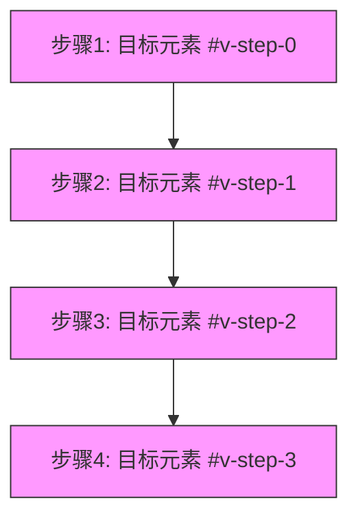
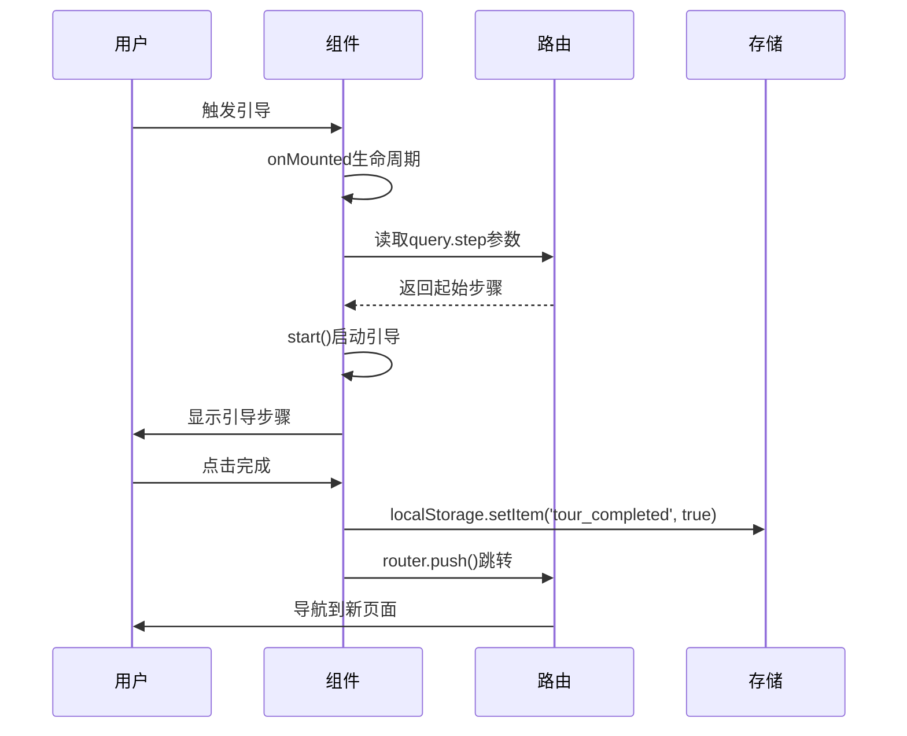
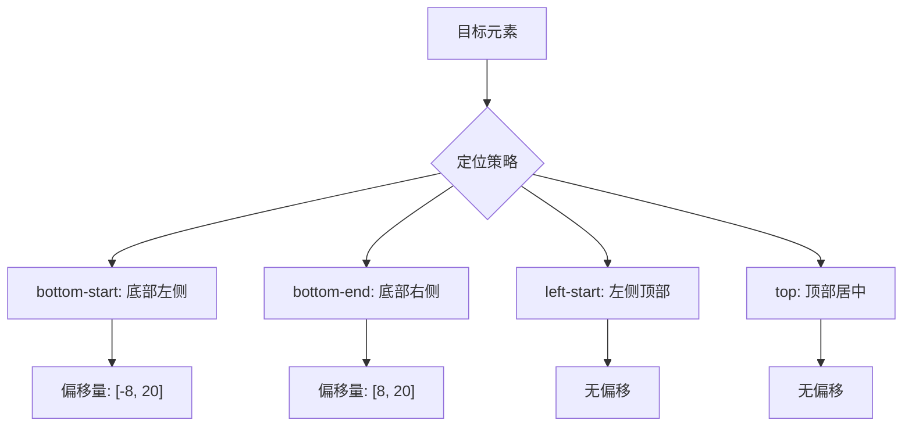

# 引导式交互组件

<cite>
**本文档引用的文件**   
- [index.vue](file://src/components/uedModule/vueTour/index.vue)
- [index.vue](file://src/views/uedTypical/vueTour/index.vue)
- [page2.vue](file://src/views/uedTypical/vueTour/page2.vue)
</cite>

## 目录
1. [产品功能概述](#产品功能概述)
2. [配置化引导步骤定义](#配置化引导步骤定义)
3. [应用状态集成机制](#应用状态集成机制)
4. [DOM元素定位策略](#dom元素定位策略)
5. [响应式设计与屏幕适配](#响应式设计与屏幕适配)
6. [新功能发布集成指南](#新功能发布集成指南)

## 产品功能概述

引导式交互组件是一种用于向用户介绍新功能、界面元素或操作流程的用户引导系统。该组件通过在界面上显示一系列带有说明文本的气泡提示，引导用户逐步了解应用的核心功能。组件支持自定义步骤、目标元素定位、提示内容配置以及交互按钮的个性化设置，为用户提供流畅的引导体验。

该组件基于Vue框架实现，采用配置化的方式定义引导流程，允许开发者通过简单的JSON配置来定义每个引导步骤的目标元素、提示标题、内容描述和定位策略。组件还支持回调函数机制，可以在引导流程的各个阶段执行自定义逻辑，如数据收集、用户行为分析等。

**Section sources**
- [index.vue](file://src/components/uedModule/vueTour/index.vue#L0-L81)
- [index.vue](file://src/views/uedTypical/vueTour/index.vue#L0-L137)

## 配置化引导步骤定义

### 引导步骤配置结构

引导组件通过`steps`属性接收一个步骤配置数组，每个步骤对象包含以下关键配置项：

```json
{
  "target": "#v-step-0",
  "title": "点击到下一步",
  "content": "默认为绑定元素区域",
  "params": {
    "maskPadding": 8,
    "hideCloseBtn": true
  },
  "labels": {
    "buttonNext": "自定义下一步文字"
  },
  "popover": {
    "placement": "bottom-start",
    "modifiers": [
      {
        "name": "offset",
        "options": {
          "offset": [-8, 20]
        }
      }
    ]
  }
}
```

**关键配置项说明：**

- **target**: 指定引导步骤的目标元素选择器，通常使用ID选择器（如`#v-step-0`）来精确定位DOM元素
- **title**: 引导气泡的标题文本，用于简要说明当前步骤的目的
- **content**: 引导气泡的详细内容，提供更详细的说明信息
- **params**: 步骤特定的参数配置，如遮罩层内边距、是否隐藏关闭按钮等
- **labels**: 按钮文本的本地化配置，支持自定义"上一步"、"下一步"和"完成"按钮的显示文本
- **popover**: 气泡提示的定位配置，包括放置位置和偏移量调整

### 多步骤引导流程

组件支持定义多步骤引导流程，通过在`steps`数组中按顺序定义多个步骤对象来实现。每个步骤可以有不同的目标元素和提示内容，形成完整的引导路径。



**Diagram sources**
- [index.vue](file://src/views/uedTypical/vueTour/index.vue#L0-L65)

**Section sources**
- [index.vue](file://src/views/uedTypical/vueTour/index.vue#L0-L65)

## 应用状态集成机制

### 引导流程启动条件

引导组件的启动通过Vue实例的生命周期钩子和路由参数来控制。在组件挂载后，通过`onMounted`钩子启动引导流程，并支持从路由查询参数中读取起始步骤。

```javascript
onMounted(() => {
  nextTick(() => {
    console.log('>>instance>>>', instance.proxy.$tours, route.params);
    instance.proxy.$tours.myTour.start(route.query.step || 0);
  });
});
```

启动条件分析：
1. **组件挂载完成**: 使用`onMounted`生命周期钩子确保DOM元素已渲染完成
2. **异步更新队列**: 使用`nextTick`确保Vue的异步更新队列已处理完毕
3. **全局实例访问**: 通过`instance.proxy.$tours`访问全局注册的引导实例
4. **起始步骤控制**: 支持通过路由查询参数`step`指定起始步骤，实现从特定步骤开始引导

### 步骤状态持久化

组件通过路由参数实现步骤状态的临时持久化。当用户完成引导流程后，可以通过路由跳转将完成状态传递到其他页面。

```javascript
const muCustomFinishCallback = (val) => {
  document.documentElement.scrollTop = 0;
  console.log('>>finish>>>', val);
  router.push(`/vueTour-page2?fromPath=${route.path}&stepLen=${steps.value.length - 1}`);
};
```

完成回调中，组件将以下信息编码到路由参数中：
- `fromPath`: 原始页面路径，用于返回
- `stepLen`: 步骤总数，用于状态验证

### 完成标记存储

虽然当前实现主要依赖路由参数进行状态传递，但项目中存在使用`localStorage`进行状态持久化的模式，可用于扩展引导完成状态的长期存储。

```javascript
// 示例：使用localStorage存储用户状态
localStorage.setItem('user-store', JSON.stringify(state));
```

建议的完成标记存储方案：
1. **短期会话存储**: 使用路由参数在页面间传递状态
2. **长期持久化存储**: 使用`localStorage`记录用户已完成的引导任务
3. **用户偏好存储**: 结合用户ID存储个性化引导偏好



**Diagram sources**
- [index.vue](file://src/views/uedTypical/vueTour/index.vue#L60-L117)
- [page2.vue](file://src/views/uedTypical/vueTour/page2.vue#L46-L82)

**Section sources**
- [index.vue](file://src/views/uedTypical/vueTour/index.vue#L60-L117)
- [page2.vue](file://src/views/uedTypical/vueTour/page2.vue#L46-L82)

## DOM元素定位策略

### 动态加载元素处理

对于动态加载的DOM元素，引导组件采用以下策略确保准确定位：

1. **延迟初始化**: 在`onMounted`钩子中使用`nextTick`确保DOM更新完成
2. **异步等待**: 通过Vue的响应式系统等待目标元素渲染完成
3. **实例访问**: 通过`getCurrentInstance()`获取当前组件实例，访问全局注册的引导实例

```javascript
const instance = getCurrentInstance();
onMounted(() => {
  nextTick(() => {
    myTour.value = instance?.proxy?.$tours.myTour;
    myTour.value.start();
  });
});
```

这种策略确保了即使目标元素是通过异步操作或条件渲染生成的，也能在元素存在后正确启动引导。

### 气泡定位实现

组件通过`popover`配置项实现灵活的气泡定位策略，支持多种放置位置和偏移量调整。

**支持的放置位置：**
- `bottom-start`: 底部开始位置
- `bottom-end`: 底部结束位置
- `left-start`: 左侧开始位置
- `top`: 顶部居中位置

**偏移量配置：**
通过`modifiers`数组中的`offset`配置项，可以精确调整气泡位置：

```json
"popover": {
  "placement": "bottom-start",
  "modifiers": [
    {
      "name": "offset",
      "options": {
        "offset": [-8, 20]
      }
    }
  ]
}
```

偏移量数组`[x, y]`表示：
- `x`: 水平偏移量（负值向左，正值向右）
- `y`: 垂直偏移量（负值向上，正值向下）



**Diagram sources**
- [index.vue](file://src/views/uedTypical/vueTour/index.vue#L0-L65)

**Section sources**
- [index.vue](file://src/views/uedTypical/vueTour/index.vue#L0-L65)

## 响应式设计与屏幕适配

### 屏幕尺寸适配策略

引导组件通过CSS变量和相对单位实现响应式设计，确保在不同屏幕尺寸下都能提供良好的用户体验。

**关键响应式特性：**
- **字体大小**: 使用CSS变量`var(--font-size-xl)`定义，可随主题配置调整
- **间距控制**: 使用相对单位`px`结合固定值，确保布局一致性
- **布局结构**: 采用简单的块级元素布局，避免复杂布局带来的适配问题

```css
.logo,
.title {
  font-size: var(--font-size-xl);
  line-height: 120px;
  margin: 50px;
}
```

### 气泡布局优化

组件通过以下方式优化不同屏幕尺寸下的气泡布局：
1. **相对定位**: 气泡相对于目标元素定位，避免绝对定位带来的屏幕边缘问题
2. **自动换行**: 文本内容支持自动换行，适应不同宽度的气泡容器
3. **按钮间距**: 通过CSS的`button + button`选择器确保按钮间有适当的间距

```css
:deep(.buttons) {
  button + button {
    margin-left: 6px;
  }
}
```

这种设计确保了即使在小屏幕设备上，引导气泡的交互元素也能清晰可辨，用户可以轻松进行操作。

**Section sources**
- [index.vue](file://src/components/uedModule/vueTour/index.vue#L59-L80)
- [index.vue](file://src/views/uedTypical/vueTour/index.vue#L119-L136)

## 新功能发布集成指南

### 集成步骤

在新功能发布时集成引导组件的完整步骤如下：

1. **引入组件**: 在目标页面中导入引导组件
2. **定义步骤**: 配置引导步骤数组，指定每个步骤的目标元素和提示内容
3. **设置回调**: 定义完成、下一步等操作的回调函数
4. **启动引导**: 在组件挂载后启动引导流程

### 配置示例

以下是一个完整的引导组件配置示例：

```vue
<script setup lang="ts">
import VueTour from '@/components/uedModule/vueTour/index.vue';

const router = useRouter();
const route = useRoute();

// 定义引导步骤
const steps = ref([
  {
    target: '#new-feature-button',
    title: '新功能介绍',
    content: '这是我们的最新功能，点击开始体验',
    params: {
      maskPadding: 8,
      hideCloseBtn: true
    },
    labels: {
      buttonNext: '开始体验'
    },
    popover: {
      placement: 'bottom-start',
      modifiers: [
        {
          name: 'offset',
          options: {
            offset: [-8, 20]
          }
        }
      ]
    }
  },
  {
    target: '#feature-settings',
    title: '功能设置',
    content: '在这里可以自定义新功能的参数',
    params: {
      maskPadding: 8
    },
    labels: {
      buttonPrevious: '返回',
      buttonNext: '继续'
    },
    popover: {
      placement: 'bottom-end',
      modifiers: [
        {
          name: 'offset',
          options: {
            offset: [8, 20]
          }
        }
      ]
    }
  }
]);

// 定义回调函数
const myCustomNextStepCallback = (currentStep: number) => {
  console.log(`进入第 ${currentStep + 1} 步`);
};

const muCustomFinishCallback = () => {
  // 引导完成后的处理
  localStorage.setItem('new-feature-tour-completed', 'true');
  message.success('恭喜完成新功能引导！');
};

const callbacks = ref({
  onNextStep: myCustomNextStepCallback,
  onFinish: muCustomFinishCallback
});

// 启动引导
const instance = getCurrentInstance();
onMounted(() => {
  nextTick(() => {
    instance.proxy.$tours.myTour.start(route.query.step || 0);
  });
});
</script>

<template>
  <div>
    <!-- 目标元素 -->
    <button id="new-feature-button">新功能</button>
    <div id="feature-settings">功能设置</div>
    
    <!-- 引导组件 -->
    <vue-tour name="myTour" :steps="steps" :callbacks="callbacks" />
  </div>
</template>
```

### 最佳实践

1. **目标元素ID命名**: 使用清晰的ID命名约定，如`v-step-{序号}`或`feature-{name}`
2. **国际化支持**: 使用`I18N`对象支持多语言，确保提示文本可本地化
3. **用户体验**: 避免过多步骤，一般不超过5步，保持引导简洁高效
4. **状态管理**: 结合`localStorage`记录用户已完成的引导，避免重复显示
5. **性能考虑**: 在复杂页面中延迟启动引导，确保页面完全加载后再显示

**Section sources**
- [index.vue](file://src/views/uedTypical/vueTour/index.vue#L0-L137)
- [page2.vue](file://src/views/uedTypical/vueTour/page2.vue#L0-L83)