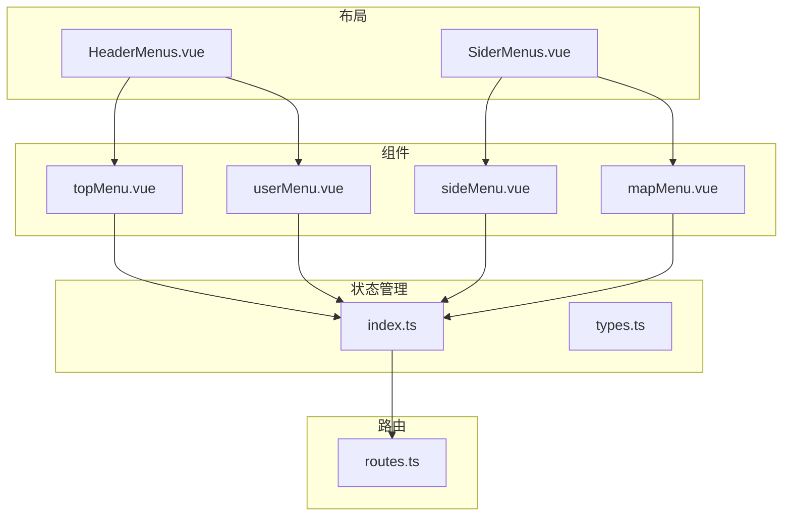
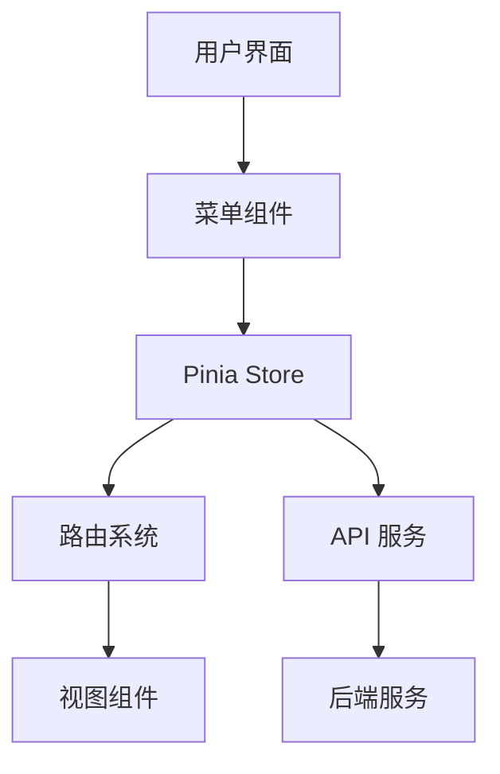
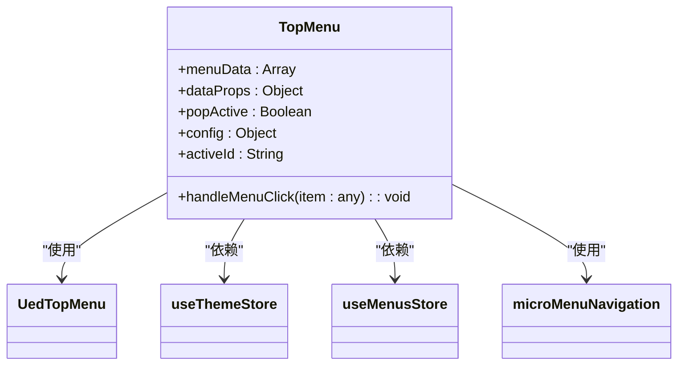
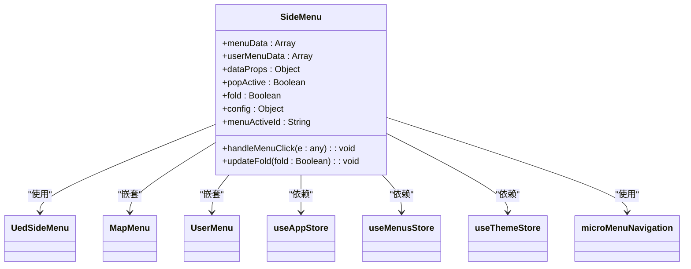
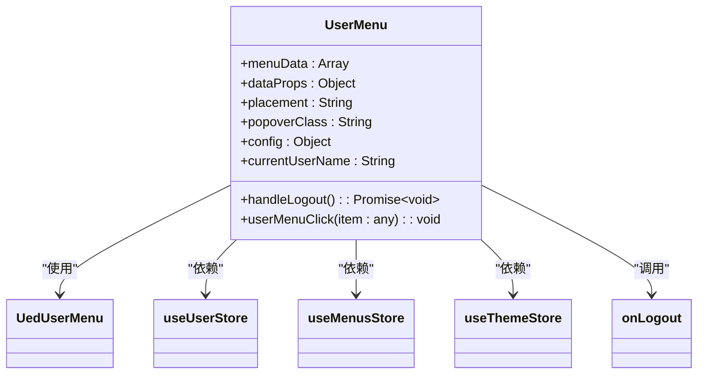
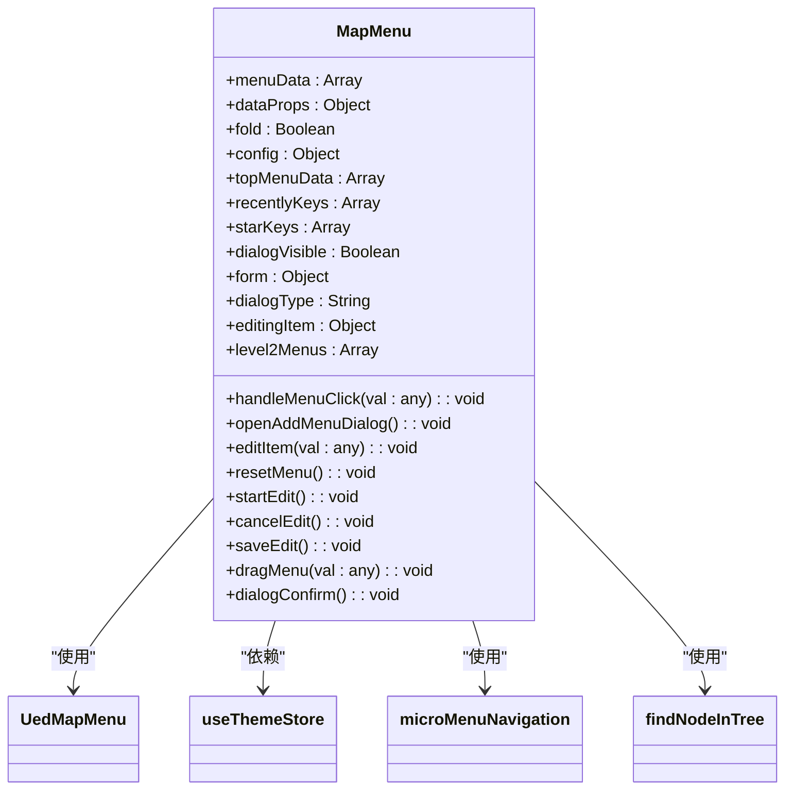
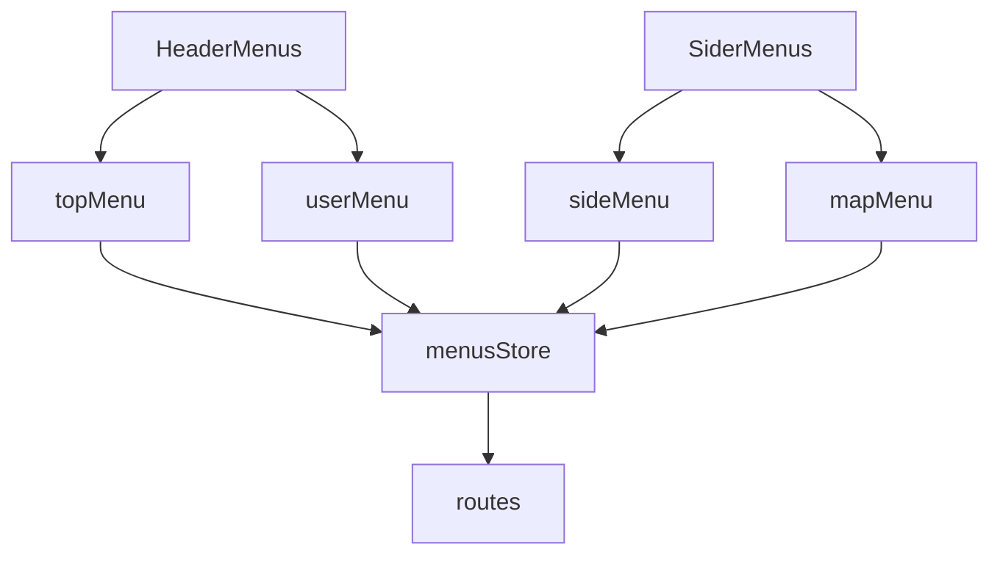

# 菜单组件

<cite>
**本文档中引用的文件**   
- [topMenu.vue](file://src/components/uedModule/menu/topMenu.vue)
- [sideMenu.vue](file://src/components/uedModule/menu/sideMenu.vue)
- [userMenu.vue](file://src/components/uedModule/menu/userMenu.vue)
- [mapMenu.vue](file://src/components/uedModule/menu/mapMenu.vue)
- [index.ts](file://src/store/uedModule/menus/index.ts)
- [types.ts](file://src/store/uedModule/menus/types.ts)
- [routes.ts](file://src/router/routes.ts)
- [HeaderMenus.vue](file://src/components/uedModule/layout/comps/HeaderMenus.vue)
- [SiderMenus.vue](file://src/components/uedModule/layout/comps/SiderMenus.vue)
- [common.ts](file://src/api/common.ts)
</cite>

## 目录
1. [引言](#引言)
2. [项目结构](#项目结构)
3. [核心组件](#核心组件)
4. [架构概述](#架构概述)
5. [详细组件分析](#详细组件分析)
6. [依赖分析](#依赖分析)
7. [性能考虑](#性能考虑)
8. [故障排除指南](#故障排除指南)
9. [结论](#结论)

## 引言
本文档详细说明了 `topMenu`、`sideMenu`、`userMenu` 和 `mapMenu` 四个菜单组件的设计与实现。文档化了这些组件与 `store/menus` 模块的数据绑定方式，包括动态菜单加载、权限过滤和选中状态同步。同时提供了菜单国际化适配和自定义图标集成的配置方法。

## 项目结构
项目结构遵循功能模块化设计，主要组件位于 `src/components/uedModule/menu` 目录下。菜单相关的状态管理由 `src/store/uedModule/menus` 模块负责。

**图示来源**
- [topMenu.vue](file://src/components/uedModule/menu/topMenu.vue)
- [sideMenu.vue](file://src/components/uedModule/menu/sideMenu.vue)
- [userMenu.vue](file://src/components/uedModule/menu/userMenu.vue)
- [mapMenu.vue](file://src/components/uedModule/menu/mapMenu.vue)
- [index.ts](file://src/store/uedModule/menus/index.ts)
- [types.ts](file://src/store/uedModule/menus/types.ts)
- [routes.ts](file://src/router/routes.ts)
- [HeaderMenus.vue](file://src/components/uedModule/layout/comps/HeaderMenus.vue)
- [SiderMenus.vue](file://src/components/uedModule/layout/comps/SiderMenus.vue)

**本节来源**
- [topMenu.vue](file://src/components/uedModule/menu/topMenu.vue)
- [sideMenu.vue](file://src/components/uedModule/menu/sideMenu.vue)
- [userMenu.vue](file://src/components/uedModule/menu/userMenu.vue)
- [mapMenu.vue](file://src/components/uedModule/menu/mapMenu.vue)

## 核心组件
核心菜单组件包括 `topMenu`、`sideMenu`、`userMenu` 和 `mapMenu`，它们分别负责顶部导航、侧边栏导航、用户信息和地图式导航的展示。

**本节来源**
- [topMenu.vue](file://src/components/uedModule/menu/topMenu.vue)
- [sideMenu.vue](file://src/components/uedModule/menu/sideMenu.vue)
- [userMenu.vue](file://src/components/uedModule/menu/userMenu.vue)
- [mapMenu.vue](file://src/components/uedModule/menu/mapMenu.vue)

## 架构概述
系统采用基于 Vue 3 和 Pinia 的组合式 API 架构。菜单组件通过 Pinia store 进行状态管理，并与路由系统集成。

**图示来源**
- [index.ts](file://src/store/uedModule/menus/index.ts)
- [routes.ts](file://src/router/routes.ts)

## 详细组件分析

### topMenu 分析
`topMenu` 组件实现顶部导航的一级菜单展示。

**图示来源**
- [topMenu.vue](file://src/components/uedModule/menu/topMenu.vue#L1-L83)

**本节来源**
- [topMenu.vue](file://src/components/uedModule/menu/topMenu.vue#L1-L83)

### sideMenu 分析
`sideMenu` 组件基于路由数据生成侧边栏并支持多级嵌套。

**图示来源**
- [sideMenu.vue](file://src/components/uedModule/menu/sideMenu.vue#L1-L261)

**本节来源**
- [sideMenu.vue](file://src/components/uedModule/menu/sideMenu.vue#L1-L261)

### userMenu 分析
`userMenu` 组件集成用户信息与退出功能。

**图示来源**
- [userMenu.vue](file://src/components/uedModule/menu/userMenu.vue#L1-L91)

**本节来源**
- [userMenu.vue](file://src/components/uedModule/menu/userMenu.vue#L1-L91)

### mapMenu 分析
`mapMenu` 组件实现地图式导航布局。

**图示来源**
- [mapMenu.vue](file://src/components/uedModule/menu/mapMenu.vue#L1-L353)

**本节来源**
- [mapMenu.vue](file://src/components/uedModule/menu/mapMenu.vue#L1-L353)

## 依赖分析
菜单组件之间存在明确的依赖关系，通过 Pinia store 进行状态共享。

**图示来源**
- [topMenu.vue](file://src/components/uedModule/menu/topMenu.vue)
- [sideMenu.vue](file://src/components/uedModule/menu/sideMenu.vue)
- [userMenu.vue](file://src/components/uedModule/menu/userMenu.vue)
- [mapMenu.vue](file://src/components/uedModule/menu/mapMenu.vue)
- [index.ts](file://src/store/uedModule/menus/index.ts)
- [routes.ts](file://src/router/routes.ts)
- [HeaderMenus.vue](file://src/components/uedModule/layout/comps/HeaderMenus.vue)
- [SiderMenus.vue](file://src/components/uedModule/layout/comps/SiderMenus.vue)

**本节来源**
- [topMenu.vue](file://src/components/uedModule/menu/topMenu.vue)
- [sideMenu.vue](file://src/components/uedModule/menu/sideMenu.vue)
- [userMenu.vue](file://src/components/uedModule/menu/userMenu.vue)
- [mapMenu.vue](file://src/components/uedModule/menu/mapMenu.vue)
- [index.ts](file://src/store/uedModule/menus/index.ts)

## 性能考虑
菜单组件采用响应式设计，通过 `watchEffect` 监听主题配置变化，确保界面及时更新。`mapMenu` 组件支持菜单的动态添加、编辑和拖拽排序，提升了用户体验。

## 故障排除指南
- **菜单不显示**：检查 `menuData` 是否正确传递，确认 `store/menus` 中的 `setMenus` 方法是否被正确调用。
- **选中状态不同步**：确保 `activeId` 计算属性正确绑定到 `menusStore` 的 `activeId`。
- **国际化失效**：检查 `langs` 对象是否正确配置，确认 `config.lang` 值是否有效。

**本节来源**
- [index.ts](file://src/store/uedModule/menus/index.ts#L1-L139)
- [topMenu.vue](file://src/components/uedModule/menu/topMenu.vue#L1-L83)
- [sideMenu.vue](file://src/components/uedModule/menu/sideMenu.vue#L1-L261)

## 结论
本文档详细分析了四个菜单组件的设计与实现，展示了它们如何通过 Pinia store 进行状态管理，并与路由系统集成。通过合理的架构设计，实现了菜单的动态加载、权限过滤和选中状态同步，为用户提供了一致的导航体验。