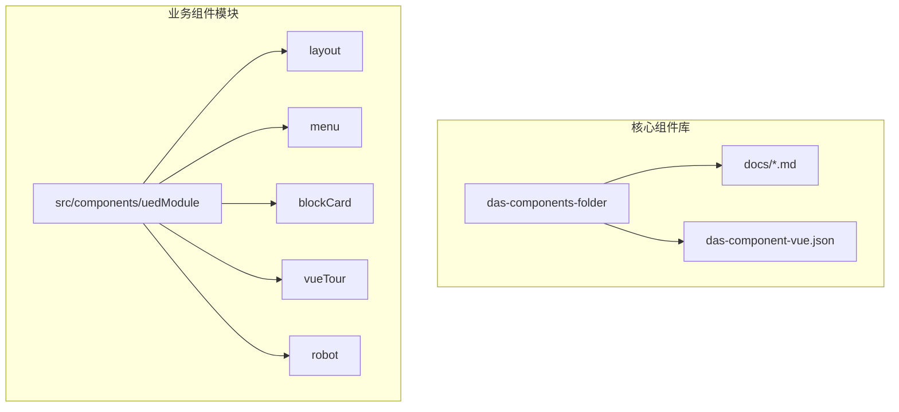
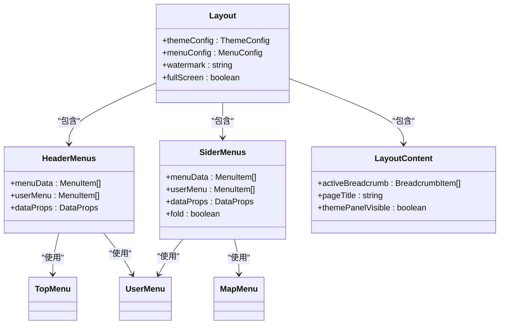
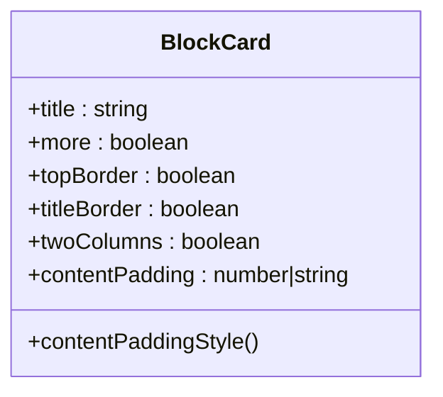

# 组件架构

<cite>
**本文档引用的文件**   
- [das-component-vue.json](file://das-components-folder/das-component-vue.json)
- [das-button-group.md](file://das-components-folder/docs/das-button-group.md)
- [das-table.md](file://das-components-folder/docs/das-table.md)
- [das-form.md](file://das-components-folder/docs/das-form.md)
- [index.vue](file://src/components/uedModule/layout/index.vue)
- [sideMenu.vue](file://src/components/uedModule/menu/sideMenu.vue)
- [topMenu.vue](file://src/components/uedModule/menu/topMenu.vue)
- [HeaderMenus.vue](file://src/components/uedModule/layout/comps/HeaderMenus.vue)
- [LayoutContent.vue](file://src/components/uedModule/layout/comps/LayoutContent.vue)
- [userMenu.vue](file://src/components/uedModule/menu/userMenu.vue)
- [blockCard/index.vue](file://src/components/uedModule/blockCard/index.vue)
</cite>

## 目录
1. [项目结构概览](#项目结构概览)
2. [DAS基础组件库](#das基础组件库)
3. [UED模块化组件](#ued模块化组件)
4. [组件调用示例](#组件调用示例)
5. [组件组合与样式隔离](#组件组合与样式隔离)

## 项目结构概览

本项目采用模块化设计，主要分为两大核心部分：`das-components-folder` 目录下的DAS基础组件库和 `src/components/uedModule` 目录下的UED模块化业务组件。



**图源**
- [das-component-vue.json](file://das-components-folder/das-component-vue.json)
- [index.vue](file://src/components/uedModule/layout/index.vue)

**本节来源**
- [das-component-vue.json](file://das-components-folder/das-component-vue.json)
- [index.vue](file://src/components/uedModule/layout/index.vue)

## DAS基础组件库

DAS基础组件库是一个基于Vue 3和Ant Design Vue的企业级组件库，提供了32个功能丰富的UI组件，覆盖了通用、布局、数据录入、数据展示、反馈等多个类别。

### 组件分类与功能

根据 `das-component-vue.json` 配置文件，DAS组件库主要分为以下几类：

- **通用组件**：提供色彩规范、过渡动画、异步按钮、按钮组等基础功能。
- **布局组件**：包含折叠框等复杂界面布局工具。
- **数据录入组件**：涵盖表单、SQL查询、搜索栏、下拉选择器、穿梭框、表格输入等。
- **数据展示组件**：包括文字提示、空状态、标签页、帮助文本、高亮、标签、详情展示、指标卡片、信息卡片、表格、数据导出、混合加载、虚拟列表、趋势线条、简单图表、文字滚动等。
- **反馈组件**：提供通知提醒框、站内通知、通知提示、气泡提示、抽屉等用户反馈机制。
- **其他组件**：包含国际化、自动标签更多、列设置等工具类组件。

### 核心组件API详解

#### das-button-group 按钮组

按钮组组件用于展示一组相关的操作按钮，支持多种使用场景。

**属性接口 (Props)**

| 属性名 | 说明 | 类型 | 默认值 |
| :--- | :--- | :--- | :--- |
| type | 按钮组类型 | string | 'form' |
| form-type | 表单场景类型 | string | 'add' |
| align | 对齐方式 | string | 'center' |
| is-advanced | 是否为高级筛选 | boolean | false |
| is-expanded | 筛选区域是否展开 | boolean | false |
| show-save-template | 是否显示保存模板按钮 | boolean | false |
| tree-buttons | 树形操作按钮配置 | Array | [] |
| more-actions | 更多操作菜单项 | Array | [] |
| show-text | 图标按钮是否显示文字 | boolean | false |

**事件回调 (Events)**

| 事件名 | 说明 | 回调参数 |
| :--- | :--- | :--- |
| search | 搜索按钮点击 | - |
| reset | 重置按钮点击 | - |
| toggle-advanced | 切换高级筛选状态 | - |
| prev | 上一步按钮点击 | - |
| next | 下一步按钮点击 | - |
| submit | 提交按钮点击 | - |
| cancel | 取消按钮点击 | - |
| tree-action | 树形操作按钮点击 | action (操作类型) |
| table-action | 表格操作按钮点击 | action (操作类型) |

**插槽 (Slots)**

- `default`: 默认插槽，用于自定义按钮内容。

**本节来源**
- [das-button-group.md](file://das-components-folder/docs/das-button-group.md)

#### das-table 表格

表格组件是功能强大的数据展示工具，支持自定义刷新、一键折叠、列设置等高级功能。

**属性接口 (Props)**

| 属性名 | 说明 | 类型 | 默认值 |
| :--- | :--- | :--- | :--- |
| columns | 表格列配置 | Array | [] |
| data-source | 表格数据源 | Array | [] |
| row-key | 行数据的Key | string | 'id' |
| selection | 是否显示多选框 | boolean | true |
| pagination | 是否显示分页 | boolean | true |
| refreshIntervals | 自定义刷新周期（分钟） | Array | [] |
| hideTool | 是否隐藏工具栏 | boolean | false |
| storageKey | 列设置存储键 | string | - |

**事件回调 (Events)**

| 事件名 | 说明 | 回调参数 |
| :--- | :--- | :--- |
| change | 表格查询条件变化 | pagination, filters, sorter |
| select | 选择项变化 | selectedRowKeys, selectedRows |
| columnChange | 列设置变化 | columns |

**插槽 (Slots)**

| 插槽名 | 说明 | 作用域参数 |
| :--- | :--- | :--- |
| operate | 操作项插槽 | rowSelection, rowSelectionData |
| shortcut | 快捷查询插槽 | - |
| headerCell | 自定义表头插槽 | column |
| bodyCell | 单元格内容插槽 | column, record |

**本节来源**
- [das-table.md](file://das-components-folder/docs/das-table.md)

#### das-form 表单

表单组件在Ant Design Vue基础上扩展了更灵活的布局方式。

**属性接口 (Props)**

| 属性名 | 说明 | 类型 | 默认值 |
| :--- | :--- | :--- | :--- |
| layout | 表单布局方式 | string | 'horizontal' |
| label-width | 标签宽度 | string | '100px' |
| autoWrap | 表单项是否自动换行 | boolean | true |
| column | 表单项列数 | number | 1 |
| groups | 表单分组配置 | Array | [] |

**本节来源**
- [das-form.md](file://das-components-folder/docs/das-form.md)

## UED模块化组件

UED模块化组件是基于DAS基础组件库构建的业务级组件，主要负责页面的整体布局和通用业务模块的封装。

### 布局组件 (layout)

布局组件是整个应用的骨架，负责管理页面的头部、侧边栏和内容区域。



**图源**
- [index.vue](file://src/components/uedModule/layout/index.vue)
- [HeaderMenus.vue](file://src/components/uedModule/layout/comps/HeaderMenus.vue)
- [LayoutContent.vue](file://src/components/uedModule/layout/comps/LayoutContent.vue)

**本节来源**
- [index.vue](file://src/components/uedModule/layout/index.vue)
- [HeaderMenus.vue](file://src/components/uedModule/layout/comps/HeaderMenus.vue)
- [LayoutContent.vue](file://src/components/uedModule/layout/comps/LayoutContent.vue)

#### 核心实现

- **index.vue**: 主布局文件，通过 `a-layout` 组件构建整体结构，根据 `themeConfig` 和 `fullScreen` 状态动态渲染头部、侧边栏和内容区域。
- **HeaderMenus.vue**: 头部菜单组件，包含Logo、地图菜单、顶部菜单和用户操作区。
- **SiderMenus.vue**: 侧边栏菜单组件，支持折叠、主题切换和用户菜单。
- **LayoutContent.vue**: 内容区域组件，包含面包屑导航、页面标题和主题设置面板。

### 菜单组件 (menu)

菜单组件封装了顶部菜单、侧边菜单、用户菜单和地图菜单。

#### 侧边菜单 (sideMenu.vue)

侧边菜单组件通过 `UedSideMenu` 封装，支持多种主题和布局模式。

**属性接口 (Props)**

| 属性名 | 说明 | 类型 | 默认值 |
| :--- | :--- | :--- | :--- |
| menuData | 菜单数据 | Array | [] |
| userMenuData | 用户菜单数据 | Array | [] |
| dataProps | 数据属性映射 | Object | { id: 'id', label: 'name', ... } |
| popActive | popover菜单激活状态 | boolean | true |
| tooltipDark | tooltip暗色主题 | boolean | true |
| popoverClass | popover自定义类名 | string | 'side-menu-popover' |

**本节来源**
- [sideMenu.vue](file://src/components/uedModule/menu/sideMenu.vue)

#### 顶部菜单 (topMenu.vue)

顶部菜单组件通过 `UedTopMenu` 封装，用于顶部导航。

**属性接口 (Props)**

| 属性名 | 说明 | 类型 | 默认值 |
| :--- | :--- | :--- | :--- |
| menuData | 菜单数据 | Array | [] |
| dataProps | 数据属性映射 | Object | { id: 'id', label: 'name', ... } |
| popActive | popover菜单激活状态 | boolean | true |
| popoverClass | popover自定义类名 | string | 'top-menu-popover' |

**本节来源**
- [topMenu.vue](file://src/components/uedModule/menu/topMenu.vue)

#### 用户菜单 (userMenu.vue)

用户菜单组件通过 `UedUserMenu` 封装，显示当前用户信息和操作。

**属性接口 (Props)**

| 属性名 | 说明 | 类型 | 默认值 |
| :--- | :--- | :--- | :--- |
| menuData | 菜单数据 | Array | [] |
| dataProps | 数据属性映射 | Object | { id: 'id', label: 'name', ... } |
| name | 当前用户名 | string | 'Admin' |
| popoverClass | popover自定义类名 | string | 'user-menu-popover' |
| placement | popover弹出位置 | string | 'bottom' |

**本节来源**
- [userMenu.vue](file://src/components/uedModule/menu/userMenu.vue)

### 卡片组件 (blockCard)

卡片组件用于封装内容区块，提供统一的视觉样式。



**图源**
- [blockCard/index.vue](file://src/components/uedModule/blockCard/index.vue)

**本节来源**
- [blockCard/index.vue](file://src/components/uedModule/blockCard/index.vue)

## 组件调用示例

### 在视图中引入DAS组件

```vue
<template>
  <div>
    <!-- 使用DAS按钮组 -->
    <DasButtonGroup type="form" />
    
    <!-- 使用DAS表格 -->
    <DasTable 
      :columns="columns" 
      :data-source="dataSource" 
      @change="onChange"
    >
      <template #operate>
        <a-button type="primary">新增</a-button>
      </template>
    </DasTable>
    
    <!-- 使用DAS表单 -->
    <DasForm layout="horizontal" label-width="120px">
      <a-form-item label="姓名">
        <a-input v-model:value="form.name" />
      </a-form-item>
    </DasForm>
  </div>
</template>

<script setup>
import { DasButtonGroup, DasTable, DasForm } from 'das-component-vue';
import { ref } from 'vue';

const columns = ref([
  { title: '姓名', dataIndex: 'name' },
  { title: '年龄', dataIndex: 'age' }
]);

const dataSource = ref([
  { name: '张三', age: 25 }
]);

const form = ref({ name: '' });

const onChange = (pagination, filters, sorter) => {
  console.log('表格变化:', { pagination, filters, sorter });
};
</script>
```

### 在布局中使用UED组件

```vue
<template>
  <!-- 主布局 -->
  <Layout>
    <!-- 内容区域 -->
    <LayoutContent>
      <!-- 业务卡片 -->
      <BlockCard title="用户信息" :more="true">
        <template #content>
          <p>这里是用户信息内容</p>
        </template>
        <template #operation>
          <a-button type="primary">编辑</a-button>
        </template>
      </BlockCard>
    </LayoutContent>
  </Layout>
</template>
```

**本节来源**
- [das-button-group.md](file://das-components-folder/docs/das-button-group.md)
- [das-table.md](file://das-components-folder/docs/das-table.md)
- [das-form.md](file://das-components-folder/docs/das-form.md)
- [index.vue](file://src/components/uedModule/layout/index.vue)
- [blockCard/index.vue](file://src/components/uedModule/blockCard/index.vue)

## 组件组合与样式隔离

### 组件组合关系

DAS基础组件库和UED模块化组件通过清晰的层级关系进行组合：

1.  **基础层**: DAS组件提供原子化的UI元素（按钮、输入框、表格等）。
2.  **业务层**: UED组件利用DAS组件构建更复杂的业务模块（布局、菜单、卡片）。
3.  **应用层**: 视图文件通过组合UED组件和DAS组件来构建完整的页面。

这种分层设计确保了组件的高度复用性和可维护性。

### 样式隔离机制

项目通过以下方式实现样式隔离：

1.  **CSS变量**: 使用 `var(--color-bg-container)` 等CSS变量，确保主题切换时样式的一致性。
2.  **Scoped CSS**: 在Vue组件中使用 `scoped` 属性，限制样式作用域。
3.  **BEM命名法**: 采用 `block-card`, `block-card-header` 等BEM风格的类名，避免样式冲突。
4.  **Ant Design Vue主题**: 基于Ant Design Vue的暗色/亮色主题系统，实现全局样式统一。

**本节来源**
- [index.vue](file://src/components/uedModule/layout/index.vue)
- [blockCard/index.vue](file://src/components/uedModule/blockCard/index.vue)
- [LayoutContent.vue](file://src/components/uedModule/layout/comps/LayoutContent.vue)