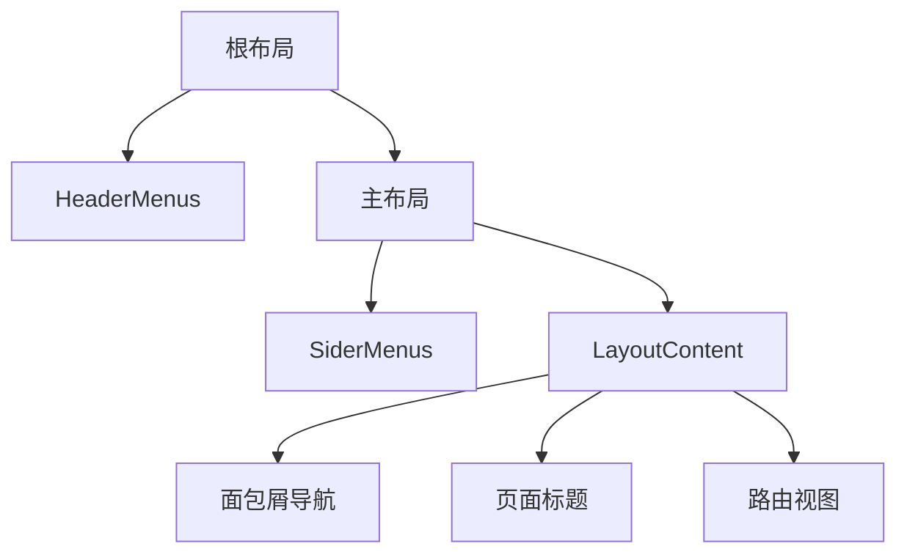
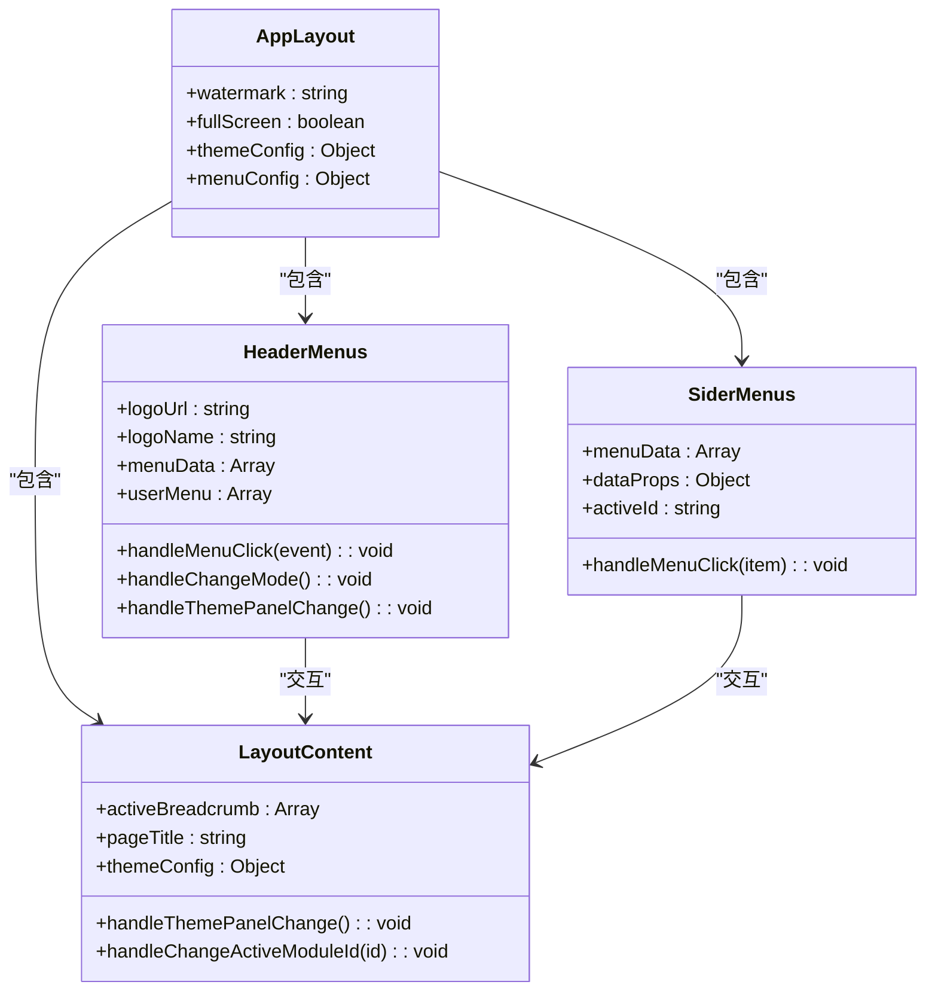

# 组件使用指南

<cite>
**本文档引用文件**  
- [das-component-vue.json](file://das-components-folder/das-component-vue.json)
- [layout/index.vue](file://src/components/uedModule/layout/index.vue)
- [layout/comps/LayoutContent.vue](file://src/components/uedModule/layout/comps/LayoutContent.vue)
- [layout/comps/HeaderMenus.vue](file://src/components/uedModule/layout/comps/HeaderMenus.vue)
- [layout/comps/SiderMenus.vue](file://src/components/uedModule/layout/comps/SiderMenus.vue)
</cite>

## 目录
1. [简介](#简介)
2. [组件库引入与注册](#组件库引入与注册)
3. [das-component-vue.json元数据索引](#das-component-vue.json元数据索引)
4. [典型布局组件分析](#典型布局组件分析)
5. [组件使用模式](#组件使用模式)
6. [按需加载与构建优化](#按需加载与构建优化)
7. [完整模板示例](#完整模板示例)
8. [最佳实践](#最佳实践)

## 简介
本文档旨在指导开发者如何在Vue项目中正确引入和使用内部UI组件库。通过分析核心布局组件和元数据配置文件，详细介绍组件注册、使用方式、属性传递、事件绑定和插槽机制，帮助开发者快速上手并遵循统一的开发规范。

## 组件库引入与注册
内部UI组件库基于Vue 3和Ant Design Vue构建，采用模块化方式组织。组件通过标准的Vue组件注册机制进行引入，支持全局注册和局部注册两种方式。项目通过`das-component-vue.json`文件维护组件元数据，实现组件的统一管理和索引。

**组件库特点**：
- 基于Vue 3 Composition API开发
- 兼容TypeScript类型系统
- 支持按需加载和Tree Shaking
- 提供完整的国际化支持
- 内置主题切换和暗色模式

## das-component-vue.json元数据索引
`das-component-vue.json`文件作为组件库的元数据索引，定义了所有可用组件的分类、名称、ID和使用说明。该文件是组件库的核心配置，为开发者提供组件的完整信息。

```json
{
  "name": "das-component-vue",
  "description": "基于Vue 3和Ant Design Vue的企业级组件库",
  "version": "1.2.7",
  "totalComponents": 32,
  "categories": {
    "通用": {
      "description": "通用基础组件",
      "components": [
        {
          "id": "das-colors",
          "name": "色彩 Color",
          "description": "提供统一的色彩规范和主题色彩系统，确保界面设计的一致性和视觉层次",
          "whenToUse": "需要统一界面色彩规范、建立品牌色彩体系、确保设计一致性时"
        }
      ]
    },
    "布局": {
      "description": "页面布局相关组件",
      "components": [
        {
          "id": "das-folding-box",
          "name": "折叠框 FoldingBox",
          "description": "功能强大的折叠盒组件，支持左中右三区域布局和可拖拽调整大小",
          "whenToUse": "复杂界面布局、多面板布局、工具面板、详情展示、分屏显示时"
        }
      ]
    }
  }
}
```

**元数据字段说明**：
- `id`：组件唯一标识符，用于代码引用
- `name`：组件中文名称，用于文档展示
- `description`：组件功能描述
- `whenToUse`：组件使用场景建议

该文件将组件按功能分为"通用"、"布局"、"数据录入"、"数据展示"、"反馈"和"其他"六大类，便于开发者快速定位所需组件。

**文件来源**
- [das-component-vue.json](file://das-components-folder/das-component-vue.json)

## 典型布局组件分析
以`layout/index.vue`为核心的布局系统，实现了灵活的页面结构管理。该组件通过组合多个子组件，构建了完整的应用布局框架。

### 布局结构


**Diagram sources**
- [layout/index.vue](file://src/components/uedModule/layout/index.vue)

### 组件关系


**Diagram sources**
- [layout/index.vue](file://src/components/uedModule/layout/index.vue)
- [layout/comps/HeaderMenus.vue](file://src/components/uedModule/layout/comps/HeaderMenus.vue)
- [layout/comps/SiderMenus.vue](file://src/components/uedModule/layout/comps/SiderMenus.vue)
- [layout/comps/LayoutContent.vue](file://src/components/uedModule/layout/comps/LayoutContent.vue)

**Section sources**
- [layout/index.vue](file://src/components/uedModule/layout/index.vue)
- [layout/comps/LayoutContent.vue](file://src/components/uedModule/layout/comps/LayoutContent.vue)
- [layout/comps/HeaderMenus.vue](file://src/components/uedModule/layout/comps/HeaderMenus.vue)
- [layout/comps/SiderMenus.vue](file://src/components/uedModule/layout/comps/SiderMenus.vue)

## 组件使用模式
### 基本用法
布局组件通过组合式API实现，使用`<script setup>`语法糖简化代码结构。组件通过`defineProps`定义接收的属性，通过`ref`和`computed`管理状态。

```vue
<template>
  <a-layout class="h-screen">
    <HeaderMenus v-if="!fullScreen" v-bind="menuConfig"/>
    <a-layout v-if="!fullScreen" class="ant-layout-has-sider">
      <SiderMenus v-if="showSider" v-bind="menuConfig"/>
      <LayoutContent/>
    </a-layout>
    <RouterView v-if="fullScreen"/>
  </a-layout>
</template>
```

### Props传递
组件通过`props`接收外部配置，支持复杂对象传递。`menuConfig`对象包含菜单数据、样式配置和行为设置。

```typescript
const menuConfig = ref({
  dataProps: {
    label: 'name',
    children: 'children'
  },
  userMenu: [
    {
      id: 1,
      name: I18N.layout.tuiChuDengLu
    }
  ],
  menuData: [
    {
      id: 1,
      name: I18N.layout.genericTypicalPage,
      icon: 'zq-icon zq-icon-zhihuitiaodu',
      url: '/workBench'
    }
  ]
});
```

### 事件绑定
组件通过`@`语法绑定事件，支持自定义事件处理。`HeaderMenus`组件监听菜单点击、模式切换等事件。

```vue
<i class="icon-button menuicon menu-icon-help" @click="showHelpDocument"/>
<i v-if="config.lightDarkSwitch" class="icon-button menuicon" 
   :class="config.mode === 'light' ? 'menu-icon-light' : 'menu-icon-black'"
   @click="handleChangeMode"/>
```

### 插槽使用
组件支持具名插槽和作用域插槽，提供灵活的内容定制能力。`UedMapMenu`组件通过插槽自定义按钮样式。

```vue
<template #addBtn>
  <a-button type="primary">{{ $t('I18N.common.add') }}{{ $t('I18N.common.menu') }}</a-button>
</template>
<template #saveBtn>
  <a-button type="primary">{{ $t('I18N.common.save') }}</a-button>
</template>
```

## 按需加载与构建优化
组件库采用按需加载策略，通过Vite构建工具实现代码分割和Tree Shaking。配置文件`vite.config.base.ts`定义了构建优化规则。

**构建优化策略**：
- 使用`import()`动态导入实现代码分割
- 配置`optimizeDeps`预构建依赖
- 启用`minify`压缩生产代码
- 配置`assetsInclude`处理静态资源

**按需加载优势**：
- 减少初始加载体积
- 提升页面加载速度
- 降低内存占用
- 改善用户体验

## 完整模板示例
以下是一个完整的Vue单文件组件模板，演示如何正确引入和使用布局组件。

```vue
<template>
  <AppLayout :config="layoutConfig">
    <template #header>
      <HeaderMenus :menu-data="menuData" :user-menu="userMenu"/>
    </template>
    <template #sider>
      <SiderMenus :menu-data="siderMenuData"/>
    </template>
    <template #content>
      <LayoutContent :breadcrumb="breadcrumb"/>
    </template>
  </AppLayout>
</template>

<script setup lang="ts">
import { ref, computed } from 'vue';
import AppLayout from '@/components/uedModule/layout/index.vue';
import HeaderMenus from '@/components/uedModule/layout/comps/HeaderMenus.vue';
import SiderMenus from '@/components/uedModule/layout/comps/SiderMenus.vue';
import LayoutContent from '@/components/uedModule/layout/comps/LayoutContent.vue';

// 布局配置
const layoutConfig = ref({
  showHeader: true,
  showSider: true,
  fullScreen: false
});

// 菜单数据
const menuData = ref([
  {
    id: 'dashboard',
    name: '仪表盘',
    icon: 'zq-icon zq-icon-zhihuitiaodu',
    url: '/dashboard'
  }
]);

// 用户菜单
const userMenu = ref([
  {
    id: 1,
    name: '退出登录'
  }
]);

// 侧边栏菜单
const siderMenuData = computed(() => {
  return menuData.value.filter(item => item.children && item.children.length > 0);
});

// 面包屑
const breadcrumb = ref([
  { title: '首页', path: '/' },
  { title: '仪表盘', path: '/dashboard' }
]);
</script>

<style scoped>
/* 样式定义 */
</style>
```

## 最佳实践
### 组件引入规范
- 使用绝对路径导入组件：`@/components/...`
- 按需引入，避免全局注册不必要的组件
- 统一组件命名规范，使用PascalCase
- 为复杂组件创建类型定义

### 状态管理
- 使用`ref`管理简单状态
- 使用`computed`派生计算属性
- 使用`watch`监听状态变化
- 避免在模板中执行复杂逻辑

### 性能优化
- 合理使用`v-if`和`v-show`
- 为列表渲染添加`key`属性
- 避免在循环中使用方法调用
- 使用`keep-alive`缓存组件状态

### 可访问性
- 为交互元素添加适当的ARIA属性
- 确保键盘导航可用
- 提供足够的对比度
- 支持屏幕阅读器

通过遵循以上指南，开发者可以高效地使用内部UI组件库，构建一致、可维护的应用界面。