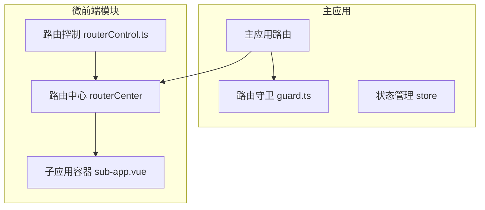
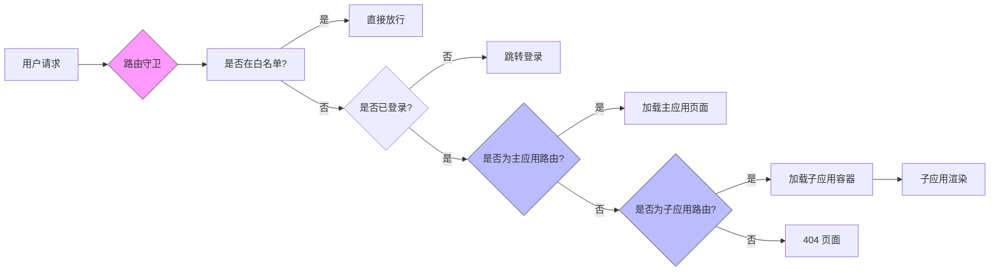
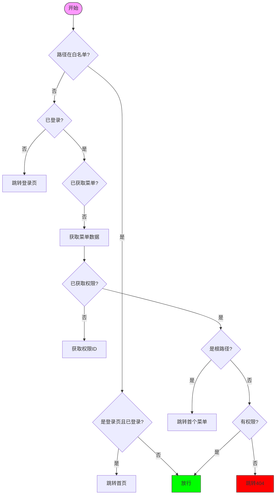
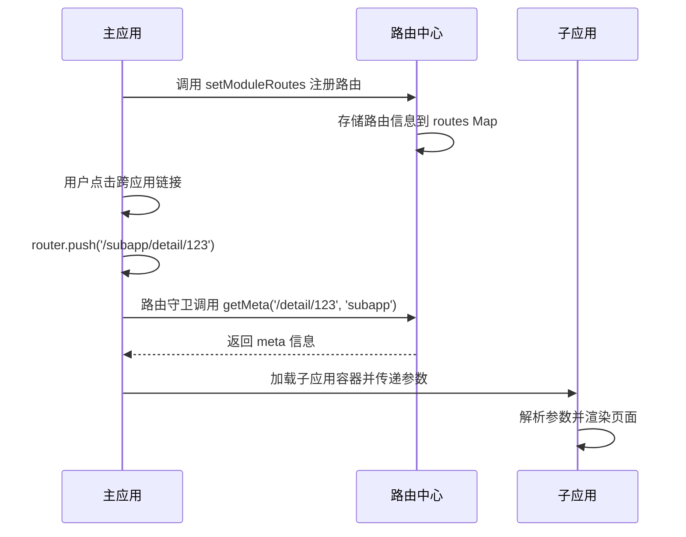
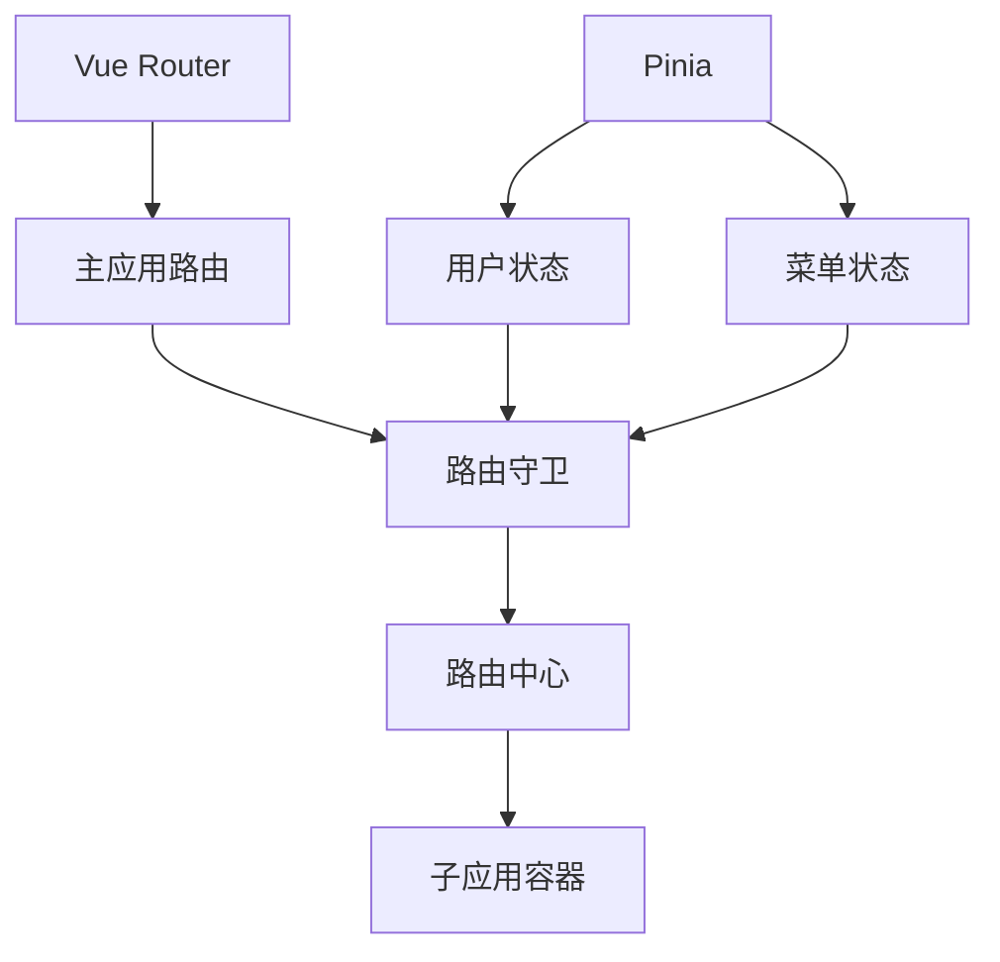

# 与微前端集成

<cite>
**本文档引用文件**  
- [routerCenter/index.ts](file://src/micro/routerCenter/index.ts)
- [guard.ts](file://src/router/guard.ts)
- [router/index.ts](file://src/router/index.ts)
- [routerControl.ts](file://src/micro/routerControl.ts)
</cite>

## 目录
1. [简介](#简介)
2. [项目结构](#项目结构)
3. [核心组件](#核心组件)
4. [架构概览](#架构概览)
5. [详细组件分析](#详细组件分析)
6. [依赖分析](#依赖分析)
7. [性能考虑](#性能考虑)
8. [故障排除指南](#故障排除指南)
9. [结论](#结论)

## 简介
本文档详细阐述了基于 Vue 的主应用与微前端子应用的路由集成机制。重点分析 `routerCenter/index.ts` 中实现的路由中心机制，说明主应用如何识别微前端子应用的路由请求，解释路由守卫中判断路由归属的逻辑，并描述路由参数传递、跨应用导航、路由冲突解决方案等关键技术细节。

## 项目结构
项目采用模块化结构，微前端相关逻辑集中在 `src/micro` 目录下，主应用路由控制位于 `src/router` 目录。通过 `routerCenter` 实现子应用路由注册与管理，通过 `guard.ts` 实现统一的路由权限控制。



**图示来源**  
- [routerCenter/index.ts](file://src/micro/routerCenter/index.ts)
- [guard.ts](file://src/router/guard.ts)

**本节来源**  
- [src/micro](file://src/micro)
- [src/router](file://src/router)

## 核心组件
核心组件包括 `RouterCenter` 类，用于集中管理所有微前端子应用的路由信息，以及 `setupPermissionGuard` 函数，用于在路由跳转前进行权限与上下文判断。

**本节来源**  
- [routerCenter/index.ts](file://src/micro/routerCenter/index.ts#L1-L220)
- [guard.ts](file://src/router/guard.ts#L6-L64)

## 架构概览
系统采用主从式微前端架构，主应用负责整体路由调度与权限控制，子应用通过注册机制将自身路由信息注入主应用的路由中心。主应用通过路由前缀或名称匹配判断当前请求归属，并动态加载对应子应用。



**图示来源**  
- [guard.ts](file://src/router/guard.ts#L6-L64)
- [routerCenter/index.ts](file://src/micro/routerCenter/index.ts#L1-L220)

## 详细组件分析

### 路由中心机制分析
`RouterCenter` 类是微前端路由系统的核心，负责收集、存储和查询所有子应用的路由信息。

#### 类结构与关系
```mermaid
classDiagram
class RouterCenter {
-router : Router
-routes : Map~string, Map~string, RoutersValue~~
-proxyKeys : [RegExp, string][]
-excludePath : string[]
-specialUrl : string[]
-routerMode : { [key : string] : RouterMode }
-customAppName : string
-defaultPage : { url : string; module : string }[]
+setCustomAppName(name : string)
+getCustomName() : string
+getRoutes() : Map~string, Map~string, RoutersValue~~
+set(key : string, path : string, module : string, name : any, meta : any, breadcrumb? : BreadcrumbList[])
+get(module : string, key : string) : RoutersValue | undefined
+getMeta(path : string, name : string, hash : string) : any
+has(key : string) : boolean
+setModuleRoutes(routerData : RouteRecordRaw[], module : string, routerMode? : RouterMode)
+initRegExpKeyToKey()
+traverseRoutes(routes : RouteRecordRaw[], module : string, parentPath : string, parentBreadcrumb? : BreadcrumbList[] | null)
+static getFullPath(parentPath : string, routePath : string) : string
+static getBreadcrumb(parentBreadcrumb : BreadcrumbList[] | null, routerPath : string, title : any) : BreadcrumbList[]
}
class RoutersValue {
+path : string
+module : string
+name : any
+meta : any
+breadcrumb? : BreadcrumbList[]
}
class BreadcrumbList {
+path : string
+title : any
}
RouterCenter --> RoutersValue : "包含"
RouterCenter --> BreadcrumbList : "使用"
```

**图示来源**  
- [routerCenter/index.ts](file://src/micro/routerCenter/index.ts#L21-L220)

**本节来源**  
- [routerCenter/index.ts](file://src/micro/routerCenter/index.ts#L1-L220)

### 路由守卫逻辑分析
`setupPermissionGuard` 是主应用的全局前置守卫，负责在每次路由跳转前进行权限校验与上下文处理。

#### 路由判断流程


**图示来源**  
- [guard.ts](file://src/router/guard.ts#L6-L64)

**本节来源**  
- [guard.ts](file://src/router/guard.ts#L6-L64)

### 路由参数传递与跨应用导航
主应用与子应用间通过 URL 参数和共享状态进行数据传递。跨应用导航通过 `router.push` 触发，由路由中心解析目标应用并加载。



**图示来源**  
- [routerCenter/index.ts](file://src/micro/routerCenter/index.ts#L1-L220)
- [guard.ts](file://src/router/guard.ts#L6-L64)

**本节来源**  
- [routerCenter/index.ts](file://src/micro/routerCenter/index.ts#L1-L220)
- [guard.ts](file://src/router/guard.ts#L6-L64)

## 依赖分析
主应用路由系统依赖 Vue Router 和 Pinia 状态管理，微前端模块依赖路由中心与子应用通信机制。



**图示来源**  
- [guard.ts](file://src/router/guard.ts#L1-L65)
- [routerCenter/index.ts](file://src/micro/routerCenter/index.ts#L1-L220)

**本节来源**  
- [guard.ts](file://src/router/guard.ts#L1-L65)
- [routerCenter/index.ts](file://src/micro/routerCenter/index.ts#L1-L220)

## 性能考虑
- 路由中心使用 Map 结构实现 O(1) 查询性能
- 路由注册采用递归遍历，避免重复注册
- 白名单路径直接放行，减少不必要的权限请求
- 子应用按需加载，避免初始加载过多资源

## 故障排除指南
常见问题及解决方案：

| 问题现象 | 可能原因 | 解决方案 |
|--------|--------|--------|
| 子应用无法加载 | 路由未正确注册 | 检查 `setModuleRoutes` 调用 |
| 路由跳转404 | 路径匹配失败 | 检查路由前缀与注册路径一致性 |
| 权限错误跳转 | permissionId 缺失 | 确保 meta 中包含正确的 permissionId |
| 面包屑显示异常 | breadcrumb 未生成 | 检查父级路由 breadcrumb 传递 |

**本节来源**  
- [routerCenter/index.ts](file://src/micro/routerCenter/index.ts#L1-L220)
- [guard.ts](file://src/router/guard.ts#L6-L64)

## 结论
该微前端路由集成方案通过 `RouterCenter` 实现了子应用路由的集中管理，通过 `guard.ts` 实现了统一的权限控制。系统具备良好的扩展性与隔离性，支持多子应用动态注册与跨应用导航，是主从式微前端架构的典型实现。