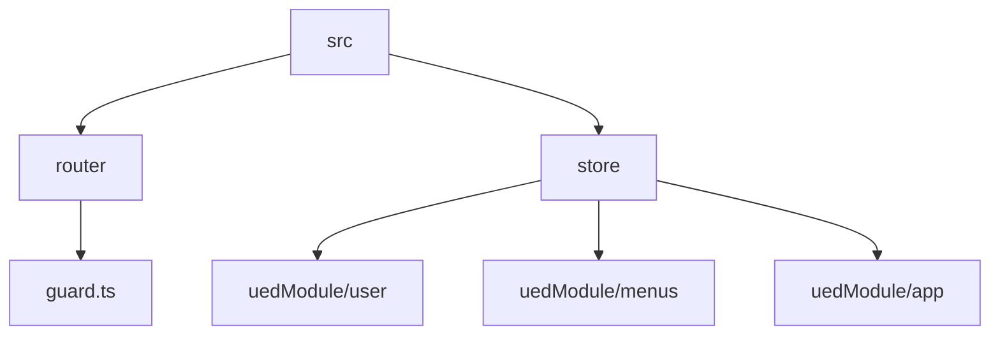
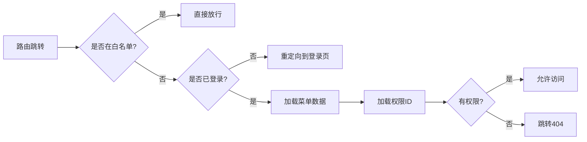
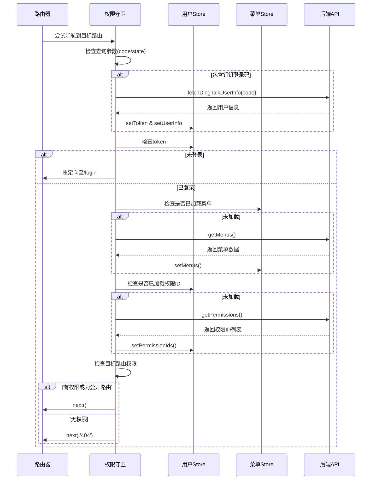
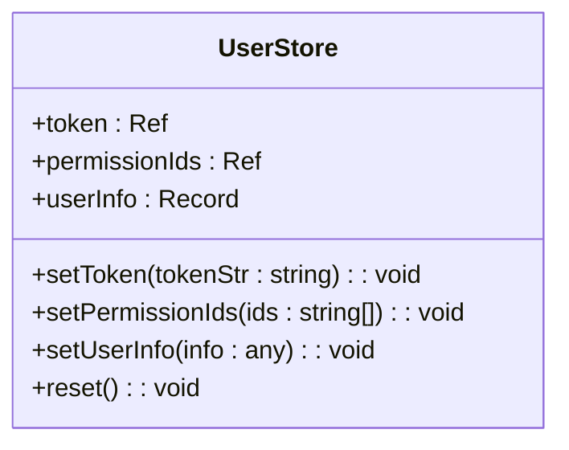
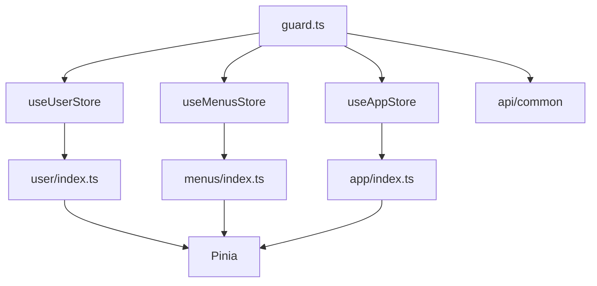

# 权限守卫

<cite>
**本文档中引用的文件**
- [guard.ts](file://src/router/guard.ts)
- [index.ts](file://src/store/index.ts)
- [menus/index.ts](file://src/store/uedModule/menus/index.ts)
- [user/index.ts](file://src/store/uedModule/user/index.ts)
- [app/index.ts](file://src/store/uedModule/app/index.ts)
</cite>

## 目录
1. [介绍](#介绍)
2. [项目结构](#项目结构)
3. [核心组件](#核心组件)
4. [架构概述](#架构概述)
5. [详细组件分析](#详细组件分析)
6. [依赖分析](#依赖分析)
7. [性能考虑](#性能考虑)
8. [故障排除指南](#故障排除指南)
9. [结论](#结论)

## 介绍
本技术文档全面解析 Vue 项目中基于 `guard.ts` 实现的全局前置路由守卫机制。文档重点阐述权限验证流程、用户登录状态检查、菜单权限过滤等核心功能，深入说明守卫如何与 Pinia 状态管理集成，从 `app` 和 `menus` store 中获取用户权限数据进行比对。同时提供完整的权限控制流程图，并涵盖自定义权限指令的实现方法与典型应用场景。

## 项目结构
该项目采用模块化结构，核心权限控制逻辑集中在 `src/router` 和 `src/store` 目录下。`guard.ts` 文件定义了全局路由守卫，而用户、菜单、应用等状态由 Pinia store 统一管理，实现了状态与路由逻辑的解耦。



**Diagram sources**
- [guard.ts](file://src/router/guard.ts#L1-L65)
- [user/index.ts](file://src/store/uedModule/user/index.ts#L1-L62)
- [menus/index.ts](file://src/store/uedModule/menus/index.ts#L1-L138)

**Section sources**
- [guard.ts](file://src/router/guard.ts#L1-L65)
- [index.ts](file://src/store/index.ts#L1-L13)

## 核心组件
核心权限守卫组件由 `setupPermissionGuard` 函数实现，该函数注册了一个全局的 `beforeEach` 导航守卫。守卫逻辑依赖于 `useUserStore`、`useMenusStore` 和 `useAppStore` 三个 Pinia store，分别管理用户认证信息、菜单数据和应用配置。

**Section sources**
- [guard.ts](file://src/router/guard.ts#L10-L65)
- [index.ts](file://src/store/index.ts#L1-L13)

## 架构概述
权限守卫的架构围绕 Vue Router 的导航守卫机制和 Pinia 的状态管理展开。当用户尝试访问路由时，守卫会拦截导航，检查用户的登录状态和权限，动态加载菜单和权限 ID，并根据权限元数据决定是否允许访问。



**Diagram sources**
- [guard.ts](file://src/router/guard.ts#L10-L65)

## 详细组件分析

### 权限守卫逻辑分析
`setupPermissionGuard` 函数是权限控制的核心入口，它通过 `router.beforeEach` 注册了一个异步前置守卫。

#### 路由守卫流程


**Diagram sources**
- [guard.ts](file://src/router/guard.ts#L10-L65)

**Section sources**
- [guard.ts](file://src/router/guard.ts#L10-L65)

### 用户状态管理分析
`user` store 负责管理用户的认证状态、权限 ID 和用户信息，是权限判断的数据来源。

#### 用户Store类图


**Diagram sources**
- [user/index.ts](file://src/store/uedModule/user/index.ts#L1-L62)

**Section sources**
- [user/index.ts](file://src/store/uedModule/user/index.ts#L1-L62)

### 菜单状态管理分析
`menus` store 负责管理应用的菜单结构，提供菜单数据的存储、转换和查询功能。

#### 菜单Store功能流程
```mermaid
flowchart TD
A[setMenus(menus)] --> B[dataToMenuMap]
B --> C[构建路径映射表]
A --> D[dataToMenuItems]
D --> E[转换为Ant Design菜单项]
F[findFistSiderMenu] --> G[深度优先搜索]
G --> H[返回第一个有效子菜单]
I[activeMenus] --> J[根据当前路由反查菜单路径]
```

**Diagram sources**
- [menus/index.ts](file://src/store/uedModule/menus/index.ts#L1-L138)

**Section sources**
- [menus/index.ts](file://src/store/uedModule/menus/index.ts#L1-L138)

## 依赖分析
权限守卫系统依赖于多个核心模块，形成了清晰的依赖链。



**Diagram sources**
- [guard.ts](file://src/router/guard.ts#L1-L65)
- [index.ts](file://src/store/index.ts#L1-L13)

**Section sources**
- [guard.ts](file://src/router/guard.ts#L1-L65)
- [index.ts](file://src/store/index.ts#L1-L13)

## 性能考虑
权限守卫在首次加载时会进行异步 API 调用以获取菜单和权限数据，这可能会导致短暂的延迟。建议在用户登录后预加载这些数据，或在登录流程中一并获取，以优化首次访问体验。此外，菜单和权限数据已通过 Pinia 的持久化插件存储在 `localStorage` 中，减少了重复请求。

## 故障排除指南
常见权限问题通常源于状态未正确初始化或 API 返回数据格式不符。检查 `userStore.token` 是否正确设置，确认 `getMenus` 和 `getPermissions` 接口返回的数据结构符合预期。若遇到菜单不显示问题，请检查 `menusStore.menusData` 是否被正确赋值，并验证 `dataToMenuMap` 函数的路径映射逻辑。

**Section sources**
- [guard.ts](file://src/router/guard.ts#L10-L65)
- [user/index.ts](file://src/store/uedModule/user/index.ts#L1-L62)
- [menus/index.ts](file://src/store/uedModule/menus/index.ts#L1-L138)

## 结论
本文档详细解析了基于 Vue Router 和 Pinia 的权限守卫实现方案。该方案通过全局前置守卫拦截路由，结合状态管理实现了灵活的权限控制。系统能够动态加载菜单和权限，支持钉钉扫码登录集成，并通过持久化存储提升了用户体验。此设计模式清晰、可维护性强，适用于中大型 Vue 应用的权限管理需求。