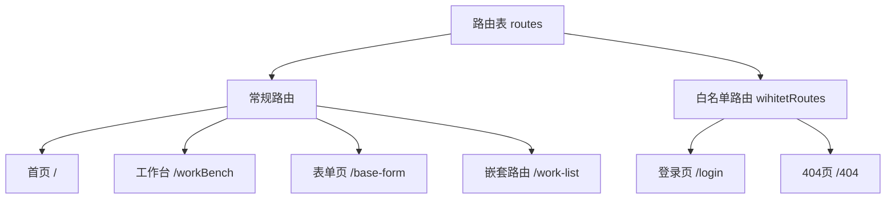
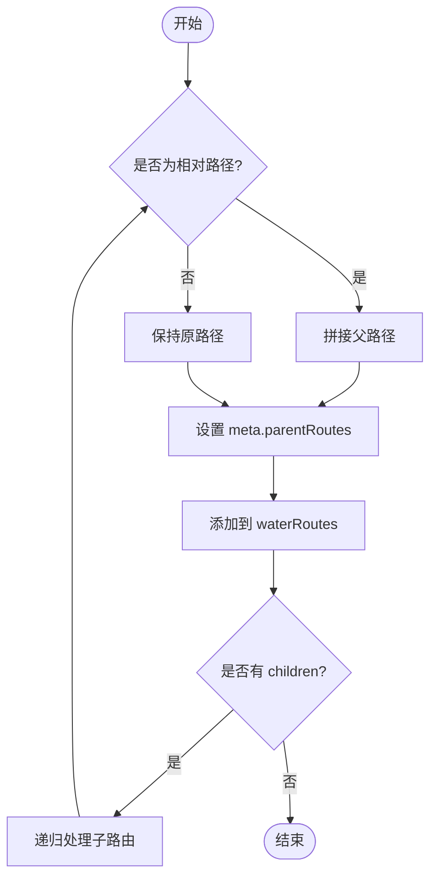
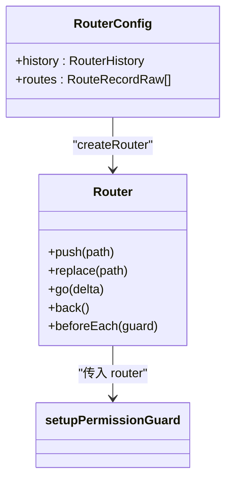
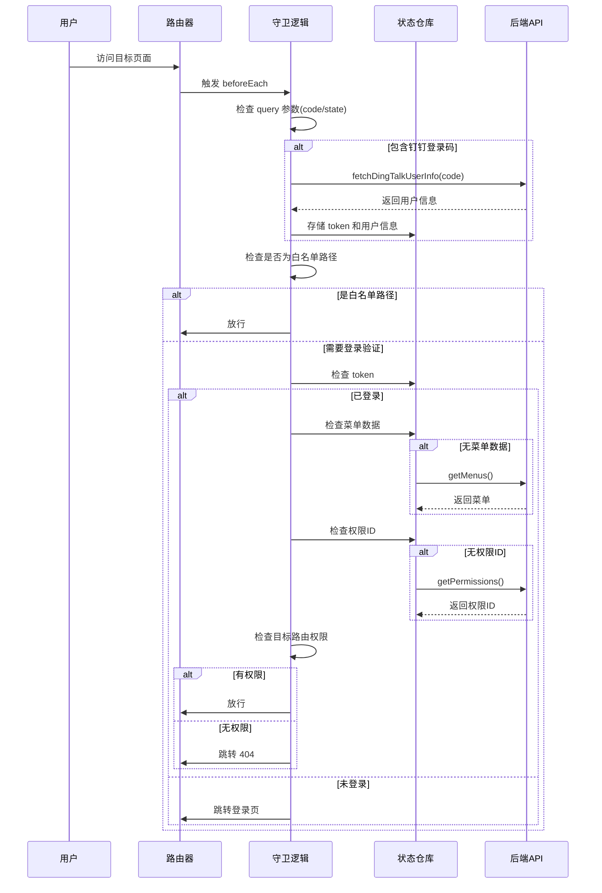
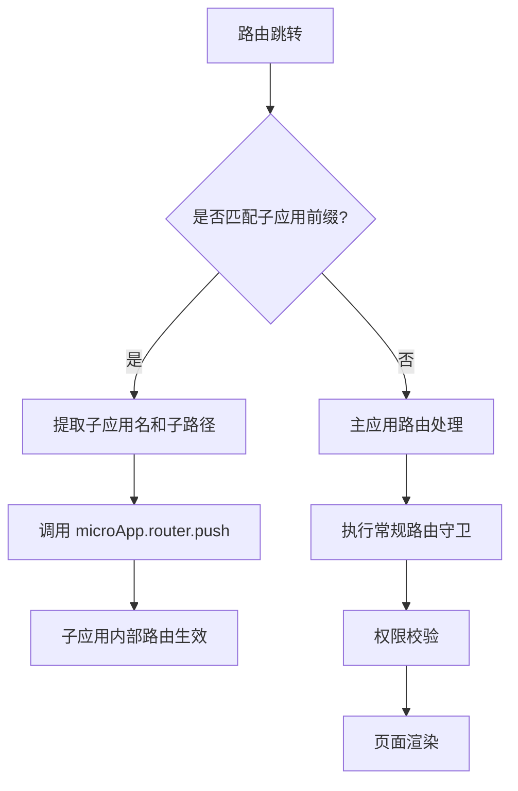

# 路由系统

<cite>
**本文档引用的文件**  
- [routes.ts](file://src/router/routes.ts)
- [index.ts](file://src/router/index.ts)
- [guard.ts](file://src/router/guard.ts)
- [routerControl.ts](file://src/micro/routerControl.ts)
- [index.ts](file://src/micro/index.ts)
</cite>

## 目录
1. [简介](#简介)
2. [路由表结构与扁平化设计](#路由表结构与扁平化设计)
3. [Vue Router 实例初始化](#vue-router-实例初始化)
4. [全局前置守卫与权限验证](#全局前置守卫与权限验证)
5. [微前端系统中的路由集成逻辑](#微前端系统中的路由集成逻辑)
6. [动态路由与嵌套路由的使用方法](#动态路由与嵌套路由的使用方法)
7. [权限守卫自定义示例](#权限守卫自定义示例)
8. [总结](#总结)

## 简介
本项目采用 Vue Router 构建前端路由系统，支持单页应用（SPA）的导航控制。路由系统不仅管理主应用内部的页面跳转，还集成了微前端架构下的子应用路由控制。通过 `routes.ts` 定义路由表，`index.ts` 初始化路由实例，`guard.ts` 实现权限校验逻辑，并结合微前端模块实现主应用与子应用之间的无缝路由跳转。

**路由系统核心功能包括：**
- 扁平化路由结构设计
- 嵌套路由支持
- 全局前置守卫进行权限控制
- 与微前端系统的深度集成
- 动态路由加载机制

## 路由表结构与扁平化设计

路由表在 `routes.ts` 文件中定义，采用 `RouteRecordRaw` 类型描述每个路由记录。所有路由以数组形式组织，分为常规路由和白名单路由两部分。



**路由元信息（meta）包含以下关键字段：**
- `title`: 页面标题（支持国际化）
- `permissionId`: 权限标识符
- `fullScreen`: 是否全屏显示
- `public`: 是否为公开页面

路由系统通过 `routeToArr` 函数将嵌套的路由结构转换为扁平化结构，便于后续权限判断和菜单生成。该过程会递归遍历所有子路由，并拼接完整路径，同时维护父级路由链（parentRoutes），用于面包屑导航。



**代码路径：**
- 路由表定义：`[routes](file://src/router/routes.ts#L4-L287)`
- 扁平化处理函数：`[routeToArr](file://src/router/index.ts#L15-L36)`

## Vue Router 实例初始化

在 `router/index.ts` 中，通过 `createRouter` 创建 Vue Router 实例。根据环境变量 `HISTORY_TYPE` 决定使用 `createWebHistory`（history 模式）或 `createWebHashHistory`（hash 模式）。



初始化流程如下：
1. 导入路由配置
2. 执行扁平化转换
3. 创建路由实例
4. 注册权限守卫
5. 导出 router 实例供全局使用

**关键配置项：**
- `basePath`: 基础路径，取自环境变量 `BASE_PATH`
- `history`: 路由历史模式
- `routes`: 经过扁平化处理的路由数组

**代码路径：**
- 路由实例创建：`[createRouter](file://src/router/index.ts#L38-L52)`
- 路由模式判断：`[HISTORY_TYPE](file://src/router/index.ts#L44)`

## 全局前置守卫与权限验证

权限控制在 `guard.ts` 中通过 `setupPermissionGuard` 函数实现，注册全局前置守卫 `beforeEach`。



**守卫逻辑主要步骤：**
1. 处理钉钉 OAuth 登录回调
2. 检查是否为白名单路径（如 `/login`, `/404`）
3. 若已登录，则加载菜单和权限数据
4. 校验目标路由的权限（`permissionId`）
5. 若未登录，则重定向至登录页

**白名单路径：**
```ts
export const WHITE_LIST: string[] = ['/404', '/login', '/ai-agent'];
```

**代码路径：**
- 守卫注册：`[setupPermissionGuard](file://src/router/guard.ts#L5-L65)`
- 白名单定义：`[WHITE_LIST](file://src/router/guard.ts#L3)`

## 微前端系统中的路由集成逻辑

微前端路由集成通过 `micro/routerControl.ts` 和 `micro/index.ts` 实现，核心是判断路由应由主应用还是子应用处理。



### 主要机制：

1. **子应用路由注册**  
   在 `setupAddMicroRouter` 中，为主应用中配置的每个子应用动态添加通配路由：
   ```ts
   path: `${app.baseroute}/:page*`
   ```
   这使得所有以子应用前缀开头的路径都被捕获并交由子应用处理。

2. **路由代理与监听**  
   `proxySubAppsRouter` 提供路由代理功能，使子应用能调用主应用的路由方法。`monitorChildRouterChange` 监听子应用的路由变化，同步更新主应用的状态（如全屏模式、活动菜单）。

3. **路径装饰与重定向**  
   `decorateLocationPath` 函数解析 URL，判断是否属于某个子应用。如果是，则构造新的子应用路径并进行跳转。

4. **定制页面路由支持**  
   支持将主应用的某些页面“挂载”到子应用路径下，通过 `customPath` 映射实现反向路由控制。

**代码路径：**
- 子应用路由注册：`[setupAddMicroRouter](file://src/micro/routerControl.ts#L5-L20)`
- 路由代理：`[proxySubAppsRouter](file://src/micro/routerControl.ts#L22-L30)`
- 路由监听：`[monitorChildRouterChange](file://src/micro/routerControl.ts#L32-L141)`
- 微前端启动：`[startMicro](file://src/micro/index.ts#L25-L65)`

## 动态路由与嵌套路由的使用方法

### 动态路由

项目中通过懒加载实现动态路由：

```ts
component: () => import('@/views/uedTypical/workBench/index.vue')
```

支持 webpackChunkName 注释优化打包：

```ts
component: () => import(/* webpackChunkName: "vueTour" */ '@/views/uedTypical/vueTour/index.vue')
```

### 嵌套路由

嵌套路由通过 `children` 属性定义，如 `/work-list` 下的 `add` 子页面：

```ts
{
  name: 'base::work-list',
  path: '/work-list',
  component: ...,
  children: [
    {
      name: 'base::work-list-add',
      path: 'add',
      component: ...
    }
  ]
}
```

**注意事项：**
- 子路由路径为相对路径（不以 `/` 开头）
- 父级路由需包含 `<router-view>` 以渲染子组件
- 扁平化处理时会自动拼接完整路径

**特殊路由类型：**
- **重定向路由**：`redirect: '/workBench'`
- **通配符路由**：`:page*` 用于捕获任意子路径
- **外部链接路由**：通过 `beforeEnter` 中 `window.open` 实现，返回 `false` 阻止原页面跳转

**代码路径：**
- 嵌套路由示例：`[/work-list](file://src/router/routes.ts#L109-L120)`
- 外部链接路由：`[/das-readdy](file://src/router/routes.ts#L10-L20)`

## 权限守卫自定义示例

以下是一个扩展权限守卫的自定义示例，展示如何添加角色校验：

```ts
// custom-guard.ts
import { Router } from 'vue-router';
import { useUserStore } from '@/store';

export function setupCustomPermissionGuard(router: Router) {
  router.beforeEach(async (to, from, next) => {
    const userStore = useUserStore();
    
    // 1. 白名单放行
    if (['/login', '/404'].includes(to.path)) {
      return next();
    }
    
    // 2. 未登录重定向
    if (!userStore.token) {
      return next('/login');
    }
    
    // 3. 角色权限校验（扩展）
    const requiredRole = to.meta.requiredRole;
    if (requiredRole && userStore.role !== requiredRole) {
      return next('/404');
    }
    
    // 4. 原有权限ID校验
    const permissionId = to.meta.permissionId as string;
    if (permissionId && !userStore.permissionIds.includes(permissionId) && !to.meta.public) {
      return next('/404');
    }
    
    // 5. 特殊路径处理
    if (to.path === '/') {
      const defaultRoute = userStore.getDefaultRoute();
      return next(defaultRoute || '/404');
    }
    
    next();
  });
}
```

**使用方式：**
```ts
// 在 main.ts 中替换原有守卫
import { setupCustomPermissionGuard } from './router/custom-guard';
setupCustomPermissionGuard(router);
```

**可扩展的权限维度：**
- 基于角色（role）
- 基于权限ID（permissionId）
- 基于功能开关（feature flag）
- 基于数据范围（data scope）
- 基于时间限制（time-based）

## 总结

本路由系统设计具有以下特点：

1. **结构清晰**：路由表分离、扁平化处理、职责分明
2. **权限完善**：基于 token 和权限ID的多层校验机制
3. **扩展性强**：支持微前端集成、动态路由、嵌套路由
4. **用户体验好**：支持全屏模式、外部链接跳转、钉钉登录集成
5. **可维护性高**：模块化设计，易于扩展和定制

**建议优化方向：**
- 增加路由加载状态提示
- 支持路由级别的权限配置文件
- 优化子应用预加载策略
- 增加路由变更日志记录
- 支持更细粒度的权限控制（如按钮级）

该路由系统为大型企业级前端应用提供了稳定、灵活、可扩展的导航基础。

**Section sources**
- [routes.ts](file://src/router/routes.ts#L1-L288)
- [index.ts](file://src/router/index.ts#L1-L53)
- [guard.ts](file://src/router/guard.ts#L1-L66)
- [routerControl.ts](file://src/micro/routerControl.ts#L1-L142)
- [micro/index.ts](file://src/micro/index.ts#L1-L66)