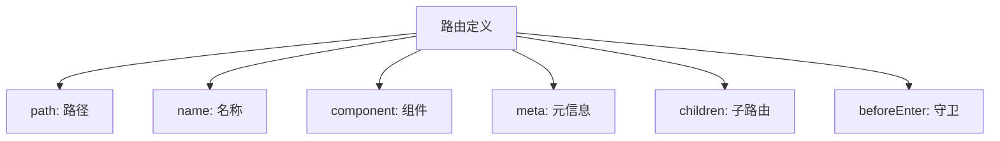
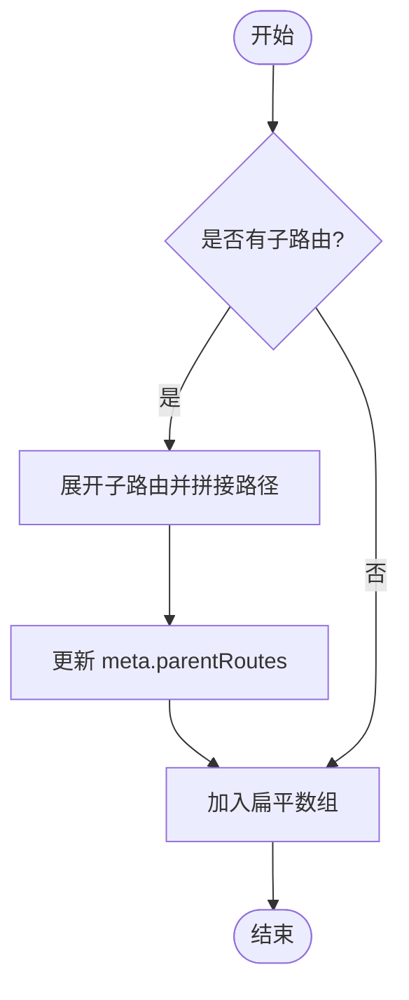
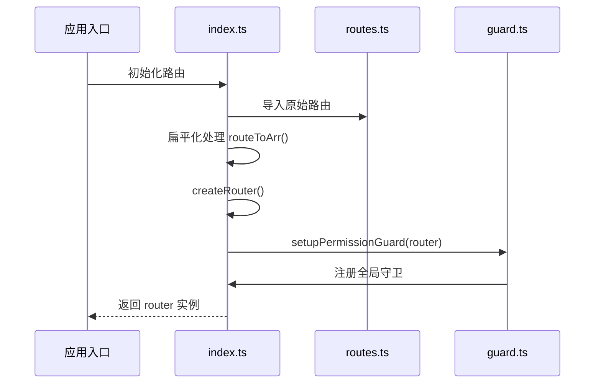
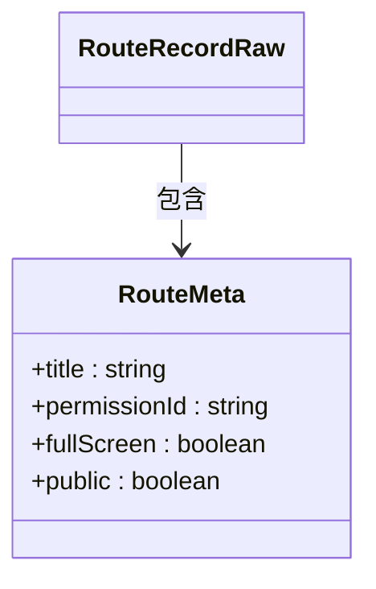

# 路由配置

<cite>
**本文档中引用的文件**  
- [routes.ts](file://src/router/routes.ts)
- [index.ts](file://src/router/index.ts)
- [types.ts](file://src/store/uedModule/menus/types.ts)
</cite>

## 目录
1. [简介](#简介)
2. [路由表结构详解](#路由表结构详解)
3. [扁平化路由设计](#扁平化路由设计)
4. [Vue Router 实例初始化](#vue-router-实例初始化)
5. [动态路由与嵌套路由](#动态路由与嵌套路由)
6. [路由元信息（meta）的使用](#路由元信息（meta）的使用)
7. [路由懒加载与性能优化](#路由懒加载与性能优化)
8. [错误处理机制](#错误处理机制)
9. [总结](#总结)

## 简介
本项目采用 Vue Router 实现前端路由管理，通过 `routes.ts` 定义路由规则，并在 `index.ts` 中完成路由实例的创建与权限守卫的设置。整体设计注重可维护性、权限控制和性能优化，支持多层级嵌套路由、动态路径匹配以及基于元信息的页面配置传递。

**Section sources**
- [routes.ts](file://src/router/routes.ts#L1-L288)
- [index.ts](file://src/router/index.ts#L1-L53)

## 路由表结构详解

`routes.ts` 文件中定义了所有路由记录，类型为 `RouteRecordRaw[]`。每条路由包含以下核心字段：

- **path**: 路由路径，支持绝对路径和相对路径。
- **name**: 路由名称，用于命名路由跳转，提升代码可读性。
- **component**: 组件异步加载函数，使用 `import()` 实现懒加载。
- **meta**: 元信息对象，用于存储页面标题、权限 ID、是否全屏等附加数据。
- **children**: 子路由数组，实现嵌套路由结构。
- **beforeEnter**: 进入路由前的守卫钩子，可用于拦截跳转并执行外部跳转逻辑。

例如，`/das-readdy` 路由通过 `beforeEnter` 拦截跳转，在新窗口打开指定 URL，并阻止原页面渲染。



**Diagram sources**
- [routes.ts](file://src/router/routes.ts#L1-L288)

**Section sources**
- [routes.ts](file://src/router/routes.ts#L1-L288)

## 扁平化路由设计

为便于权限控制与菜单生成，项目采用“扁平化路由”设计。原始嵌套的 `RouteRecordRaw` 数组经过 `routeToArr` 函数处理，将多级路由转换为一级数组，同时保留父级路径信息。

该函数递归遍历路由树，拼接完整路径，并将父级路由链存入 `meta.parentRoutes` 字段，供后续菜单渲染和权限校验使用。



**Diagram sources**
- [index.ts](file://src/router/index.ts#L15-L35)

**Section sources**
- [index.ts](file://src/router/index.ts#L15-L35)

## Vue Router 实例初始化

`index.ts` 中通过 `createRouter` 创建路由实例，配置如下：

- **history 模式**: 根据环境变量 `HISTORY_TYPE` 决定使用 `createWebHistory`（history 模式）或 `createWebHashHistory`（hash 模式）。
- **base 路径**: 支持通过 `BASE_PATH` 环境变量设置应用部署子目录。
- **路由数据**: 使用经过扁平化处理的 `waterRoutes` 作为最终路由表。

此外，初始化完成后调用 `setupPermissionGuard(router)` 注册全局前置守卫，实现权限控制逻辑。



**Diagram sources**
- [index.ts](file://src/router/index.ts#L37-L52)

**Section sources**
- [index.ts](file://src/router/index.ts#L37-L52)

## 动态路由与嵌套路由

### 动态路由
项目支持动态路径匹配，如 `/multiple/:page*` 使用通配符捕获任意子路径，适用于微前端或多页面场景。

### 嵌套路由
通过 `children` 字段定义嵌套路由。例如 `/work-list` 主路由下包含 `/work-list/add` 子路由，对应组件嵌套渲染结构。

```mermaid
graph TD
A[/work-list] --> B[/work-list/add]
C[/dashboard] --> D[/dashboard/group]
E[/dataSecurityRisk] --> F[/dataSecurityRisk/detail]
```

**Diagram sources**
- [routes.ts](file://src/router/routes.ts#L100-L110)

**Section sources**
- [routes.ts](file://src/router/routes.ts#L100-L110)

## 路由元信息（meta）的使用

`meta` 字段用于传递页面级配置信息，当前项目中包含：

- **title**: 页面标题，支持国际化键名（如 `I18N.layout.gongZuoTai`）。
- **permissionId**: 权限标识，用于权限守卫判断用户是否有权访问该页面。
- **fullScreen**: 布尔值，指示页面是否需要全屏展示（如登录页、引导页）。
- **public**: 标记是否为公开页面，无需权限校验。

这些元信息在全局守卫中被读取并用于动态设置页面标题、权限校验和布局控制。



**Diagram sources**
- [routes.ts](file://src/router/routes.ts#L10-L288)
- [types.ts](file://src/store/uedModule/menus/types.ts#L10-L14)

**Section sources**
- [routes.ts](file://src/router/routes.ts#L10-L288)
- [types.ts](file://src/store/uedModule/menus/types.ts#L10-L14)

## 路由懒加载与性能优化

所有路由组件均采用动态导入语法 `() => import('...')` 实现懒加载，确保初始包体积最小化，仅在用户访问对应路由时才加载相关组件代码。

部分路由还使用了 Webpack 的命名 chunk 功能（如 `/* webpackChunkName: "componentsGuide" */`），将特定组件打包到独立文件，进一步优化加载性能。

这种策略显著提升了首屏加载速度，尤其适用于大型单页应用。

**Section sources**
- [routes.ts](file://src/router/routes.ts#L10-L288)

## 错误处理机制

项目预定义了 `404` 路由，路径为 `/404`，指向 `NotFound/index.vue` 页面。当用户访问不存在的路由时，可通过全局守卫或路由配置重定向至该页面。

同时，`login` 路由作为白名单路由（`wihitetRoutes`），无需权限即可访问，确保用户在未登录状态下仍能正常进入登录页面。

**Section sources**
- [routes.ts](file://src/router/routes.ts#L260-L288)

## 总结

本项目的路由系统设计清晰、扩展性强，具备以下特点：

- 使用扁平化路由结构，便于权限管理和菜单生成。
- 支持 history 和 hash 两种模式，适应不同部署环境。
- 通过 `meta` 字段实现页面配置与权限控制解耦。
- 全面应用懒加载技术，优化应用性能。
- 提供完善的错误处理与白名单机制，保障用户体验。

该路由架构为后续功能扩展和微前端集成提供了坚实基础。

**Section sources**
- [routes.ts](file://src/router/routes.ts#L1-L288)
- [index.ts](file://src/router/index.ts#L1-L53)