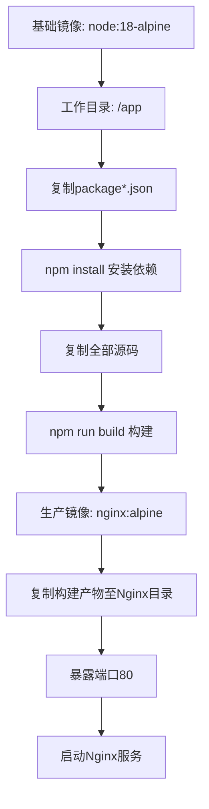
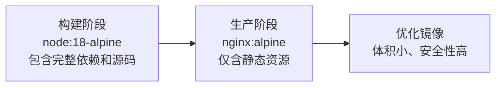
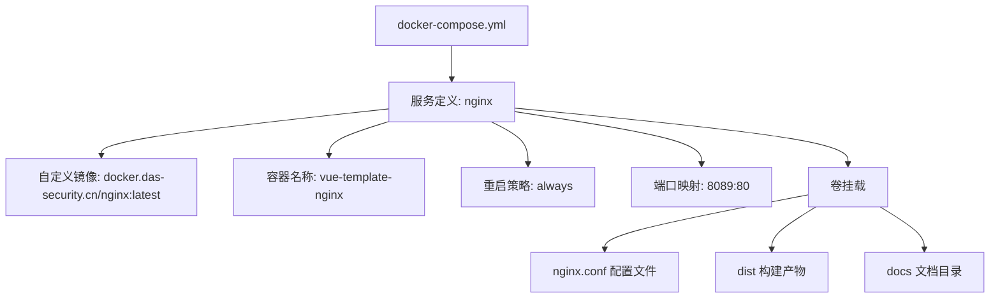
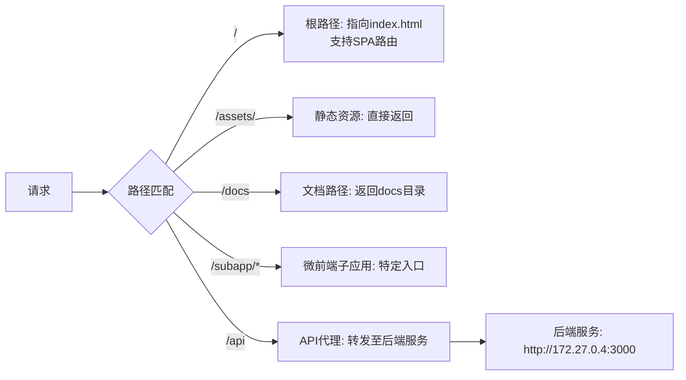

# Docker部署

<cite>
**本文档引用文件**  
- [Dockerfile](file://Dockerfile)
- [docker-compose.yml](file://docker-compose.yml)
- [nginx.conf](file://nginx.conf)
- [package.json](file://package.json)
</cite>

## 目录
1. [简介](#简介)
2. [项目结构](#项目结构)
3. [Dockerfile详解](#dockerfile详解)
4. [多阶段构建优化](#多阶段构建优化)
5. [docker-compose.yml解析](#docker-composeyml解析)
6. [Nginx配置说明](#nginx配置说明)
7. [最佳实践](#最佳实践)
8. [常见问题排查](#常见问题排查)
9. [总结](#总结)

## 简介
本文档详细说明如何使用Docker部署基于Vue3的前端项目，涵盖Dockerfile指令解析、镜像优化策略、docker-compose编排配置及Nginx反向代理设置。通过多阶段构建和容器化部署，实现高效、安全、可扩展的生产环境部署方案。

## 项目结构
项目为基于Vite构建的Vue3 TypeScript单页应用，包含微前端子应用（Vue2、Vue3、React、Angular），构建产物输出至`dist`目录。前端通过Nginx服务静态资源，并代理API请求至后端服务。

**Section sources**
- [package.json](file://package.json#L1-L158)

## Dockerfile详解



**Diagram sources**
- [Dockerfile](file://Dockerfile#L1-L13)

### 构建阶段指令解析
- `FROM node:18-alpine as builder`：使用轻量级Alpine Linux为基础的Node.js 18镜像作为构建阶段，减小镜像体积
- `WORKDIR /app`：设置工作目录，后续指令在此目录下执行
- `COPY package*.json ./`：仅复制package.json和package-lock.json，利用Docker缓存机制，避免频繁重新安装依赖
- `RUN npm install`：安装项目依赖
- `COPY . .`：复制项目源码至容器
- `RUN npm run build`：执行构建命令，生成生产环境静态资源

### 生产阶段指令解析
- `FROM nginx:alpine`：使用Nginx Alpine镜像作为运行时基础，仅包含运行静态文件所需组件
- `COPY --from=builder /app/dist /usr/share/nginx/html/frontend/dist`：从构建阶段复制构建产物至Nginx默认HTML目录
- `EXPOSE 80`：声明容器监听80端口
- `CMD ["nginx", "-g", "daemon off;"]`：以前台模式启动Nginx，确保容器持续运行

**Section sources**
- [Dockerfile](file://Dockerfile#L1-L13)
- [package.json](file://package.json#L10-L15)

## 多阶段构建优化



**Diagram sources**
- [Dockerfile](file://Dockerfile#L1-L13)

### 镜像体积优化
采用多阶段构建，将构建环境与运行环境分离：
- 构建阶段包含Node.js、npm、源码和依赖，用于执行`vite build`
- 生产阶段仅使用Nginx服务静态文件，不包含Node.js和开发依赖
- 最终镜像大小从约1GB降至约20MB，显著减小传输和部署开销

### 安全性提升
- 运行时容器不包含shell、编译器等工具，减少攻击面
- 使用非root用户运行Nginx（Alpine镜像默认配置）
- 基础镜像定期更新，及时修复安全漏洞

**Section sources**
- [Dockerfile](file://Dockerfile#L1-L13)

## docker-compose.yml解析



**Diagram sources**
- [docker-compose.yml](file://docker-compose.yml#L1-L12)

### 服务定义
- `image: docker.das-security.cn/nginx:latest`：使用私有仓库的定制Nginx镜像，可能包含安全加固或性能优化
- `container_name: vue-template-nginx`：指定容器名称，便于管理和识别
- `restart: always`：设置重启策略，确保容器异常退出后自动重启

### 端口映射
- `8089:80`：将主机8089端口映射到容器80端口，避免与主机其他服务冲突

### 卷挂载配置
- `./nginx.conf:/etc/nginx/conf.d/default.conf`：挂载自定义Nginx配置，实现反向代理和路由规则
- `./dist:/usr/share/nginx/html`：挂载构建产物目录，实现开发时热更新或CI/CD集成
- `./docs:/usr/share/nginx/html/docs`：挂载文档目录，提供静态文档服务

**Section sources**
- [docker-compose.yml](file://docker-compose.yml#L1-L12)

## Nginx配置说明



**Diagram sources**
- [nginx.conf](file://nginx.conf#L1-L102)

### 核心配置解析
- `try_files $uri $uri/ /index.html`：支持Vue Router的history模式，前端路由回退到index.html
- `location /api`：API代理配置，将/api前缀请求转发至后端服务
- `proxy_set_header`：设置代理头部，传递客户端真实信息
- WebSocket支持：通过Upgrade和Connection头部支持WebSocket连接

### 微前端路由支持
为不同微前端子应用配置独立location块，确保子应用路由正确加载：
- `/subapp/vue2`、`/subapp/vue3`、`/subapp/react`、`/subapp/angular`
- 各自指定index.html入口，支持独立部署

**Section sources**
- [nginx.conf](file://nginx.conf#L1-L102)

## 最佳实践

### 构建优化建议
- 使用`.dockerignore`文件排除node_modules、.git等无关文件
- 分层COPY提高缓存命中率：先复制package.json，再复制源码
- 考虑使用`npm ci`替代`npm install`以获得可重现的依赖安装

### 安全配置
- 限制容器权限：使用`--read-only`标志运行容器
- 设置资源限制：在docker-compose中配置memory和cpu限制
- 使用非特权端口：避免使用80/443等特权端口

### CI/CD集成
```bash
# 构建命令
docker build -t vue-app:latest .

# 推送镜像
docker push docker.das-security.cn/vue-app:latest

# 部署命令
docker-compose up -d --build
```

**Section sources**
- [Dockerfile](file://Dockerfile#L1-L13)
- [docker-compose.yml](file://docker-compose.yml#L1-L12)

## 常见问题排查

### 构建失败
- **问题**：`npm install`失败
- **解决**：检查网络连接，或使用国内镜像源
- **验证**：`docker build --no-cache`跳过缓存重新构建

### 页面无法访问
- **问题**：404错误
- **解决**：检查Nginx配置中`try_files`指令是否正确
- **验证**：进入容器检查`/usr/share/nginx/html`目录文件是否存在

### API代理失败
- **问题**：API请求返回502
- **解决**：检查后端服务地址`$service_url`是否可达
- **验证**：在容器内使用`curl`测试后端服务连通性

### 微前端子应用加载失败
- **问题**：子应用资源404
- **解决**：确认构建产物路径与Nginx配置中的root路径匹配
- **验证**：检查`/subapp/*/index.html`是否存在且路径正确

**Section sources**
- [nginx.conf](file://nginx.conf#L1-L102)
- [docker-compose.yml](file://docker-compose.yml#L1-L12)

## 总结
本文档详细解析了Vue3项目的Docker部署方案，通过多阶段构建实现镜像优化，利用docker-compose实现服务编排，结合Nginx配置支持SPA路由和API代理。该方案具有体积小、安全性高、易于维护等优点，适用于生产环境部署。建议结合CI/CD流程实现自动化构建和部署，提高开发运维效率。