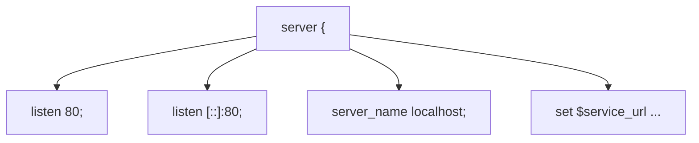
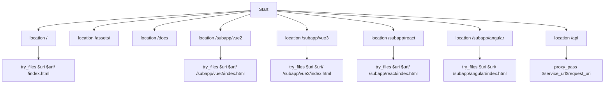

# Nginx配置

<cite>
**本文档中引用的文件**  
- [nginx.conf](file://nginx.conf)
</cite>

## 目录
1. [简介](#简介)
2. [server块配置](#server块配置)
3. [location块路由规则](#location块路由规则)
4. [反向代理与API配置](#反向代理与api配置)
5. [静态资源服务与缓存策略](#静态资源服务与缓存策略)
6. [跨域处理](#跨域处理)
7. [错误页面处理](#错误页面处理)
8. [性能优化建议](#性能优化建议)
9. [常见配置错误及解决方案](#常见配置错误及解决方案)

## 简介
本配置文件用于部署基于Vue的前端微前端项目，支持多个子应用（Vue2、Vue3、React、Angular）共存，并通过Nginx实现静态资源托管、路由重写、反向代理和跨域支持。配置适用于开发或测试环境，具备基本的安全头设置和WebSocket代理能力。

## server块配置

server块定义了Nginx服务器的基本监听行为和主机名匹配规则。

- **监听端口**：配置监听IPv4和IPv6的80端口，适用于HTTP服务。
- **server_name**：设置为`localhost`，表示仅响应主机头为localhost的请求。
- **变量定义**：通过`set $service_url`定义后端服务地址，便于在多个location中复用。



**Diagram sources**
- [nginx.conf](file://nginx.conf#L1-L5)

**Section sources**
- [nginx.conf](file://nginx.conf#L1-L10)

## location块路由规则

location块用于定义不同URL路径的处理逻辑，支持精确匹配、前缀匹配和正则匹配。

### 根路径匹配
```nginx
location / {
    root   /usr/share/nginx/html;
    index  index.html index.htm;
    try_files $uri $uri/ /index.html;
}
```
该配置支持单页应用（SPA）的前端路由，当请求的文件或目录不存在时，自动返回`index.html`，交由前端框架处理路由。

### 子应用路径匹配
针对微前端架构中的各个子应用，配置独立的location块：

- `/subapp/vue2`：指向Vue2子应用入口
- `/subapp/vue3`：指向Vue3子应用入口
- `/subapp/react`：指向React子应用入口
- `/subapp/angular`：指向Angular子应用入口

每个子应用均使用`try_files`确保前端路由正常工作。

### 特殊路径匹配
- `/assets/`：使用`alias`指令映射静态资源目录，避免路径拼接错误。
- `/docs`：修复文档路径访问问题，确保文档页面可正常加载。
- `=/50x.html`：精确匹配50x错误页面。



**Diagram sources**
- [nginx.conf](file://nginx.conf#L8-L39)

**Section sources**
- [nginx.conf](file://nginx.conf#L8-L45)

## 反向代理与API配置

`location /api` 块用于将API请求代理到后端服务，支持RESTful接口和WebSocket连接。

### 关键配置项
- `proxy_pass $service_url$request_uri`：保留原始URI路径，转发至预设的服务地址。
- `proxy_http_version 1.1`：启用HTTP/1.1以支持WebSocket。
- `Upgrade` 和 `Connection` 头部：实现WebSocket协议升级。
- 多个`proxy_set_header`设置真实IP、主机名和协议类型。
- 超时时间设置为6000秒，适应长时间连接（如WebSocket）。
- `proxy_buffering off`：关闭缓冲以支持流式传输。

### WebSocket支持
通过以下头部实现WebSocket代理：
```nginx
proxy_set_header Upgrade $http_upgrade;
proxy_set_header Connection "Upgrade";
```

**Section sources**
- [nginx.conf](file://nginx.conf#L76-L94)

## 静态资源服务与缓存策略

Nginx作为静态文件服务器，通过`root`和`alias`指令指定资源路径。

### 资源路径映射
- 根路径 `/` → `/usr/share/nginx/html`
- `/assets/` → `/usr/share/nginx/html/assets/`（使用alias避免重复路径）
- 各子应用路径独立映射

### 缓存建议（当前未配置）
虽然当前配置未启用显式缓存，但建议在生产环境中添加：

```nginx
location ~* \.(js|css|png|jpg|jpeg|gif|ico|svg)$ {
    expires 1y;
    add_header Cache-Control "public, immutable";
}
```

此策略可大幅提升静态资源加载性能。

## 跨域处理

通过`add_header`指令实现CORS（跨域资源共享）支持：

```nginx
add_header Access-Control-Allow-Origin *;
add_header Access-Control-Allow-Methods 'GET, POST, OPTIONS';
add_header Access-Control-Allow-Headers '*';
```

### 说明
- `Access-Control-Allow-Origin *`：允许所有来源访问（开发环境适用，生产环境应限制具体域名）
- 支持GET、POST和OPTIONS方法
- 允许所有请求头

**注意**：生产环境应避免使用通配符`*`，改为具体域名以增强安全性。

**Section sources**
- [nginx.conf](file://nginx.conf#L9-L10)
- [nginx.conf](file://nginx.conf#L90-L93)

## 错误页面处理

配置统一的错误页面响应机制：

```nginx
error_page   500 502 503 504  /50x.html;
location = /50x.html {
    root   /usr/share/nginx/html;
}
```

当发生5xx服务器错误时，返回`/50x.html`页面，提升用户体验。

**Section sources**
- [nginx.conf](file://nginx.conf#L50-L53)

## 性能优化建议

尽管当前配置已满足基本需求，以下优化建议可进一步提升性能：

1. **启用Gzip压缩**
   ```nginx
   gzip on;
   gzip_types text/plain application/json application/javascript text/css;
   ```
   可显著减少传输体积。

2. **静态资源缓存**
   如前所述，添加`expires`和`Cache-Control`头部。

3. **开启sendfile**
   ```nginx
   sendfile on;
   tcp_nopush on;
   ```
   提升文件传输效率。

4. **连接复用**
   ```nginx
   keepalive_timeout 65;
   ```

5. **限制请求频率**
   防止恶意刷接口：
   ```nginx
   limit_req_zone $binary_remote_addr zone=api:10m rate=10r/s;
   limit_req zone=api burst=20 nodelay;
   ```

## 常见配置错误及解决方案

| 错误现象 | 可能原因 | 解决方案 |
|--------|--------|--------|
| 前端路由刷新404 | 未配置`try_files` | 添加`try_files $uri $uri/ /index.html;` |
| 子应用无法加载 | 路径映射错误 | 使用`root`而非`alias`，并正确设置`try_files` |
| WebSocket连接失败 | 缺少Upgrade头部 | 添加`proxy_set_header Upgrade $http_upgrade;`等 |
| 跨域请求被拒 | 未设置CORS头 | 添加Access-Control-Allow-*头部 |
| 静态资源404 | root路径错误 | 检查容器内路径与host映射一致性 |
| API代理路径丢失 | proxy_pass未拼接$request_uri | 使用`$service_url$request_uri` |

**Section sources**
- [nginx.conf](file://nginx.conf#L8-L94)