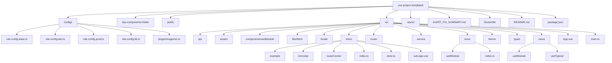
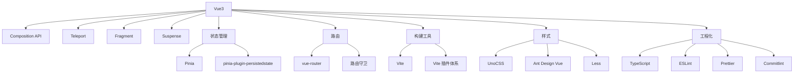
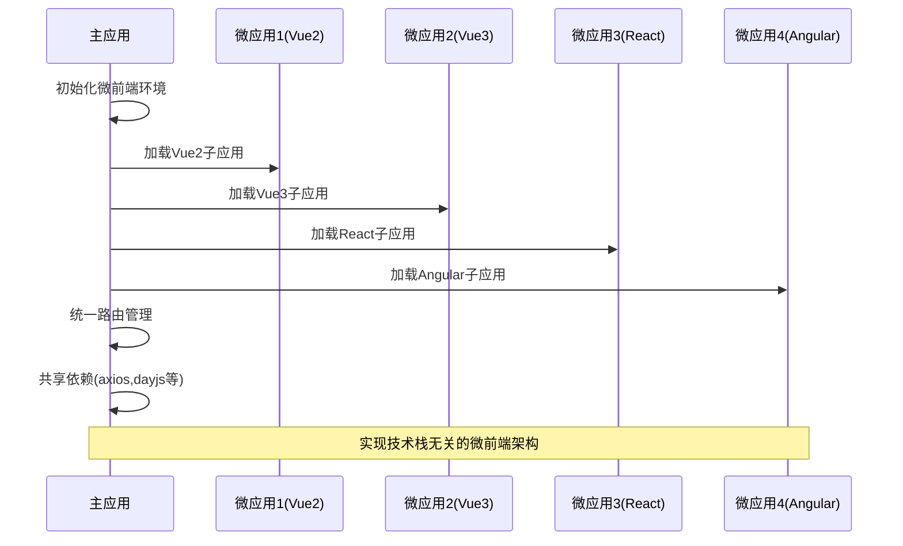
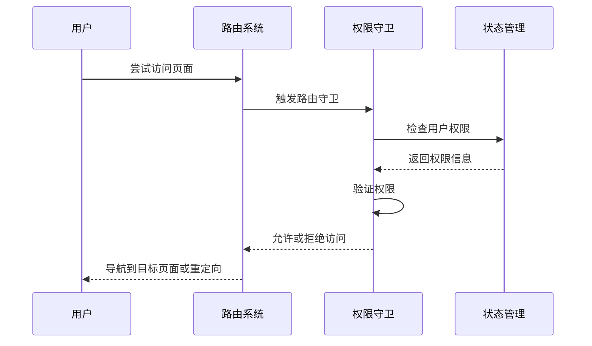

# 项目概述

<cite>
**本文档引用的文件**  
- [package.json](file://package.json)
- [README.md](file://README.md)
- [vite.config.base.ts](file://configs/vite.config.base.ts)
- [main.ts](file://src/main.ts)
- [micro/index.ts](file://src/micro/index.ts)
- [theme/index.ts](file://src/theme/index.ts)
- [locale/index.ts](file://src/locale/index.ts)
- [store/index.ts](file://src/store/index.ts)
- [router/index.ts](file://src/router/index.ts)
</cite>

## 目录
1. [简介](#简介)
2. [项目结构](#项目结构)
3. [核心特性](#核心特性)
4. [技术架构](#技术架构)
5. [微前端架构](#微前端架构)
6. [动态主题系统](#动态主题系统)
7. [国际化支持](#国际化支持)
8. [权限控制机制](#权限控制机制)
9. [技术选型与依赖分析](#技术选型与依赖分析)
10. [构建与开发流程](#构建与开发流程)
11. [总结](#总结)

## 简介

vue-project-template6 是一个现代化的 Vue3 前端开发模板，旨在为企业级复杂应用提供完整的工程化解决方案。该项目不仅集成了最新的前端技术栈，还内置了微前端、动态主题、国际化、权限控制等企业级特性，为开发者提供开箱即用的开发体验。

该模板的设计哲学是"约定优于配置"，通过合理的默认配置和模块化设计，降低项目初始化成本，提高团队协作效率。项目支持多种部署模式，包括单体应用和微前端架构，能够适应不同规模和复杂度的应用场景。

**Section sources**
- [README.md](file://README.md#L1-L80)
- [package.json](file://package.json#L1-L158)

## 项目结构



**Diagram sources**
- [package.json](file://package.json#L1-L158)
- [project_structure](file://#L1-L500)

**Section sources**
- [package.json](file://package.json#L1-L158)

## 核心特性

vue-project-template6 项目集成了多项企业级前端开发所需的核心特性，这些特性共同构成了一个完整的现代化前端开发解决方案。

### 微前端架构支持
项目原生支持微前端架构，通过 `@micro-zoe/micro-app` 和 Vite 插件实现模块联邦，允许将大型应用拆分为多个独立开发、独立部署的子应用。

### 动态主题系统
内置了完整的主题切换机制，支持亮色和暗色两种主题模式，通过 Ant Design Vue 的主题配置系统实现无缝切换。

### 国际化支持
集成了专业的国际化解决方案 `@international/vue3-i18n`，支持多语言切换，并提供了完整的命令行工具链来管理翻译资源。

### 权限控制机制
实现了基于路由的权限控制体系，通过路由守卫和状态管理实现细粒度的访问控制。

### 状态管理
采用 Pinia 作为状态管理方案，并集成了持久化插件，确保关键状态在页面刷新后依然存在。

### 工程化规范
集成了 ESLint、Prettier、Commitlint 等代码质量工具，确保团队代码风格统一，提高代码可维护性。

**Section sources**
- [README.md](file://README.md#L1-L80)
- [package.json](file://package.json#L1-L158)

## 技术架构



**Diagram sources**
- [package.json](file://package.json#L1-L158)
- [vite.config.base.ts](file://configs/vite.config.base.ts#L1-L92)

**Section sources**
- [package.json](file://package.json#L1-L158)

## 微前端架构

vue-project-template6 通过模块联邦和微应用框架实现了强大的微前端能力，允许将大型单体应用拆分为多个可独立开发和部署的子应用。

### 架构实现



### 核心配置

项目通过 `@originjs/vite-plugin-federation` 插件实现模块联邦，同时使用 `@micro-zoe/micro-app` 作为微应用容器。在 `vite.config.base.ts` 中配置了模块暴露机制：

```typescript
federation({
  name: 'home',
  filename: 'remoteEntry.js',
  exposes: {
    './axios': 'axios',
    './ant-design-vue': 'ant-design-vue',
    './dayjs': 'dayjs'
  }
})
```

这种设计允许子应用共享主应用的核心依赖，减少重复打包，优化加载性能。

**Diagram sources**
- [vite.config.base.ts](file://configs/vite.config.base.ts#L1-L92)
- [src/micro/index.ts](file://src/micro/index.ts#L1-L65)

**Section sources**
- [vite.config.base.ts](file://configs/vite.config.base.ts#L1-L92)
- [src/micro/index.ts](file://src/micro/index.ts#L1-L65)

## 动态主题系统

项目实现了完整的动态主题切换功能，支持亮色和暗色两种主题模式，满足不同用户在不同环境下的视觉需求。

### 主题架构

```mermaid
classDiagram
class ThemeTypes {
+Light : string
+Dark : string
}
class themeTokens {
+light : object
+dark : object
}
class theme {
+token : object
+algorithm : function
}
ThemeTypes <|-- themeTokens
themeTokens --> theme : "使用"
main.ts --> theme : "导入"
App.vue --> theme : "应用"
Note over themeTokens,theme : 主题系统通过Ant Design Vue的Design Token机制实现
```

### 实现方式

在 `src/theme/index.ts` 中定义了主题类型枚举和主题令牌：

```typescript
export enum ThemeTypes {
  Light = 'light',
  Dark = 'dark'
}

export const themeTokens = {
  light: LightToken,
  dark: DarkToken
};
```

在 `main.ts` 中通过 `a-config-provider` 组件应用主题配置，实现了全局主题的动态切换能力。

**Diagram sources**
- [src/theme/index.ts](file://src/theme/index.ts#L1-L13)
- [main.ts](file://src/main.ts#L1-L37)

**Section sources**
- [src/theme/index.ts](file://src/theme/index.ts#L1-L13)
- [main.ts](file://src/main.ts#L1-L37)

## 国际化支持

项目集成了完整的国际化解决方案，支持多语言切换和翻译资源管理。

### 国际化架构

```mermaid
flowchart TD
A[初始化] --> B[加载语言包]
B --> C{检测语言环境}
C --> |中文| D[加载zh-CN]
C --> |英文| E[加载en-US]
D --> F[创建i18n实例]
E --> F
F --> G[应用到Vue实例]
G --> H[组件中使用$t()]
H --> I[动态翻译]
J[命令行工具] --> K[i18n:init]
J --> L[i18n:extract]
J --> M[i18n:translate]
J --> N[i18n:exportAll]
J --> O[i18n:import]
J --> P[i18n:sync]
```

### 实现机制

在 `src/locale/index.ts` 中配置了国际化实例：

```typescript
import { createI18n } from '@international/vue3-i18n';
import en from '../../.kiwi/en-US';
import zh from '../../.kiwi/zh-CN';

export default function i18n(app: any) {
  const i18nIns = createI18n(app, {
    autoDetect: false,
    messages: {
      zh: { I18N: zh },
      en: { I18N: en }
    },
    kiwi: {
      zh,
      en
    }
  });
  app.use(i18nIns);
}
```

通过 `package.json` 中的脚本命令，提供了完整的国际化工作流支持。

**Diagram sources**
- [src/locale/index.ts](file://src/locale/index.ts#L1-L19)
- [package.json](file://package.json#L1-L158)

**Section sources**
- [src/locale/index.ts](file://src/locale/index.ts#L1-L19)
- [package.json](file://package.json#L1-L158)

## 权限控制机制

项目实现了基于路由的权限控制体系，通过路由守卫和状态管理实现细粒度的访问控制。

### 权限架构



### 实现方式

在 `src/router/index.ts` 中通过 `setupPermissionGuard` 函数设置权限守卫：

```typescript
function setupPermissionGuard(router: Router) {
  // 权限验证逻辑
}
```

路由数据通过 `routeToArr` 函数进行扁平化处理，便于权限验证和菜单生成。

**Diagram sources**
- [src/router/index.ts](file://src/router/index.ts#L1-L52)
- [src/store/index.ts](file://src/store/index.ts#L1-L14)

**Section sources**
- [src/router/index.ts](file://src/router/index.ts#L1-L52)
- [src/store/index.ts](file://src/store/index.ts#L1-L14)

## 技术选型与依赖分析

项目的技术选型体现了现代化前端开发的最佳实践，各项技术选择都有明确的工程化考量。

### 核心依赖分析

| 类别 | 技术栈 | 选择理由 |
|------|-------|---------|
| **框架** | Vue3 | 最新的Vue版本，支持Composition API，性能优越 |
| **状态管理** | Pinia | Vue官方推荐，TypeScript支持好，API简洁 |
| **路由** | vue-router | Vue官方路由解决方案，功能完整 |
| **UI组件库** | Ant Design Vue | 企业级UI组件库，设计规范，功能丰富 |
| **构建工具** | Vite | 快速的开发服务器，优秀的HMR体验 |
| **样式方案** | UnoCSS | 原子化CSS，按需生成，体积小 |
| **微前端** | @micro-zoe/micro-app | 轻量级微前端解决方案，兼容性好 |

### 工程化依赖

项目集成了完整的工程化工具链，包括：

- **代码质量**: ESLint + Prettier + Stylelint
- **提交规范**: Commitlint + Husky
- **类型安全**: TypeScript
- **性能优化**: Vite插件体系
- **依赖管理**: npm-run-all 并行执行脚本

这些工具共同保障了代码质量和开发效率。

**Section sources**
- [package.json](file://package.json#L1-L158)
- [README.md](file://README.md#L1-L80)

## 构建与开发流程

项目提供了完善的开发和构建脚本，支持多种开发场景。

### 脚本命令分析

```mermaid
flowchart TD
A[开发命令] --> A1[npm run dev]
A --> A2[npm run dev:frontend]
A --> A3[npm run dev:mock]
B[构建命令] --> B1[npm run build]
B --> B2[npm run build:micro]
B --> B3[npm run build:lib]
C[代码质量] --> C1[npm run lint]
C --> C2[npm run lint-fix]
C --> C3[npm run prepare]
D[微前端] --> D1[npm run start:micro]
D --> D2[npm run build:micro]
D --> D3[各子应用专用命令]
E[国际化] --> E1[npm run i18n:init]
E --> E2[npm run i18n:extract]
E --> E3[npm run i18n:translate]
F[初始化] --> F1[npm run bootstrap]
F --> F2[安装所有依赖]
F --> F3[安装子应用依赖]
```



### 开发工作流

1. **初始化**: `npm run bootstrap` 安装所有依赖
2. **开发**: `npm run dev` 启动开发服务器和mock服务
3. **代码检查**: `npm run lint` 进行代码质量检查
4. **构建**: `npm run build` 生成生产环境代码
5. **微前端**: `npm run start:micro` 启动所有子应用

这种设计使得开发流程标准化，降低了新成员的上手成本。

**Section sources**
- [package.json](file://package.json#L1-L158)
- [README.md](file://README.md#L1-L80)

## 总结

vue-project-template6 项目作为一个现代化的 Vue3 前端开发模板，成功地将企业级应用所需的各种特性集成到一个统一的开发框架中。该项目不仅提供了开箱即用的开发体验，还通过合理的架构设计和技术选型，解决了复杂前端应用的工程化挑战。

项目的核心价值在于：
- **标准化**: 统一的技术栈和工程化规范
- **可扩展**: 微前端架构支持应用的持续演进
- **用户体验**: 动态主题和国际化提升产品体验
- **开发效率**: 完善的工具链和脚本支持

对于初学者，该项目提供了清晰的学习路径和最佳实践参考；对于经验丰富的开发者，它提供了一个可定制、可扩展的企业级开发平台。无论是构建新的大型应用，还是重构现有系统，vue-project-template6 都是一个值得考虑的优秀起点。