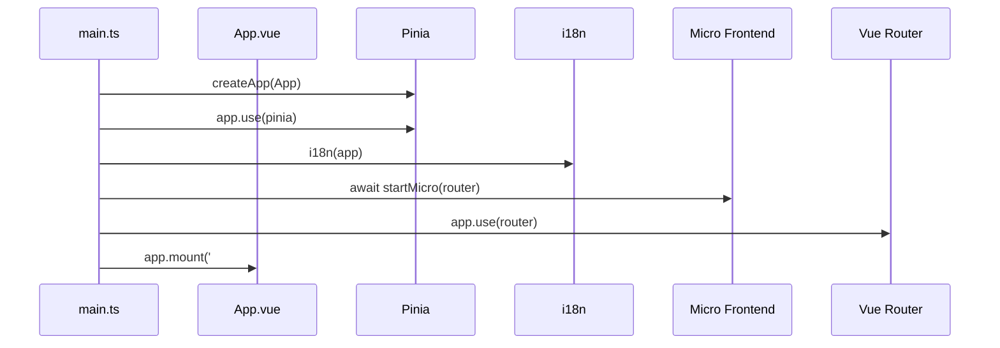
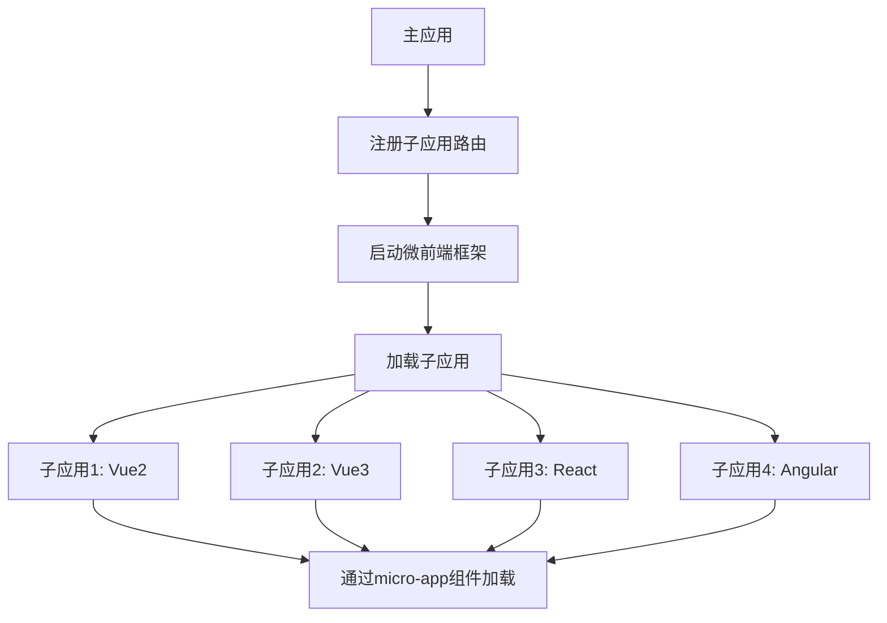
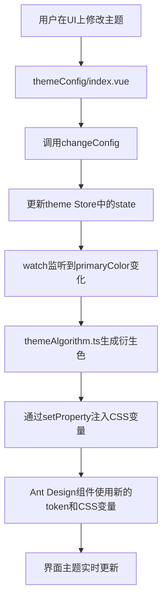
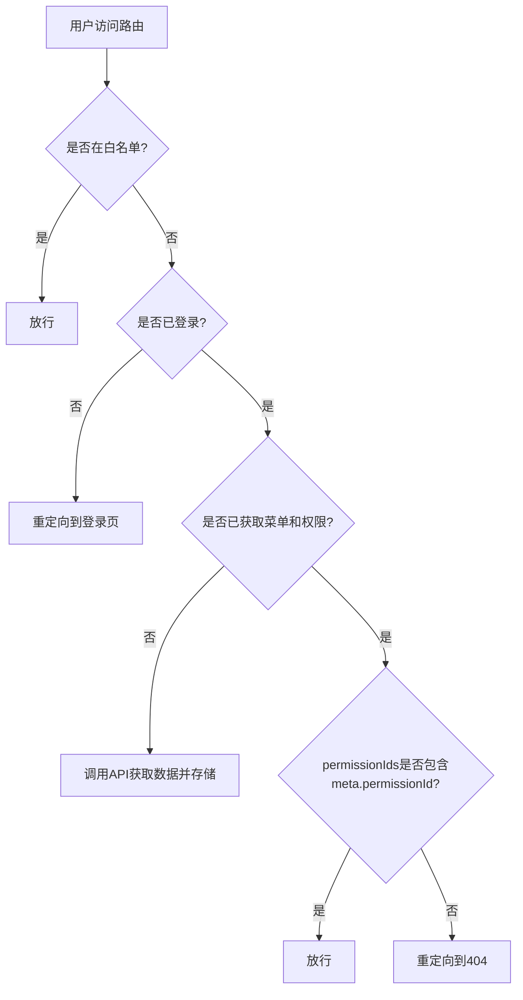

# 项目概述

<cite>
**本文档引用的文件**   
- [README.md](file://README.md)
- [package.json](file://package.json)
- [src/main.ts](file://src/main.ts)
- [src/router/index.ts](file://src/router/index.ts)
- [src/router/routes.ts](file://src/router/routes.ts)
- [src/router/guard.ts](file://src/router/guard.ts)
- [src/store/index.ts](file://src/store/index.ts)
- [src/store/uedModule/theme/index.ts](file://src/store/uedModule/theme/index.ts)
- [src/store/uedModule/theme/types.ts](file://src/store/uedModule/theme/types.ts)
- [src/store/uedModule/menus/types.ts](file://src/store/uedModule/menus/types.ts)
- [src/locale/index.ts](file://src/locale/index.ts)
- [src/micro/index.ts](file://src/micro/index.ts)
- [src/components/uedModule/layout/index.vue](file://src/components/uedModule/layout/index.vue)
- [src/views/uedModule/themeConfig/index.vue](file://src/views/uedModule/themeConfig/index.vue)
</cite>

## 目录
1. [项目概述](#项目概述)
2. [技术栈与核心依赖](#技术栈与核心依赖)
3. [项目结构分析](#项目结构分析)
4. [核心架构与初始化流程](#核心架构与初始化流程)
5. [微前端架构实现](#微前端架构实现)
6. [主题切换功能实现](#主题切换功能实现)
7. [权限控制机制](#权限控制机制)
8. [国际化支持](#国际化支持)
9. [模块化组织方式](#模块化组织方式)
10. [典型应用场景](#典型应用场景)

## 项目概述

`vue-project-template6` 是一个企业级的 Vue 3 前端开发模板，旨在为开发者提供一个功能完备、架构清晰、易于扩展的项目起点。该项目不仅集成了现代前端开发的最佳实践，还特别强化了对微前端、主题切换、权限控制和国际化等企业级应用关键特性的支持。通过采用 Vue 3 的组合式 API 和响应式系统，结合 TypeScript 提供的强类型保障，该项目确保了代码的可维护性和健壮性。其设计目标是成为一个“开箱即用”的解决方案，能够显著缩短中后台管理系统的开发周期，让开发者能够专注于业务逻辑的实现，而非基础架构的搭建。

**Section sources**
- [README.md](file://README.md)

## 技术栈与核心依赖

该项目构建于一套成熟且先进的技术栈之上，其核心依赖在 `package.json` 文件中明确定义。主要技术栈包括：

*   **Vue 3**: 作为核心框架，利用其 Composition API 提供更灵活的代码组织方式和更好的逻辑复用能力。
*   **TypeScript**: 为整个项目提供静态类型检查，极大地提升了代码质量和开发体验，减少了运行时错误。
*   **Vite**: 作为构建工具，提供闪电般的冷启动和热模块替换（HMR），显著优化了开发体验。
*   **Pinia**: 作为状态管理库，替代了 Vuex，其 API 更简洁，与 TypeScript 集成更友好，支持插件扩展（如 `pinia-plugin-persistedstate` 实现状态持久化）。
*   **Ant Design Vue**: 作为 UI 组件库，提供了丰富、美观且功能强大的组件，加速了用户界面的开发。

此外，项目还引入了 `UnoCSS` 作为原子化 CSS 引擎，实现了极致的 CSS 性能和灵活性。`@micro-zoe/micro-app` 和 `@originjs/vite-plugin-federation` 等依赖则为微前端架构提供了底层支持。

```mermaid
graph TD
A[Vue 3] --> B[TypeScript]
A --> C[Vite]
A --> D[Pinia]
A --> E[Ant Design Vue]
C --> F[UnoCSS]
D --> G[Pinia Plugin Persistedstate]
E --> H[Ant Design Icons Vue]
I[Micro Frontend] --> J[@micro-zoe/micro-app]
I --> K[@originjs/vite-plugin-federation]
```

**Diagram sources**
- [package.json](file://package.json)

**Section sources**
- [package.json](file://package.json)

## 项目结构分析

项目的目录结构遵循了清晰的模块化原则，便于团队协作和代码维护。

*   **configs/**: 存放 Vite 的配置文件，包括基础配置、开发、生产、库构建等不同环境的配置，体现了配置分离的最佳实践。
*   **das-components-folder/**: 包含项目自定义的 DAS 组件的文档和元数据，用于组件库的管理和展示。
*   **public/**: 存放静态资源文件，如 `index.html` 和 `empty.html`（用于微前端的 iframe 沙箱）。
*   **src/**: 源代码主目录。
    *   **api/**: 定义与后端服务的接口。
    *   **assets/**: 存放字体、样式重置等静态资源。
    *   **components/uedModule/**: 包含可复用的 UI 组件，如布局、菜单、机器人助手等。
    *   **libs/fetch/**: 封装的网络请求库。
    *   **locale/**: 国际化相关的配置和逻辑。
    *   **micro/**: 微前端功能的核心实现，包含子应用集成和通信逻辑。
    *   **router/**: Vue Router 的配置，包括路由定义、守卫和工具函数。
    *   **service/**: 业务服务层。
    *   **store/**: Pinia 状态管理，按功能模块（app, login, menus, theme, user）组织。
    *   **theme/**: 主题相关的配置、算法和 CSS 文件。
    *   **views/**: 页面级视图组件，分为 `uedModule`（模块内页面）和 `uedTypical`（典型页面）。
    *   **App.vue** 和 **main.ts**: 应用的根组件和入口文件。

这种结构将功能、视图、状态和配置清晰地分离，使得项目易于理解和扩展。

**Section sources**
- [README.md](file://README.md)

## 核心架构与初始化流程

应用的启动流程在 `src/main.ts` 文件中定义，清晰地展示了核心依赖的注入顺序。



**Diagram sources**
- [src/main.ts](file://src/main.ts#L1-L38)

**Section sources**
- [src/main.ts](file://src/main.ts#L1-L38)

### 初始化流程详解
1.  **创建应用实例**: 使用 `createApp` 创建 Vue 应用实例。
2.  **注入 Pinia**: 立即将 Pinia 状态管理器注入应用，使其在任何组件中都可访问。
3.  **配置全局属性**: 设置全局属性，如 `$tours` (用于引导) 和 `$oem` (用于品牌定制)。
4.  **初始化国际化**: 调用 `i18n(app)` 函数，将国际化实例注册到应用中。
5.  **启动微前端**: 调用 `startMicro(router)` 函数，这是一个异步操作，负责注册子应用的路由并启动微前端框架。
6.  **注入路由**: 在微前端初始化完成后，将 Vue Router 注入应用。
7.  **挂载应用**: 最后，将应用挂载到 DOM 的 `#app` 元素上。

这个流程确保了微前端的路由配置在主应用路由生效前就绪，避免了路由冲突。

## 微前端架构实现

该项目通过 `@micro-zoe/micro-app` 库实现了微前端架构，支持将多个独立的子应用（如 Vue2, Vue3, React, Angular）集成到同一个主应用中。

### 核心实现
*   **子应用注册**: 在 `src/micro/index.ts` 的 `startMicro` 函数中，通过 `registerRouterCenter` 和 `setupAddMicroRouter` 将子应用的路由信息注册到主应用的路由系统中。
*   **子应用加载**: 使用 `<micro-app>` 自定义组件（定义于 `src/micro/sub-app.vue`）来加载和渲染子应用。该组件通过 `name` 和 `url` 属性指定子应用。
*   **通信机制**: 子应用通过 `window.__MICRO_APP_ENVIRONMENT__` 全局变量来判断自己是否运行在微前端环境中，并据此调整其行为（如设置 `__webpack_public_path__`）。
*   **沙箱隔离**: 通过 `iframe` 模式和 `fiber` 模式提供运行时沙箱，隔离子应用的全局变量和样式，防止冲突。



**Diagram sources**
- [src/micro/index.ts](file://src/micro/index.ts#L37-L64)
- [src/micro/sub-app.vue](file://src/micro/sub-app.vue#L1-L31)

**Section sources**
- [src/micro/index.ts](file://src/micro/index.ts#L37-L64)
- [src/micro/sub-app.vue](file://src/micro/sub-app.vue#L1-L31)

## 主题切换功能实现

主题切换功能通过结合 CSS 变量、Pinia 状态管理和 Ant Design Vue 的主题算法实现。

### 实现原理
1.  **状态管理**: `theme` Store (`src/store/uedModule/theme/index.ts`) 管理着所有主题配置，如 `mode` (light/dark)、`primaryColor` (主题色)、`fontSize` (字号) 等。这些配置被持久化到 `localStorage` 中。
2.  **动态计算**: 当用户更改主题色时，`themeAlgorithm.ts` 文件中的 `watch` 函数会监听 `config.value.primaryColor` 的变化。它使用 `color` 和 `@ant-design/colors` 库生成一组与主色相关的衍生色（如浅色、深色版本）。
3.  **CSS 变量注入**: 生成的衍生色通过 `document.body.style.setProperty` 动态注入到 CSS 自定义属性（CSS Variables）中，如 `--um-primary-color-light`。
4.  **Ant Design 主题**: Store 中的 `theme` 计算属性会根据当前模式（亮/暗）选择不同的 `algorithm` (如 `darkAlgorithm`)，并覆盖 Ant Design 组件的 `token`（如 `colorPrimary`），从而改变组件的外观。
5.  **UI 控制**: `themeConfig/index.vue` 页面提供了用户界面，允许用户通过选择器和滑块来修改各项主题配置。



**Diagram sources**
- [src/store/uedModule/theme/index.ts](file://src/store/uedModule/theme/index.ts#L0-L158)
- [src/theme/themeAlgorithm.ts](file://src/theme/themeAlgorithm.ts#L18-L67)
- [src/views/uedModule/themeConfig/index.vue](file://src/views/uedModule/themeConfig/index.vue#L41-L75)

**Section sources**
- [src/store/uedModule/theme/index.ts](file://src/store/uedModule/theme/index.ts#L0-L158)
- [src/theme/themeAlgorithm.ts](file://src/theme/themeAlgorithm.ts#L18-L67)
- [src/views/uedModule/themeConfig/index.vue](file://src/views/uedModule/themeConfig/index.vue#L41-L75)

## 权限控制机制

权限控制通过路由守卫（Route Guard）和后端权限 ID 匹配来实现。

### 实现流程
1.  **白名单**: 定义 `WHITE_LIST`，包含登录页、404页等无需权限的页面。
2.  **路由守卫**: 在 `src/router/guard.ts` 的 `beforeEach` 守卫中进行权限校验。
3.  **登录状态检查**: 如果用户未登录且访问非白名单页面，则重定向到登录页。
4.  **权限获取**: 用户登录后，应用会从后端获取用户的菜单数据 (`getMenus`) 和权限 ID 列表 (`getPermissions`)，并存储在 Pinia Store 中。
5.  **权限校验**: 对于需要权限的页面，其路由元信息 `meta` 中会定义一个 `permissionId`。守卫会检查当前用户的 `permissionIds` 数组是否包含该 `permissionId`。如果不包含，则重定向到 404 页面。



**Diagram sources**
- [src/router/guard.ts](file://src/router/guard.ts#L0-L65)
- [src/router/routes.ts](file://src/router/routes.ts#L0-L199)

**Section sources**
- [src/router/guard.ts](file://src/router/guard.ts#L0-L65)
- [src/router/routes.ts](file://src/router/routes.ts#L0-L199)

## 国际化支持

国际化（i18n）功能通过 `@international/vue3-i18n` 库实现。

### 实现方式
1.  **消息定义**: 项目使用 Kiwi 工具管理多语言资源，生成的翻译文件位于 `./.kiwi/zh-CN` 和 `./.kiwi/en`。
2.  **初始化**: 在 `src/locale/index.ts` 中，`createI18n` 函数被调用，将中文和英文的消息对象注册到应用实例中。
3.  **使用**: 在 Vue 组件的模板中，通过 `$t('I18N.layout.gongZuoTai')` 这样的语法来获取对应的语言文本。`I18N` 是命名空间，`layout.gongZuoTai` 是具体的键。
4.  **命令行工具**: `package.json` 中定义了 `i18n:*` 系列脚本（如 `i18n:extract`, `i18n:translate`），用于自动化提取代码中的文本、翻译和同步。

**Section sources**
- [src/locale/index.ts](file://src/locale/index.ts#L0-L17)
- [package.json](file://package.json#L10-L25)

## 模块化组织方式

项目采用了基于功能的模块化组织方式，以 `uedModule` 为命名空间，将相关的组件、视图和状态管理集中在一起。

*   **组件模块化**: `src/components/uedModule` 目录下，`layout`、`menu`、`vueTour` 等子目录分别封装了布局、菜单和引导功能的组件，实现了高内聚、低耦合。
*   **状态管理模块化**: `src/store/uedModule` 目录下，`app`、`login`、`menus`、`theme`、`user` 等 Store 分别管理各自领域的状态，通过 `src/store/index.ts` 统一导出，方便在应用中使用。
*   **视图模块化**: `src/views/uedModule` 目录包含了 `login`、`loginConfig` 和 `themeConfig` 等与模块相关的页面。

这种组织方式使得代码结构清晰，职责分明，便于团队并行开发和维护。

**Section sources**
- [src/components/uedModule](file://src/components/uedModule)
- [src/store/uedModule](file://src/store/uedModule)
- [src/views/uedModule](file://src/views/uedModule)

## 典型应用场景

`vue-project-template6` 特别适用于以下场景：

*   **企业级中后台管理系统**: 其内置的权限控制、菜单管理、主题配置和国际化功能，非常适合快速搭建复杂的管理后台。
*   **微前端基座应用**: 作为主应用（基座），可以集成由不同技术栈（Vue, React, Angular）开发的多个子系统，实现技术栈无关的大型应用拆分。
*   **需要高度定制化的应用**: 通过主题配置页面，非技术人员也可以轻松调整应用的视觉风格（颜色、布局、字体等），满足不同客户的品牌需求。
*   **多语言支持的应用**: 内置的国际化方案和自动化工具链，使得开发支持多语言的产品变得简单高效。

总而言之，该项目是一个功能强大、架构先进的开发模板，为构建现代化、企业级的前端应用提供了坚实的基础。

**Section sources**
- [README.md](file://README.md)