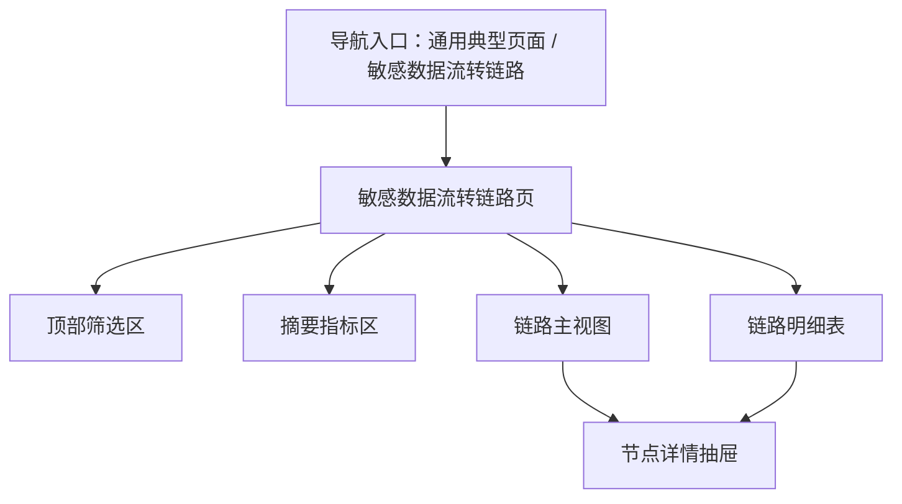
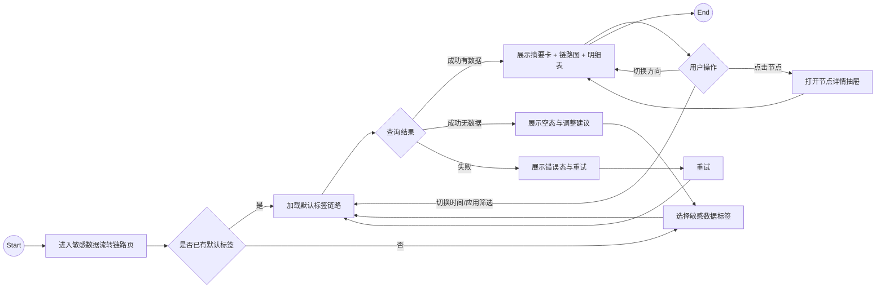

# 敏感数据流转链路 PRD（完整稿）

**版本**：V1.0（MVP）  
**模块**：API 风险监测 / 敏感数据流转链路

## 1. 背景与目标

### 1.1 背景

当前 API 风险监测产品已经具备敏感数据识别、账号访问分析、应用/API 资产视图等基础能力，但在“单个敏感标签的完整流转链路调查”上仍缺少统一页面。

产品经理、安全运营人员和分析人员在排查某类敏感数据是否存在异常扩散时，往往需要在多个页面之间来回切换：

1. 先从敏感数据标签列表定位目标标签。
2. 再到访问日志里排查哪些账号调用了相关 API。
3. 再到应用或 API 页面查看接口归属和风险状态。
4. 最后手工拼接请求量、返回量和时间分布，形成链路判断。

这种方式存在以下问题：

1. 数据视角分散，链路判断依赖人工拼接。
2. 无法快速回答“这个敏感标签到底经过了哪些账号、应用和 API”。
3. 请求侧与返回侧命中数量分散在不同视图中，缺少双向计数对照。
4. 面向安全运营的调查链路不完整，难以快速完成研判与汇报。

基于 Stage 0 竞品分析，行业产品通常更偏：

1. 通用 data lineage / data governance；
2. API 敏感数据暴露识别；
3. 数据外泄事件调查。

但较少提供一个面向 API 风险监测场景、以“敏感标签”为主入口的单页式链路调查视图。因此，本产品可以通过“标签驱动 + API 优先 + 证据钻取”的组合形成差异化体验。

### 1.2 目标（MVP）

本期目标是上线一个 **敏感数据流转链路页面 MVP**，支持：

1. 用户选择一个敏感数据标签，快速切换当前分析对象。
2. 页面展示该标签对应的完整流转链路：`标签 -> 调用账号 -> 访问应用 -> API 接口`。
3. 页面同时展示请求命中数量、返回命中数量、总请求量、最近访问时间等关键指标。
4. 用户可点击链路节点查看详情与证据，理解该节点在链路中的位置与风险。
5. 用户可通过时间范围、应用范围、链路方向筛选链路，支持快速研判。

### 1.3 非目标（本期不做）

1. 不做真实后端任务编排或异步链路计算任务中心。
2. 不做跨页面的多层详情流转，首期以单页 + 抽屉详情为主。
3. 不做可编辑的自定义链路编排、节点增删、拖拽拓扑。
4. 不做复杂告警联动闭环（如一键封禁账号、阻断 API）。
5. 不做 Pencil 设计稿交付，本轮在 PRD 后直接进入前端页面实现路径。

## 2. 术语与定义

| 术语 | 定义 |
|---|---|
| 敏感数据标签 | 对数据内容进行分类后的标签，如手机号、身份证号、银行卡号等 |
| 链路 | 某敏感标签从命中到被账号访问、被应用承载、被 API 接口处理的完整路径 |
| 链路节点 | 链路中的单个对象，包含标签节点、账号节点、应用节点、API 节点 |
| 请求命中数量 | 在请求报文中命中该敏感标签的次数 |
| 返回命中数量 | 在返回报文中命中该敏感标签的次数 |
| 链路方向 | 用户查看链路时选择的方向，包含全部 / 仅请求 / 仅返回 |
| 节点详情抽屉 | 点击链路节点后打开的右侧详情面板，用于展示明细与证据 |
| 链路明细记录 | 将单条链路关系展开后的表格记录，包含账号、应用、API、时间、计数等字段 |

## 3. 用户与使用场景

### 3.1 角色

#### 角色 A：API 风险监测产品经理

- 目标：快速理解某个敏感标签在产品中应该如何被呈现、解释和调查。
- 关注内容：标签入口、链路可视化、业务解释性、页面完整度。

#### 角色 B：安全运营人员

- 目标：针对某个敏感标签快速完成流转链路调查，识别异常扩散路径。
- 关注内容：调用账号、应用归属、API 接口、请求/返回数量、最近访问时间。

#### 角色 C：风险分析人员 / 应用安全分析师

- 目标：从 API 视角判断敏感数据暴露范围和访问上下文。
- 关注内容：API 方法、路径、所属应用、风险等级、节点详情与证据。

### 3.2 典型场景

1. 安全运营人员选择“手机号”标签，排查近 24 小时内经过哪些账号和 API 被访问。
2. 产品经理基于“身份证号”标签链路查看页面效果，评估是否满足调查与汇报需求。
3. 风险分析师筛选某业务应用，查看其所有涉及“银行卡号”的接口与返回命中情况。
4. 用户点击 API 节点，进一步查看该接口的请求/返回命中明细和最近访问记录。

## 4. 信息架构与页面

### 4.0 IA 图（信息架构）

### 4.1 用户流程图（User Flow）

### 4.2 页面清单

1. **敏感数据流转链路页**
   - 页面唯一主入口，展示标签筛选、摘要指标、链路视图、链路明细。
2. **节点详情抽屉**
   - 作为页面内二级视图，用于展示当前节点的业务信息、技术信息、风险信息和证据摘要。

### 4.3 页面布局要点（可交付研发）

#### A. 敏感数据流转链路页

- 顶部搜索区：
  - 敏感标签选择器
  - 时间范围
  - 应用筛选
  - 链路方向切换（全部 / 仅请求 / 仅返回）
- 首屏摘要区：
  - 触达应用数
  - 触达 API 数
  - 关联账号数
  - 请求命中数量
  - 返回命中数量
- 中部链路区：
  - 采用横向分层布局，固定节点顺序：标签 -> 账号 -> 应用 -> API
  - 节点支持高亮上下游
  - 节点支持点击进入详情抽屉
- 下部明细区：
  - 表格展示每条链路记录
  - 支持按最近访问时间降序排序
  - 支持查看请求/返回方向、命中字段、风险状态

#### B. 节点详情抽屉

- 右侧抽屉展示，默认宽度适合中高信息量详情。
- 分为 4 个模块：
  - 基本信息
  - 调用/命中指标
  - 关联上下游
  - 最近访问记录 / 证据摘要
- API 节点需额外展示：
  - 方法
  - 路径
  - 所属应用
  - 请求命中 / 返回命中

## 5. 数据模型（字段定义）

### 5.1 核心实体（表格）

#### 实体 1：敏感标签概览 `SensitiveTagOverview`

| 字段 | 类型 | 必填 | 说明 |
|---|---|---|---|
| tagId | string | 是 | 标签 ID |
| tagName | string | 是 | 标签名称 |
| tagCategory | enum | 是 | 标签类别：personal / finance / identity / device / custom |
| riskLevel | enum | 是 | 风险等级：high / medium / low |
| appCount | number | 是 | 触达应用数 |
| apiCount | number | 是 | 触达 API 数 |
| accountCount | number | 是 | 关联账号数 |
| requestHitCount | number | 是 | 请求命中数量 |
| responseHitCount | number | 是 | 返回命中数量 |
| lastAccessTime | datetime | 否 | 最近访问时间 |

#### 实体 2：链路节点 `LineageNode`

| 字段 | 类型 | 必填 | 说明 |
|---|---|---|---|
| nodeId | string | 是 | 节点 ID |
| nodeType | enum | 是 | tag / account / app / api |
| nodeName | string | 是 | 节点名称 |
| subLabel | string | 否 | 节点补充信息，如部门、应用域、方法 |
| riskLevel | enum | 否 | 风险等级 |
| requestHitCount | number | 否 | 请求命中数量 |
| responseHitCount | number | 否 | 返回命中数量 |
| upstreamCount | number | 否 | 上游关联数 |
| downstreamCount | number | 否 | 下游关联数 |
| latestEventTime | datetime | 否 | 最近事件时间 |

#### 实体 3：链路关系 `LineageEdge`

| 字段 | 类型 | 必填 | 说明 |
|---|---|---|---|
| edgeId | string | 是 | 关系 ID |
| sourceNodeId | string | 是 | 起点节点 ID |
| targetNodeId | string | 是 | 终点节点 ID |
| direction | enum | 是 | all / request / response |
| requestCount | number | 是 | 请求侧次数 |
| responseCount | number | 是 | 返回侧次数 |
| latestEventTime | datetime | 否 | 最近事件时间 |

#### 实体 4：链路明细记录 `LineageRecord`

| 字段 | 类型 | 必填 | 说明 |
|---|---|---|---|
| recordId | string | 是 | 明细记录 ID |
| tagId | string | 是 | 敏感标签 ID |
| tagName | string | 是 | 敏感标签名称 |
| accountName | string | 是 | 调用账号 |
| accountDept | string | 否 | 账号所属部门 |
| appId | string | 是 | 应用 ID |
| appName | string | 是 | 应用名称 |
| apiId | string | 是 | API ID |
| apiMethod | enum | 是 | GET / POST / PUT / DELETE / PATCH |
| apiPath | string | 是 | API 路径 |
| requestHitCount | number | 是 | 请求命中数量 |
| responseHitCount | number | 是 | 返回命中数量 |
| requestTotal | number | 是 | 请求总量 |
| responseTotal | number | 是 | 返回总量 |
| matchedFields | string[] | 否 | 命中字段列表 |
| direction | enum | 是 | request / response / both |
| riskStatus | enum | 是 | normal / warning / high |
| latestAccessTime | datetime | 否 | 最近访问时间 |

#### 实体 5：节点详情 `LineageNodeDetail`

| 字段 | 类型 | 必填 | 说明 |
|---|---|---|---|
| nodeId | string | 是 | 节点 ID |
| nodeType | enum | 是 | 节点类型 |
| title | string | 是 | 节点标题 |
| summary | string | 否 | 节点摘要 |
| ownerName | string | 否 | 负责人 / 归属人 |
| appName | string | 否 | 所属应用 |
| apiMethod | enum | 否 | API 方法 |
| apiPath | string | 否 | API 路径 |
| requestHitCount | number | 否 | 请求命中数量 |
| responseHitCount | number | 否 | 返回命中数量 |
| latestEvents | object[] | 否 | 最近访问记录摘要 |
| upstreamNodes | object[] | 否 | 上游节点简表 |
| downstreamNodes | object[] | 否 | 下游节点简表 |

### 5.2 附属实体（可选）

#### 实体：查询条件 `LineageFilter`

| 字段 | 类型 | 必填 | 说明 |
|---|---|---|---|
| tagId | string | 是 | 当前选中的敏感标签 |
| appIds | string[] | 否 | 筛选应用 |
| timeRange | [datetime, datetime] | 否 | 时间范围 |
| direction | enum | 是 | all / request / response |
| keyword | string | 否 | 明细表关键字搜索（账号/API） |

#### 实体：查询任务状态 `LineageQueryTask`

| 字段 | 类型 | 必填 | 说明 |
|---|---|---|---|
| taskId | string | 是 | 查询任务 ID |
| status | enum | 是 | idle / loading / success / empty / failed |
| currentTagId | string | 是 | 当前标签 |
| errorCode | string | 否 | 失败码 |
| errorMessage | string | 否 | 失败信息 |
| updatedAt | datetime | 否 | 更新时间 |

## 6. 核心功能需求

### 6.1 列表/卡片展示字段

#### 6.1.1 筛选区

页面顶部必须提供以下筛选项：

1. 敏感数据标签选择器（必填）
2. 时间范围（默认近 24 小时）
3. 应用筛选（可多选）
4. 链路方向切换：
   - 全部
   - 仅请求
   - 仅返回

#### 6.1.2 摘要指标区

当标签查询成功后，页面需展示以下摘要卡：

1. 触达应用数
2. 触达 API 数
3. 关联账号数
4. 请求命中数量
5. 返回命中数量
6. 最近访问时间

#### 6.1.3 链路主视图区

链路主视图必须满足：

1. 固定展示 4 层节点：
   - 标签
   - 账号
   - 应用
   - API
2. 节点需展示名称和核心指标。
3. API 节点需同时展示方法与路径。
4. 当前选中节点需高亮，并联动高亮上下游关系线。
5. 用户切换方向后，链路只保留对应方向的数据或关系。

#### 6.1.4 链路明细表

明细表至少展示以下列：

1. 标签名称
2. 调用账号
3. 所属应用
4. API 方法
5. API 路径
6. 请求命中数量
7. 返回命中数量
8. 请求总量
9. 返回总量
10. 命中字段
11. 风险状态
12. 最近访问时间
13. 操作（查看节点详情）

### 6.2 查看 / 钻取 / 复制

本页面不涉及新建、编辑、复制、删除实体，但需支持以下查看类交互：

1. **查看节点详情**
   - 点击任意节点或明细操作，打开节点详情抽屉。
2. **高亮链路**
   - 点击节点后，高亮该节点的上游和下游。
3. **复制链路摘要**
   - 页面支持复制当前标签的一行链路摘要文本，便于汇报或沟通。

### 6.3 搜索 / 筛选 / 排序

1. 用户切换敏感标签后，必须重新加载当前页全部链路数据。
2. 用户修改时间范围或应用筛选后，必须保留当前标签上下文。
3. 明细表默认按最近访问时间倒序。
4. 明细表支持按账号或 API 路径关键字检索。
5. 用户切换方向时，摘要卡和链路图需同步刷新。

### 6.4 节点详情抽屉

#### 6.4.1 标签节点详情

展示内容：

1. 标签名称、类别、风险等级
2. 当前命中的应用数、API 数、账号数
3. 最近访问时间
4. 下游 Top API / Top 应用简表

#### 6.4.2 账号节点详情

展示内容：

1. 账号名称、部门、角色（如有）
2. 关联应用数
3. 最近访问 API 数
4. 请求/返回命中数量
5. 最近访问记录摘要

#### 6.4.3 应用节点详情

展示内容：

1. 应用名称、应用域、负责人（如有）
2. 关联账号数
3. 关联 API 数
4. 请求/返回命中数量
5. 最近命中的 API 列表

#### 6.4.4 API 节点详情

展示内容：

1. API 方法、路径
2. 所属应用
3. 请求命中数量 / 返回命中数量
4. 请求总量 / 返回总量
5. 命中字段
6. 最近访问记录

## 7. 状态机（表格）

### 7.1 状态枚举

本页面核心状态机采用查询任务状态 `LineageQueryTask`：

- `idle`：未加载
- `loading`：加载中
- `success`：加载成功且有数据
- `empty`：加载成功但无数据
- `failed`：加载失败

### 7.2 状态转移与动作规则（含失败提示）

| 当前状态 | 动作 | 目标状态 | 前置条件 | 失败分支 | 失败提示 | 幂等/回滚策略 |
|---|---|---|---|---|---|---|
| idle | 进入页面并存在默认标签 | loading | 页面初始化完成 | 默认标签缺失 | 暂无可分析的敏感标签 | 停留 idle，提示用户先选择标签 |
| idle | 用户选择标签 | loading | 已选择标签 | 标签值非法 | 请选择有效的敏感标签 | 保持 idle |
| loading | 查询返回且有数据 | success | 接口成功返回且节点/明细非空 | 无 | 无 | 使用本次结果覆盖旧结果 |
| loading | 查询返回但无数据 | empty | 接口成功返回但结果为空 | 无 | 当前条件下暂无链路数据 | 清空旧结果，仅保留筛选条件 |
| loading | 查询失败 | failed | 网络/服务异常 | 401 / 403 / 5xx / timeout | 链路数据加载失败，请重试 | 保留最近一次成功结果快照（如有） |
| success | 用户修改筛选条件 | loading | 标签仍有效 | 请求失败 | 条件刷新失败，请重试 | 先显示 loading，再决定进入 success / empty / failed |
| success | 用户切换方向 | loading | 当前标签有效 | 请求失败 | 方向切换失败，请稍后重试 | 保留当前视图，直到新结果返回 |
| empty | 用户调整标签或时间范围 | loading | 新条件有效 | 请求失败 | 条件刷新失败，请重试 | 从 empty 进入新一轮查询 |
| failed | 用户点击重试 | loading | 保持当前条件 | 再次失败 | 仍未成功获取链路数据 | 连续失败时停留 failed |

## 8. 权限与安全

### 8.1 权限点（最小集）

1. **页面访问权限**
   - 能否进入敏感数据流转链路页。
2. **链路查询权限**
   - 能否切换标签、时间范围、应用范围并发起查询。
3. **节点详情查看权限**
   - 能否查看节点详情抽屉中的敏感信息。

### 8.2 风险操作策略（二次确认 / 审计 / 幂等 / 回滚）

本页面不包含修改类风险操作，但需满足以下安全约束：

1. 节点详情中涉及敏感字段样本时，仅展示摘要，不直接暴露原始数据值。
2. 页面查询行为可记录基础审计日志（谁在什么时间查看了哪个标签的链路）。
3. 同一筛选条件重复点击查询应视为幂等操作，不产生重复副作用。

## 9. 异常与边界（必须覆盖）

### 9.1 空态

1. 当前标签在所选时间范围内无链路数据。
2. 当前应用筛选条件过严，导致无结果。
3. 标签列表为空时，页面需提示“暂无可分析的敏感标签”。

### 9.2 加载态

1. 首次进入页面展示整体加载态。
2. 切换标签或方向时，链路区与明细区进入 loading。
3. 节点详情抽屉单独有加载态，避免阻塞主页面。

### 9.3 错误态（401 / 403 / 5xx / 查询失败等）

1. 401：会话失效，需重新登录。
2. 403：无权查看当前链路或节点详情。
3. 5xx / timeout：展示错误提示，并允许重试。
4. 节点详情失败时，仅影响抽屉，不影响主页面已加载结果。

### 9.4 长文本 / 多标签 / 大量数据 / 并发点击

1. API 路径超长时需省略显示，并提供 tooltip。
2. 命中字段数量过多时，首屏只展示前 N 项，剩余通过 tooltip 或抽屉查看。
3. 当链路节点较多时，链路区需支持横向滚动或局部收纳，避免布局溢出。
4. 用户连续切换标签或方向时，仅保留最后一次请求结果。
5. 明细表数据较多时，需分页展示，避免一次性渲染过量记录。

## 10. 埋点与指标（可选）

建议记录以下埋点，用于后续优化页面可用性：

1. 标签切换次数
2. 方向切换次数
3. 节点详情打开次数
4. 明细表筛选使用率
5. 空态触发次数
6. 错误重试次数

## 11. 验收标准（DoD）

### 11.1 功能 DoD

1. 用户可以选择敏感标签并成功加载链路。
2. 页面能展示标签、账号、应用、API 四层链路关系。
3. 页面能展示请求命中数量与返回命中数量。
4. 用户可以通过时间范围、应用、方向切换链路结果。
5. 用户可以打开节点详情抽屉查看证据摘要。
6. 明细表与链路视图数据保持一致。

### 11.2 质量 DoD

1. 页面加载、空态、错误态可区分且提示明确。
2. 超长 API 路径、命中字段、节点名称不会导致布局溢出。
3. 多次快速切换筛选条件不会导致结果错乱。
4. 页面在常规桌面分辨率下布局完整，不出现关键模块遮挡。
5. 所有交互按钮具备 loading / disabled 等基本状态反馈。

## 12. 验收用例清单（测试可直接用）

### 12.1 列表与展示

1. 成功选择“手机号”标签后，页面展示摘要卡、链路图和明细表。
2. API 节点展示方法、路径、请求命中数量和返回命中数量。
3. 点击链路节点后，高亮当前节点及上下游关系。

### 12.2 搜索与筛选

1. 切换时间范围后，页面重新加载当前标签链路。
2. 仅筛选某个应用后，链路与明细仅展示该应用相关数据。
3. 切换“仅请求”方向后，页面只保留请求侧命中链路。

### 12.3 节点详情

1. 点击账号节点可打开详情抽屉，展示账号信息与最近访问摘要。
2. 点击 API 节点可看到方法、路径、所属应用、请求/返回命中数量。
3. 节点详情加载失败时，仅抽屉展示错误，不影响主页面已加载内容。

### 12.4 空态与异常

1. 当前筛选条件无结果时，页面展示空态文案与引导。
2. 查询失败时，页面展示错误态与重试按钮。
3. 权限不足时，页面展示无权限提示，不展示敏感明细。

### 12.5 权限矩阵

1. 仅有页面访问权限的用户可以进入页面，但若无节点详情权限，则无法打开抽屉详情。
2. 无链路查询权限的用户无法修改筛选条件或触发查询。
3. 有全部权限的用户可以完成完整链路查看和节点钻取。

### 12.6 边界与性能

1. 当 API 路径超过正常展示宽度时，表格不换行溢出，支持 tooltip 查看完整路径。
2. 当命中字段超过 5 个时，首屏收纳并可查看剩余字段。
3. 用户连续快速切换标签三次，仅最后一次结果生效。

## 13. 决策点（需要拍板 + 默认建议）

| 决策点 | 说明 | 推荐默认 | 影响 |
|---|---|---|---|
| 页面是否仅做单页 | 是否拆分详情页 | 单页 + 详情抽屉 | 降低 MVP 成本，便于快速交付 |
| 默认时间范围 | 首次进入页面的默认时间 | 近 24 小时 | 保持结果密度适中，便于演示 |
| 链路方向默认值 | 首次加载默认查看全部 / 请求 / 返回 | 全部 | 兼顾完整理解与展示完整度 |
| 应用筛选是否支持多选 | 是否允许同时筛多个应用 | 支持多选 | 更符合调查场景 |
| 节点详情是否展示原始字段值 | 是否直接暴露样本内容 | 仅展示摘要 | 降低敏感信息展示风险 |

## 14. 自检附录（需求匹配度）

### 14.1 覆盖度检查

- 已覆盖需求点 1：在通用典型页面二级菜单新增一个敏感数据溯源页面。
- 已覆盖需求点 2：围绕敏感数据标签展示完整流转路径。
- 已覆盖需求点 3：展示标签名称、调用账号、访问应用、API 接口。
- 已覆盖需求点 4：展示请求和返回数量。
- 已覆盖需求点 5：前置进行了竞品调研，并已沉淀为 `competitive-analysis.md`。
- 已覆盖需求点 6：为后续前端页面生成提供了完整页面结构、数据模型、状态机与验收用例。

### 14.2 逻辑一致性检查

- §4.2 页面清单仅包含“主页面 + 节点详情抽屉”，并已在 §4.3、§6.x、§12 中同步引用，无孤立页面。
- 状态机围绕查询任务状态展开，与本页面“查询-展示-钻取”的核心流程一致。
- 权限点与功能需求对应：页面访问、链路查询、节点详情查看三类权限边界清晰。

### 14.3 完整性检查

- 数据模型字段表：已补全。
- 状态机表格：已补全。
- 验收用例：已补全，覆盖成功/失败/权限/边界。
- 决策点列表：已补全。
