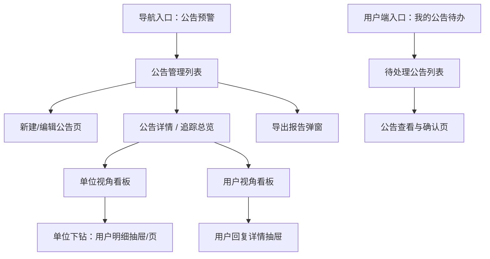
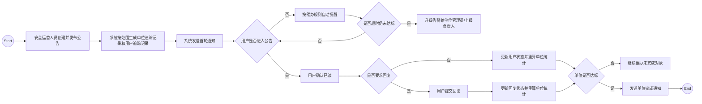

# 公告预警模块 PRD（完整稿）

**版本**：V1.0（MVP）  
**模块**：安全运营 / 公告预警

## 1. 背景与目标

### 1.1 背景

在网络安全产品中，漏洞预警、应急响应通知、专项排查通告等公告类信息通常带有强时效、强责任、强留痕要求。当前很多系统只能完成“公告发布”，但无法形成“谁收到、谁已读、谁已回复、哪个单位已达标、何时被催办、是否已升级”的全链路追踪。

这会带来以下问题：

1. 只能看见公告是否发出，无法确认组织层和个人层是否真正接收并执行。
2. 缺少单位视角汇总，安全运营人员无法快速识别哪些单位未达标。
3. 缺少用户视角证据，无法追溯个人已读、回复、催办和历史留痕。
4. 无法对超时未读、未回复对象进行自动催办和升级告警，闭环依赖人工跟踪。
5. 审计证明不足，难以满足网络安全责任追踪和事后问责要求。

因此，需要设计一个支持 **单位视角** 与 **用户视角** 双轨追踪的公告预警模块，实现从发布、接收、确认、回复、催办到审计导出的完整闭环。

### 1.2 目标（MVP）

本期目标是上线一个 **公告预警模块 MVP**，支持：

1. 安全运营人员按单位、部门、角色、用户组发布公告，并配置是否强制已读、是否强制回复、预警结束时间。
2. 系统同时维护单位视角和用户视角的追踪数据，并保证两者统计一致。
3. 用户完成已读或回复后，系统在 3 秒内联动更新单位统计结果。
4. 系统按规则执行自动催办和升级告警，并支持运营人员手动批量催办。
5. 系统提供钻取、筛选、导出和审计能力，支撑日常运营和责任追溯。

### 1.3 非目标（本期不做）

1. 不做多级审批发布流，公告由具备权限的安全运营人员直接发布。
2. 不做公告模板市场或复杂模板设计器，首期仅支持基础富文本公告内容和回复配置。
3. 不做外部 IM 平台全渠道打通，首期聚焦站内信、邮件、短信三类通知能力的可配置接入。
4. 不做单位组织架构的实时主数据治理，组织变化以现有组织中心同步结果为准。
5. 不做移动端原生 App 专属交互适配，首期以前端 Web 管理端和用户端为主。

## 2. 术语与定义

| 术语 | 定义 |
|---|---|
| 公告 | 一次由安全运营人员发布的正式通知，包含标题、内容、范围、等级、结束时间及执行要求 |
| 单位视角 | 以组织/部门为聚合对象的执行跟踪视图，用于查看该单位整体已读率、回复率、达标情况 |
| 用户视角 | 以个人为对象的执行跟踪视图，用于查看该用户是否已读、是否回复、何时催办 |
| 应接收人数 | 在某公告范围内、某单位下实际纳入追踪的有效接收用户数 |
| 强制已读 | 用户未完成已读确认前，系统持续提醒，且不可绕过指定主要功能限制 |
| 强制回复 | 用户需提交回复后才视为执行完成；如公告配置无需回复，则用户状态可在已读后完成 |
| 单位达标 | 单位层面满足配置规则后的状态，如已读率达标、关键岗位回复齐全 |
| 催办 | 系统或人工针对未读/未回复对象发送提醒行为 |
| 升级告警 | 在预设时限内仍未达标时，向单位管理员或上级安全负责人发送的升级通知 |
| 状态失效 | 因离职、调岗等原因导致某接收对象不再计入应接收人数，但保留历史记录的状态 |
| 已读凭证 | 用户完成已读操作时记录的时间、IP、User-Agent 等不可抵赖证据 |
| 回复版本 | 用户对公告回复内容的版本快照，需支持历史可追溯、防篡改 |

## 3. 用户与使用场景

### 3.1 角色

#### 角色 A：全局安全运营人员

- 目标：发布公告、查看全局执行情况、批量催办、导出报告。
- 关注内容：未达标单位、未回复关键人员、催办升级结果、审计留痕。

#### 角色 B：单位管理员

- 目标：查看本单位执行进度、督促成员完成已读/回复、接收升级告警。
- 关注内容：本单位已读率、回复率、未完成人员名单、催办历史。

#### 角色 C：普通用户

- 目标：接收与自己相关的公告，及时确认已读并按要求回复。
- 关注内容：待处理公告、截止时间、是否强制、回复要求、历史记录。

### 3.2 典型场景

1. 安全运营人员发布“高危漏洞应急排查公告”，要求重点岗位必须在 24 小时内回复排查结果。
2. 单位管理员查看本单位未达标列表，定位尚未已读或未回复的成员并执行手动催办。
3. 普通用户登录系统后收到强制公告提醒，在完成已读和回复前无法进入主要业务页面。
4. 安全运营人员在单位视角中点击某单位的已读人数，下钻查看该单位具体未读用户名单。
5. 审计人员导出“单位汇总 + 用户明细”报告，用于证明公告传达和执行闭环已经形成。

## 4. 信息架构与页面

### 4.0 IA 图（信息架构）

### 4.1 用户流程图（User Flow）

### 4.2 页面清单

1. **公告管理列表**
   - 展示已发公告、状态、预警等级、发布时间、截止时间、整体执行率，并提供追踪入口。
2. **新建/编辑公告页**
   - 配置标题、正文、公告等级、接收范围、强制规则、回复要求、催办规则、结束时间。
3. **公告详情 / 追踪总览页**
   - 展示公告基础信息、全局汇总卡片、单位视角入口、用户视角入口、催办与导出操作。
4. **单位视角看板**
   - 以单位为粒度展示应接收人数、已读率、回复率、达标状态、升级告警状态，并支持下钻。
5. **用户视角看板**
   - 展示用户维度的已读状态、回复状态、回复内容、催办记录和失效状态。
6. **单位下钻页 / 抽屉**
   - 从单位视角下钻查看该单位下所有用户的执行明细，并支持批量催办。
7. **用户端待办列表**
   - 展示当前用户待已读、待回复、已超时的公告列表。
8. **用户端公告查看与确认页**
   - 展示公告内容、截止时间、附件、回复组件、已读确认按钮、历史回复版本。

### 4.3 页面布局要点（可交付研发）

#### A. 公告管理列表

- 顶部筛选区：
  - 公告标题
  - 发布时间范围
  - 预警等级
  - 发布状态
  - 是否强制已读
  - 是否强制回复
- 中部表格区：
  - 标题
  - 预警等级
  - 发布时间
  - 预警结束时间
  - 已读率
  - 回复率
  - 未达标单位数
  - 状态
- 操作区：
  - 查看详情
  - 单位视角追踪
  - 用户视角追踪
  - 手动催办
  - 导出报告

#### B. 新建/编辑公告页

- 分为 4 个分区：
  - 基础信息：标题、正文、附件、预警等级
  - 接收范围：单位/部门/角色/用户组选择
  - 执行规则：是否强制已读、是否强制回复、回复类型、达标规则
  - 时效与催办：结束时间、催办规则、升级规则
- 页底操作：
  - 保存草稿
  - 立即发布
  - 定时发布（决策点）

#### C. 公告详情 / 追踪总览页

- 顶部信息区：标题、等级、发布人、发布时间、结束时间、范围摘要
- 汇总卡片区：
  - 覆盖单位数
  - 应接收人数
  - 全局已读率
  - 全局回复率
  - 未达标单位数
  - 已升级单位数
- 右上操作：
  - 手动催办
  - 导出报告
  - 查看审计日志

#### D. 单位视角看板

- 顶部统计卡：
  - 单位总数
  - 达标单位数
  - 未达标单位数
  - 已升级单位数
- 表格主列：
  - 单位名称
  - 应接收人数
  - 已读人数 / 已读率
  - 已回复人数 / 回复率
  - 单位最终状态
  - 最后操作时间
  - 升级告警状态
  - 操作
- 支持点击“已读人数/回复率”进入用户明细下钻。

#### E. 用户视角看板

- 顶部筛选区：
  - 用户姓名 / 账号
  - 所属单位
  - 已读状态
  - 回复状态
  - 是否超时
  - 是否失效
- 表格主列：
  - 用户姓名 / 账号
  - 所属单位
  - 已读状态 / 首次阅读时间
  - 回复状态 / 回复时间
  - 回复内容摘要
  - 催办次数
  - 最近催办时间
  - 状态失效标记

#### F. 用户端公告查看与确认页

- 顶部固定提醒：
  - 强制标识
  - 截止时间
  - 超时状态
- 主体区域：
  - 公告正文
  - 附件列表
  - 已读确认区
  - 回复输入区（预设选项 / 自由文本）
  - 回复版本历史
- 页面需支持强制弹窗模式和全页模式两种承载方式。

## 5. 数据模型（字段定义）

### 5.1 核心实体（表格）

#### 实体 1：公告主表 `NoticeAnnouncement`

| 字段 | 类型 | 必填 | 说明 |
|---|---|---|---|
| id | string | 是 | 公告 ID |
| title | string | 是 | 公告标题 |
| level | enum | 是 | 等级：critical / high / medium / low |
| content | richtext | 是 | 公告正文 |
| attachments | object[] | 否 | 附件列表 |
| publishScopeType | object | 是 | 发布范围配置，包含单位/部门/角色/用户组 |
| requireRead | boolean | 是 | 是否强制确认已读 |
| requireReply | boolean | 是 | 是否强制回复 |
| replyMode | enum | 否 | none / preset-options / free-text / mixed |
| replyOptionConfig | object[] | 否 | 预设回复选项配置 |
| deadlineAt | datetime | 是 | 预警结束时间 |
| autoReminderRule | object[] | 否 | 自动催办规则配置 |
| escalationRule | object[] | 否 | 升级告警规则配置 |
| unitPassRule | object | 是 | 单位达标规则配置 |
| status | enum | 是 | draft / published / ended / archived / revoked |
| publishedBy | string | 否 | 发布人 |
| publishedAt | datetime | 否 | 发布时间 |
| createdAt | datetime | 是 | 创建时间 |
| updatedAt | datetime | 是 | 更新时间 |

#### 实体 2：公告用户接收记录 `NoticeRecipientUser`

| 字段 | 类型 | 必填 | 说明 |
|---|---|---|---|
| id | string | 是 | 用户接收记录 ID |
| announcementId | string | 是 | 公告 ID |
| userId | string | 是 | 用户 ID |
| userName | string | 是 | 用户姓名 |
| userAccount | string | 是 | 用户账号 |
| unitId | string | 是 | 所属单位 ID |
| unitName | string | 是 | 所属单位名称 |
| roleTags | string[] | 否 | 用户命中的角色标签 |
| isKeyPosition | boolean | 否 | 是否关键岗位 |
| readStatus | enum | 是 | unread / read / invalid |
| firstReadAt | datetime | 否 | 首次阅读时间 |
| readIp | string | 否 | 已读确认 IP |
| readUserAgent | string | 否 | 已读确认 User-Agent |
| replyStatus | enum | 是 | not-required / pending / replied / invalid |
| latestReplyId | string | 否 | 当前生效回复版本 ID |
| latestReplyAt | datetime | 否 | 最新回复时间 |
| reminderCount | number | 是 | 催办次数 |
| latestReminderAt | datetime | 否 | 最近催办时间 |
| overdueFlag | boolean | 是 | 是否超时未完成 |
| invalidReason | enum | 否 | resigned / transferred / removed-scope / other |
| invalidAt | datetime | 否 | 状态失效时间 |
| statusVersion | number | 是 | 并发控制版本号 |

#### 实体 3：公告单位汇总记录 `NoticeRecipientUnit`

| 字段 | 类型 | 必填 | 说明 |
|---|---|---|---|
| id | string | 是 | 单位汇总记录 ID |
| announcementId | string | 是 | 公告 ID |
| unitId | string | 是 | 单位 ID |
| unitName | string | 是 | 单位名称 |
| expectedUserCount | number | 是 | 应接收人数 |
| readUserCount | number | 是 | 已读人数 |
| readRate | number | 是 | 已读率 |
| repliedUserCount | number | 是 | 已回复人数 |
| replyRate | number | 是 | 回复率 |
| keyPositionExpectedCount | number | 否 | 关键岗位应回复人数 |
| keyPositionRepliedCount | number | 否 | 关键岗位已回复人数 |
| finalStatus | enum | 是 | not-met / met / invalid |
| lastActionAt | datetime | 否 | 最近已读/回复时间 |
| escalated | boolean | 是 | 是否已升级告警 |
| escalatedAt | datetime | 否 | 最近升级时间 |
| completionNoticeSent | boolean | 是 | 是否已发送单位完成通知 |
| recalculatedAt | datetime | 否 | 最近重算时间 |

#### 实体 4：公告回复版本 `NoticeReplyVersion`

| 字段 | 类型 | 必填 | 说明 |
|---|---|---|---|
| id | string | 是 | 回复版本 ID |
| announcementId | string | 是 | 公告 ID |
| recipientUserId | string | 是 | 用户接收记录 ID |
| replyMode | enum | 是 | preset-options / free-text / mixed |
| replyContentRaw | text | 否 | 原始回复内容 |
| replyOptionValues | string[] | 否 | 选中的预设项 |
| submittedAt | datetime | 是 | 提交时间 |
| submittedBy | string | 是 | 提交人 |
| contentHash | string | 是 | 回复内容摘要值，用于防篡改校验 |
| previousVersionId | string | 否 | 上一版本 ID |
| isCurrent | boolean | 是 | 是否当前有效版本 |

#### 实体 5：催办与升级记录 `NoticeReminderLog`

| 字段 | 类型 | 必填 | 说明 |
|---|---|---|---|
| id | string | 是 | 记录 ID |
| announcementId | string | 是 | 公告 ID |
| targetType | enum | 是 | user / unit / unit-admin / superior |
| targetId | string | 是 | 目标对象 ID |
| reminderType | enum | 是 | auto / manual / escalation |
| channel | enum | 是 | inbox / email / sms |
| triggerRuleCode | string | 否 | 命中的规则编码 |
| sentAt | datetime | 是 | 发送时间 |
| sentBy | string | 否 | 手动催办时的操作人 |
| result | enum | 是 | success / failed / partial-success |
| resultMessage | string | 否 | 发送结果说明 |

#### 实体 6：审计日志 `NoticeAuditLog`

| 字段 | 类型 | 必填 | 说明 |
|---|---|---|---|
| id | string | 是 | 审计日志 ID |
| announcementId | string | 是 | 公告 ID |
| actorId | string | 否 | 操作人 ID，系统任务可为空 |
| actorType | enum | 是 | user / admin / system |
| actionType | enum | 是 | publish / read / reply / remind / escalate / export / recalculate / invalidate |
| targetType | enum | 是 | announcement / unit / user / report |
| targetId | string | 是 | 目标对象 ID |
| actionAt | datetime | 是 | 操作时间 |
| actionSnapshot | object | 否 | 操作快照 |
| retentionDays | number | 是 | 保存天数，默认不低于 180 天 |

### 5.2 附属实体（可选）

1. `NoticeExportTask`：记录 Excel / PDF 导出任务状态、导出人、文件地址、生成时间。
2. `NoticeScopeChangeLog`：记录发布后追加范围、移除范围、组织重算等变更历史。

## 6. 核心功能需求

### 6.1 公告列表与总览展示

1. 公告管理列表需展示公告基础信息、执行进度、强制标记和追踪入口。
2. 列表支持按标题、发布时间、预警等级、状态筛选。
3. 列表需展示全局已读率、回复率、未达标单位数，便于运营快速识别风险公告。
4. 对已结束但仍未完全达标的公告，应标识“已超时未闭环”。

### 6.2 公告创建、编辑与发布

1. 安全运营人员可新建公告，填写标题、正文、附件、预警等级、结束时间。
2. 发布范围支持按单位、部门、角色、用户组多维组合选择。
3. 系统在发布时需展开为明确的接收用户清单和单位汇总清单。
4. 公告可配置：
   - 是否强制已读
   - 是否强制回复
   - 回复方式
   - 自动催办规则
   - 升级告警规则
   - 单位达标规则
5. 发布成功后立即生成用户接收记录、单位汇总记录、首轮通知任务。
6. 已发布公告原则上不可编辑正文和强制规则；如需补充范围，只允许增量追加并保留变更日志。

### 6.3 用户已读与回复执行

1. 用户查看公告详情页后，点击“确认已读”才记为已读，不以页面打开直接视为已读。
2. 已读操作必须记录首次时间、IP、User-Agent，并写入审计日志。
3. 若公告要求回复，用户需提交回复后才视为完成执行。
4. 回复支持三种模式：
   - 预设选项
   - 自由文本
   - 预设选项 + 自由文本混合
5. 回复内容每次提交均生成新版本，历史版本可查看，不可覆盖删除。
6. 用户重复提交回复时，仅最新版本作为统计口径，历史版本保留审计。

### 6.4 单位视角追踪与联动计算

1. 用户任意一次已读动作成功后，对应单位的 `readUserCount` +1，并重算 `readRate`。
2. 用户任意一次首次满足回复要求后，对应单位的 `repliedUserCount` +1，并重算 `replyRate`。
3. 单位最终状态根据配置规则实时计算，MVP 默认支持：
   - 已读率达到阈值
   - 回复率达到阈值
   - 关键岗位 100% 回复
4. 单位达标后可触发“单位完成通知”，且同一单位同一公告默认只发送一次。
5. 单位统计更新延迟需控制在 3 秒内。
6. 单位汇总数据需支持人工触发重算，以处理组织合并/拆分等特殊情况。

### 6.5 用户视角追踪与催办记录

1. 用户视角需展示用户身份信息、所属单位、已读状态、回复状态、回复摘要、催办次数和时间。
2. 对无需回复的公告，用户确认已读后，回复状态应展示为 `无需回复`。
3. 对已失效用户，需保留历史记录，但不再计入应接收人数和达标计算。
4. 用户视角支持筛选：
   - 未读
   - 已读未回复
   - 已回复
   - 已超时
   - 已失效

### 6.6 自动催办与手动催办

1. 系统支持按公告配置的催办规则自动执行提醒。
2. MVP 需支持以下规则能力：
   - 相对发布时间或截止时间配置触发点
   - 面向未读对象触发
   - 面向未回复对象触发
   - 面向单位未达标触发升级告警
3. 支持的默认规则样例：
   - 发布后 24 小时未读，发送站内信
   - 发布后 48 小时未读，发送短信/邮件
   - 发布后 72 小时单位仍未达标，通知单位管理员和上级安全负责人
4. 运营人员支持一键向未读用户、未回复用户、未达标单位批量发送手动催办。
5. 催办记录必须可追溯，包含渠道、时间、对象、结果。

### 6.7 强制机制与用户限制

1. 对强制已读公告，用户未确认已读前应持续提示，且无法关闭提醒。
2. 对强制回复公告，用户未完成回复前应持续提示，且无法绕过指定主要功能入口。
3. 系统需支持白名单页面配置，避免登录、首页基础导航等核心能力被完全阻断。
4. 若用户没有回复权限或公告已过期，需给出明确提示并记录异常操作日志。

### 6.8 查询、筛选、钻取与导出

1. 单位视角支持按单位达标/未达标、升级状态筛选。
2. 用户视角支持按未读/未回复/已回复/已失效筛选。
3. 支持从单位视角点击已读数、回复率等指标，下钻到该单位的用户明细。
4. 支持从公告详情直接查看全部未回复用户列表。
5. 支持导出：
   - 单位汇总报告（Excel / PDF）
   - 用户明细报告（Excel / PDF）
   - 单位汇总 + 用户明细组合导出
6. 导出操作需写入审计日志，且导出文件中保留导出人、导出时间、公告标题等水印或元信息。

### 6.9 异常场景处理

1. 用户离职/调岗：
   - 对该公告用户记录标记为 `invalid`
   - 从应接收人数中剔除
   - 保留历史已读/回复/催办记录
2. 单位合并/拆分：
   - 支持人工触发重算
   - 重算过程写入审计日志
   - 重算前后结果需保留快照
3. 发布后范围遗漏：
   - 支持增量追加单位或用户
   - 新追加对象从未读状态开始追踪
   - 不影响既有用户历史状态

## 7. 状态机（表格）

### 7.1 状态枚举

#### 公告生命周期状态 `AnnouncementStatus`

- `draft`：草稿
- `published`：已发布
- `ended`：已到截止时间
- `archived`：已归档
- `revoked`：已撤销

#### 用户已读状态 `ReadStatus`

- `unread`：未读
- `read`：已读
- `invalid`：失效

#### 用户回复状态 `ReplyStatus`

- `not-required`：无需回复
- `pending`：待回复
- `replied`：已回复
- `invalid`：失效

#### 单位达标状态 `UnitFinalStatus`

- `not-met`：未达标
- `met`：已达标
- `invalid`：失效/无有效接收人

### 7.2 状态转移与动作规则（含失败提示）

#### A. 公告生命周期状态机

| 当前状态 | 动作 | 目标状态 | 前置条件 | 失败分支 | 失败提示 | 幂等/回滚策略 |
|---|---|---|---|---|---|---|
| draft | 发布公告 | published | 标题、正文、范围、结束时间、规则配置校验通过 | 参数缺失 / 范围为空 | 请完善公告信息并至少选择一个接收对象 | 发布失败不生成接收记录 |
| published | 到达截止时间 | ended | 当前时间 >= `deadlineAt` | 定时任务失败 | 公告状态更新失败，请稍后重试 | 任务重试，确保最终一致 |
| published | 撤销公告 | revoked | 操作人具备权限，且公告未归档 | 权限不足 / 状态不允许 | 当前公告不可撤销 | 已发送记录保留，不回滚历史审计 |
| ended | 归档 | archived | 操作人具备权限 | 权限不足 | 您没有归档权限 | 归档操作可重复提交但只生效一次 |

#### B. 用户执行状态机

| 当前状态 | 动作 | 目标状态 | 前置条件 | 失败分支 | 失败提示 | 幂等/回滚策略 |
|---|---|---|---|---|---|---|
| unread + pending | 确认已读 | read + pending | 用户属于公告有效范围，公告未撤销 | 记录写入失败 / 用户失效 | 已读确认失败，请重试 | 首次已读只累计一次，重复点击幂等 |
| unread + not-required | 确认已读 | read + not-required | 同上 | 同上 | 已读确认失败，请重试 | 首次已读只累计一次 |
| read + pending | 提交回复 | read + replied | 公告要求回复，回复内容校验通过 | 内容为空 / 格式不合法 / 公告已失效 | 请完善回复内容后再提交 | 每次提交生成新版本，仅最新版本计当前状态 |
| unread + pending | 直接提交回复 | read + replied | 系统允许“回复即视为已读”策略 | 策略未开启 / 内容不合法 | 当前公告需先确认已读 | 默认不启用此策略 |
| 任意有效状态 | 用户离职/移出范围 | invalid + invalid | 组织同步或人工处理成功 | 状态同步失败 | 用户状态失效处理失败 | 保留历史，不删除记录 |

#### C. 单位达标状态机

| 当前状态 | 动作 | 目标状态 | 前置条件 | 失败分支 | 失败提示 | 幂等/回滚策略 |
|---|---|---|---|---|---|---|
| not-met | 用户已读/回复后重算 | not-met / met | 汇总计算成功 | 汇总任务失败 | 单位统计更新失败，请稍后查看 | 异步重试，3 秒内最终一致 |
| met | 范围变更或人员失效后重算 | met / not-met | 单位达标规则重新计算 | 重算失败 | 单位状态重算失败 | 保留旧快照，允许人工再次重算 |
| not-met | 超时未达标触发升级 | not-met | 命中升级规则且未重复发送 | 通知发送失败 | 升级告警发送失败 | 发送失败可重试，成功后记录一次升级状态 |
| met | 发送完成通知 | met | 尚未发送完成通知 | 通知失败 | 完成通知发送失败 | 默认只发送一次，可人工补发 |

## 8. 权限与安全

### 8.1 权限点（最小集）

| 角色 | 权限点 |
|---|---|
| 普通用户 | 查看本人公告；确认本人已读；提交本人回复；查看本人历史回复 |
| 单位管理员 | 查看本单位公告执行明细；查看本单位用户明细；对本单位成员执行手动催办；接收本单位升级告警 |
| 全局安全运营人员 | 创建/发布公告；查看全局单位与用户视角；执行全局催办；执行导出；触发重算；查看审计日志 |

### 8.2 风险操作策略（二次确认/审计/幂等/回滚）

1. 发布公告、批量催办、导出报告、人工重算、撤销公告均属于风险操作，需二次确认。
2. 已读、回复、催办、导出、重算、范围追加等操作必须写入审计日志。
3. 已读按钮需幂等，重复点击不得重复累计统计。
4. 回复采用版本化，不做物理覆盖，避免篡改争议。
5. 导出文件需按权限做数据隔离，单位管理员仅能导出本单位数据。
6. 单位和用户查询接口需强制附加权限过滤，禁止前端传参越权查看。

## 9. 异常与边界（必须覆盖）

### 9.1 空态

1. 公告列表无数据时，提示“暂无公告，可新建公告”。
2. 单位视角无命中单位时，提示“当前筛选条件下暂无单位数据”。
3. 用户视角无未完成用户时，提示“当前公告已全部完成闭环”。

### 9.2 加载态

1. 列表、看板、下钻抽屉均需提供骨架屏或加载态。
2. 大数据量钻取时，需先展示摘要与分页骨架，避免整页阻塞。

### 9.3 错误态（401/403/5xx/导出失败等）

1. `401`：提示用户重新登录。
2. `403`：提示“您暂无权限查看该范围数据”。
3. `5xx`：提示“数据加载失败，请稍后重试”。
4. 导出失败：提示“报告导出失败，请重新发起或联系管理员”。
5. 催办发送失败：记录失败结果，并支持按失败对象重试。

### 9.4 长文本/大量数据/并发点击

1. 公告正文、回复内容需支持长文本折叠与展开。
2. 用户视角表格在单公告 10 万用户规模下必须支持分页、服务端筛选和异步导出。
3. 单位视角表格需支持虚拟滚动或分页，避免一次性渲染全部单位。
4. 已读和回复提交需防重复点击，前端按钮置灰 + 后端幂等控制。
5. 自动催办任务与人工催办任务并发时，需通过去重键避免同一时刻重复发送。

### 9.5 组织与范围变更

1. 公告发布后追加范围，不得覆盖原接收对象的历史状态。
2. 用户离职、调岗导致失效时，相关统计需及时重算。
3. 单位合并/拆分后的重算需标记为“人工重算结果”，便于审计追溯。

## 10. 埋点与指标（可选）

1. 公告发布量、按等级分布。
2. 公告 24 小时已读率、48 小时回复率、截止前达标率。
3. 自动催办触发次数、成功率、升级触发率。
4. 单位平均闭环耗时、用户平均首次已读耗时、平均首次回复耗时。
5. 强制公告拦截次数，用于评估执行强度与用户影响。

## 11. 验收标准（DoD）

### 11.1 功能 DoD

1. 系统可按单位、部门、角色、用户组发布公告，并生成对应单位和用户追踪记录。
2. 用户已读和回复动作能正确联动更新单位统计结果，且两者数据一致。
3. 单位视角可按配置规则计算达标状态，并支持钻取到用户明细。
4. 系统可按规则自动催办、升级告警，且支持手动催办。
5. 普通用户、单位管理员、全局安全运营人员的数据访问范围符合权限模型。
6. 支持导出单位汇总与用户明细报告，并保留导出审计日志。

### 11.2 质量 DoD

1. 用户已读/回复后的单位统计更新延迟不超过 3 秒。
2. 审计日志至少保留 180 天。
3. 单公告接收对象达到 10 万用户时，列表加载和钻取响应时间不超过 2 秒（分页首屏）。
4. 已读、回复、催办、导出等关键操作具备幂等与异常恢复机制。
5. 回复内容支持历史版本追溯，并提供防篡改校验字段。

## 12. 验收用例清单（测试可直接用）

### 12.1 公告创建与发布

1. 成功路径：安全运营人员填写完整信息并发布成功，系统生成单位和用户追踪记录。
2. 失败路径：发布时未选择接收范围，系统阻止发布并提示。
3. 权限路径：普通用户尝试访问发布页，系统返回无权限。

### 12.2 用户已读与回复

1. 成功路径：用户确认已读后，用户状态变为已读，单位已读人数与已读率正确增加。
2. 成功路径：要求回复的公告中，用户提交有效回复后，回复状态变为已回复，单位回复人数与回复率正确增加。
3. 失败路径：用户提交空回复或非法格式，系统提示并保持待回复状态。
4. 幂等路径：用户重复点击已读按钮，不重复增加统计。

### 12.3 单位视角与用户视角一致性

1. 成功路径：单位视角的已读人数、已回复人数等于该单位下用户视角明细汇总。
2. 失败路径：汇总任务异常时，系统记录错误并在重试后恢复一致。
3. 边界路径：用户失效后，单位应接收人数减少，历史记录仍可查看。

### 12.4 催办与升级告警

1. 成功路径：命中 24 小时未读规则时，系统向未读用户发送站内信并写入催办记录。
2. 成功路径：单位在 72 小时仍未达标时，系统向单位管理员发送升级告警。
3. 失败路径：短信通道失败时，系统记录失败原因并允许重试。
4. 手动路径：运营人员筛选未回复用户并发起批量催办，系统仅对命中对象发送。

### 12.5 强制机制

1. 成功路径：强制已读公告未完成前，用户无法关闭提醒并被限制访问指定业务页面。
2. 成功路径：强制回复公告未完成前，用户持续收到提醒，完成后限制解除。
3. 边界路径：白名单页面仍可正常访问，不被强制机制阻断。

### 12.6 钻取、筛选与导出

1. 成功路径：在单位视角点击某单位已读人数，可下钻查看该单位用户明细。
2. 成功路径：按未回复筛选后，列表仅显示待回复用户。
3. 成功路径：导出“单位汇总 + 用户明细”报告成功，文件包含正确范围数据。
4. 权限路径：单位管理员导出时，仅能导出本单位数据。

### 12.7 组织变化与范围追加

1. 成功路径：用户离职后被标记为失效，应接收人数正确扣减。
2. 成功路径：公告发布后追加新单位，新用户从未读状态开始追踪。
3. 成功路径：单位合并后人工触发重算，重算结果可查看前后差异日志。

### 12.8 错误与恢复

1. 网络异常导致已读提交失败时，系统提示重试，未写入成功前不得更新统计。
2. 汇总更新延迟超过阈值时，系统触发告警日志并异步重试。
3. 审计日志写入失败时，关键操作需进入补偿队列，避免核心记录丢失。

## 13. 决策点（需要拍板 + 默认建议）

| 决策点 | 说明 | 推荐默认 |
|---|---|---|
| 单位达标规则是否统一配置还是按公告自定义 | 不同公告可能要求不同达标阈值 | 按公告自定义，系统提供默认模板 |
| 发布是否支持定时发布 | 涉及定时任务与撤回逻辑 | MVP 可支持，若工期紧张可降级为立即发布 |
| 回复是否允许“直接回复即视为已读” | 影响交互简化与审计口径 | 默认不允许，保持已读与回复两个显式动作 |
| 强制机制阻断范围 | 影响用户体验与系统可用性 | 默认只阻断主要业务页面，保留白名单页面 |
| 单位完成通知是否自动发送 | 增加闭环感知，但会增加通知量 | 默认自动发送一次 |
| 导出 PDF 是否同步生成 | 大数据量场景耗时较长 | 默认异步导出，前端查看任务状态 |
| 组织重算是否允许覆盖历史视图 | 会影响审计口径 | 默认保留重算前快照，不覆盖审计历史 |

## 14. 需求匹配度自检

### 14.1 覆盖度检查

原始需求中涉及的发布范围、强制机制、时效管控、单位视角追踪、用户视角追踪、双视角联动、不可抵赖性、钻取筛选、导出、通知催办、权限隔离、异常场景、实时性、审计日志、性能和验收标准，均已在本 PRD 中覆盖。

### 14.2 逻辑一致性检查

1. 页面清单、功能需求、异常边界、DoD 和验收用例已按“公告管理列表 / 详情总览 / 单位视角 / 用户视角 / 用户端待办”一致引用。
2. 状态机已覆盖公告生命周期、用户执行状态和单位达标状态，无明显死状态。
3. 权限模型与功能边界一一对应，导出、查看、催办均包含数据隔离约束。
4. 异常边界已覆盖用户失效、组织重算、范围追加、导出失败、并发催办等关键场景。

### 14.3 完整性检查

1. 已包含核心实体字段表。
2. 已包含状态机表格。
3. 已包含按功能分组的验收用例。
4. 已包含需要拍板的决策点及推荐默认。
