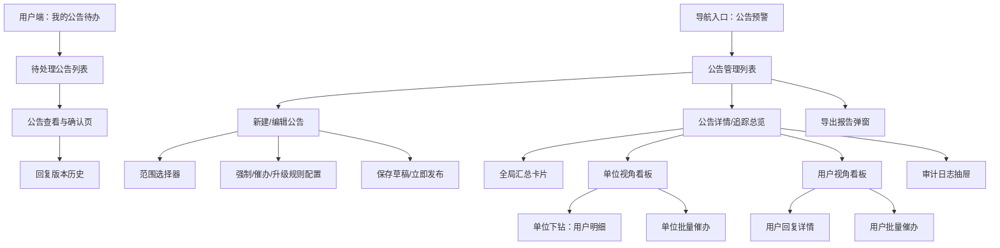
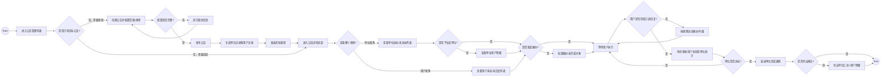
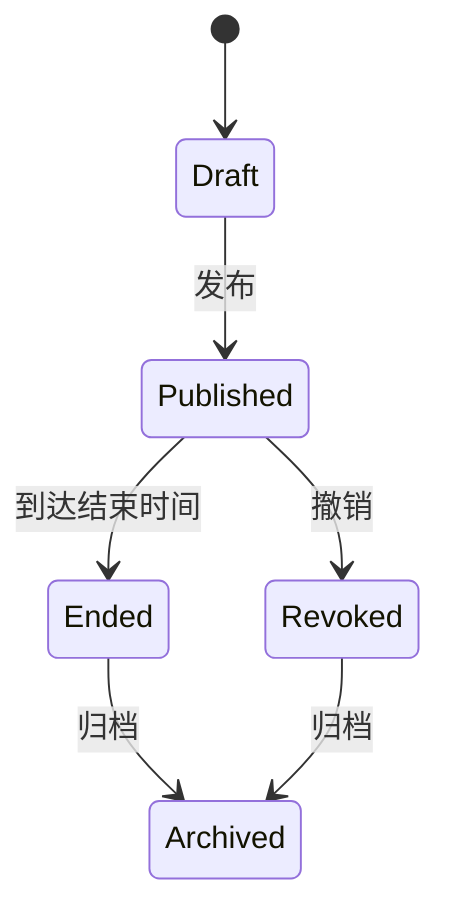
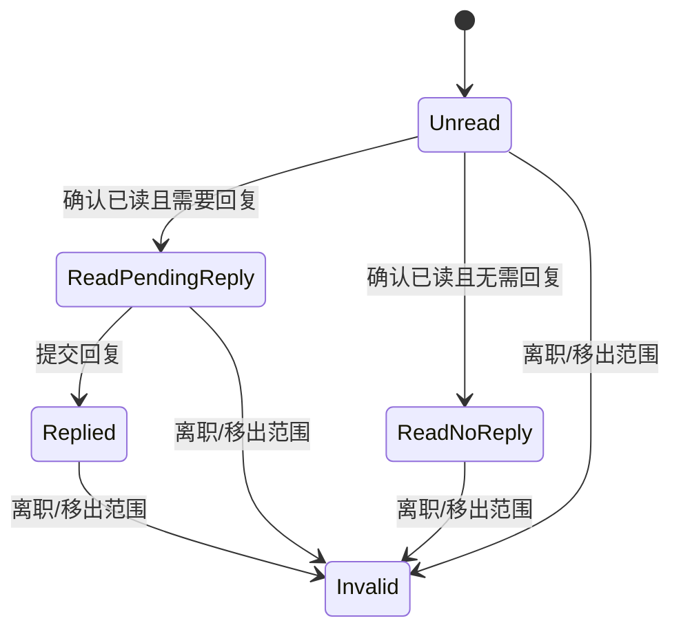
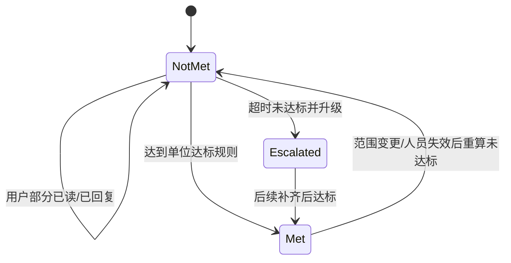

# 公告预警模块：叙事与视觉表达（评审稿）

## 0. TL;DR（一句话）
全局安全运营人员在网络安全通告需要强时效、强追责、强留痕的压力下，为了确保“公告已送达、单位已闭环、个人已执行”这三件事都可追溯，通过“发布公告 → 追踪单位/用户执行 → 催办升级 → 导出审计报告”的关键路径，完成公告预警的责任闭环。

---

## 1) 故事脚本（Story Script）

### 1.1 场景设定

- 角色：
  - 主角色：全局安全运营人员
  - 次角色：单位管理员
  - 执行角色：普通用户 / 关键岗位人员
  - 审计相关角色：审计人员 / 上级安全负责人
- 背景/压力：
  - 平台需要发布漏洞预警、应急响应通知、专项排查通告等高优先级公告
  - 公告不是“发出去就结束”，而是必须知道哪些单位已完成传达、哪些成员已读、哪些关键岗位已回复
  - 一旦超时未处理，系统需要自动催办，并能升级告警到单位管理员或上级负责人
  - 事后还需证明整条链路真实发生、不可篡改、可审计导出
- 触发事件：
  - 出现高危漏洞，需要向全网业务单位下发紧急排查通知
  - 某专项检查要求所有单位在规定时间内反馈确认结果
  - 安全管理层需要查看哪些单位尚未闭环，并督促整改
- 成功标准：
  - 公告发布范围准确展开到具体个人
  - 用户已读、回复后，单位统计能实时联动
  - 未完成对象能被自动或手动催办
  - 单位达标/未达标状态清晰可视
  - 最终可导出“单位汇总 + 用户明细”的审计材料
- 失败代价：
  - 公告传达停留在“已发送”层面，无法证明已执行
  - 单位未达标却未被及时发现，扩大处置风险
  - 审计或问责时缺少可核验的证据链

### 1.2 故事主线（四幕）

- 第一幕（进入/发现）：
  - 安全运营人员进入“公告预警”模块，首先看到公告管理列表和当前各公告的总体执行情况
  - 页面应第一时间呈现哪些公告风险高、哪些公告尚未闭环、哪些公告已超时仍有未完成人员
  - 用户无需先点进详情，就能识别是否需要立即跟进

- 第二幕（定位/缩小范围）：
  - 用户点击某条公告进入追踪总览，切换查看单位视角和用户视角
  - 在单位视角中，用户快速识别未达标单位、已升级单位和关键岗位未回复单位
  - 在用户视角中，用户筛出未读、未回复、已超时对象，并定位具体责任人

- 第三幕（决策/行动）：
  - 安全运营人员执行批量催办，或从单位视角下钻到用户明细进一步处理
  - 单位管理员查看本单位成员状态，对未完成成员发起督办
  - 普通用户收到强制提醒后进入公告详情，完成已读与回复动作

- 第四幕（反馈/收尾）：
  - 用户完成已读/回复后，系统在单位视角中立即更新统计和达标状态
  - 若单位达标，系统可发送单位完成通知
  - 若超时仍未达标，系统发送升级告警并记录催办链路
  - 最终运营人员导出报告，沉淀为可审计的闭环结果

### 1.3 镜头表（把交互写成连贯动作）

| 镜头 | 用户意图 | 用户动作 | 系统反馈 | 兜底/异常 |
|---|---|---|---|---|
| 1 | 快速掌握当前公告执行态势 | 打开公告管理列表 | 展示高等级公告、已读率、回复率、未达标单位数 | 首屏失败时提示重试并保留筛选条件 |
| 2 | 定位需要优先跟进的公告 | 按标题、等级、发布时间筛选 | 列表缩小到目标公告 | 无结果时提示清空筛选 |
| 3 | 理解某条公告的整体闭环情况 | 进入公告详情/追踪总览 | 展示覆盖单位数、应接收人数、全局已读率/回复率、已升级单位数 | 汇总接口失败时先保留基础信息并提示重试 |
| 4 | 识别未达标单位 | 切换到单位视角 | 按单位显示已读率、回复率、达标状态、升级状态 | 大数据量时分页/虚拟滚动加载 |
| 5 | 锁定具体未完成人员 | 点击单位已读数/回复率下钻 | 打开该单位用户明细，展示未读、未回复人员 | 无权限查看时明确提示权限边界 |
| 6 | 推动执行完成 | 对未读/未回复对象发起手动催办 | 展示发送结果、催办次数、最近催办时间 | 发送失败时标注失败对象并支持重试 |
| 7 | 用户完成公告执行 | 普通用户进入公告页并确认已读/提交回复 | 状态更新为已读/已回复，单位统计联动刷新 | 重复提交幂等处理，失败时保留输入内容 |
| 8 | 完成闭环并沉淀证据 | 导出单位汇总与用户明细报告 | 生成导出任务、记录导出审计日志 | 导出失败可重试，不丢失当前筛选范围 |

---

## 2) 信息架构图（IA）

---

## 3) 用户流程图（User Flow）

---

## 4) 状态机（State Machine）

> 本模块至少有三条核心状态线：`公告生命周期`、`用户执行状态`、`单位闭环状态`。三者必须联动理解。

### 4.1 公告生命周期状态机

### 4.2 用户执行状态机

### 4.3 单位闭环状态机

---

## 5) 设计说明文档（Design Notes）

### 5.1 页面目的与主行动

- 主目标：
  - 让安全运营人员能够在一个模块里完成公告发布、执行追踪、催办升级和审计导出
- Primary CTA：
  - `新建公告`
  - `查看追踪`
- Secondary Actions：
  - `手动催办`
  - `切换单位/用户视角`
  - `导出报告`
  - `查看审计日志`
- 危险操作（Danger）：
  - 发布公告
  - 批量催办
  - 撤销公告
  - 人工重算单位统计

### 5.2 页面结构与主视图优先级

#### A. 公告管理列表

- 页面定位：
  - 模块的运营总入口，用于“发现问题公告”和“进入具体追踪”
- 首屏优先展示：
  - 高等级公告
  - 即将超时公告
  - 已超时未闭环公告
- 主操作优先级：
  - 第一优先：查看详情/追踪
  - 第二优先：新建公告
  - 第三优先：手动催办、导出

#### B. 公告详情 / 追踪总览

- 页面定位：
  - 某一公告的执行中枢页
- 首屏信息层级：
  - 第一层：公告标题、等级、结束时间、是否强制
  - 第二层：全局汇总卡片
  - 第三层：单位视角 / 用户视角切换
- 切换规则：
  - 默认先落在单位视角，因为单位维度更适合快速发现未闭环组织
  - 当用户来自某个单位的钻取链接时，默认打开该单位的用户明细态

#### C. 用户端公告查看与确认页

- 页面定位：
  - 公告执行页，而不是纯信息浏览页
- 交互重点：
  - 用户需要明确完成“已读”和“回复”动作
  - 页面要突出截止时间、强制标识、当前完成状态
- 强制公告承载建议：
  - 优先使用全页或阻断式弹窗
  - 禁止仅做角标提醒，避免被忽略

### 5.3 核心组件与字段（可交付研发）

#### A. 公告管理列表字段

- 公告标题
- 预警等级
- 发布时间
- 预警结束时间
- 是否强制已读
- 是否强制回复
- 全局已读率
- 全局回复率
- 未达标单位数
- 当前状态
- 操作列

#### B. 单位视角字段

- 单位名称
- 应接收人数
- 已读人数
- 已读率
- 已回复人数
- 回复率
- 关键岗位已回复情况
- 单位最终状态
- 最后操作时间
- 升级告警状态
- 催办操作

#### C. 用户视角字段

- 用户姓名
- 用户账号
- 所属单位
- 已读状态
- 首次阅读时间
- 回复状态
- 回复时间
- 回复内容摘要
- 催办次数
- 最近催办时间
- 是否超时
- 是否失效

#### D. 新建/编辑公告配置字段

- 标题
- 正文
- 附件
- 预警等级
- 接收范围（单位 / 部门 / 角色 / 用户组）
- 是否强制已读
- 是否强制回复
- 回复方式（预设选项 / 自由文本 / 混合）
- 单位达标规则
- 自动催办规则
- 升级告警规则
- 预警结束时间

### 5.4 筛选、排序与操作规则

- 公告管理列表默认排序：
  - `高等级优先 -> 已超时未闭环优先 -> 最近发布时间倒序`
- 单位视角默认排序：
  - `未达标优先 -> 已升级优先 -> 已读率升序`
- 用户视角默认排序：
  - `未回复优先 -> 未读优先 -> 最近催办时间倒序`
- 操作布局规则：
  - 高频操作直接展示：`查看追踪`、`手动催办`
  - 低频操作收纳到更多菜单：`查看审计日志`、`人工重算`、`撤销`
- 下钻规则：
  - 从单位视角点击已读人数、回复率、未完成人数任一指标，都可进入用户明细

### 5.5 反馈与状态表达规则

- 已读状态表达：
  - 未读：灰色标签
  - 已读：蓝色/绿色标签，并显示首次阅读时间
- 回复状态表达：
  - 无需回复：中性标签
  - 未回复：警示标签
  - 已回复：成功标签
- 单位最终状态表达：
  - 未达标：红/橙色高风险提示
  - 已达标：绿色完成状态
  - 已升级：在状态旁显示升级标识和时间
- 强制公告表达：
  - 在列表、详情、用户端待办均需出现明确 `强制已读` / `强制回复` 标识

### 5.6 权限与审计（最小集）

- 权限点：
  - 普通用户只能查看本人公告并提交本人执行动作
  - 单位管理员只能查看本单位明细和执行本单位催办
  - 全局安全运营人员可查看全局数据、催办、导出和重算
- 需要二次确认的操作：
  - 发布公告
  - 批量催办
  - 撤销公告
  - 导出报告
  - 人工重算
- 审计日志要求：
  - 记录发布、已读、回复、催办、升级、导出、重算、失效处理
  - 已读需保留 IP、时间、User-Agent
  - 回复需保留版本历史和防篡改摘要值

### 5.7 异常/空态/边界（必须覆盖）

- 空态（无公告）：
  - 提示“当前暂无公告，可新建公告”
- 无结果（筛选后）：
  - 提示“未找到符合条件的公告/单位/用户”
- 加载态：
  - 列表与看板使用骨架屏
  - 批量催办、导出、重算使用进度反馈
- 错误态：
  - `403`：提示当前角色无权限查看该范围数据
  - `5xx`：提示稍后重试，保留当前筛选条件
  - 通知发送失败：明确失败对象数量和失败原因摘要
- 长文本：
  - 公告正文和回复内容需折叠/展开
- 大数据量：
  - 单公告 10 万用户时，用户视角必须服务端分页和筛选
- 并发点击：
  - 已读、回复、催办、导出按钮均需前端防抖 + 后端幂等
- 组织变更：
  - 用户离职/调岗后显示 `状态失效`
  - 单位合并/拆分后支持人工重算，并保留重算前快照

### 5.8 文案与术语表（统一口径）

| 概念 | 推荐用词 | 禁用/替代 | 备注 |
|---|---|---|---|
| 公告执行完成 | 已达标 | 已完成、处理完毕 | 单位视角统一使用“达标” |
| 个人阅读动作 | 确认已读 | 阅读完成、已查看 | 需强调是主动确认 |
| 个人反馈动作 | 提交回复 | 已反馈、已处理 | 与版本化回复保持一致 |
| 督促动作 | 催办 | 催促、提醒一下 | 对外口径统一用“催办” |
| 超时升级 | 升级告警 | 上报、升级通知 | 统一安全运营术语 |
| 人员无效 | 状态失效 | 删除、移除 | 需保留历史，不做物理删除 |
| 单位完成通知 | 单位完成通知 | 单位闭环通知 | 对业务更直观 |

## 6) 评审关注点（给产品/设计/研发）

1. 单位视角是否默认成为主入口，是否足够支撑“先发现未达标单位，再下钻到个人”的心智路径。
2. 强制已读、强制回复的阻断范围是否既满足闭环要求，又不至于破坏系统可用性。
3. 单位达标规则是否允许按公告差异化配置，还是先统一模板化。
4. 自动催办与手动催办的权限边界、去重策略、通知渠道是否足够清晰。
5. 用户端“已读”和“回复”是否必须两个明确动作，还是允许“提交回复即视为已读”。

## 7) Handoff 备注

- 该文档的用途是为下一步页面原型、Pencil 设计稿和前端页面实现提供统一交互脚本。
- 若继续推进到设计阶段，建议先出 3 个高优先画板：
  - 公告管理列表
  - 公告详情/单位视角看板
  - 用户端公告确认页
