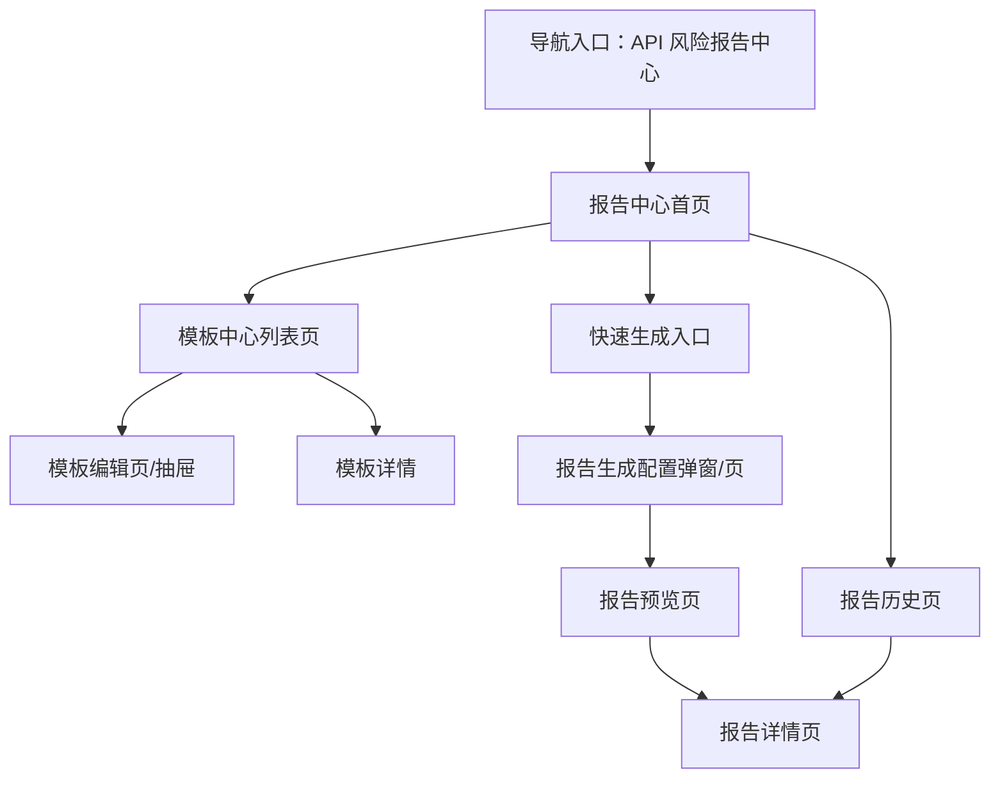
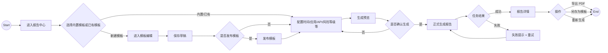

# API 风险报告中心 PRD（完整稿）

**版本**：V1.0（MVP）  
**模块**：API 风险监测 / 报告中心

## 1. 背景与目标

### 1.1 背景

当前 API 风险监测产品已经具备 API 资产发现、风险检测、敏感数据识别、异常行为分析等能力，但“结果交付”仍然依赖人工整理：安全运营人员需要手工筛选时间范围、导出图表、拼接说明文字、整理事件明细，才能形成可对内汇报或对外审计提交的正式报告。

这种方式存在以下问题：

1. 报告口径不统一，不同人员输出差异较大。
2. 高频周报/月报工作重复度高，效率低。
3. 报告与原始风险证据脱节，追溯成本高。
4. 面向不同角色（管理层 / 安全运营 / 应用负责人 / 审计）缺少不同粒度的模板化输出。

基于竞品调研，行业产品普遍更强在“仪表盘”或“固定检测报告”，对“报告模板中心 + 模板自定义 + 生成历史沉淀”的产品化覆盖不足。本产品可将报告能力升级为核心资产模块。

### 1.2 目标（MVP）

本期目标是上线一个 **API 风险报告中心 MVP**，支持：

1. 内置多个报告模板，覆盖不同受众和场景。
2. 用户基于模板配置时间、应用、API、风险等级等范围。
3. 用户可预览并正式生成报告。
4. 用户可导出报告并查看历史生成记录。
5. 报告内容可追溯到 API、风险事件、账号/IP、数据标签等证据。

### 1.3 非目标（本期不做）

1. 不做完全自由画布式模板编排。
2. 不做多级审批流、签章流、邮件分发流。
3. 不做多租户品牌化主题体系。
4. 不做 Word 深度格式还原，首期以 PDF 为主。
5. 不做复杂 BI 自定义计算公式引擎。

## 2. 术语与定义

| 术语 | 定义 |
|---|---|
| 报告模板 | 预定义的报告结构与模块配置，供重复生成报告使用 |
| 内置模板 | 系统预置模板，不可删除，可复制为自定义模板 |
| 自定义模板 | 用户基于内置模板或空模板创建的模板 |
| 报告实例 | 某次基于模板和范围参数生成的具体报告结果 |
| 报告模块 | 模板中的可复用内容单元，如摘要指标卡、趋势图、Top 榜单、事件明细表 |
| 生成任务 | 一次报告生成的后台执行任务 |
| 报告范围 | 本次生成选择的数据边界，如时间、应用、API 分组、风险等级等 |

## 3. 用户与使用场景

### 3.1 角色

#### 角色 A：安全运营人员

- 目标：快速输出 API 风险周报/月报、专项分析报告
- 关注内容：风险趋势、Top 风险 API、事件证据、整改状态

#### 角色 B：应用负责人

- 目标：查看本业务系统相关 API 风险与整改建议
- 关注内容：本系统范围内问题、重点 API、整改优先级

#### 角色 C：管理层 / 审计人员

- 目标：快速理解整体风险态势与合规状态
- 关注内容：摘要指标、趋势变化、风险等级分布、合规视图

### 3.2 典型场景

1. 安全运营人员每周生成“API 风险运营周报”。
2. 应用负责人生成某业务系统“高风险 API 整改报告”。
3. 管理层查看“季度 API 风险概览”。
4. 审计人员导出“合规映射报告”作为审计材料。

## 4. 信息架构与页面

### 4.0 IA 图（信息架构）

### 4.1 用户流程图（User Flow）

### 4.2 页面清单

1. **报告中心首页**
   - 展示常用模板、最近报告、快捷创建入口
2. **模板中心列表页**
   - 展示内置模板、自定义模板、筛选、状态、操作
3. **模板编辑页 / 抽屉**
   - 支持模块开关、排序、参数配置、保存草稿、发布
4. **报告生成配置页 / 弹窗**
   - 配置时间范围、应用范围、API 分组、风险等级、事件类型、数据标签等
5. **报告预览页**
   - 预览报告结构与摘要内容
6. **报告详情页**
   - 查看正式生成结果、导出、重新生成、另存模板
7. **报告历史页**
   - 查看所有报告实例及状态

### 4.3 页面布局要点（可交付研发）

#### A. 报告中心首页

- 左侧主区域：常用模板卡片 / 最近报告
- 右侧辅助区域：快捷统计、常用操作
- Primary CTA：`创建报告`

#### B. 模板中心列表页

- 顶部搜索区：模板名称、模板类型、状态、来源
- 中部列表区：模板卡片或表格
- 操作区：新建模板、复制模板、编辑、发布、归档、删除

#### C. 模板编辑页

- 左侧：模板基本信息 + 模块列表
- 右侧：模块参数与预览摘要
- 页底操作：保存草稿、发布模板

#### D. 报告生成配置页

- 标准分区：
  - 模板信息
  - 生成范围配置
  - 输出配置
  - 结果预估摘要

#### E. 报告详情页

- 顶部：报告标题、状态、来源模板、生成参数摘要
- 主体：按模板模块顺序展示摘要、图表、榜单、明细
- 右上操作：导出、重新生成、另存为模板

#### F. 报告历史页

- 表格视图为主
- 支持按时间、模板、状态、生成人筛选

## 5. 数据模型（字段定义）

### 5.1 核心实体（表格）

#### 实体 1：报告模板 `ReportTemplate`

| 字段 | 类型 | 必填 | 说明 |
|---|---|---|---|
| id | string | 是 | 模板 ID |
| name | string | 是 | 模板名称 |
| code | string | 是 | 模板编码 |
| templateType | enum | 是 | 模板类型：management / operation / compliance / technical |
| sourceType | enum | 是 | 来源：builtin / custom |
| status | enum | 是 | 状态：draft / published / archived |
| description | string | 否 | 模板说明 |
| audience | string[] | 是 | 适用对象 |
| moduleConfigs | object[] | 是 | 模块配置列表 |
| defaultScopeConfig | object | 否 | 默认范围参数 |
| version | number | 是 | 模板版本号 |
| createdBy | string | 是 | 创建人 |
| updatedBy | string | 是 | 更新人 |
| createdAt | datetime | 是 | 创建时间 |
| updatedAt | datetime | 是 | 更新时间 |
| publishedAt | datetime | 否 | 发布时间 |

#### 实体 2：报告实例 `ReportInstance`

| 字段 | 类型 | 必填 | 说明 |
|---|---|---|---|
| id | string | 是 | 报告实例 ID |
| name | string | 是 | 报告名称 |
| templateId | string | 是 | 来源模板 ID |
| templateVersion | number | 是 | 来源模板版本 |
| status | enum | 是 | 状态：pending / running / success / failed / archived |
| scopeConfig | object | 是 | 实际生成范围配置 |
| generatedContent | object | 否 | 结构化报告内容 |
| exportFormats | string[] | 否 | 已导出格式列表 |
| generatedBy | string | 是 | 生成人 |
| generatedAt | datetime | 否 | 生成完成时间 |
| errorCode | string | 否 | 失败码 |
| errorMessage | string | 否 | 失败原因 |

#### 实体 3：报告模块配置 `ReportModuleConfig`

| 字段 | 类型 | 必填 | 说明 |
|---|---|---|---|
| moduleKey | string | 是 | 模块标识 |
| moduleType | enum | 是 | summary / trend / distribution / ranking / timeline / table / compliance |
| title | string | 是 | 模块标题 |
| enabled | boolean | 是 | 是否启用 |
| sortOrder | number | 是 | 排序 |
| config | object | 否 | 模块参数 |

#### 实体 4：生成任务 `ReportGenerateTask`

| 字段 | 类型 | 必填 | 说明 |
|---|---|---|---|
| id | string | 是 | 任务 ID |
| reportId | string | 是 | 关联报告实例 |
| taskStatus | enum | 是 | pending / running / success / failed |
| progress | number | 否 | 执行进度 |
| startedAt | datetime | 否 | 开始时间 |
| endedAt | datetime | 否 | 结束时间 |
| retryCount | number | 是 | 重试次数 |

#### 实体 5：导出记录 `ReportExportRecord`

| 字段 | 类型 | 必填 | 说明 |
|---|---|---|---|
| id | string | 是 | 导出记录 ID |
| reportId | string | 是 | 关联报告实例 |
| exportFormat | enum | 是 | pdf / word / html |
| exportedBy | string | 是 | 导出人 |
| exportedAt | datetime | 是 | 导出时间 |

### 5.2 附属实体（可选）

#### 实体：报告范围配置 `ReportScopeConfig`

| 字段 | 类型 | 必填 | 说明 |
|---|---|---|---|
| timeRange | [datetime, datetime] | 是 | 时间范围 |
| appIds | string[] | 否 | 业务系统 / 应用 |
| apiGroups | string[] | 否 | API 分组 |
| riskLevels | string[] | 否 | 风险等级 |
| eventTypes | string[] | 否 | 事件类型 |
| dataTags | string[] | 否 | 数据标签 |
| includeEvidence | boolean | 是 | 是否包含证据明细 |
| includeSuggestions | boolean | 是 | 是否包含整改建议 |

## 6. 核心功能需求

### 6.1 列表/卡片展示字段

#### 模板中心

必须展示：
- 模板名称
- 模板类型
- 来源（内置/自定义）
- 状态
- 最近更新时间
- 最近使用时间
- 创建人

支持两种视图之一即可：
- 表格视图（推荐）
- 卡片视图（二期可补）

#### 报告历史

必须展示：
- 报告名称
- 来源模板
- 生成状态
- 生成时间
- 生成人
- 导出格式

### 6.2 创建/编辑/复制/删除

#### A. 新建模板

支持两种起点：
1. 从内置模板复制
2. 从空白模板创建

最小输入：
- 模板名称
- 模板类型
- 适用对象
- 模块列表

#### B. 编辑模板

仅允许编辑：
- 自定义模板
- 系统管理员有权限修改的模板

可编辑项：
- 模板基本信息
- 模块开关
- 模块排序
- 默认范围参数
- 目标读者口径

#### C. 复制模板

用户可复制内置模板或自定义模板，复制后默认生成新草稿模板。

#### D. 删除模板

仅允许删除自定义模板。  
MVP 默认软删：删除后模板进入归档状态，不物理删除。

### 6.3 搜索/筛选/排序

#### 模板中心筛选项

- 模板名称
- 模板类型
- 状态
- 来源
- 适用对象

#### 报告历史筛选项

- 报告名称
- 来源模板
- 生成状态
- 生成人
- 生成时间范围

#### 排序规则

- 模板中心默认：内置优先、已发布优先、最近使用优先
- 报告历史默认：生成时间倒序

### 6.4 报告生成与预览

#### A. 选择模板

用户从模板中心或快速入口选择模板后，进入范围配置。

#### B. 配置范围

必须支持：
- 时间范围
- 应用范围
- API 分组
- 风险等级
- 事件类型
- 数据标签

可选支持：
- 是否包含证据明细
- 是否包含整改建议

#### C. 生成预览

用户点击“生成预览”后，系统展示：
- 预计纳入 API 数量
- 预计纳入风险事件数量
- 报告模块顺序
- 关键摘要内容样例

#### D. 正式生成

点击“正式生成”后，生成任务进入后台执行。

生成成功后：
- 写入报告历史
- 进入报告详情页

生成失败后：
- 保留本次参数
- 提示失败原因
- 支持重试

### 6.5 导出/归档/再次生成

#### 导出

MVP 至少支持：
- PDF 导出

二期预留：
- Word 导出
- HTML 导出

#### 再次生成

用户可基于已有报告实例的参数快速重新生成。

#### 另存为模板

用户可将某次报告实例的配置另存为新模板草稿。

## 7. 状态机（表格）

### 7.1 状态枚举

#### 模板状态

- `draft` 草稿
- `published` 已发布
- `archived` 已归档

#### 报告生成任务状态

- `pending` 待生成
- `running` 生成中
- `success` 生成成功
- `failed` 生成失败
- `archived` 已归档

### 7.2 状态转移与动作规则（含失败提示）

#### A. 模板状态机

| 当前状态 | 动作 | 目标状态 | 前置条件 | 失败分支 | 失败提示 | 幂等/回滚策略 |
|---|---|---|---|---|---|---|
| 草稿 | 发布 | 已发布 | 有编辑权限；模板名称合法；至少有 1 个启用模块 | 校验失败 / 权限不足 | 请先补全模板必填项后再发布 | 发布失败保持草稿 |
| 已发布 | 取消发布 | 草稿 | 有发布权限 | 权限不足 | 无权限执行该操作 | 失败保持已发布 |
| 草稿 | 归档 | 已归档 | 有删除/归档权限 | 权限不足 | 无权限执行该操作 | 失败保持草稿 |
| 已发布 | 归档 | 已归档 | 有删除/归档权限 | 权限不足 | 无权限执行该操作 | 失败保持已发布 |
| 已归档 | 恢复 | 草稿 | 有编辑权限 | 权限不足 | 无权限执行该操作 | 失败保持已归档 |

#### B. 报告生成任务状态机

| 当前状态 | 动作 | 目标状态 | 前置条件 | 失败分支 | 失败提示 | 幂等/回滚策略 |
|---|---|---|---|---|---|---|
| 待生成 | 开始生成 | 生成中 | 模板有效；范围参数合法；有生成权限 | 参数非法 / 权限不足 | 请检查生成范围配置 | 失败保持待生成 |
| 生成中 | 生成成功 | 生成成功 | 后台聚合与渲染任务成功 | 无 | 生成成功 | 写入实例与历史 |
| 生成中 | 生成失败 | 生成失败 | 数据源超时 / 渲染失败 / 导出中间步骤失败 | 系统异常 | 报告生成失败，请稍后重试 | 保留参数支持重试 |
| 生成失败 | 重新生成 | 待生成 | 用户点击重试；仍有生成权限 | 权限不足 | 无权限重新生成 | 失败保持生成失败 |
| 生成成功 | 归档 | 已归档 | 手动归档或系统过期归档 | 无 | 报告已归档 | 归档后只读 |

## 8. 权限与安全

### 8.1 权限点（最小集）

| 权限点 | 说明 |
|---|---|
| report:template:view | 查看模板 |
| report:template:create | 创建模板 |
| report:template:edit | 编辑模板 |
| report:template:publish | 发布模板 |
| report:template:archive | 归档模板 |
| report:generate | 生成报告 |
| report:view | 查看报告 |
| report:export | 导出报告 |
| report:delete | 删除/归档报告 |

### 8.2 风险操作策略（二次确认/审计/幂等/回滚）

需要二次确认：
- 发布模板
- 覆盖已发布模板
- 归档/删除模板
- 删除报告历史

审计日志必须记录：
- 模板创建、编辑、发布、归档
- 报告生成、导出、重新生成
- 导出格式、操作人、时间

幂等要求：
- 正式生成按钮在提交后立即 loading，防止重复触发
- 导出按钮在处理中不可重复点击

## 9. 异常与边界（必须覆盖）

### 9.1 空态

- 无模板：
  - 页面显示空态说明
  - CTA：从内置模板创建第一份模板
- 无报告历史：
  - CTA：立即生成第一份报告

### 9.2 加载态

- 首屏模板加载：Skeleton 或 Spin
- 生成预览：分区 loading
- 正式生成：任务状态 loading
- 导出：按钮 loading

### 9.3 错误态（401/403/5xx/导入失败等）

- 401：跳转登录或提示登录失效
- 403：提示无权限查看/编辑/导出
- 5xx：提示系统异常，请稍后重试
- 参数校验失败：就近提示具体字段
- 数据源超时：提示生成失败并支持重试

### 9.4 长文本/多标签/大量数据/并发点击

- 模板描述、报告说明、整改建议：
  - 超过 2 行折叠，支持展开
- 多标签：
  - 折叠展示，支持 tooltip
- 大量数据：
  - 明细表分页或懒加载
- 并发点击：
  - 生成、导出、发布按钮需防重

## 10. 埋点与指标（可选）

建议埋点：
- 模板被使用次数
- 报告生成成功率
- 报告导出成功率
- 预览后放弃率
- 最常用模板类型

核心指标：
- 周报生成次数
- 自定义模板覆盖率
- 报告平均生成时长

## 11. 验收标准（DoD）

### 11.1 功能 DoD

1. 系统提供至少 4 个内置模板。
2. 用户可从模板创建报告，并配置范围参数。
3. 用户可预览并正式生成报告。
4. 系统记录报告历史。
5. 用户可导出 PDF。
6. 用户可创建/编辑/发布/归档自定义模板。
7. 报告详情中可查看结构化内容与证据关联结果。

### 11.2 质量 DoD

1. 页面加载、空态、错误态完整覆盖。
2. 生成与导出操作具备防重机制。
3. 权限不足场景有明确提示。
4. 模板状态与生成状态机行为一致。
5. 关键操作有审计日志。

## 12. 验收用例清单（测试可直接用）

### 12.1 模板中心

1. 成功：用户进入模板中心，可看到内置模板与自定义模板。
2. 失败：无模板数据时，系统展示空态并提供创建引导。
3. 权限：无查看权限用户不可进入模板中心。

### 12.2 创建/编辑模板

1. 成功：用户基于内置模板复制并保存为草稿。
2. 失败：模板名称为空时不可保存，并提示必填。
3. 权限：无编辑权限用户只能查看，不能修改。

### 12.3 发布/归档模板

1. 成功：草稿模板满足条件后可发布。
2. 失败：模板无启用模块时发布失败，并提示补全。
3. 权限：无发布权限用户不可发布模板。

### 12.4 生成报告

1. 成功：选择模板并填写合法范围后，系统成功生成报告并进入详情页。
2. 失败：时间范围缺失时不可生成，提示补全。
3. 失败：后台超时导致生成失败时，页面保留参数并提供重试。
4. 权限：无生成权限用户不可生成报告。

### 12.5 预览报告

1. 成功：用户可在正式生成前看到报告结构与摘要预览。
2. 失败：筛选条件冲突时，预览前提示调整。
3. 边界：事件明细过多时，预览页仍可正常分页显示。

### 12.6 导出报告

1. 成功：生成成功的报告可导出 PDF。
2. 失败：生成失败状态的报告不可导出，并提示原因。
3. 权限：无导出权限用户不可见导出操作。

### 12.7 报告历史

1. 成功：用户可在历史页按时间倒序查看报告。
2. 失败：筛选后无结果时，系统展示空结果态。
3. 权限：无查看权限用户不可查看历史详情。

### 12.8 并发与异常恢复

1. 并发：用户连续点击“正式生成”仅触发一次任务。
2. 并发：用户连续点击“导出”仅触发一次导出。
3. 恢复：生成失败后点击“重新生成”可成功重新进入任务链路。

## 13. 决策点（需要拍板 + 默认建议）

| 决策点 | 选项 | 推荐默认 | 影响 |
|---|---|---|---|
| 模板自定义深度 | 模块开关/排序/参数配置 vs 自由布局 | 模块开关/排序/参数配置 | 可更快上线，降低编辑器复杂度 |
| 生成方式 | 全同步 vs 同步预览 + 异步正式生成 | 同步预览 + 异步正式生成 | 兼顾体验与性能 |
| 导出格式优先级 | PDF / Word / HTML | 首发 PDF | 优先满足核心交付场景 |
| 删除模板策略 | 软删 vs 硬删 | 软删 | 便于审计与恢复 |
| 模板组织维度 | 按页面来源 vs 按读者角色/场景 | 按读者角色/场景 | 更贴近真实使用方式 |

---

## 14. 需求匹配度自检

### 覆盖度检查

- 已覆盖需求点：
  1. 支持内置多个报告模板
  2. 支持报告模板自定义
  3. 支持报告生成
  4. 支持报告导出
  5. 支持报告历史沉淀
  6. 支持证据链追溯
- 补全项：
  1. 增加了模板状态与生成任务状态机
  2. 增加了权限/审计/并发防重要求
  3. 增加了验收用例与 DoD

### 逻辑一致性检查

- 模板页面、生成页面、详情页、历史页在功能需求、异常边界、验收用例中均有对应章节。
- 模板状态与生成任务状态已分开建模，无冲突转移。
- 导出、发布、删除等风险动作已补二次确认与权限要求。

### 完整性检查

- 数据模型字段表：已覆盖
- 状态机表格：已覆盖
- 验收用例：已覆盖
- 决策点列表：已覆盖

