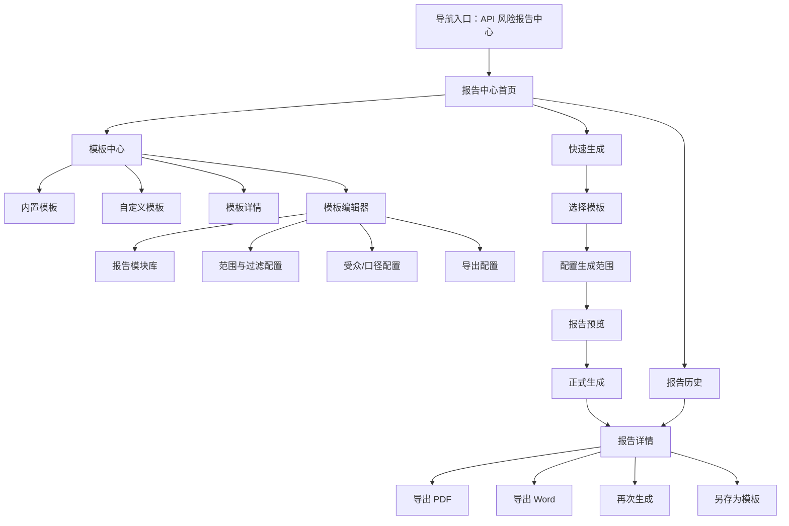
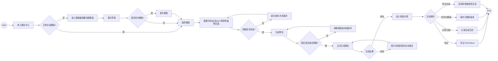
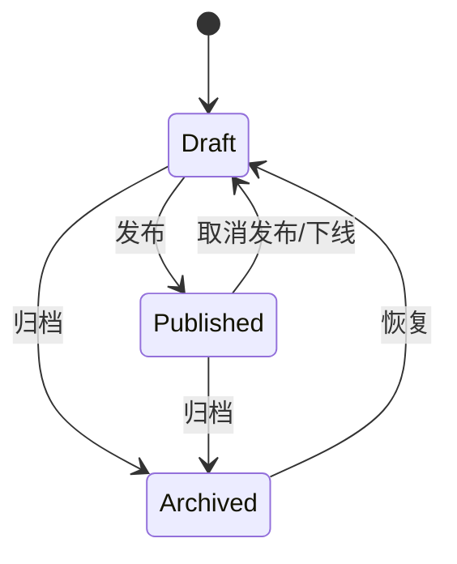
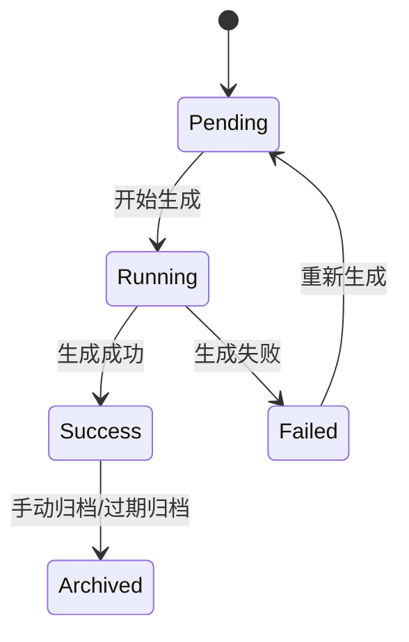

# API 风险报告中心：叙事与视觉表达（评审稿）

## 0. TL;DR（一句话）
安全运营人员在持续监测 API 风险的工作压力下，为了快速产出可交付、可追溯、可复用的风险报告，通过“选择模板 → 配置范围 → 生成预览 → 导出/分发”的关键路径，完成对内研判与对外汇报。

---

## 1) 故事脚本（Story Script）

### 1.1 场景设定

- 角色：
  - 主角色：安全运营人员 / API 风险分析师
  - 次角色：应用负责人
  - 阅读者：安全经理 / 审计人员 / 管理层
- 背景/压力：
  - 平台已积累 API 风险事件、敏感数据标签、异常访问行为、整改记录
  - 不同受众需要不同口径的报告，但现有方式通常依赖手工截图、导表和拼文档
  - 运营人员需要高频产出周报/月报/专项整改报告，效率与一致性都不足
- 触发事件：
  - 例行周报生成
  - 管理层要求查看季度 API 风险概览
  - 应用负责人需要查看某业务系统高风险 API 整改报告
  - 审计要求导出合规视角报告
- 成功标准：
  - 能快速找到合适模板
  - 能按应用、时间、风险等级、对象范围裁剪内容
  - 能生成结构稳定、证据链完整、可导出的正式报告
  - 能保留历史版本与生成记录，便于追溯
- 失败代价：
  - 人工整理耗时过长
  - 对外汇报口径不一致
  - 报告无法追溯到原始 API 风险证据
  - 管理层与技术团队看到的是两套完全割裂的信息

### 1.2 故事主线（四幕）

- 第一幕（进入/发现）：
  - 用户从“API 风险报告中心”进入模块，首先看到模板中心和最近生成记录
  - 系统强调几个最重要的模板入口：管理层摘要、运营周报、合规审计、技术明细
  - 页面明确区分“模板资产”和“已生成报告”

- 第二幕（定位/缩小范围）：
  - 用户选择一个内置模板或已有自定义模板
  - 用户配置范围：时间、业务系统、API 分组、风险等级、事件类型、数据标签
  - 系统即时展示摘要预估：将包含多少 API、多少风险事件、覆盖哪些系统
  - 若模板支持组件级配置，用户可增删模块、调整顺序、切换展示颗粒度

- 第三幕（决策/行动）：
  - 用户点击“预览生成”查看报告结构
  - 在预览中检查摘要、趋势、Top 榜单、事件时间线、证据明细是否符合目标受众
  - 用户确认后执行生成，可选择导出 PDF / Word，或保存为新模板版本

- 第四幕（反馈/收尾）：
  - 系统反馈生成成功，写入报告历史
  - 报告可查看、导出、复制、再次生成
  - 若生成失败，系统提示失败原因、失败阶段和可重试方式
  - 若模板被修改，需记录版本与发布状态，避免多人协作时口径混乱

### 1.3 镜头表（把交互写成连贯动作）

| 镜头 | 用户意图 | 用户动作 | 系统反馈 | 兜底/异常 |
|---|---|---|---|---|
| 1 | 理解当前有哪些报告能力 | 打开报告中心 | 展示模板总数、最近报告、常用模板入口 | 首屏加载失败时显示重试与最近缓存 |
| 2 | 找到合适模板 | 浏览内置模板 / 搜索模板 | 按模板类型、状态、最近使用排序 | 无结果时提示清空筛选 |
| 3 | 限定分析范围 | 选择时间、应用、风险等级等参数 | 实时更新摘要范围 | 条件冲突时就近提示 |
| 4 | 调整模板结构 | 增删模块、排序、配置组件参数 | 模板预览同步更新 | 权限不足时禁用编辑并说明原因 |
| 5 | 生成报告 | 点击“生成预览”或“正式生成” | 显示生成进度与结果摘要 | 生成超时/任务失败可重试 |
| 6 | 对外交付 | 导出 PDF / Word，或复制链接分享 | 记录导出时间、导出人、版本号 | 导出失败时保留已配置参数并提示重试 |
| 7 | 沉淀模板资产 | 保存为草稿/发布模板/新版本 | 模板进入可复用资产库 | 发布冲突时提示版本差异 |

---

## 2) 信息架构图（IA）

---

## 3) 用户流程图（User Flow）

---

## 4) 状态机（State Machine）

> 本模块同时存在两类核心实体：`报告模板` 与 `生成报告`。二者都需要清晰状态机。

### 4.1 模板状态机

### 4.2 报告生成任务状态机

---

## 5) 设计说明文档（Design Notes）

### 5.1 页面目的与主行动

- 主目标：
  - 让安全运营人员以最低的重复劳动，产出结构规范、口径统一、可证据追溯的 API 风险报告
- Primary CTA：
  - `创建报告`
- Secondary Actions：
  - `新建模板`
  - `使用模板`
  - `预览报告`
  - `导出`
  - `另存为模板`
- 危险操作（Danger）：
  - 删除模板
  - 删除报告历史
  - 覆盖已发布模板

### 5.2 核心组件与字段（可交付研发）

#### A. 模板中心列表字段

- 模板名称
- 模板类型（管理层/运营/合规/技术）
- 模板来源（内置/自定义）
- 状态（草稿/已发布/已归档）
- 最近更新时间
- 最近使用时间
- 创建人 / 维护人
- 适用对象（管理层 / 安全运营 / 应用负责人 / 审计）

#### B. 报告历史列表字段

- 报告名称
- 来源模板
- 生成范围摘要
- 生成状态
- 导出格式
- 生成时间
- 生成人
- 版本号

#### C. 模板参数配置维度

- 时间范围
- 业务系统 / 应用
- API 分组 / API 标签
- 风险等级
- 事件类型
- 数据标签
- 是否包含证据明细
- 是否包含整改建议
- 目标读者口径

#### D. 报告模块库（建议最小集）

- 摘要指标卡
- 风险趋势图
- API 资产总览
- 风险等级分布
- 敏感数据标签分布
- Top 风险 API
- Top 异常账号 / IP
- 事件时间线
- 告警明细表
- 整改建议 / 待办清单
- 合规映射章节

#### E. 排序与规则

- 模板中心默认按：`内置优先 -> 已发布优先 -> 最近使用优先`
- 报告历史默认按：`最近生成时间倒序`
- 模板编辑器中模块排序支持拖拽或上下移动
- 高风险、高频操作默认显性展示，低频操作收纳到“更多”

### 5.3 权限与审计（最小集）

- 权限点：
  - 查看模板
  - 编辑模板
  - 发布模板
  - 生成报告
  - 导出报告
  - 删除模板/报告
- 需要二次确认的操作：
  - 发布模板
  - 覆盖已发布模板
  - 删除模板
  - 删除报告历史
- 审计日志建议记录：
  - 模板创建、编辑、发布、归档
  - 报告生成、导出、再次生成
  - 导出对象、导出格式、导出时间

### 5.4 异常/空态/边界（必须覆盖）

- 空态（无模板）：
  - 引导创建第一份模板，推荐先从内置模板复制
- 空态（无报告历史）：
  - 引导使用内置模板快速生成首份报告
- 无结果（筛选后）：
  - 提示调整筛选条件，不要让用户误以为系统无数据
- 加载态：
  - 首屏模板加载
  - 预览生成
  - 正式生成
  - 导出中
- 错误态：
  - 参数缺失
  - 生成任务失败
  - 导出失败
  - 权限不足
  - 数据源超时
- 长文本：
  - 模板描述、报告说明、整改建议需支持折叠/展开
- 多标签：
  - API 标签、数据标签、风险标签需支持折叠显示与 tooltip
- 大量数据：
  - 预览页的事件明细需分页或按模块懒加载
- 并发点击：
  - 生成报告按钮在提交后应进入 loading，防止重复生成
- 版本冲突：
  - 发布模板前若存在他人更新，需提示差异

### 5.5 文案与术语表（统一口径）

| 概念 | 推荐用词 | 禁用/替代 | 备注 |
|---|---|---|---|
| 报告模板 | 报告模板 | 模板配置 / 报表壳子 | 对外统一为“报告模板” |
| 已生成报告 | 报告实例 | 报表记录 | 区分模板与生成结果 |
| 生成 | 生成报告 | 导出报告 | “生成”强调形成内容，“导出”强调输出文件 |
| 发布模板 | 发布 | 上线模板 | 保持与模板状态一致 |
| 再次生成 | 重新生成 | 刷新报告 | 避免和页面刷新混淆 |
| 管理层摘要 | 管理层摘要报告 | 领导版 | 用正式术语 |
| 技术明细 | 技术明细报告 | 明细版 | 对研发/安全运营更清晰 |

### 5.6 决策点 + 推荐默认 + 影响

#### 决策点 1：模板自定义深度

- 推荐默认：
  - 第一阶段先做“模块开关 + 排序 + 参数配置”
  - 暂不做完全自由布局
- 影响：
  - 可以更快上线，且减少过度复杂的编辑器开发成本

#### 决策点 2：报告生成方式

- 推荐默认：
  - 支持“同步预览 + 异步正式生成”
- 影响：
  - 兼顾体验与大报告生成性能

#### 决策点 3：导出格式优先级

- 推荐默认：
  - 首发优先 `PDF`
  - 第二阶段补 `Word`
- 影响：
  - 能更快满足汇报交付场景，同时降低文档格式兼容复杂度

#### 决策点 4：模板体系维度

- 推荐默认：
  - 按“读者角色 + 使用场景”组织模板，而不是按页面来源组织
- 影响：
  - 更符合真实业务使用方式，也便于后续扩展多行业模板

---

## 6) 轻量角色定义（供 Stage 2 使用）

### 角色 1：安全运营人员

- 核心目标：高频生成 API 风险周报/月报，快速汇报当前风险态势与重点问题
- 关注内容：
  - 风险趋势
  - 高风险 API / 账号 / 来源 IP
  - 事件明细与证据
  - 整改闭环

### 角色 2：应用负责人

- 核心目标：查看本业务系统相关 API 风险与整改建议
- 关注内容：
  - 本系统范围内的问题
  - 重点 API
  - 影响等级
  - 整改建议与待办

### 角色 3：管理层 / 审计人员

- 核心目标：快速理解整体风险态势与合规状态
- 关注内容：
  - 摘要指标
  - 趋势变化
  - 风险等级分布
  - 合规视图

---

## 7) Handoff → Stage 2 的结构化输入

### 功能点（核心 5 项）

1. 报告模板中心
2. 模板参数化与模块化编辑
3. 报告预览与正式生成
4. 报告历史与版本管理
5. 导出与外部交付

### 主实体

- 报告模板
- 报告实例
- 报告模块
- 生成任务
- 导出记录

### 状态线索

- 模板：`草稿 / 已发布 / 已归档`
- 生成任务：`待生成 / 生成中 / 生成成功 / 生成失败 / 已归档`

### 建议的页面拆分

1. 报告中心首页
2. 模板中心列表页
3. 模板编辑页 / 抽屉
4. 报告生成向导 / 配置弹窗
5. 报告详情页
6. 报告历史页

